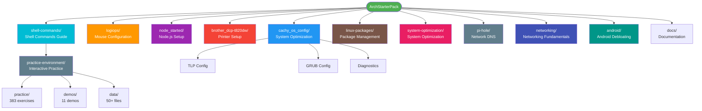
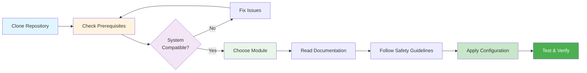
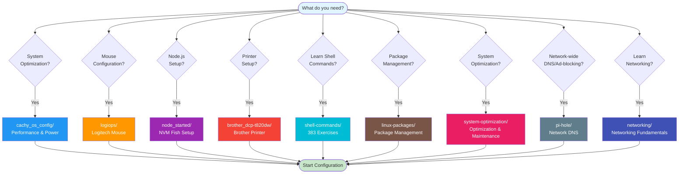

# ArchStarterPack

A curated collection of configuration files, setup guides, and optimization scripts for Arch Linux-based systems. This repository provides battle-tested configurations for CachyOS, hardware peripherals, and development environments.

## Table of Contents

- [Overview](#overview)
- [Prerequisites](#prerequisites)
- [Configuration Modules](#configuration-modules)
  - [CachyOS Configuration](#1-cachyos-configuration)
  - [LogiOps - Logitech Mouse Configuration](#2-logiops---logitech-mouse-configuration)
  - [Node.js Development Setup](#3-nodejs-development-setup)
  - [Brother Printer Setup](#4-brother-printer-setup)
  - [Shell Commands Mastery Guide](#5-shell-commands-mastery-guide)
  - [Linux Package Management](#6-linux-package-management)
  - [System Optimization & Maintenance](#7-system-optimization--maintenance)
- [Pi-hole Network DNS](#8-pi-hole-network-dns)
- [Networking Fundamentals](#9-networking-fundamentals)
- [Android Debloating & Privacy](#10-android-debloating--privacy)
- [Project Structure](#project-structure)
- [Quick Start](#quick-start)
- [Troubleshooting & FAQ](#troubleshooting--faq)
- [License](#license)
- [Contributing](#contributing)

## Overview

ArchStarterPack is a collection of production-ready configuration files and comprehensive guides designed to streamline the setup process for Arch-based Linux distributions. Whether you're configuring a new system, optimizing performance, or setting up development tools, this repository provides tested solutions.

**Key Features:**

- 🚀 Performance optimization for CachyOS/Arch systems
- 🖱️ Advanced mouse configuration for Logitech devices
- 🔧 Minimal, clean development environment setup
- 🖨️ Brother printer and scanner setup guides
- 📚 Shell commands mastery with 80+ practice exercises
- 📖 Detailed documentation with safety checks
- 🛡️ Tested configurations for ASUS VivoBook hardware

## Prerequisites

- **Operating System:** Arch Linux or Arch-based distribution (CachyOS, Manjaro, EndeavourOS, etc.)
- **Hardware:** Configurations optimized for ASUS X507UF, but adaptable to other systems
- **Package Manager:** `pacman` (standard Arch package manager)
- **Shell:** Fish shell (for Node.js configuration) or Bash
- **Permissions:** Root/sudo access for system configuration

## Configuration Modules

### 1. CachyOS Configuration

**Location:** [`cachy_os_config/`](cachy_os_config/)
**Difficulty:** Intermediate to Advanced
**Time Required:** 30-60 minutes

Comprehensive guides for configuring and optimizing CachyOS on ASUS X507UF (Intel i5-8250U + Intel UHD 620 + NVIDIA MX130) hardware. These configurations provide maximum performance when plugged in and power efficiency on battery.

#### What's Included

- **[Performance & Power Optimization](cachy_os_config/asus_x_507_uf_readme.md)** - Complete guide for AC/battery power management

  - TLP configuration for automatic AC/battery switching
  - CPU governor optimization (performance/powersave)
  - Intel Turbo Boost management
  - NVIDIA power management
  - Thermal management with `thermald`
  - Battery care settings (charge thresholds)

- **[External Monitor-Only Setup](cachy_os_config/asus_x_507_uf_nvidia_deprecated.md)** - Configure laptop to use external display exclusively

  - NVIDIA Optimus configuration
  - Disable internal eDP display
  - Early KMS (Kernel Mode Setting)
  - GRUB kernel parameters
  - HDMI-first boot configuration

- **[Hardware Diagnostics Toolkit](cachy_os_config/extract.md)** - Comprehensive system diagnostics scripts

  - `diagnostics.sh` - Full system diagnostics with command visibility
  - `drm-power-diagnostics.sh` - Specialized DRM/power/USB diagnostics
  - Shows commands before executing (transparent and educational)
  - GPU/CPU/PCI/ACPI information gathering
  - Thermal sensor readings
  - Kernel module status
  - Boot error detection
  - Safe, read-only diagnostics

- **[Optional Diagnostics Extensions](cachy_os_config/optional_extract.md)** - Advanced diagnostic modules

  - Auto-upload to pastebin
  - Vulkan/OpenGL info collection
  - Network diagnostics suite
  - SMART disk health reports
  - Wayland/X11 logs

- **[GRUB Configuration](cachy_os_config/grub)** - Production GRUB config with optimized kernel parameters

#### Key Features

✅ Maximum performance on AC power
✅ Power efficiency on battery
✅ Safe thermal management
✅ NVIDIA Optimus support
✅ Intel P-state optimization
✅ Automatic power profile switching
✅ Battery longevity features

#### Quick Start

```bash
cd cachy_os_config/
# Read the main guide first
cat asus_x_507_uf_readme.md

# Follow the numbered steps carefully
# Always run safety checks before applying configurations
```

---

### 2. LogiOps - Logitech Mouse Configuration

**Location:** [`logiops/`](logiops/)
**Difficulty:** Intermediate
**Time Required:** 20-30 minutes

Configuration and setup guide for Logitech MX Master 3S mouse using LogiOps on Linux. Provides gesture controls, button remapping, and scroll wheel optimization.

#### What's Included

- **[LogiOps Setup Guide](logiops/readme.md)** - Complete installation and configuration instructions

  - Building from source
  - Dependency installation for various distros
  - Safety checks and validation
  - Common issues and troubleshooting
  - Tips for advanced configurations

- **[MX Master 3S Configuration](logiops/logid.cfg)** - Production-ready `logid.cfg`
  - SmartShift configuration (ratchet/free-spin toggle)
  - Hi-res scroll wheel settings
  - Gesture button mappings
  - Workspace switching gestures
  - KDE Plasma integration
  - Thumb wheel configuration

#### Features

🖱️ **Button Mappings:**

- Scroll wheel middle-click
- Back/Forward buttons
- SmartShift toggle button
- Gesture button with swipe controls

🎯 **Gestures:**

- Click: Overview (Meta+W)
- Swipe Left/Right: Workspace switching
- Swipe Up: Task switcher (Meta+Tab)
- Swipe Down: Show desktop (Meta+D)

⚙️ **Advanced Settings:**

- DPI: 2000
- SmartShift threshold: 30
- Scroll multiplier: 2.0x
- Custom wheel resolution

#### Quick Start

```bash
cd logiops/

# Install dependencies (Arch Linux)
sudo pacman -S base-devel cmake libevdev libconfig systemd-libs glib2

# Clone and build LogiOps
git clone https://github.com/PixlOne/logiops.git
cd logiops
mkdir build && cd build
cmake -DCMAKE_BUILD_TYPE=Release ..
make
sudo make install

# Copy configuration
sudo cp ../logid.cfg /etc/logid.cfg

# Validate and start
sudo logid -t  # test configuration
sudo systemctl enable --now logid
```

---

### 3. Node.js Development Setup

**Location:** [`node_started/`](node_started/)
**Difficulty:** Beginner to Intermediate
**Time Required:** 10-15 minutes

Minimal, clean configuration for NVM (Node Version Manager) in Fish shell. No bloated plugins, no unnecessary dependencies—just what you need to get Node.js working reliably.

#### What's Included

- **[Node.js Setup (main README)](node_started/README.md)** - Explains the Fish/NVM issue and what `config.fish` + `nvm.fish` + `nvm-load.fish` are doing
- **[NVM Fish Setup Guide](node_started/nvm-fish-readme.md)** - Detailed copy/paste setup instructions

  - Installation requirements
  - Fish shell integration
  - VSCode compatibility
  - Troubleshooting guide
  - Rollback instructions

- **[Minimal config.fish](node_started/config.fish)** - Bare minimum Fish configuration

  - NVM environment setup
  - No fisher or bass required
  - Clean, maintainable approach

- **[NVM Fish Functions](node_started/nvm.fish)** - `nvm` wrapper (runs `nvm` via bash)
- **[NVM Fish Loader](node_started/nvm-load.fish)** - `nvm-load` env sync (loads default Node into Fish PATH)

#### Philosophy

This configuration follows a **minimal, package-manager-friendly** approach:

- No third-party Fish plugin managers
- No bass (bash wrapper) dependency
- Direct integration with pacman-installed NVM
- Clean separation of concerns
- Easy to understand and maintain

#### Quick Start

```bash
cd node_started/

# Install NVM via pacman
sudo pacman -S nvm

# Create Fish config directories
mkdir -p ~/.config/fish/functions

# Copy configurations
cp config.fish ~/.config/fish/config.fish
cp nvm.fish ~/.config/fish/functions/nvm.fish
cp nvm-load.fish ~/.config/fish/functions/nvm-load.fish

# Reload shell
exec fish

# Set default Node version (one-time)
bash -ic 'source /usr/share/nvm/init-nvm.sh && nvm install --lts && nvm alias default lts/*'

# Test
node -v
nvm --version
```

**Note (Fish shell / `nvm use`)**: `nvm use <version>` runs in a bash subprocess and won’t automatically update the current Fish session’s PATH. Use `nvm-load` after switching (or open a new shell). See `node_started/nvm-fish-readme.md`.

---

### 4. Brother Printer Setup

**Location:** [`brother_dcp-t820dw/`](brother_dcp-t820dw/)
**Difficulty:** Beginner to Intermediate
**Time Required:** 15-25 minutes

Complete setup guide for Brother DCP-T820DW printer and scanner on Arch Linux. Includes network (WiFi), USB configuration, and scanning setup.

#### What's Included

- **[Brother Printer Setup Guide](brother_dcp-t820dw/BROTHER_PRINTER_SETUP_README.md)** - Complete installation and configuration
  - CUPS and Avahi setup
  - AUR driver installation
  - USB and WiFi network printing
  - Scanner setup with SANE
  - Troubleshooting common issues
  - Driver integrity verification

#### Features

🖨️ **Printing:**

- WiFi network printing via IPP
- USB direct printing
- CUPS web interface configuration
- IPP Everywhere support

🔍 **Scanning:**

- SANE integration
- Network scanner support
- Simple Scan GUI
- brscan5 driver configuration

📸 **Photo Management:**

- digiKam recommended for photo organization
- Advanced image editing and cataloging
- RAW format support
- Face detection and tagging

#### Quick Start

```bash
cd brother_dcp-t820dw/

# Install CUPS and dependencies
sudo pacman -S cups cups-pdf avahi nss-mdns system-config-printer

# Enable services
sudo systemctl enable --now cups
sudo systemctl enable --now avahi-daemon

# Install Brother driver (AUR)
paru -S brother-dcpt820dw

# For scanning
sudo pacman -S sane-airscan simple-scan
paru -S brscan5 brscan-skey

# Register scanner
brsaneconfig5 -a name="BrotherDCP" model=DCPT820DW ip=<PRINTER-IP>

# Test printer
lpstat -p
lp /usr/share/cups/data/testprint

# For photo management and organization
sudo pacman -S digikam
```

---

### 5. Shell Commands Mastery Guide

**Location:** [`shell-commands/`](shell-commands/)
**Difficulty:** Beginner to Expert
**Time Required:** 4-6 weeks (self-paced)

Complete guide to Unix/Linux shell commands for Salesforce development and system automation. Master essential commands, powerful combinations, and real-world patterns through **383 interactive exercises** with automatic validation and progress tracking.

#### What's Included

- **[Shell Commands Guide](shell-commands/README.md)** - Complete mastery course

  - Shell operators and redirection fundamentals
  - 40+ essential command tutorials (grep, sed, awk, jq, curl, etc.)
  - Piping patterns and command chaining
  - Linux system administration patterns
  - Salesforce CLI integration patterns
  - Apex log analysis techniques
  - Deployment automation scripts

- **[Interactive Practice System](shell-commands/practice-environment/practice/)** ⭐ NEW!
  - **383 exercises** across 35 command practice files
  - **Automatic validation** - Type commands yourself and get immediate feedback
  - **Progress tracking** - JSON-based progress saved per user
  - **Practice menu system** - Interactive menu organized by category
  - **6 validation modes** - Exact, numeric, contains, regex, lines, sorted
  - **3 attempts per question** - Hints after wrong attempts, solutions after failures
  - **Scoring system** - Track mastery and improvement over time

#### Course Structure

📚 **Part 1: Fundamentals**

- Shell operators (`|`, `>`, `>>`, `&&`, `||`)
- Input/output redirection

📝 **Part 2: Essential Commands (40+ commands)**

- Text processing: grep, sed, awk, cut, sort, uniq, tr, wc
- File operations: find, cat, diff, tail/head, tee
- System & process: ps, top, df/du
- Archives: tar, zip, gzip
- Network: curl, wget, ping, netstat
- Advanced: jq, xargs, column, paste, comm

🔗 **Part 3: Command Combinations**

- Piping patterns for data processing
- Command chaining strategies
- Linux system patterns
- Advanced workflows

💪 **Part 4: Practice (80 exercises)**

- Beginner: 20 exercises
- Intermediate: 20 exercises
- Advanced: 20 exercises
- Expert: 20 exercises

⚡ **Part 5: Salesforce-Specific**

- SF CLI integration patterns
- Apex log analysis
- Deployment scripts

#### Quick Start

```bash
cd shell-commands/

# Option 1: Interactive Practice (Recommended)
cd practice-environment/practice
./practice-menu.sh
# Or practice a specific command:
./commands/grep-practice.sh

# Option 2: Follow the structured learning path
cat README.md

# Start with basics
cat 01-basics/operators.md

# Practice with grep (most common command)
cat 02-commands/grep.md

# Try beginner exercises (reading)
cat 04-practice/beginner.md

# 4-Week Learning Path:
# Week 1: Basics + interactive practice (grep, cut, sort)
# Week 2: Core commands (sed, awk, jq) + practice validation
# Week 3: Combinations + advanced practice + track progress
# Week 4: Expert practice + Salesforce patterns + master all 35 commands
```

#### Learning Path

**For Complete Beginners:**

1. Read operators and redirection basics
2. Master grep, cat, tail/head
3. **Practice interactively:** `cd practice-environment/practice && ./commands/grep-practice.sh`
4. Complete beginner exercises (1-20) from reading exercises
5. Progress to intermediate commands

**For Intermediate Users:**

1. Focus on sed, awk, jq for data processing
2. **Practice interactively:** `./commands/sed-practice.sh`, `./commands/awk-practice.sh`, `./commands/jq-practice.sh`
3. Learn piping and chaining patterns
4. Complete intermediate and advanced exercises
5. **Track progress:** `./progress.sh show`
6. Explore Salesforce-specific patterns

**For Advanced Users:**

1. Master complex piping patterns
2. Complete expert exercises
3. **Master all 35 practice command files** - Aim for 90%+ on each
4. Build custom automation scripts
5. **View mastery:** `./progress.sh mastered`
6. Contribute your own patterns

#### Key Highlights

✅ **383 Interactive Exercises** - Active learning with automatic validation
✅ **35 Practice Command Files** - One for each documented command
✅ **Progress Tracking** - Track mastery per command with JSON storage
✅ **80+ Reading Exercises** - Hands-on learning with solutions
✅ **Salesforce Integration** - Real-world SF CLI patterns
✅ **Generic Linux Examples** - System administration, web servers, Docker
✅ **Progressive Learning** - Beginner to expert path
✅ **Real-World Patterns** - Production-ready recipes
✅ **Self-Paced** - Learn at your own speed

#### Who This Is For

- Salesforce developers learning Linux/Unix commands
- System administrators wanting structured practice
- DevOps engineers needing quick reference
- Anyone automating workflows with shell scripts
- Students preparing for Linux certification

---

### 6. Linux Package Management

**Location:** [`linux-packages/`](linux-packages/)
**Difficulty:** Beginner to Intermediate
**Time Required:** 10-30 minutes

Complete guide for installing and managing applications on Arch-based systems. Learn how to choose between AppImage, Flatpak, and `.deb` formats, integrate applications into your desktop, troubleshoot Flatpak sandboxing issues, and manage package-related problems.

#### What's Included

- **[Package Management Guide](linux-packages/README.md)** - Comprehensive AppImage and package installation guide
- **[Flatpak Sandboxing Issues](linux-packages/FLATPAK_SANDBOXING.md)** - Troubleshooting browser settings and data persistence problems
  - Choosing between AppImage and `.deb` formats
  - Installing FUSE dependency
  - Running and integrating AppImages
  - Creating desktop entries for KDE Application Launcher
  - Icon extraction and theming
  - Update management strategies
  - Security best practices
  - Flatpak vs AppImage comparison

#### Features

📦 **Package Format Guidance:**

- When to choose AppImage over `.deb`
- Understanding distro-agnostic formats
- Arch-specific considerations

🔧 **Integration:**

- Manual desktop entry creation
- Icon extraction from AppImages
- KDE Plasma integration
- AppImageLauncher automation

🔄 **Update Management:**

- Manual update process
- AppImageUpdate tool usage
- Version management best practices
- Backup strategies

🛡️ **Security:**

- Signature verification
- Checksum validation
- Trusted source guidelines
- Sandboxing considerations

📊 **Comparison:**

- Flatpak vs AppImage detailed comparison
- When to use each format
- Hybrid approach recommendations

#### Quick Start

```bash
cd linux-packages/

# Install FUSE dependency
sudo pacman -S fuse2

# Make AppImage executable
chmod +x MyApp-x86_64.AppImage

# Move to stable location
mkdir -p ~/.local/bin
mv MyApp-x86_64.AppImage ~/.local/bin/myapp
chmod +x ~/.local/bin/myapp

# Create desktop entry
mkdir -p ~/.local/share/applications
nano ~/.local/share/applications/myapp.desktop

# Refresh KDE cache
kbuildsycoca6
```

#### Use Cases

- Running applications that only provide `.deb` or AppImage formats
- Portable applications that don't need system installation
- Testing applications without modifying system packages
- Applications not available in Arch repositories or AUR
- Understanding modern Linux application distribution formats

---

### 7. System Optimization & Maintenance

**Location:** [`system-optimization/`](system-optimization/)
**Difficulty:** Beginner to Intermediate
**Time Required:** 15-60 minutes

Complete guide for optimizing, cleaning, and maintaining CachyOS/Arch-based systems. Remove redundant packages, optimize memory usage, improve system speed, clean caches, and automate maintenance tasks.

#### What's Included

- **[System Optimization Guide](system-optimization/README.md)** - Main guide with decision tree and quick reference
- **[Package Cleanup Guide](system-optimization/PACKAGE_CLEANUP.md)** - Remove orphaned and unused packages
- **[Cache Cleanup Guide](system-optimization/CACHE_CLEANUP.md)** - Clean pacman, paru, and flatpak caches
- **[Memory Optimization Guide](system-optimization/MEMORY_OPTIMIZATION.md)** - Optimize memory usage and swap configuration
- **[Speed Optimization Guide](system-optimization/SPEED_OPTIMIZATION.md)** - Improve boot time and system performance
- **[Maintenance Scripts Guide](system-optimization/MAINTENANCE_SCRIPTS.md)** - Automate maintenance tasks

#### Features

🧹 **Package Cleanup:**

- Find and remove orphaned packages
- Clean unused dependencies
- Remove AUR packages safely
- Flatpak runtime cleanup

💾 **Cache Management:**

- Pacman cache cleanup (keeps last 2 versions)
- Paru cache cleanup
- Flatpak cache and unused runtimes
- Systemd journal log rotation
- Temporary files cleanup

🧠 **Memory Optimization:**

- Monitor memory usage
- Configure swap and swappiness
- ZRAM setup for faster virtual memory
- Memory leak detection

⚡ **Speed Optimization:**

- Boot time analysis and optimization
- Database optimization (pacman, locate)
- Filesystem optimization (TRIM, mount options)
- I/O scheduler tuning
- Network optimization

🤖 **Automation:**

- Automated maintenance scripts
- Systemd timer scheduling
- Cron job examples
- Health check scripts

#### Quick Start

```bash
cd system-optimization/

# Check system health
./scripts/check-optimization.sh

# Clean orphaned packages (interactive)
sudo ./scripts/cleanup-packages.sh

# Clean caches
sudo ./scripts/cleanup-cache.sh

# Full system maintenance
sudo ./scripts/system-maintenance.sh
```

#### Use Cases

- Free up disk space by removing unused packages and caches
- Optimize system performance and boot time
- Improve memory usage and configure swap
- Automate regular maintenance tasks
- Monitor system health and optimization status
- Troubleshoot performance issues

---

### 8. Pi-hole Network DNS

**Location:** [`pi-hole/`](pi-hole/)
**Difficulty:** Beginner to Intermediate
**Time Required:** 45-70 minutes (router UI dependent)

Run Pi-hole on a Raspberry Pi with authoritative DNS for your LAN. Includes quick start, router DHCP guidance, and advanced add-ons for privacy and reliability.

#### What's Included

- **[Pi-hole Guide](pi-hole/README.md)** — Central quick start, router DHCP settings, troubleshooting
- **Advanced docs (under `pi-hole/docs/`):**
  - `unbound.md` — Local recursive DNS with Unbound
  - `ipv6.md` — IPv6-safe deployment
  - `hardcoded-dns.md` — Blocking hardcoded DNS/DoH clients

#### Highlights

✅ Single DNS path (no secondary DNS)
✅ Router DoH/DoT disablement guidance
✅ DHCP reservation and verification checklist
✅ Optional: Unbound recursion, IPv6, DNS firewalling

#### Quick Start

```bash
# On the Pi
sudo apt update
sudo apt install -y openssh-server
# Install Pi-hole via official installer, then set router DHCP DNS to Pi-hole only
```

Check `pi-hole/README.md` for router paths (TP-Link, ASUS, Netgear, OpenWRT) and verification steps.

---

### 9. Networking Fundamentals

**Location:** [`networking/`](networking/)
**Difficulty:** Beginner → Intermediate
**Time Required:** 60-120 minutes (self-paced)

Systematic learning path for home networking: IP addressing, subnet masks/prefixes, gateways, DHCP, DNS, and router UI models. Designed to make modules like Pi-hole feel intuitive instead of “patchwork settings.”

#### What's Included

- **[Networking Start Here](networking/README.md)** — guided reading order
- **Core docs:** `networking/docs/` (IP addressing, DHCP, DNS, router model, troubleshooting)
- **Practice drills:** `networking/practice/drills.md`

#### Quick Start

```bash
cd networking/
cat README.md
```

---

### 10. Android Debloating & Privacy

**Location:** [`android/`](android/)
**Difficulty:** Beginner → Intermediate
**Time Required:** 30-60 minutes (self-paced)

Practical workflow for reducing Android telemetry and bloat safely. Learn how to trace “mystery domains” (often discovered via Pi-hole) back to the responsible app/package, then debloat in a reversible way.

#### What's Included

- **[Android Module (Start Here)](android/README.md)** — reading order, glossary, links to Pi-hole/DNS concepts
- **[Android Debloating Guide](android/debloat.md)** — ADB setup, safety model, investigation workflow, known telemetry domains, Pi-hole regex deny examples

---

## Project Structure



**Detailed Structure:**

```
ArchStarterPack/
├── .github/
│   ├── ISSUE_TEMPLATE.md               # Bug report template
│   └── PULL_REQUEST_TEMPLATE.md        # PR template
├── linux-packages/
│   ├── README.md                       # Package management and AppImage guide
│   └── FLATPAK_SANDBOXING.md           # Flatpak sandboxing troubleshooting
├── system-optimization/
│   ├── README.md                       # System optimization main guide
│   ├── PACKAGE_CLEANUP.md              # Package cleanup guide
│   ├── CACHE_CLEANUP.md                # Cache cleanup guide
│   ├── MEMORY_OPTIMIZATION.md          # Memory optimization guide
│   ├── SPEED_OPTIMIZATION.md           # Speed optimization guide
│   ├── MAINTENANCE_SCRIPTS.md          # Maintenance scripts guide
│   └── scripts/
│       ├── check-optimization.sh       # System health check script
│       ├── cleanup-packages.sh         # Package cleanup script
│       ├── cleanup-cache.sh            # Cache cleanup script
│       └── system-maintenance.sh       # Full maintenance script
├── brother_dcp-t820dw/
│   └── BROTHER_PRINTER_SETUP_README.md # Brother printer & scanner guide
├── cachy_os_config/
│   ├── asus_x_507_uf_readme.md         # Main performance & power guide
│   ├── asus_x_507_uf_nvidia_deprecated.md  # External monitor setup
│   ├── diagnostics.sh                   # System diagnostics tool
│   ├── drm-power-diagnostics.sh         # DRM/power/USB diagnostics tool
│   ├── 01-custom.conf                   # TLP custom configuration example
│   ├── extract.md                      # Diagnostics toolkit documentation
│   ├── DRM_POWER_DIAGNOSTICS.md        # DRM/power diagnostics guide
│   ├── optional_extract.md             # Advanced diagnostics
│   ├── GRUB_PARAMETERS.md              # Detailed kernel parameter explanations
│   └── grub                            # GRUB configuration file
├── docs/
│   ├── FAQ.md                          # Frequently asked questions
│   ├── TROUBLESHOOTING.md              # Common issues and solutions
│   ├── GLOSSARY.md                     # Technical terms glossary
│   └── LEARNING_RESOURCES.md           # Curated educational materials
├── logiops/
│   ├── readme.md                       # LogiOps setup guide
│   └── logid.cfg                       # MX Master 3S configuration
├── node_started/
│   ├── nvm-fish-readme.md              # NVM Fish setup guide
│   ├── config.fish                     # Minimal Fish config
│   └── nvm.fish                        # NVM Fish functions
├── shell-commands/
│   ├── 01-basics/
│   │   ├── operators.md                # Shell operators and symbols
│   │   └── redirection.md              # Input/output redirection
│   ├── 02-commands/
│   │   ├── grep.md, sed.md, awk.md     # Text processing commands
│   │   ├── find.md, cat.md, tail-head.md # File operations
│   │   ├── curl.md, wget.md, jq.md     # Network and data tools
│   │   └── [35+ more command guides]   # Comprehensive command reference
│   ├── 03-combinations/
│   │   ├── piping.md                   # Piping patterns
│   │   ├── chaining.md                 # Command chaining
│   │   ├── linux-system-patterns.md    # System admin patterns
│   │   └── advanced-patterns.md        # Complex workflows
│   ├── 04-practice/
│   │   ├── beginner.md                 # 20 beginner exercises
│   │   ├── intermediate.md             # 20 intermediate exercises
│   │   ├── advanced.md                 # 20 advanced exercises
│   │   └── expert.md                   # 20 expert exercises
│   ├── 05-salesforce/
│   │   ├── sf-cli-patterns.md          # SF CLI integration
│   │   ├── log-analysis.md             # Apex log analysis
│   │   └── deployment-scripts.md       # Deployment automation
│   ├── practice-environment/
│   │   ├── practice/                   # ⭐ Interactive Practice System
│   │   │   ├── commands/              # 35 practice files (383 exercises)
│   │   │   │   ├── grep-practice.sh
│   │   │   │   ├── awk-practice.sh
│   │   │   │   └── [33 more...]
│   │   │   ├── practice-engine.sh     # Validation engine
│   │   │   ├── practice-menu.sh       # Interactive menu
│   │   │   ├── progress.sh            # Progress tracking
│   │   │   └── README.md              # Practice guide
│   │   ├── data/                       # Sample data files (logs, JSON, CSV)
│   │   ├── demos/                      # Passive learning demos
│   │   ├── exercises/                  # Guided tutorials
│   │   └── README.md                   # Practice environment guide
│   └── README.md                       # Shell commands guide
├── check-prerequisites.sh               # System compatibility checker
├── CHANGELOG.md                         # Version history and changes
├── CONTRIBUTING.md                      # Contribution guidelines
├── LICENSE                              # MIT License
└── README.md                           # This file
```

## Quick Start



**Before you begin, verify your system compatibility:**

```bash
git clone https://github.com/cjmaaz/ArchStarterPack.git
cd ArchStarterPack
chmod +x check-prerequisites.sh
./check-prerequisites.sh
```

This will check if your system meets all requirements for the configuration modules.

---

1. **Clone the repository:**

   ```bash
   git clone https://github.com/cjmaaz/ArchStarterPack.git
   cd ArchStarterPack
   ```

2. **Check prerequisites:**

   ```bash
   ./check-prerequisites.sh
   ```

3. **Choose your configuration module:**



**Module Selection:**

- For system optimization: `cd cachy_os_config/`
- For mouse configuration: `cd logiops/`
- For Node.js setup: `cd node_started/`
- For Brother printer setup: `cd brother_dcp-t820dw/`
- For shell commands learning: `cd shell-commands/`
  - For package management: `cd linux-packages/`
- For system optimization: `cd system-optimization/`
- For network-wide DNS blocking: `cd pi-hole/`

4. **Read the documentation:**
   Each module contains detailed README files with step-by-step instructions.

5. **Follow safety guidelines:**
   - Always read the full guide before executing commands
   - Run safety checks where indicated
   - Back up existing configurations
   - Test in a safe environment first

**Quick Diagnostics:**
If you encounter issues, run the diagnostics tools (show commands and output):

```bash
cd cachy_os_config/

# Full system diagnostics
./diagnostics.sh                  # Normal mode
./diagnostics.sh --redact         # Redact personal info (IPs, MACs, hostnames, etc.)

# DRM/display, power management, USB issues (creates directory with multiple files)
./drm-power-diagnostics.sh                  # Normal mode
./drm-power-diagnostics.sh --redact         # Redact personal info
```

## Troubleshooting & FAQ

For comprehensive troubleshooting guides, common issues, and frequently asked questions, see:

- [Troubleshooting Guide](docs/TROUBLESHOOTING.md) - Solutions to common problems
- [FAQ](docs/FAQ.md) - Frequently asked questions
- [Glossary](docs/GLOSSARY.md) - Technical terms explained
- [Learning Resources](docs/LEARNING_RESOURCES.md) - Curated educational materials

## License

This project is licensed under the MIT License - see the [LICENSE](LICENSE) file for details.

## Contributing

Contributions are welcome! If you have improvements, additional configurations, or bug fixes:

1. Fork the repository
2. Create a feature branch (`git checkout -b feature/improvement`)
3. Commit your changes (`git commit -am 'Add new configuration'`)
4. Commit your changes with descriptive messages
5. Push to the branch (`git push origin feature/improvement`)
6. Open a Pull Request

**Guidelines:**

- Document all configurations thoroughly
- Include safety checks and warnings
- Test on actual hardware before submitting
- Follow existing documentation style
- Explain the "why" behind configuration choices

See [CONTRIBUTING.md](CONTRIBUTING.md) for detailed contribution guidelines.

---

**Repository:** [https://github.com/cjmaaz/ArchStarterPack](https://github.com/cjmaaz/ArchStarterPack)

**Note:** These configurations are tested on specific hardware (ASUS X507UF) and software (CachyOS). While they should work on similar systems, always review and adapt configurations to your specific hardware and requirements.

**Disclaimer:** Use these configurations at your own risk. Always back up your system before making significant changes. The maintainers are not responsible for any system issues that may arise from using these configurations.
