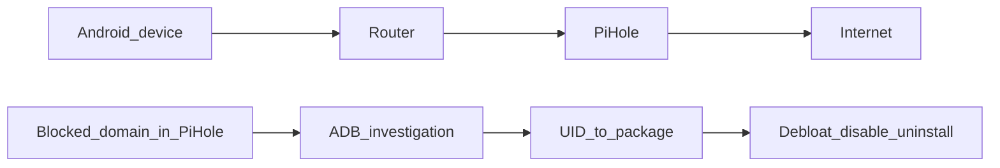

# Android Privacy & Debloating (Beginner → Advanced)

Take back control of your device. This guide helps you:

- identify background telemetry (domains / connections / trackers)
- map “suspicious traffic” back to the responsible app/service
- safely debloat (without bricking your phone)

Works on common Android skins (OxygenOS/ColorOS, MIUI, OneUI, etc.).

Related:

- Pi-hole enforcement patterns: [`../pi-hole/docs/hardcoded-dns.md`](../pi-hole/docs/hardcoded-dns.md)
- DNS fundamentals: [`../networking/docs/dns.md`](../networking/docs/dns.md)
- Prefer a systematic reading path: [`docs/README.md`](docs/README.md)

---

## Table of Contents

1. [The why](#the-why)
2. [Safety model (what “debloat” means)](#safety-model-what-debloat-means)
3. [Prerequisites: ADB setup](#prerequisites-adb-setup)
4. [Workflow: Pi-hole clue → app → fix](#workflow-pi-hole-clue--app--fix)
5. [Phase 1: Automated debloating (recommended start)](#phase-1-automated-debloating-recommended-start)
6. [Phase 2: Detective work (manual investigation)](#phase-2-detective-work-manual-investigation)
7. [Phase 3: On-device monitoring tools](#phase-3-on-device-monitoring-tools)
8. [Known telemetry domains + Pi-hole regex deny](#known-telemetry-domains--pi-hole-regex-deny)
9. [Disclaimer](#disclaimer)

---

## The Why

### What Is Telemetry?

**Definition:** **Telemetry** is the automatic collection and transmission of data from your device to vendor servers for analytics, diagnostics, and tracking purposes.

**Why telemetry exists:**

- **Vendor purposes:** Collect data to improve products, diagnose issues, track users
- **Analytics:** Understand how users interact with devices
- **Diagnostics:** Identify problems and crashes
- **Advertising:** Build user profiles for targeted ads
- **Ecosystem:** Lock users into vendor services

**How telemetry works:**

1. **Data collection:** Apps collect usage data, device info, behavior
2. **Data packaging:** Data packaged into reports
3. **Transmission:** Data sent to vendor servers (e.g., `allawnos.com`)
4. **Server processing:** Vendors analyze data
5. **Usage:** Data used for analytics, advertising, product improvement

**Real-world example:**

- App tracks which features you use
- Collects device information (model, OS version)
- Records usage patterns (when you use app, how long)
- Sends to `tracking.vendor.com` every hour
- Vendor uses data for analytics and advertising

### Why Modern Android Has Telemetry

**Modern Android builds often include vendor services that run constantly in the background.**

**Some are useful:**

- **System services:** Core Android functionality
- **Cloud sync:** Backup and sync services
- **OTA updates:** System update services
- **Device management:** Settings and configuration

**Others primarily exist for:**

**1. Telemetry:**

- **Sending usage/diagnostics:** Collect and send data to vendor endpoints
- **Examples:** `allawnos.com`, `heytapmobile.com`, `tracking.miui.com`
- **Purpose:** Analytics, diagnostics, user tracking
- **Impact:** Privacy concerns, data collection

**2. Ecosystem lock-in:**

- **Vendor cloud accounts:** Force use of vendor cloud services
- **App stores:** Vendor-specific app stores
- **Assistants:** Vendor voice assistants
- **Accessory ecosystems:** Vendor-specific accessories
- **Purpose:** Keep users in vendor ecosystem
- **Impact:** Reduced choice, vendor dependency

**3. Bloatware:**

- **Pre-installed apps:** Apps you didn't install
- **Consuming resources:** Using CPU, battery, network
- **Can't remove:** Often can't uninstall normally
- **Purpose:** Vendor partnerships, advertising revenue
- **Impact:** Wasted resources, reduced performance

**Real-world example:**

**OPPO/OnePlus device includes:**

- `com.oppo.analytics` → Sends telemetry to `allawnos.com`
- `com.oppo.heycloud` → Vendor cloud service (lock-in)
- `com.oppo.appstore` → Vendor app store (lock-in)
- `com.oppo.bloatware` → Pre-installed app (bloatware)

**All running in background:**

- Consuming CPU and battery
- Sending data to vendor servers
- Can't be removed normally
- Reducing device performance

### The Goal of Debloating

**The goal is not "remove everything".**

**Why not remove everything:**

- **System apps needed:** Some apps are required for device to function
- **Breaking risk:** Removing wrong apps can break device
- **Functionality loss:** May lose useful features

**The goal is: understand what's running, stop what you don't want, keep the phone stable.**

**What this means:**

- **Understand:** Know what apps are running and why
- **Stop unwanted:** Remove/disable apps you don't need
- **Keep stable:** Ensure device still works correctly
- **Balance:** Remove telemetry/bloat, keep functionality

**Real-world example:**

**Good debloating:**

- ✅ Remove `com.oppo.analytics` (telemetry)
- ✅ Remove `com.oppo.bloatware` (unused app)
- ✅ Keep `com.android.systemui` (needed for UI)
- ✅ Keep `com.android.phone` (needed for calls)

**Bad debloating:**

- ❌ Remove `com.android.systemui` (breaks phone UI)
- ❌ Remove `com.android.phone` (breaks phone calls)
- ❌ Remove everything (device won't work)

---

## Safety model (what “debloat” means)

Prefer safer actions first:

- **Uninstall for user 0 (recommended)**: removes the app for the main user, but does not delete the system APK.
  - Typical command: `pm uninstall --user 0 <package>`
  - Often reversible (without root).
- **Disable**: prevents the app from running/launching.
  - Typical command: `pm disable-user --user 0 <package>`
- **Reduce permissions**: keep the app, reduce the data it can collect.

Rule of thumb:

- Start with community “Recommended” lists (UAD-ng).
- Change one thing at a time.
- Keep a small rollback log (what you removed/disabled).

### Rollback / restore (quick recipes)

```bash
# Re-install an app you uninstalled for user 0
adb shell cmd package install-existing <package>

# Re-enable an app you disabled
adb shell pm enable <package>

# List packages including “uninstalled for user 0”
adb shell pm list packages -u
```

---

## Prerequisites: ADB setup

ADB (Android Debug Bridge) lets you inspect packages, logs, and sometimes traffic clues.

### Install ADB

Arch Linux:

```bash
sudo pacman -S android-tools
```

Debian/Ubuntu:

```bash
sudo apt install adb fastboot
```

Windows:

- Download [SDK Platform Tools](https://developer.android.com/studio/releases/platform-tools)
- Extract and open PowerShell/CMD in that folder

### Prepare your phone

1. Enable Developer Options (tap Build Number 7 times).
2. Enable USB Debugging.
3. Connect the phone and run:

```bash
adb devices
```

Approve the prompt on the phone.

---

## Workflow: Pi-hole clue → app → fix

If you run Pi-hole, you’ll often discover telemetry like this:

1. You see a domain in Pi-hole Query Log (e.g., `allawnos.com`)
2. You want to know which app/service is responsible
3. You debloat/disable the responsible package (and optionally add regex deny rules)

Mental model:



Important:

- DNS blocks show what the phone tried to resolve, not always which app did it.
- Apps can bypass Pi-hole via hardcoded DNS / DoH. For enforcement, see `../pi-hole/docs/hardcoded-dns.md`.

---

## Phase 1: Automated debloating (recommended start)

The safest start is **Universal Android Debloater - Next Generation (UAD-ng)**. It uses community lists to reduce breakage risk.

### How to use UAD-ng

1. Download from [GitHub Releases](https://github.com/Universal-Debloater-Alliance/universal-android-debloater-next-generation/releases)
2. Launch (Linux example):

```bash
chmod +x uad-ng-linux-x86_64
./uad-ng-linux-x86_64
```

3. Debloat:

- Start with “Recommended”
- Search for vendor analytics/telemetry/cloud packages
- Uninstall for user 0 (UAD-ng does this)

---

## Phase 2: Detective work (manual investigation)

Use this when you see a domain (Pi-hole) but want to attribute it to an app.

### Network clues

Show active connections:

```bash
adb shell netstat -tp
```

Logcat filter for a domain:

```bash
adb shell "logcat | grep 'allawnos.com'"
```

If you see a UID, map it to a package:

```bash
adb shell pm list packages --uid 10145
```

### Battery drain clues

Quick stats:

```bash
adb shell dumpsys battery
```

Detailed:

```bash
adb shell dumpsys batterystats > battery_log.txt
```

Search for “Wake lock” / package names.

### Foreground/service clues

Focused app:

```bash
adb shell dumpsys window | grep -E 'mCurrentFocus|mFocusedApp'
```

Running services (long output):

```bash
adb shell dumpsys activity services
```

---

## Phase 3: On-device monitoring tools

If you want visibility without a PC:

- **PCAPdroid**: local VPN that logs connections and can export PCAPs
  - F-Droid: [PCAPdroid](https://f-droid.org/en/packages/com.emanuelef.remote_capture/)
- **TrackerControl**: identifies/blocks trackers via signatures
  - F-Droid: [TrackerControl](https://f-droid.org/en/packages/net.kollnig.missioncontrol.fdroid/)

---

## Known telemetry domains + Pi-hole regex deny

Use as a starting point. Verify with Pi-hole query logs / PCAPdroid if you’re unsure.

| Domain                   | Associated service  | Notes                                              |
| ------------------------ | ------------------- | -------------------------------------------------- |
| `allawnos.com`           | OPPO/OnePlus cloud  | Often appears as vendor telemetry (weather/OTA/UX) |
| `heytapmobile.com`       | HeyTap (OPPO)       | Cloud sync, App Market, vendor services            |
| `heytapdl.com`           | HeyTap download/CDN | Vendor downloads/updates                           |
| `tracking.miui.com`      | Xiaomi              | MIUI analytics                                     |
| `data.mistat.xiaomi.com` | Xiaomi              | User Experience Program                            |
| `samsungads.com`         | Samsung             | Ads / ad measurement (example; verify on device)   |

### Pi-hole “Regex deny” examples (OEM telemetry)

These match the base domain and all subdomains:

- `(^|\\.)heytapmobile\\.com$`
- `(^|\\.)heytapdl\\.com$`
- `(^|\\.)allawnos\\.com$`

Can add more regex for other OEMs:

- Find candidate domains in Pi-hole Query Log / PCAPdroid.
- Block the base domain with: `(^|\\.)domain\\.tld$`

---

## Disclaimer

- Backup your data.
- Removing “Expert”/“Unsafe” packages can cause boot loops.
- You are responsible for changes you make; verify packages before removing.
