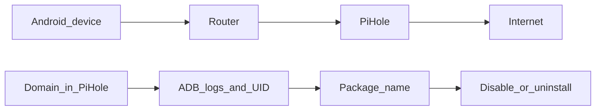

# Investigation workflow: Pi-hole clue → app → fix

Goal: when you see a suspicious domain (often in Pi-hole logs), figure out **which app/service** on Android is responsible.

## Mental model



## Step-by-step (practical)

### 1) Confirm the domain is real (and frequent)

- In Pi-hole: Query Log → filter by the domain → note client IP/MAC and frequency.

### 2) Try to catch attribution signals on the phone (ADB)

```bash
# Look for the domain in logs
adb shell "logcat | grep -i 'allawnos.com'"
```

If you see a UID (e.g., `UID=10145`):

```bash
adb shell pm list packages --uid 10145
```

### 3) Sanity-check the package

- Is it a vendor cloud, app store, “device care”, analytics, or something you don’t use?
- If unsure: disable first (more reversible), then reboot and observe.

### 4) Apply a fix (one at a time)

```bash
# Option A: disable
adb shell pm disable-user --user 0 <package>

# Option B: uninstall for user 0
adb shell pm uninstall --user 0 <package>
```

### 5) Verify

- Pi-hole: query volume for the domain should drop to near zero.
- Optional: phone-side visibility using PCAPdroid / TrackerControl.

## Important: DNS bypass exists

Some apps/devices use hardcoded DNS or DoH, which can bypass Pi-hole.

Read:

- `../../pi-hole/docs/hardcoded-dns.md`
