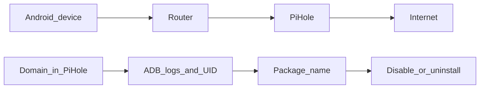

# Investigation Workflow: Pi-hole Clue → App → Fix

Goal: when you see a suspicious domain (often in Pi-hole logs), figure out **which app/service** on Android is responsible.

## What Is Investigation?

### Definition

**Investigation** is the process of tracing network activity (domains, connections) back to the specific Android app or service that caused it.

### Why Investigation Is Needed

**The problem:** Pi-hole shows you domains being queried, but not which app is making the queries.

**Why this matters:**

- **Need to know source:** Can't fix what you don't identify
- **Targeted removal:** Remove specific app, not guess
- **Verify results:** Confirm removal worked
- **Prevent breakage:** Know what you're removing

**The solution:** Use ADB and logs to trace domains to apps.

**Real-world analogy:**

- **Pi-hole = Security camera** (shows what happened)
- **Investigation = Detective work** (find who did it)
- **ADB = Investigation tools** (logs, commands)
- **Result = Identify culprit** (which app)

### How Investigation Works

**Step-by-step process:**

1. **See domain in Pi-hole:** Query log shows suspicious domain
2. **Investigate with ADB:** Use logs to find which app
3. **Map to package:** Identify Android package name
4. **Verify package:** Confirm it's the right app
5. **Remove/disable:** Apply fix
6. **Verify fix:** Confirm domain queries stopped

## Mental Model



**Flow explanation:**

- **Phone → Router → Pi-hole → Internet:** Network traffic flow
- **Clue → ADB → Package → Fix:** Investigation and fix flow
- **Each step:** Builds on previous step to identify and fix issue

## Step-by-Step (Practical)

### 1) Confirm the Domain Is Real (and Frequent)

**What this means:** Verify the domain is actually being queried frequently, not a one-time event.

**Why this matters:**

- **One-time queries:** May be normal, not worth investigating
- **Frequent queries:** Indicates ongoing telemetry, worth investigating
- **Verify pattern:** Confirm it's consistent behavior

**How to do it:**

**In Pi-hole: Query Log → filter by the domain → note client IP/MAC and frequency.**

**Step-by-step:**

1. **Open Pi-hole:** Go to Pi-hole admin interface
2. **Query Log:** Navigate to Query Log
3. **Filter domain:** Search for suspicious domain (e.g., `allawnos.com`)
4. **Check frequency:** Note how often it's queried (per hour/day)
5. **Note client:** Record device IP/MAC address
6. **Verify pattern:** Confirm it's consistent, not random

**Real-world example:**

**Pi-hole Query Log shows:**

```
Domain: allawnos.com
Client: 192.168.1.100 (Android phone)
Frequency: 50 queries/hour
Time: Consistent throughout day
```

**Analysis:**

- ✅ **Frequent:** 50 queries/hour is high frequency
- ✅ **Consistent:** Happening throughout day
- ✅ **Worth investigating:** Likely telemetry, not normal usage

**If domain queried rarely:**

- May be normal app behavior
- Not worth investigating
- Focus on frequent domains instead

### 2) Try to Catch Attribution Signals on the Phone (ADB)

**What this means:** Use ADB to find which app is making the network requests.

**Why this matters:**

- **Pi-hole shows domain:** But not which app
- **ADB shows app:** Can identify responsible app
- **Connect the dots:** Link domain to app

**How to do it:**

**Look for the domain in logs:**

```bash
adb shell "logcat | grep -i 'allawnos.com'"
```

**What this does:**

- **`logcat`:** Shows Android system logs
- **`grep -i 'allawnos.com'`:** Searches for domain (case-insensitive)
- **Shows matches:** Displays log entries containing domain

**What to look for:**

- **UID numbers:** User ID of app making connection
- **Package names:** App package name in logs
- **Connection attempts:** Network connection logs
- **Error messages:** Failed connection attempts

**If you see a UID (e.g., `UID=10145`):**

**Map UID to package:**

```bash
adb shell pm list packages --uid 10145
```

**What this does:**

- **`pm list packages`:** Lists packages
- **`--uid 10145`:** Filters by UID
- **Shows package:** Displays package name(s) with that UID

**Real-world example:**

**Step 1: Search logs:**

```bash
$ adb shell "logcat | grep -i 'allawnos.com'"
logcat: UID=10145 connecting to allawnos.com
logcat: UID=10145 DNS query: allawnos.com
```

**Step 2: Map UID to package:**

```bash
$ adb shell pm list packages --uid 10145
package:com.oppo.heycloud
```

**Result:** `com.oppo.heycloud` is making connections to `allawnos.com` ✅

### 3) Sanity-Check the Package

**What this means:** Verify the identified package is actually the culprit and safe to remove.

**Why this matters:**

- **Confirm attribution:** Make sure you found the right app
- **Assess risk:** Determine if safe to remove
- **Avoid breakage:** Don't remove critical apps

**How to do it:**

**Check package type:**

- **Is it vendor cloud?** (e.g., `com.oppo.heycloud`)
- **Is it app store?** (e.g., `com.oppo.appstore`)
- **Is it "device care"?** (e.g., `com.oppo.devicecare`)
- **Is it analytics?** (e.g., `com.oppo.analytics`)
- **Is it something you don't use?** (e.g., unused vendor apps)

**If unsure: disable first (more reversible), then reboot and observe.**

**Why disable first:**

- **More reversible:** Easier to restore if wrong
- **Test impact:** See if device still works
- **Lower risk:** Less chance of breaking device

**Real-world example:**

**Found package:** `com.oppo.heycloud`

**Sanity check:**

- ✅ **Vendor cloud:** Yes, OPPO cloud service
- ✅ **Not critical:** Not needed for device to function
- ✅ **Safe to remove:** Can be removed safely

**Action:** Remove with `pm uninstall --user 0`

**If package was `com.android.systemui`:**

- ❌ **System UI:** Critical system component
- ❌ **Don't remove:** Would break phone UI
- ❌ **Keep it:** Leave this one alone

### 4) Apply a Fix (One at a Time)

**What this means:** Remove or disable the identified app using safe methods.

**Why one at a time:**

- **Identify issues:** Know which app caused problems
- **Easier rollback:** Can restore specific app if needed
- **Lower risk:** Less chance of breaking device

**How to do it:**

**Option A: Disable (safer, reversible)**

```bash
adb shell pm disable-user --user 0 <package>
```

**What this does:**

- **Disables app:** Prevents app from running
- **Reversible:** Can enable with `pm enable`
- **Lower risk:** App still installed, just inactive

**Option B: Uninstall for user 0 (recommended)**

```bash
adb shell pm uninstall --user 0 <package>
```

**What this does:**

- **Removes app:** Uninstalls app for your user
- **Reversible:** Can restore with `pm install-existing`
- **More permanent:** App gone but can be restored

**Real-world example:**

**Found:** `com.oppo.heycloud` is causing `allawnos.com` queries

**Option 1: Disable (test first):**

```bash
$ adb shell pm disable-user --user 0 com.oppo.heycloud
Package com.oppo.heycloud new state: disabled-user
```

**Test:** Reboot, check Pi-hole, verify queries stopped

**Option 2: Uninstall (if disabling worked):**

```bash
$ adb shell pm uninstall --user 0 com.oppo.heycloud
Success
```

**Verify:** Check Pi-hole, confirm queries stopped

### 5) Verify

**What this means:** Confirm that removing/disabling the app actually stopped the telemetry.

**Why this matters:**

- **Confirm fix worked:** Verify domain queries stopped
- **Check for side effects:** Ensure device still works
- **Validate investigation:** Confirm you found the right app

**How to do it:**

**Pi-hole: query volume for the domain should drop to near zero.**

**Step-by-step:**

1. **Wait:** Give it some time (hours/days)
2. **Check Pi-hole:** Query Log → filter by domain
3. **Compare:** Before vs after query volume
4. **Verify:** Queries should be near zero

**Optional: phone-side visibility using PCAPdroid / TrackerControl.**

**PCAPdroid:**

- **What:** On-device network monitoring app
- **Why:** See network activity directly on phone
- **How:** Install, monitor connections, verify no connections to domain

**TrackerControl:**

- **What:** Tracker blocking and monitoring app
- **Why:** Identify and block trackers
- **How:** Install, check tracker list, verify domain blocked

**Real-world example:**

**Before removal:**

- Pi-hole shows: `allawnos.com` queried 50 times/hour

**After removal:**

- Pi-hole shows: `allawnos.com` queried 0 times/hour ✅

**Verification:**

- ✅ **Queries stopped:** Domain no longer queried
- ✅ **Device works:** Phone functions normally
- ✅ **Fix successful:** Investigation and removal worked

## Important: DNS Bypass Exists

**Some apps/devices use hardcoded DNS or DoH, which can bypass Pi-hole.**

**What this means:**

- **Hardcoded DNS:** Apps use specific DNS servers (bypass Pi-hole)
- **DoH (DNS-over-HTTPS):** Apps use encrypted DNS (bypass Pi-hole)
- **Pi-hole won't see:** These queries don't go through Pi-hole

**Why this happens:**

- **Apps want connectivity:** Ensure they can connect
- **Vendors want control:** Bypass user DNS controls
- **Privacy concerns:** Users block telemetry, apps find ways around

**Solutions:**

- **Firewall rules:** Block direct connections at network level
- **Router configuration:** Redirect all DNS to Pi-hole
- **On-device tools:** Use PCAPdroid/TrackerControl to monitor
- **Network-level blocking:** Block domains at router/firewall

**Read:**

- **Enforcement patterns:** [`../../pi-hole/docs/hardcoded-dns.md`](../../pi-hole/docs/hardcoded-dns.md)
