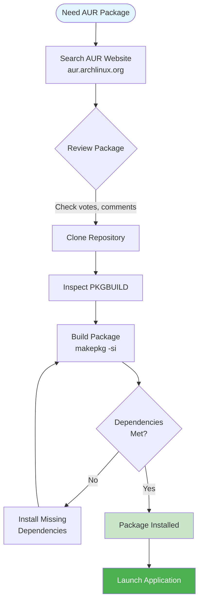
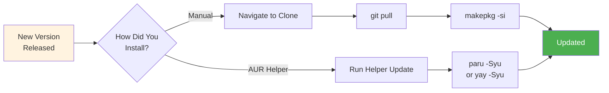

# AUR Package Installation & Maintenance

**Complete guide to installing, building, and maintaining packages from the Arch User Repository (AUR) on CachyOS and other Arch-based systems.**

This document explains:

- **What the AUR is** and why it exists
- **How to manually build and install** AUR packages
- **How to update** AUR packages when new versions are released
- **When to use AUR helpers** like `paru` or `yay`
- **Security considerations** for community-maintained packages

It is written for:

- CachyOS, Arch Linux, and Arch-based distros (EndeavourOS, Manjaro, etc.)
- Users who need software not available in the official repositories
- Anyone wanting to understand the Arch package ecosystem

---

## What is the AUR?

### Definition

**The Arch User Repository (AUR)** is a community-driven repository of package build scripts (called PKGBUILDs) for Arch Linux. It contains packages that are not available in the official Arch repositories.

**Key characteristics:**

- **Community-maintained:** Packages are created and maintained by users, not the Arch team
- **Build scripts, not binaries:** The AUR provides instructions to build packages from source
- **Not officially supported:** Arch developers do not test or endorse AUR packages
- **Requires manual installation:** Packages must be built locally on your system

### Why the AUR Exists

**Official Arch repositories** (`core`, `extra`, `multilib`) contain:

- Packages maintained by Arch developers
- Well-tested, stable software
- Essential system components

**The AUR fills gaps for:**

- Proprietary software (Notion, Spotify, Discord, etc.)
- Niche applications with small user bases
- Newer versions of software before they reach official repos
- Forks and modified versions of existing software
- Software with licensing that prevents official inclusion

**Real-world example:**

The `notion` package in official CachyOS/Arch repositories is a **window manager** (a different application entirely). To get the **Notion note-taking app**, you must use the AUR package `notion-app-electron`, which provides a community-maintained Electron wrapper.

### Security Considerations

**The AUR is user-generated content.** Before installing any AUR package:

1. **Review the PKGBUILD:** Check what commands will run during installation
2. **Check package votes and popularity:** Higher votes suggest more community trust
3. **Read comments:** Users report issues and security concerns
4. **Verify the source:** Ensure the package downloads from official sources
5. **Check for orphaned packages:** Unmaintained packages may have security issues

**To view a PKGBUILD before installing:**

```bash
# After cloning, before building
cat PKGBUILD
```

**What to look for:**

- `source=()` array should point to official download URLs
- No suspicious commands in `build()` or `package()` functions
- No unexplained `curl`, `wget`, or network calls

---

## Understanding the Manual Build Process

### What is makepkg?

**`makepkg`** is the Arch Linux tool that builds packages from source code. It reads a `PKGBUILD` file and:

1. Downloads source code from specified URLs
2. Verifies checksums for integrity
3. Extracts and compiles the source
4. Creates a `.pkg.tar.zst` package file
5. Optionally installs the package to your system

**Why build locally?**

- **Transparency:** You can see exactly what's being installed
- **Customization:** You can modify build options
- **Security:** No trust required in pre-built binaries
- **Compatibility:** Packages built for your exact system

### What is a PKGBUILD?

**A PKGBUILD** is a bash script that defines how to build a package. Key variables include:

| Variable | Purpose |
|----------|---------|
| `pkgname` | Package name |
| `pkgver` | Version number |
| `source` | URLs to download source files |
| `sha256sums` | Checksums to verify downloads |
| `depends` | Runtime dependencies |
| `makedepends` | Build-time dependencies |
| `build()` | Commands to compile the software |
| `package()` | Commands to install files |

### Required Build Tools

Before building any AUR package, install the base development tools:

```bash
sudo pacman -S --needed base-devel git
```

**What this installs:**

- **`base-devel`:** Compilers (gcc), make, and other build essentials
- **`git`:** Required to clone AUR repositories

**The `--needed` flag:** Only installs packages that aren't already installed, preventing unnecessary reinstallation.

---

## Step-by-Step Installation: Notion as Example

This section uses **Notion** (the note-taking app) as a practical example. The same process applies to any AUR package.



### Step 1: Find the Package

Visit [aur.archlinux.org](https://aur.archlinux.org) and search for your package.

**For Notion:**

- Search: "notion"
- Find: `notion-app-electron` (the note-taking app wrapper)
- Note the Git Clone URL: `https://aur.archlinux.org/notion-app-electron.git`

**Evaluating a package:**

- **Votes:** Higher is better (indicates community trust)
- **Popularity:** Percentage of AUR users who installed it
- **Last Updated:** Recent updates suggest active maintenance
- **Orphan status:** Avoid orphaned packages when possible

### Step 2: Clone the Repository

```bash
# Clone the AUR package repository
git clone https://aur.archlinux.org/notion-app-electron.git

# Navigate into the directory
cd notion-app-electron
```

**What this does:**

- Downloads the PKGBUILD and any helper files to your local system
- Creates a directory named after the package

### Step 3: Review the PKGBUILD (Recommended)

```bash
# View the build script before running
cat PKGBUILD
```

**Check for:**

- Legitimate source URLs (should point to official Notion releases or GitHub)
- No suspicious shell commands
- Dependencies listed match what the software actually needs

### Step 4: Build and Install

```bash
makepkg -si
```

**Flag breakdown:**

| Flag | Meaning |
|------|---------|
| `-s` | **Sync dependencies:** Automatically install missing dependencies via pacman |
| `-i` | **Install:** Install the package after building |

**What happens during build:**

1. `makepkg` reads the PKGBUILD
2. Downloads the Notion source/binaries from the specified URL
3. Verifies checksums
4. Packages everything into a `.pkg.tar.zst` file
5. Installs the package using `pacman -U`
6. You'll be prompted for your sudo password during installation

**After successful installation:**

- Notion appears in your application launcher (KDE, GNOME, etc.)
- Works under Wayland via XWayland compatibility automatically
- Configuration stored in `~/.config/Notion/`

---

## Updating AUR Packages

### Why Manual Updates Are Needed

AUR packages are **not updated automatically** when you run `sudo pacman -Syu`. The package manager only updates packages from official repositories.

**You must manually update AUR packages when:**

- The application notifies you of a new version
- The app stops working or shows version mismatch errors
- You see update notifications on the AUR package page
- Security advisories recommend updating



### Update Process

**Step 1: Navigate to your local clone**

```bash
cd ~/notion-app-electron
```

If you deleted this directory, re-clone:

```bash
git clone https://aur.archlinux.org/notion-app-electron.git
cd notion-app-electron
```

**Step 2: Pull the latest changes**

```bash
git pull
```

This downloads the updated PKGBUILD with the new version number and checksums.

**Step 3: Rebuild and install**

```bash
makepkg -si
```

The `--noconfirm` flag can skip confirmation prompts:

```bash
makepkg -si --noconfirm
```

**What happens:**

- `makepkg` detects the new version
- Downloads and builds the updated package
- Replaces the old installation with the new version

---

## AUR Helpers: Alternative Method

### What Are AUR Helpers?

**AUR helpers** are tools that automate the AUR workflow:

- Searching and installing AUR packages
- Checking for updates
- Handling dependencies
- Building and installing in one command

**Popular AUR helpers:**

| Helper | Description |
|--------|-------------|
| `paru` | Written in Rust, modern, feature-rich, recommended for CachyOS |
| `yay` | Written in Go, popular, mature, widely used |

### Installing paru (Recommended for CachyOS)

CachyOS typically has `paru` available. If not installed:

```bash
# Install paru from AUR (manually, just this once)
git clone https://aur.archlinux.org/paru.git
cd paru
makepkg -si
```

### Using paru

**Install an AUR package:**

```bash
paru -S notion-app-electron
```

**Update all packages (official + AUR):**

```bash
paru -Syu
```

**Search for packages:**

```bash
paru -Ss notion
```

### Manual vs AUR Helper: When to Use Each

**Use manual installation when:**

- You want to review the PKGBUILD before building
- You're installing security-sensitive packages
- You're learning how Arch package building works
- The AUR helper fails and you need to debug

**Use AUR helpers when:**

- You install many AUR packages
- You want automatic update checking
- You're comfortable with the packages you're installing
- You want convenience for trusted, popular packages

---

## Troubleshooting

### Dependency Errors

**Problem:** `makepkg -si` fails with missing dependency errors.

**Solution:**

```bash
# Read the error message for the package name
# Example error: "target not found: some-dependency"

# Try installing the dependency manually
sudo pacman -S some-dependency

# If it's an AUR dependency, install it first
paru -S some-dependency

# Then retry the original build
makepkg -si
```

### Build Failures

**Problem:** Compilation fails with errors.

**Common causes and solutions:**

1. **Missing build dependencies:**
   ```bash
   # Check the PKGBUILD for makedepends
   grep makedepends PKGBUILD
   # Install any listed packages
   sudo pacman -S missing-package
   ```

2. **Outdated PKGBUILD:**
   ```bash
   # Check the AUR page for comments about fixes
   # The maintainer may have already addressed the issue
   git pull
   makepkg -si
   ```

3. **Checksum mismatch:**
   ```bash
   # If upstream changed the source file without a version bump
   makepkg -si --skipchecksums
   # Note: Only do this if you trust the source
   ```

### Application Behaves Strangely After Update

**Problem:** App crashes, loses settings, or acts erratically after updating.

**Solution: Clear the application cache**

```bash
# For Notion specifically
rm -rf ~/.config/Notion

# For other apps, check their config directory
ls ~/.config/ | grep -i appname
rm -rf ~/.config/AppName
```

**Warning:** This removes saved preferences. You may need to reconfigure the application.

### Package Conflicts

**Problem:** New package conflicts with an existing one.

**Solution:**

```bash
# Remove the conflicting package first
sudo pacman -R conflicting-package

# Then install the new one
makepkg -si
```

---

## Applying This to Other Packages

### Finding AUR Packages

**Official AUR website:** [aur.archlinux.org](https://aur.archlinux.org)

**Search tips:**

- Use the application's actual name
- Try common suffixes: `-bin` (prebuilt binary), `-git` (latest from git)
- Check for multiple versions (stable vs development)

**Example searches:**

| Application | AUR Package(s) |
|-------------|----------------|
| Spotify | `spotify` |
| Discord | `discord`, `discord-canary` |
| Visual Studio Code | `visual-studio-code-bin` |
| Zoom | `zoom` |
| Slack | `slack-desktop` |

### Checking Package Quality

Before installing, evaluate:

1. **Votes and popularity:** More votes = more users trust it
2. **Last updated:** Avoid stale packages (6+ months without updates)
3. **Orphan status:** Orphaned packages have no maintainer
4. **Comments section:** Users report issues and provide fixes
5. **Out-of-date flag:** Red flag means the package needs updating

### Security Best Practices

1. **Always review PKGBUILDs** for unfamiliar packages
2. **Prefer packages with high votes** (community-vetted)
3. **Check the source URLs** point to official locations
4. **Avoid orphaned packages** for security-critical software
5. **Keep packages updated** for security patches
6. **Use `paru -Gp packagename`** to view PKGBUILD without cloning

---

## Quick Reference

### Install a Package Manually

```bash
git clone https://aur.archlinux.org/package-name.git
cd package-name
cat PKGBUILD          # Review first
makepkg -si
```

### Update a Package Manually

```bash
cd package-name
git pull
makepkg -si
```

### Install with paru

```bash
paru -S package-name
```

### Update All Packages with paru

```bash
paru -Syu
```

### Remove an AUR Package

```bash
sudo pacman -R package-name
```

---

## Related Documentation

- **[Package Management Guide](./README.md)** - AppImage, Flatpak, and package format choices
- **[Flatpak Sandboxing Issues](./FLATPAK_SANDBOXING.md)** - Troubleshooting Flatpak permission problems
- **[Glossary](../docs/GLOSSARY.md)** - Technical terms explained

---

This guide applies to any AUR package. The Notion example demonstrates the workflow, but the same steps work for Spotify, Discord, Visual Studio Code, or any other software available in the AUR.
