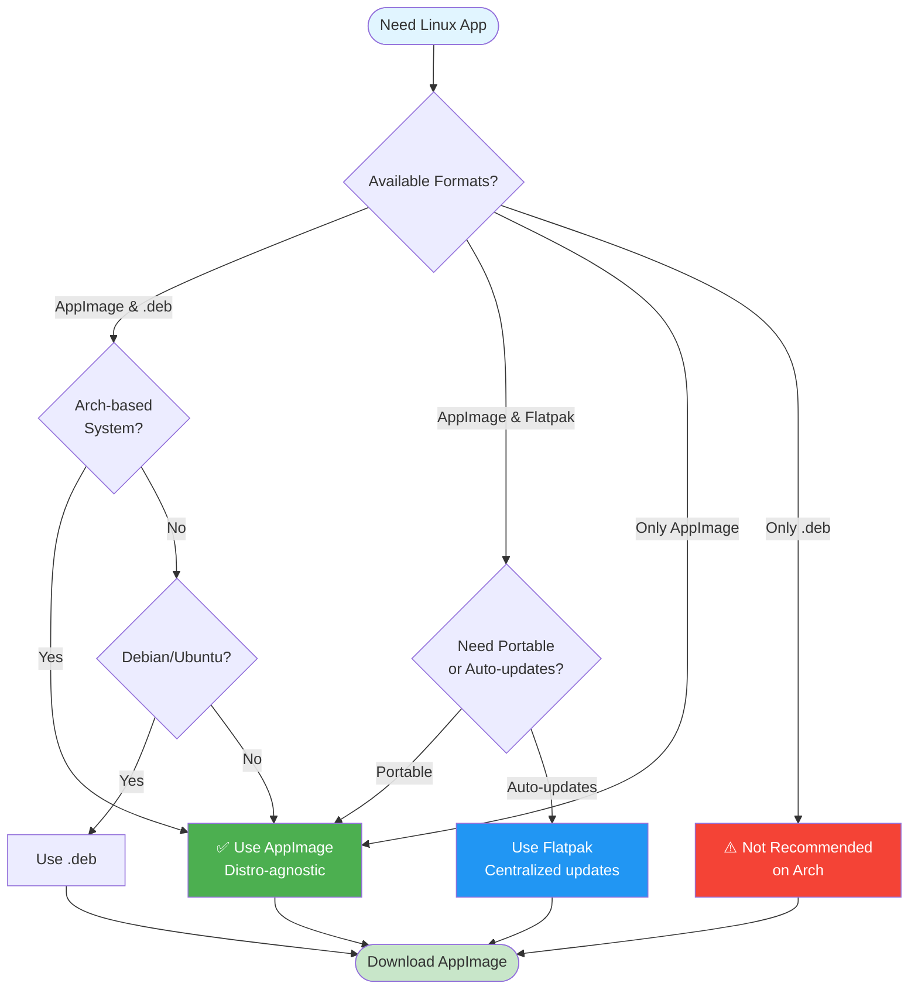
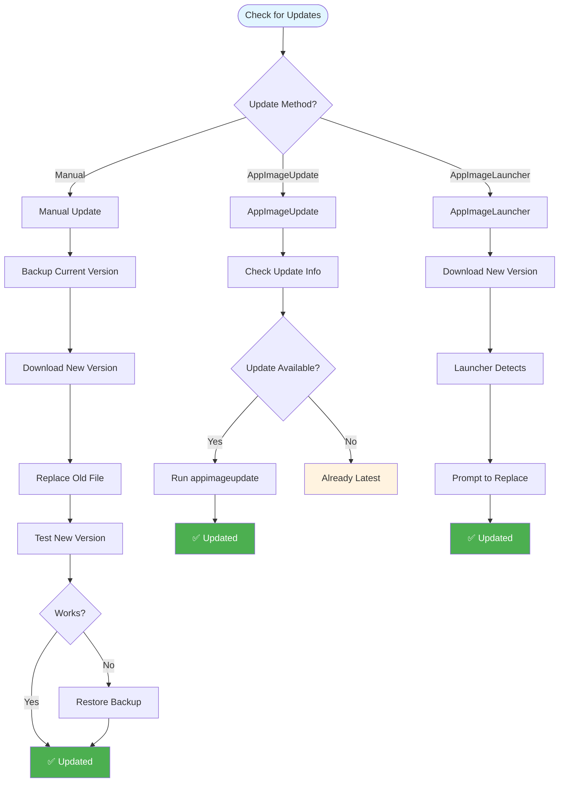

# Linux Package Management & Installation

**Complete guide to installing and managing applications on Arch-based systems, covering AppImage, Flatpak, and common package installation issues.**

This document explains:

- **Which Linux package format to choose** (AppImage, Flatpak, .deb)
- **How to run AppImages on Arch-based systems**
- **How to properly integrate applications into KDE Application Launcher**
- **Common Flatpak sandboxing issues and solutions**

It is written for:

- Arch Linux & Arch-based distros (CachyOS, EndeavourOS, etc.)
- KDE Plasma desktop
- Users downloading apps that offer **`.AppImage`, `.deb`, or Flatpak** formats

---

## Choosing the Correct Package Format



If an application provides the following options:

- Linux (`.AppImage`)
- Linux (`.deb`)

### ✅ Recommended: **AppImage**

**Do not use `.deb` on Arch-based systems.**

Reasons:

- `.deb` is for Debian/Ubuntu (`apt`)
- Arch uses `pacman` and does not support `.deb` natively
- Converting `.deb` packages is fragile and error-prone

### Why AppImage Works Well on Arch

- Distro-agnostic
- Bundles its own dependencies
- No system installation required
- Works reliably on rolling-release systems

---

## Running an AppImage on Arch


### Step 1: Make the AppImage executable

From a terminal:

```bash
chmod +x MyApp-x86_64.AppImage
```

Or via KDE:

- Right-click → Properties → Permissions
- Enable **"Is executable"**

---

### Step 2: Install required dependency (FUSE)

Many AppImages require **FUSE v2**, which is not installed by default on Arch.

Install it once:

```bash
sudo pacman -S fuse2
```

Without this, AppImages may silently fail when launched.

---

### Step 3: Run the AppImage

```bash
./MyApp-x86_64.AppImage
```

If it launches successfully, the AppImage itself is working correctly.

---

## Placing the AppImage in a Stable Location

Do **not** leave AppImages in the `Downloads` directory.

Recommended location:

```bash
mkdir -p ~/.local/bin
mv MyApp-x86_64.AppImage ~/.local/bin/myapp
chmod +x ~/.local/bin/myapp
```

This ensures:

- Stable paths
- No accidental deletion
- Cleaner desktop integration

---

## Adding the AppImage to KDE Application Launcher

AppImages do not automatically appear in the app menu.
To integrate them properly, create a `.desktop` file.

### Step 1: Create the applications directory (if missing)

```bash
mkdir -p ~/.local/share/applications
```

---

### Step 2: Create a desktop entry

Create a file named `myapp.desktop`:

```bash
nano ~/.local/share/applications/myapp.desktop
```

Paste the following (generic template):

```ini
[Desktop Entry]
Type=Application
Name=MyApp
Comment=Application Description
Exec=/home/USER/.local/bin/myapp
Icon=utilities-terminal
Terminal=false
Categories=Development;Utility;
```

⚠️ Replace:

- `/home/USER` with your actual home path
- `myapp` with the AppImage filename

---

### Step 3: Refresh KDE application cache

```bash
kbuildsycoca6
```

The application will now appear in:

- KDE Application Launcher
- Search
- Favorites / Task Manager (if pinned)

---

## Icon Extraction & Theming

By default, desktop entries use generic icons (like `utilities-terminal`). To use the actual application icon from the AppImage, extract it and reference it in your `.desktop` file.

### Step 1: Extract the AppImage

AppImages are self-extracting archives. Extract the contents temporarily:

```bash
cd ~/.local/bin
./myapp --appimage-extract
```

This creates a `squashfs-root/` directory containing the AppImage's internal structure.

### Step 2: Find the icon

Icons are typically located in:

```bash
# Common locations to check:
ls squashfs-root/*.png
ls squashfs-root/*.svg
ls squashfs-root/*.ico
ls squashfs-root/usr/share/pixmaps/
ls squashfs-root/usr/share/icons/
ls squashfs-root/.DirIcon  # AppImage standard icon
```

The `.DirIcon` file is the AppImage's standard icon (usually a PNG or SVG).

### Step 3: Copy icon to user directory

Create icons directory and copy the icon:

```bash
# Create icons directory
mkdir -p ~/.local/share/icons/hicolor/256x256/apps

# Copy icon (adjust path as needed)
cp squashfs-root/.DirIcon ~/.local/share/icons/hicolor/256x256/apps/myapp.png

# Or if using a different icon file:
cp squashfs-root/usr/share/pixmaps/myapp.png ~/.local/share/icons/hicolor/256x256/apps/myapp.png
```

For SVG icons:

```bash
mkdir -p ~/.local/share/icons/hicolor/scalable/apps
cp squashfs-root/.DirIcon ~/.local/share/icons/hicolor/scalable/apps/myapp.svg
```

### Step 4: Update desktop entry

Edit your `.desktop` file to reference the icon:

```ini
[Desktop Entry]
Type=Application
Name=MyApp
Comment=Application Description
Exec=/home/USER/.local/bin/myapp
Icon=myapp
Terminal=false
Categories=Development;Utility;
```

Or use the full path:

```ini
Icon=/home/USER/.local/share/icons/hicolor/256x256/apps/myapp.png
```

### Step 5: Refresh icon cache

Update the icon cache so KDE recognizes the new icon:

```bash
# For KDE Plasma
kbuildsycoca6

# For GTK-based apps (optional)
gtk-update-icon-cache ~/.local/share/icons/hicolor/
```

### Step 6: Clean up extraction

Remove the temporary extraction directory:

```bash
rm -rf ~/.local/bin/squashfs-root
```

### Alternative: Using system icon themes

If you prefer to use system icons, you can reference them by name:

```ini
Icon=application-x-executable  # Generic executable icon
Icon=utilities-terminal        # Terminal icon
Icon=system-software-install   # Install icon
```

Browse available icons:

```bash
# KDE icon themes
ls /usr/share/icons/
ls ~/.local/share/icons/
```

---

## AppImage Updates



AppImages do not update automatically. You need to manually download and replace the old version.

### Manual Update Process

#### Step 1: Backup current version (recommended)

```bash
cd ~/.local/bin
cp myapp myapp.backup
```

This allows you to roll back if the new version has issues.

#### Step 2: Download new version

Download the new AppImage from the official source. Verify the filename matches your current one (or update your `.desktop` file if the name changed).

#### Step 3: Replace old version

```bash
# Stop the application if running
# Then replace:
mv ~/Downloads/MyApp-x86_64.AppImage ~/.local/bin/myapp
chmod +x ~/.local/bin/myapp
```

#### Step 4: Test the new version

Launch the application to ensure it works correctly:

```bash
~/.local/bin/myapp
```

If issues occur, restore the backup:

```bash
mv ~/.local/bin/myapp.backup ~/.local/bin/myapp
```

### Using AppImageUpdate (if available)

Some AppImages support automatic updates via `AppImageUpdate`. Check if your AppImage supports it:

```bash
~/.local/bin/myapp --appimage-updateinfo
```

If update information is available, you can update:

```bash
# Install AppImageUpdate (AUR)
paru -S appimageupdate

# Update the AppImage
appimageupdate ~/.local/bin/myapp
```

**Note:** Not all AppImages provide update information. This method only works if the developer has configured it.

### AppImageLauncher Update Integration

If you're using **AppImageLauncher**, it can help manage updates:

- AppImageLauncher detects when you download a new version
- It can prompt you to replace the old integrated version
- Updates maintain your desktop integration automatically

### Best Practices for Version Management

- **Keep backups**: Always backup before updating
- **Check release notes**: Review changelogs before updating
- **Test thoroughly**: Verify the new version works with your workflow
- **Version naming**: Some users keep multiple versions:
  ```bash
  ~/.local/bin/myapp-v1.0.0
  ~/.local/bin/myapp-v2.0.0
  ```
- **Update regularly**: Check for updates monthly or when security issues are announced
- **Verify sources**: Always download from official sources

### Handling Multiple Versions

If you need to keep multiple versions:

```bash
# Install versions with version numbers
~/.local/bin/myapp-1.0.0
~/.local/bin/myapp-2.0.0

# Create separate desktop entries
~/.local/share/applications/myapp-1.0.0.desktop
~/.local/share/applications/myapp-2.0.0.desktop
```

Update the `Exec=` and `Name=` fields in each `.desktop` file accordingly.

---

## Security Considerations

AppImages run with your user permissions and are not sandboxed by default. Follow these security best practices:

### Verify AppImage Signatures

Some AppImages are cryptographically signed. Verify signatures when available:

```bash
# Check if AppImage is signed
~/.local/bin/myapp --appimage-signature

# Verify signature (requires GPG key)
gpg --verify myapp.AppImage.sig myapp.AppImage
```

**Note:** Most AppImages are not signed. This is a limitation of the current ecosystem.

### Download from Trusted Sources

- **Official websites**: Always download from the application's official website
- **GitHub Releases**: Verify you're on the correct repository
- **Avoid third-party mirrors**: Unless you trust the mirror operator
- **Check URLs**: Verify download URLs match the official domain

### Verify File Integrity

Check SHA256 checksums when provided:

```bash
# Download checksum file
wget https://example.com/myapp.AppImage.sha256

# Calculate checksum of downloaded file
sha256sum ~/Downloads/myapp.AppImage

# Compare with provided checksum
cat myapp.AppImage.sha256
```

If checksums don't match, **do not run** the AppImage.

### Run with Appropriate Permissions

- **User-level execution**: AppImages run as your user, not root
- **Avoid running as root**: Never use `sudo` with AppImages unless absolutely necessary
- **Check file permissions**: Ensure only you can execute:
  ```bash
  ls -l ~/.local/bin/myapp
  # Should show: -rwxr-xr-x (owner executable, others not)
  ```

### Sandboxing Considerations

AppImages are **not sandboxed** by default. They have access to:

- Your home directory
- Network access
- System resources (CPU, memory, GPU)
- Other running applications

**Considerations:**

- **Firewall**: Use a firewall to restrict network access if needed
- **AppArmor/SELinux**: Can be configured to restrict AppImage behavior (advanced)
- **Isolated execution**: Run in a VM or container for untrusted applications
- **Review permissions**: Check what the application requests access to

### AppImageLauncher Security Features

AppImageLauncher provides some security benefits:

- **Centralized management**: All AppImages in one location (`~/Applications/`)
- **Verification prompts**: Asks before integrating new AppImages
- **Isolation**: Can help prevent accidental execution of malicious files

### When to Be Cautious

**Red flags:**

- Unsigned AppImages from unknown sources
- AppImages downloaded from file-sharing sites
- Checksums don't match
- AppImages requesting root access unnecessarily
- AppImages from unverified GitHub forks
- AppImages with unusual file sizes (too small or suspiciously large)

**Safe practices:**

- Research the application before downloading
- Check GitHub stars, issues, and community activity
- Read user reviews and forum discussions
- Start with well-known applications
- Use AppImageLauncher for better management

### Reporting Security Issues

If you discover a security issue:

1. **Do not run** the AppImage
2. Report to the application maintainer
3. Report to security@lists.appimage.org if it's an AppImage format issue
4. Consider reporting to your distribution's security team

---

## Flatpak vs AppImage Comparison

Both Flatpak and AppImage are modern Linux application distribution formats. Here's how they compare:

### Distribution Model

| Aspect           | Flatpak                                   | AppImage                        |
| ---------------- | ----------------------------------------- | ------------------------------- |
| **Distribution** | Centralized repositories (Flathub, etc.)  | Direct download from developers |
| **Discovery**    | Via software centers and `flatpak search` | Manual download from websites   |
| **Installation** | `flatpak install app`                     | Download and make executable    |

**Flatpak:** Applications are distributed through repositories like Flathub, making discovery and installation easier.

**AppImage:** Applications are downloaded directly from developer websites or GitHub releases, giving developers full control.

### Dependencies

| Aspect      | Flatpak                                            | AppImage                        |
| ----------- | -------------------------------------------------- | ------------------------------- |
| **Runtime** | Shared runtimes (e.g., `org.freedesktop.Platform`) | Bundled with application        |
| **Size**    | Smaller per-app (shared dependencies)              | Larger per-app (self-contained) |
| **Updates** | Runtime updates benefit all apps                   | Each app updates independently  |

**Flatpak:** Uses shared runtimes, reducing disk space. Multiple apps share the same runtime.

**AppImage:** Each AppImage bundles its dependencies, resulting in larger individual files but complete portability.

### Updates

| Aspect        | Flatpak                         | AppImage                    |
| ------------- | ------------------------------- | --------------------------- |
| **Method**    | `flatpak update` (automatic)    | Manual download and replace |
| **Frequency** | Centralized, regular updates    | Per-developer schedule      |
| **Ease**      | Single command updates all apps | Manual per-application      |

**Flatpak:** Updates are centralized and can be automated. One command updates all Flatpak applications.

**AppImage:** Updates require manually downloading new versions and replacing old ones. Some apps support `AppImageUpdate`, but it's not universal.

### Size Comparison

**Example: A text editor**

- **Flatpak:** ~50-100 MB (shares runtime with other apps)
- **AppImage:** ~100-200 MB (includes all dependencies)

**Total for 10 applications:**

- **Flatpak:** ~500 MB (shared runtime) + ~50 MB per app = ~1 GB
- **AppImage:** ~100-200 MB per app = ~1-2 GB

**Winner:** Flatpak for multiple applications, AppImage for single portable apps.

### Desktop Integration

| Aspect                | Flatpak   | AppImage                  |
| --------------------- | --------- | ------------------------- |
| **Menu Integration**  | Automatic | Manual (`.desktop` files) |
| **Icons**             | Automatic | Manual extraction         |
| **MIME Types**        | Automatic | Manual configuration      |
| **File Associations** | Automatic | Manual setup              |

**Flatpak:** Full automatic integration with desktop environments.

**AppImage:** Requires manual setup of `.desktop` files and icons (or use AppImageLauncher).

### Security & Sandboxing

| Aspect             | Flatpak                | AppImage                        |
| ------------------ | ---------------------- | ------------------------------- |
| **Sandboxing**     | Yes (bubblewrap)       | No (runs with user permissions) |
| **Permissions**    | Granular control       | Full user access                |
| **Isolation**      | Strong isolation       | No isolation                    |
| **Security Model** | Restrictive by default | Permissive by default           |

**Flatpak:** Applications run in sandboxes with restricted access. Permissions can be managed via `flatpak override`.

**AppImage:** Runs with full user permissions, no sandboxing. You trust the application completely.

### Use Cases: When to Choose Each

#### Choose **Flatpak** when:

- You want automatic updates
- You install many applications
- You prefer centralized management
- Security/sandboxing is important
- You want easy discovery via software centers
- You're okay with repository dependency

#### Choose **AppImage** when:

- You need portable applications (USB drive, network share)
- You want to run without installation
- You prefer direct developer distribution
- You need specific versions not in Flatpak repos
- You want to test applications without system changes
- You're on a system without Flatpak support

### Arch-Specific Considerations

**Both work well on Arch:**

- **Flatpak:** Available in official repos (`pacman -S flatpak`)
- **AppImage:** Works out-of-the-box with `fuse2` installed
- **Performance:** Both perform well on Arch
- **Integration:** Both integrate with KDE Plasma

**Recommendation:**

- Use **Flatpak** for regularly-used applications that benefit from automatic updates
- Use **AppImage** for portable tools, one-off applications, or when you need specific versions
- Many users use both formats depending on the application

### Hybrid Approach

You can use both formats simultaneously:

```bash
# Install common apps via Flatpak
flatpak install flathub org.gimp.GIMP
flatpak install flathub org.inkscape.Inkscape

# Use AppImage for portable tools
~/.local/bin/portable-tool.AppImage
```

This gives you the benefits of both: centralized management for common apps and portability for specialized tools.

---

## Optional: Automatic Integration with AppImageLauncher

If you use multiple AppImages, **AppImageLauncher** can automate menu integration.

### Install (AUR)

Using an AUR helper:

```bash
paru -S appimagelauncher-bin
```

Recommended choice:

- `appimagelauncher-bin` → precompiled, stable, fastest install

### What AppImageLauncher Does

- Detects AppImages on first run
- Offers **"Integrate and run"**
- Automatically creates menu entries and icons
- Moves AppImages to a managed location

This is optional but convenient.

---

## Summary

### Best Practices on Arch/KDE

- Prefer **AppImage** over `.deb`
- Install `fuse2`
- Store AppImages in `~/.local/bin`
- Use `.desktop` files for menu integration
- Extract and use application icons for better integration
- Keep backups before updating AppImages
- Verify checksums and download from trusted sources
- Use AppImageLauncher if managing many AppImages
- Consider Flatpak for applications that benefit from automatic updates

### Mental Model

- AppImage = portable executable
- `.desktop` file = menu integration
- FUSE = runtime requirement
- Icon extraction = better visual integration
- Manual updates = developer control
- Security = user responsibility

Once set up, AppImages behave like native applications without touching system packages.

---

This README is suitable for:

- Personal reference
- Public repositories
- New Linux users learning Arch/KDE workflows
