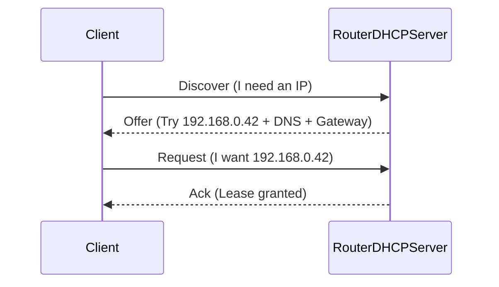

# DHCP (How Devices Get IP, Gateway, DNS)

This page teaches DHCP so router settings (especially “DHCP DNS”) stop feeling like random checkboxes.

---

## 0. Prerequisite

If you don’t know **IP/subnet/gateway/subnet mask** yet, start here:

- [`ip-addressing.md`](ip-addressing.md)

---

## 1. What DHCP is

**DHCP is the protocol that automatically gives devices network settings**:

- IP address
- Subnet mask / prefix
- Default gateway (router)
- DNS servers (critical for Pi-hole)
- Lease time (how long settings stick)

---

## 2. The DHCP “DORA” handshake

When a device joins your Wi‑Fi/LAN, it typically does:

Why this matters:

- The “Ack” contains DNS servers your clients will use by default.
- If DNS in DHCP is wrong, Pi-hole won’t be used.

---

## 3. Leases (why changes don’t apply instantly)

DHCP settings are attached to a **lease**. Until the client renews the lease, it may keep old DNS.

Typical renewal behavior:

- renew at ~50% of lease time (varies by OS)
- immediate refresh after Wi‑Fi toggle, reconnect, or reboot

---

## 4. DHCP reservation vs static IP

### DHCP reservation (recommended)

You configure the router: `Pi MAC → 192.168.0.109`.

- Pros: centralized, avoids conflicts, survives reinstalls
- Cons: needs router UI access

Why MAC?

- DHCP identifies the client by its **MAC address** (link-layer identity), so a reservation is “MAC → IP.”
- This is why a reinstall doesn’t break the reservation (the MAC usually stays the same).

See: [`layer2-mac-arp.md`](layer2-mac-arp.md)

### Static IP (use if reservation is impossible)

You configure the Pi itself.

- Pros: works without router features
- Cons: easiest way to break networking (wrong gateway/DNS, conflicts)

Rule of thumb: **Use DHCP reservation whenever you can.**

---

## 5. Common mistake: changing WAN DNS instead of LAN DHCP DNS

Router UIs often show “Internet DNS” prominently. That usually affects only the router.

Client behavior is controlled by:

- **LAN DHCP DNS** fields
- IPv6 DNS advertisement (RDNSS/DHCPv6)

See: [`home-router-model.md`](home-router-model.md).

---

## 6. Exercises (practical)

### Check your client’s DNS is correct

- Linux: [`../../shell-commands/02-commands/ip.md`](../../shell-commands/02-commands/ip.md) (IP + gateway) and `nmcli`/`resolvectl` for DNS
- Windows: [`../../shell-commands/02-commands/ipconfig.md`](../../shell-commands/02-commands/ipconfig.md)
- DNS check: [`../../shell-commands/02-commands/nslookup.md`](../../shell-commands/02-commands/nslookup.md)

### Force a fresh lease after changing router settings

- Toggle Wi‑Fi, reboot, or renew lease in OS settings.
- On Windows you can explicitly do `/release` then `/renew` (see `ipconfig.md`).

---

## Next

- DNS (what happens after the device knows which DNS server to use): [`dns.md`](dns.md)
