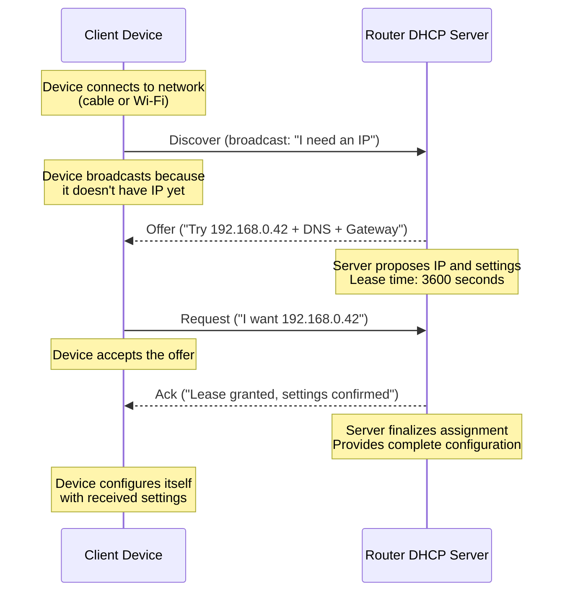

# DHCP (How Devices Get IP, Gateway, DNS)

This page teaches DHCP so router settings (especially “DHCP DNS”) stop feeling like random checkboxes.

---

## 0. Prerequisite

If you don’t know **IP/subnet/gateway/subnet mask** yet, start here:

- [`ip-addressing.md`](ip-addressing.md)

---

## 1. What DHCP is

**DHCP (Dynamic Host Configuration Protocol)** is the protocol that automatically gives devices network settings so they can connect to a network without manual configuration.

### The Problem DHCP Solves

**Without DHCP (manual configuration):**
- Every device needs manual IP configuration
- You must configure: IP address, subnet mask, gateway, DNS on each device
- Risk of IP conflicts (two devices with same IP)
- Changing DNS requires updating every device
- Example: 20 devices = 20 manual configurations

**With DHCP (automatic configuration):**
- Devices automatically get network settings
- Router assigns IPs automatically (no conflicts)
- Change DNS in one place (router), all devices get update
- Example: 20 devices = 1 configuration (on router)

**Real-world analogy:**
- **Without DHCP:** Like manually assigning seat numbers to every guest at a wedding
- **With DHCP:** Like a restaurant host automatically seating guests (assigns table/seat)

### Why DHCP Exists

DHCP was created to solve several problems:

**1. Convenience:**
- No manual configuration needed
- Devices "just work" when connected
- Saves time and reduces errors

**2. Centralized Management:**
- Change DNS in one place (router DHCP settings)
- All devices automatically get new DNS
- Easier to manage large networks

**3. Dynamic IP Assignment:**
- IPs assigned as devices connect
- IPs released when devices disconnect
- Efficient use of IP address space

**4. Conflict Prevention:**
- DHCP server ensures no duplicate IPs
- Tracks which IPs are assigned
- Prevents network conflicts automatically

**5. Mobility:**
- Device can move between networks
- Gets appropriate IP for each network
- No manual reconfiguration needed

### What DHCP Actually Does (Step-by-Step)

**When a device connects to a network:**

1. **Device connects** (plugs in cable or joins Wi-Fi)
2. **Device broadcasts:** "I need network settings!" (DHCP Discover)
3. **Router responds:** "Here's your IP, gateway, DNS, subnet mask" (DHCP Offer)
4. **Device accepts:** "I'll use those settings" (DHCP Request)
5. **Router confirms:** "Lease granted, settings valid for X hours" (DHCP Acknowledge)
6. **Device configures itself** automatically with received settings

**What settings DHCP provides:**

- **IP address** - Unique address for the device (e.g., `192.168.0.42`)
- **Subnet mask / prefix** - Defines the subnet (e.g., `255.255.255.0` or `/24`)
- **Default gateway (router)** - Where to send packets for other networks (e.g., `192.168.0.1`)
- **DNS servers** - Where to resolve domain names (critical for Pi-hole)
- **Lease time** - How long these settings are valid (e.g., 3600 seconds = 1 hour)

**Example DHCP response:**
```
IP Address: 192.168.0.42
Subnet Mask: 255.255.255.0
Gateway: 192.168.0.1
DNS: 192.168.0.109 (Pi-hole)
Lease Time: 3600 seconds (1 hour)
```

**Result:** Device is now configured and can access the network and internet.

---

## 2. The DHCP "DORA" Handshake

When a device joins your Wi‑Fi/LAN, it performs a **4-step handshake** called **DORA** (Discover, Offer, Request, Acknowledge).

### Why Each Step Exists

**D - Discover:**
- **Purpose:** Device doesn't know where DHCP server is
- **Method:** Broadcasts request to entire network
- **Message:** "I need network settings! Is there a DHCP server?"
- **Why broadcast?** Device doesn't have IP yet, can't send to specific address

**O - Offer:**
- **Purpose:** DHCP server proposes network settings
- **Method:** Server responds with proposed IP and settings
- **Message:** "I'm a DHCP server. Try IP `192.168.0.42` with gateway `192.168.0.1` and DNS `192.168.0.109`"
- **Why propose?** Multiple DHCP servers might exist, device can choose

**R - Request:**
- **Purpose:** Device accepts the offer
- **Method:** Device confirms it wants the proposed settings
- **Message:** "I accept IP `192.168.0.42`. Please assign it to me."
- **Why confirm?** Ensures device actually wants these settings

**A - Acknowledge:**
- **Purpose:** Server finalizes the assignment
- **Method:** Server confirms lease and provides final settings
- **Message:** "Lease granted! IP `192.168.0.42` is yours for 3600 seconds. Here are your settings."
- **Why acknowledge?** Finalizes the lease, provides complete configuration

### The Complete DORA Flow



### What Happens at Each Step (Detailed)

**Step 1: Discover (Client → Server)**
- **Who sends:** Device (client)
- **Method:** Broadcast (to `255.255.255.255` - all devices)
- **Content:** "I need network configuration"
- **Why broadcast:** Device doesn't have IP, doesn't know server location
- **Real-world:** Like shouting "Is there a manager here?" in a store

**Step 2: Offer (Server → Client)**
- **Who sends:** DHCP server (router)
- **Method:** Unicast or broadcast (depending on network state)
- **Content:** Proposed IP address, subnet mask, gateway, DNS, lease time
- **Example:** "Try `192.168.0.42`, mask `255.255.255.0`, gateway `192.168.0.1`, DNS `192.168.0.109`"
- **Why offer:** Server proposes settings, client can accept or reject

**Step 3: Request (Client → Server)**
- **Who sends:** Device (client)
- **Method:** Broadcast (to confirm with all servers)
- **Content:** "I accept IP `192.168.0.42`"
- **Why request:** Confirms device wants these specific settings
- **Real-world:** Like saying "Yes, I'll take that apartment"

**Step 4: Acknowledge (Server → Client)**
- **Who sends:** DHCP server (router)
- **Method:** Unicast or broadcast
- **Content:** Final confirmation, complete settings, lease time
- **Example:** "Lease granted! IP `192.168.0.42` is yours for 3600 seconds"
- **Why acknowledge:** Finalizes the lease, provides complete configuration

### Real-World Analogy: Renting an Apartment

**DORA handshake is like renting an apartment:**

1. **Discover:** You look for apartments (broadcast: "Any apartments available?")
2. **Offer:** Landlord shows you an apartment ("Here's apartment 42, rent is $X")
3. **Request:** You accept ("Yes, I'll take apartment 42")
4. **Acknowledge:** Landlord gives you keys ("Lease signed, here are your keys, lease is for 1 year")

**DHCP equivalent:**
1. **Discover:** Device asks for network settings
2. **Offer:** Router proposes IP `192.168.0.42`
3. **Request:** Device accepts IP `192.168.0.42`
4. **Acknowledge:** Router grants lease, provides all settings

### Why This Matters for Pi-hole

**Critical point:** The "Ack" (Acknowledge) message contains **DNS servers** your clients will use by default.

**What this means:**
- If DHCP DNS is set to Pi-hole (`192.168.0.109`), all devices use Pi-hole
- If DHCP DNS is set to public DNS (`8.8.8.8`), all devices bypass Pi-hole
- **If DNS in DHCP is wrong, Pi-hole won't be used.**

**Example:**
- Router DHCP DNS: `192.168.0.109` (Pi-hole) ✅
- Device gets DHCP Ack with DNS: `192.168.0.109`
- Device uses Pi-hole for all DNS queries

**Wrong configuration:**
- Router DHCP DNS: `8.8.8.8` (Google DNS) ❌
- Device gets DHCP Ack with DNS: `8.8.8.8`
- Device bypasses Pi-hole, queries go directly to Google

---

## 3. Leases (Why Changes Don't Apply Instantly)

DHCP settings are attached to a **lease** - a time-limited assignment. Until the client renews the lease, it may keep old DNS and other settings.

### What is a Lease?

**Definition:** A lease is a temporary assignment of network settings with an expiration time.

**Why leases exist:**
- **Dynamic assignment:** IPs can be reassigned when devices disconnect
- **Efficiency:** Unused IPs can be reclaimed
- **Flexibility:** Settings can be updated periodically

**Lease components:**
- **IP address** - Assigned to device
- **Settings** - Gateway, DNS, subnet mask
- **Lease time** - How long settings are valid (e.g., 3600 seconds = 1 hour)
- **Expiration** - When lease expires and must be renewed

**Real-world analogy:**
- **Lease** = Rental agreement with expiration date
- **IP address** = Apartment number
- **Lease time** = Rental period (e.g., 1 year)
- **Renewal** = Extending the rental agreement

### Lease Renewal Timing

**Typical renewal behavior:**

**First renewal attempt:**
- **When:** ~50% of lease time (varies by OS)
- **Purpose:** Refresh lease before it expires
- **Example:** 1-hour lease → renews at ~30 minutes

**Second renewal attempt:**
- **When:** ~87.5% of lease time (if first renewal succeeded)
- **Purpose:** Final attempt before expiration
- **Example:** 1-hour lease → renews again at ~52.5 minutes

**Immediate refresh:**
- **When:** After Wi‑Fi toggle, reconnect, or reboot
- **Purpose:** Get fresh settings immediately
- **Method:** Device sends new DHCP Discover

**Detailed example:** Lease time = 3600 seconds (1 hour)

**Timeline:**
```
0 seconds:     Device gets IP (lease starts)
1800 seconds:  First renewal attempt (~50% of lease)
3150 seconds:  Second renewal attempt (~87.5% of lease)
3600 seconds:  Lease expires (if renewal failed)
```

**What happens:**
- **First renewal (1800s):** Device tries to renew lease
  - If successful: Lease extended, settings refreshed
  - If failed: Device keeps using current settings, tries again later

- **Second renewal (3150s):** Device tries again
  - If successful: Lease extended, settings refreshed
  - If failed: Device keeps using current settings until expiration

- **After expiration (3600s):** If renewal failed
  - Device loses IP address
  - Device may get link-local address (`169.254.x.x`)
  - Device must start new DHCP Discover process

### Why This Matters

**The problem:** After changing router DHCP DNS, clients may keep old DNS for up to lease time.

**Example scenario:**
1. **Initial state:** Router DHCP DNS = `8.8.8.8` (Google)
2. **Device gets lease:** DNS = `8.8.8.8`, lease = 1 hour
3. **You change router:** DHCP DNS = `192.168.0.109` (Pi-hole)
4. **Device still uses:** `8.8.8.8` (old DNS from lease)
5. **After renewal:** Device gets new DNS = `192.168.0.109` (Pi-hole)

**Timeline:**
```
Time 0:00 - Router DHCP DNS changed to Pi-hole
Time 0:00 - Device still has old lease (DNS = 8.8.8.8)
Time 0:30 - Device renews lease → Gets new DNS (192.168.0.109) ✅
```

**How to force immediate update:**
- **Toggle Wi‑Fi** (disconnect and reconnect)
- **Reboot device** (forces fresh DHCP request)
- **Manually renew lease** (OS-specific commands)

### What Happens When DHCP Server Is Unreachable

**Scenario:** Router DHCP server goes down or becomes unreachable

**During lease renewal:**

1. Client tries to renew lease (at 50% of lease time)
2. DHCP server doesn't respond
3. Client continues using **current settings** (lease still valid)
4. Client retries renewal periodically

**After lease expires:**

1. Client's lease expires
2. Client cannot renew (server unreachable)
3. Client loses IP address and network settings
4. Client may get **link-local address** (`169.254.x.x` - APIPA)

### Troubleshooting: Why My Device Has 169.254.x.x

**APIPA (Automatic Private IP Addressing):**

- Windows/Linux fallback when DHCP fails
- Range: `169.254.0.0/16` (link-local)
- **Meaning:** Device couldn't get IP from DHCP server

**Common causes:**

1. **DHCP server down** (router DHCP disabled or crashed)
2. **Network cable unplugged** (no physical connection)
3. **Wi‑Fi disconnected** (no wireless connection)
4. **Wrong network** (connected to network without DHCP)
5. **Firewall blocking** (DHCP packets blocked)

**How to fix:**

- Check router DHCP is enabled
- Verify network connection (cable/Wi‑Fi)
- Check firewall rules (allow DHCP ports 67/68)
- Manually renew lease: `ipconfig /renew` (Windows) or `dhclient` (Linux)

---

## 4. DHCP reservation vs static IP

### DHCP reservation (recommended)

You configure the router: `Pi MAC → 192.168.0.109`.

- Pros: centralized, avoids conflicts, survives reinstalls
- Cons: needs router UI access

Why MAC?

- DHCP identifies the client by its **MAC address** (link-layer identity), so a reservation is “MAC → IP.”
- This is why a reinstall doesn’t break the reservation (the MAC usually stays the same).

See: [`layer2-mac-arp.md`](layer2-mac-arp.md)

### Static IP (use if reservation is impossible)

You configure the Pi itself.

- Pros: works without router features
- Cons: easiest way to break networking (wrong gateway/DNS, conflicts)

Rule of thumb: **Use DHCP reservation whenever you can.**

---

## 5. Common mistake: changing WAN DNS instead of LAN DHCP DNS

Router UIs often show “Internet DNS” prominently. That usually affects only the router.

Client behavior is controlled by:

- **LAN DHCP DNS** fields
- IPv6 DNS advertisement (RDNSS/DHCPv6)

See: [`home-router-model.md`](home-router-model.md).

---

## 6. Exercises (practical)

### Check your client's DNS is correct

- Linux: [`../../shell-commands/02-commands/ip.md`](../../shell-commands/02-commands/ip.md) (IP + gateway) and `nmcli`/`resolvectl` for DNS
- Windows: [`../../shell-commands/02-commands/ipconfig.md`](../../shell-commands/02-commands/ipconfig.md)
- DNS check: [`../../shell-commands/02-commands/nslookup.md`](../../shell-commands/02-commands/nslookup.md)

### Force a fresh lease after changing router settings

**Methods to force renewal:**

1. **Toggle Wi‑Fi** (disconnect and reconnect)
2. **Reboot device** (forces fresh DHCP request)
3. **Manual renewal:**
   - Windows: `ipconfig /release` then `ipconfig /renew`
   - Linux: `sudo dhclient -r` then `sudo dhclient` (or `sudo systemctl restart NetworkManager`)

**Why renewal is needed:**

- Old lease may have old DNS settings cached
- Renewal gets fresh settings from DHCP server
- Immediate effect (no waiting for automatic renewal)

---

## 7. Practice Drills

- DHCP drills: [`../practice/dhcp-drills.md`](../practice/dhcp-drills.md)

---

## Next

- DNS (what happens after the device knows which DNS server to use): [`dns.md`](dns.md)
- Home router model (where DHCP DNS settings live): [`home-router-model.md`](home-router-model.md)
