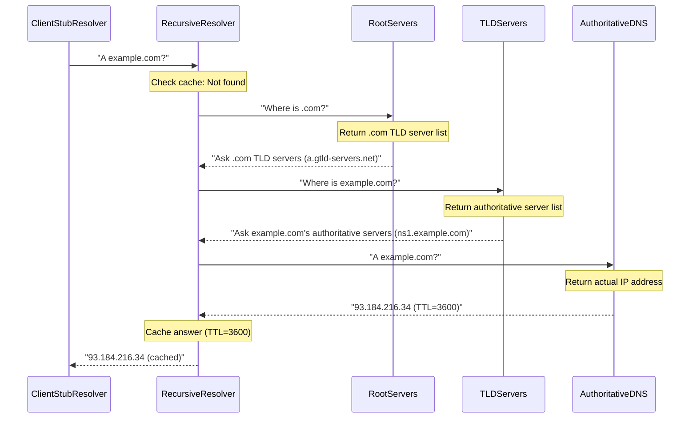
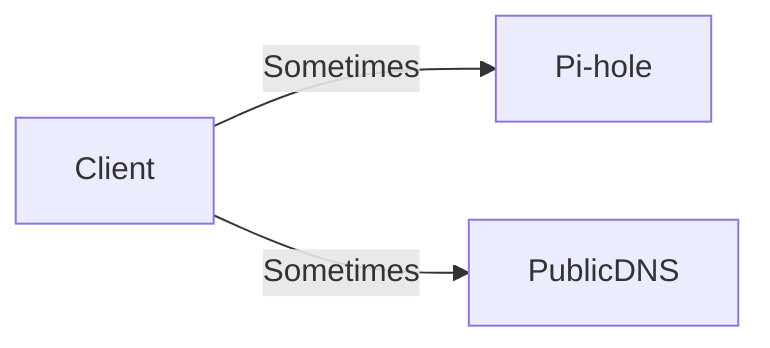
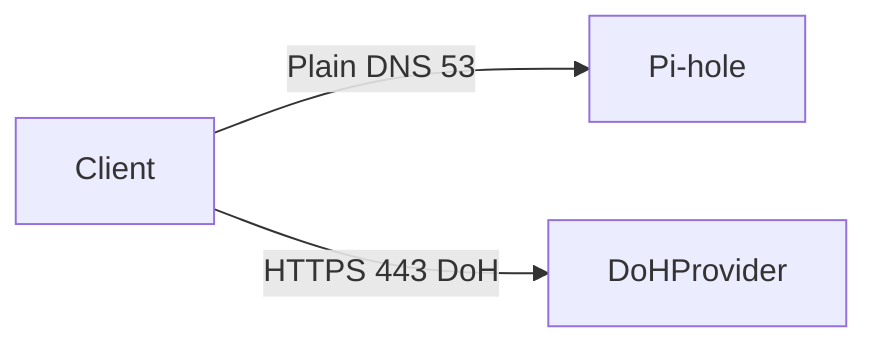

# DNS (How Names Become IPs)

DNS is the reason Pi-hole works: Pi-hole blocks ads by filtering DNS lookups.

---

## 0. Prerequisites

- If you don’t know **IP/subnet/gateway** yet: [`ip-addressing.md`](ip-addressing.md)
- DNS tools:
  - [`../../shell-commands/02-commands/nslookup.md`](../../shell-commands/02-commands/nslookup.md)
  - [`../../shell-commands/02-commands/dig.md`](../../shell-commands/02-commands/dig.md)

---

## 1. What DNS is (Complete Explanation)

**DNS (Domain Name System)** translates human-readable domain names (e.g., `example.com`) into IP addresses (e.g., `93.184.216.34`) that computers use to communicate.

### The Problem DNS Solves

**The fundamental problem:**
- **Humans remember names:** `google.com`, `example.com`, `github.com`
- **Computers need numbers:** `172.217.164.110`, `93.184.216.34`, `140.82.121.3`
- **DNS bridges the gap:** Translates names to numbers

**Without DNS:**
- You'd have to type IP addresses for every website
- Example: Visit `172.217.164.110` instead of `google.com`
- Impossible to remember IPs for thousands of websites
- IPs change, but domain names stay the same

**With DNS:**
- Type domain names: `google.com`, `example.com`
- DNS automatically translates to IP addresses
- Easy to remember, human-friendly
- Domain names stay the same even if IPs change

**Real-world example:**
- **Without DNS:** "Visit `93.184.216.34`" (what is this?)
- **With DNS:** "Visit `example.com`" (clear and memorable)

### Why DNS Exists

**Primary reasons:**

**1. Human-Friendly Names:**
- Domain names are easier to remember than IP addresses
- `google.com` vs `172.217.164.110` (which is easier?)
- Brand names can be used (e.g., `apple.com`)

**2. IP Address Changes:**
- Websites can change IP addresses
- Domain name stays the same (`example.com`)
- DNS automatically points to new IP
- Users don't need to know IP changed

**3. Load Balancing:**
- One domain name can point to multiple IPs
- DNS can distribute load across servers
- Example: `google.com` → multiple IPs (load balancing)

**4. Service Location:**
- Services can move to different servers
- Domain name stays the same
- DNS updated to point to new location
- Users don't notice the change

### DNS as Phone Book Analogy

**DNS is like a phone book for the internet:**

**Phone Book:**
- **Name** = Person's name (e.g., "John Smith")
- **Number** = Phone number (e.g., "555-1234")
- **Lookup** = Find number for name

**DNS:**
- **Name** = Domain name (e.g., `example.com`)
- **Number** = IP address (e.g., `93.184.216.34`)
- **Lookup** = DNS query (find IP for domain)

**How it works:**
1. You want to call someone → Look up name in phone book → Get number
2. You want to visit website → DNS looks up domain name → Gets IP address

**Key difference:**
- Phone book is static (printed once)
- DNS is dynamic (updated constantly, distributed system)

### What DNS Actually Does

**Step-by-step DNS lookup:**

1. **You type:** `example.com` in browser
2. **Browser asks:** "What is the IP for `example.com`?"
3. **DNS responds:** "The IP is `93.184.216.34`"
4. **Browser connects:** To `93.184.216.34` using the IP
5. **Website loads:** You see the website

**Behind the scenes:**
- DNS query sent to DNS server (from DHCP)
- DNS server looks up `example.com` in its database
- DNS server returns IP address `93.184.216.34`
- Browser uses IP to connect to website

**Visual flow:**
```
You type: example.com
    ↓
Browser: "DNS, what is IP for example.com?"
    ↓
DNS Server: "93.184.216.34"
    ↓
Browser: Connects to 93.184.216.34
    ↓
Website loads
```

### Why DNS Matters for Pi-hole

**Pi-hole works by filtering DNS queries:**
- When device asks DNS: "What is IP for `ads.example.com`?"
- Pi-hole checks: Is this an ad domain?
- If ad domain: Pi-hole returns `0.0.0.0` (blocks it)
- If not ad: Pi-hole forwards to real DNS, returns actual IP

**This is why DNS configuration is critical:**
- If devices use Pi-hole DNS → Pi-hole can filter ads
- If devices use public DNS → Pi-hole never sees queries → ads not blocked

---

## 2. The Actors (Who Does What)

DNS involves multiple components working together. Understanding each helps you understand how DNS works.

### Stub Resolver

**What it is:** Your device/OS component that asks DNS questions.

**What it does:**
- Receives DNS queries from applications (browser, email, etc.)
- Sends queries to recursive resolver
- Returns answers to applications

**Where it lives:**
- Your operating system (Windows, Linux, macOS)
- Browser DNS client
- Application DNS libraries

**Example:**
- Browser wants to visit `example.com`
- Stub resolver asks: "What is IP for `example.com`?"
- Sends query to recursive resolver (from DHCP DNS settings)
- Returns answer to browser

**Key point:** Stub resolver doesn't do the actual DNS lookup work - it just asks questions.

### Recursive Resolver

**What it is:** The system that does the actual work to find DNS answers.

**What it does:**
- Receives queries from stub resolvers
- Performs full DNS lookup (root → TLD → authoritative)
- Caches results for efficiency
- Returns answers to stub resolvers

**Examples:**
- **Local:** Unbound (runs on your Pi-hole or router)
- **Public:** Cloudflare (`1.1.1.1`), Google (`8.8.8.8`), Quad9 (`9.9.9.9`)

**Why it's called "recursive":**
- It recursively queries multiple DNS servers
- Starts at root, goes to TLD, then authoritative
- Does the full lookup work

**Key point:** Recursive resolver does the heavy lifting - performs full DNS resolution.

### Authoritative DNS

**What it is:** The "source of truth" DNS servers for a specific domain.

**What it does:**
- Owns the DNS records for a domain
- Provides definitive answers for that domain
- Example: `example.com`'s authoritative servers know the real IP

**Who runs it:**
- Domain owner or their DNS provider
- Example: `example.com`'s authoritative servers are run by example.com's DNS provider

**Key point:** Authoritative DNS is the final authority - it knows the real IP for a domain.

### Root + TLD Servers

**What they are:** The directory system that points you toward the right authoritative servers.

**Root servers:**
- Know about all top-level domains (.com, .org, .net, etc.)
- Point you to TLD servers
- Example: "For .com domains, ask .com TLD servers"

**TLD (Top-Level Domain) servers:**
- Know about domains in their TLD
- Point you to authoritative servers
- Example: ".com TLD servers know about example.com, point to example.com's authoritative servers"

**Key point:** Root and TLD servers are like directory assistance - they don't know the answer, but they know who to ask.

### How They Work Together

**Complete DNS lookup flow:**

```
1. Stub Resolver (your device)
   ↓ "What is IP for example.com?"

2. Recursive Resolver (Pi-hole, Cloudflare, etc.)
   ↓ "I'll find out for you"

3. Root Servers
   ↓ "For .com, ask .com TLD servers"

4. TLD Servers (.com)
   ↓ "For example.com, ask example.com's authoritative servers"

5. Authoritative Servers (example.com)
   ↓ "example.com = 93.184.216.34"

6. Recursive Resolver
   ↓ Caches answer, returns to stub resolver

7. Stub Resolver
   ↓ Returns IP to application (browser)
```

**Real-world analogy:**
- **Stub resolver** = You asking for directions
- **Recursive resolver** = Friend who helps you find the address
- **Root/TLD servers** = Directory assistance (knows who to ask)
- **Authoritative servers** = The actual place (knows the real address)

---

## 3. The Recursion Story (Root → TLD → Authoritative)

### Detailed Recursion Flow

When you query `example.com`, the recursive resolver performs **full recursion**:



### Why Recursion is Needed

**The problem:** No single DNS server knows all domains on the internet.

**Why recursion is needed:**
- Internet has millions of domains
- Each domain has its own authoritative servers
- No single server can store all domain information
- Need to ask multiple servers to find answer

**Distributed system:**
- DNS is distributed across millions of servers
- Each domain owner runs their own authoritative servers
- Root/TLD servers know where to find authoritative servers
- Recursive resolvers traverse the hierarchy to find answers

**Example:** Finding `example.com`
- Root servers don't know `example.com`'s IP
- But root servers know: "For .com domains, ask .com TLD servers"
- TLD servers don't know `example.com`'s IP
- But TLD servers know: "For example.com, ask example.com's authoritative servers"
- Authoritative servers know: "example.com = 93.184.216.34"

**Without recursion:**
- Every device would need to query root → TLD → authoritative
- Inefficient, slow, complex
- Devices would need to implement full DNS protocol

**With recursion:**
- Recursive resolver does the work once
- Caches results for other queries
- Devices just ask recursive resolver
- Simple, fast, efficient

### Types of DNS Resolvers

**Recursive resolver (does the work):**

**What it does:**
- Performs full lookup (root → TLD → authoritative)
- Caches results for TTL duration
- Handles all the complexity

**Examples:**
- **Unbound** (local, runs on your Pi-hole or router)
- **Cloudflare** (`1.1.1.1`) - public recursive resolver
- **Google** (`8.8.8.8`) - public recursive resolver
- **Quad9** (`9.9.9.9`) - public recursive resolver

**When to use:**
- Want full DNS resolution
- Want caching for performance
- Want control over DNS queries

**Stub resolver (just asks questions):**

**What it does:**
- Sends query to recursive resolver
- Doesn't perform recursion itself
- Just forwards queries and returns answers

**Examples:**
- Your OS DNS client (Windows, Linux, macOS)
- Browser DNS client
- Application DNS libraries

**When it's used:**
- Every device has a stub resolver
- Simplifies DNS for applications
- Applications don't need to implement full DNS

**Forwarding resolver:**

**What it does:**
- Receives query, forwards to another recursive resolver
- Doesn't perform recursion itself
- Acts as middleman

**Example:**
- Pi-hole forwarding to Cloudflare/Google
- Pi-hole receives query → forwards to `1.1.1.1` → returns answer

**When to use:**
- Want to filter DNS (Pi-hole)
- Don't want to run full recursive resolver
- Want to use public recursive resolver's cache

### DNS Record Types

DNS stores different types of information. Each record type serves a specific purpose.

**Common record types:**

| Type      | Purpose                | Example                                            | When Used                                    |
| --------- | ---------------------- | -------------------------------------------------- | -------------------------------------------- |
| **A**     | IPv4 address           | `example.com → 93.184.216.34`                      | Most common - maps domain to IPv4 IP         |
| **AAAA**  | IPv6 address           | `example.com → 2606:2800:220:1:248:1893:25c8:1946` | Maps domain to IPv6 IP                       |
| **CNAME** | Canonical name (alias) | `www.example.com → example.com`                    | Creates alias (www points to main domain)    |
| **MX**    | Mail exchange          | `example.com → mail.example.com (priority 10)`     | Where to send email for domain               |
| **NS**    | Name server            | `example.com → ns1.example.com`                    | Which DNS servers are authoritative          |
| **TXT**   | Text record            | `example.com → "v=spf1 ..."` (SPF)                 | Text data (SPF, DKIM, verification codes)   |

### A Record (IPv4 Address) - Most Common

**What it does:** Maps a domain name to an IPv4 address.

**Example:**
- Domain: `example.com`
- A Record: `93.184.216.34`
- Meaning: `example.com` points to IP `93.184.216.34`

**When you use it:**
- Every time you visit a website
- Browser queries A record to get IP
- Most common DNS query type

**Query example:**
```bash
dig example.com A
# Returns: 93.184.216.34
```

### AAAA Record (IPv6 Address)

**What it does:** Maps a domain name to an IPv6 address.

**Example:**
- Domain: `example.com`
- AAAA Record: `2606:2800:220:1:248:1893:25c8:1946`
- Meaning: `example.com` also has IPv6 address

**When you use it:**
- When device supports IPv6
- Browser may prefer IPv6 if available
- Less common than A records (IPv4)

**Query example:**
```bash
dig example.com AAAA
# Returns: 2606:2800:220:1:248:1893:25c8:1946
```

### CNAME Record (Canonical Name / Alias)

**What it does:** Creates an alias - one domain name points to another.

**Example:**
- Domain: `www.example.com`
- CNAME Record: `example.com`
- Meaning: `www.example.com` is an alias for `example.com`

**Why use it:**
- `www.example.com` and `example.com` point to same IP
- Only need to update IP in one place (`example.com`)
- `www.example.com` automatically follows

**Real-world:**
- Many websites: `www.example.com` → `example.com`
- Both work, point to same website
- Easier management (one IP to update)

**Query example:**
```bash
dig www.example.com CNAME
# Returns: example.com
```

### MX Record (Mail Exchange)

**What it does:** Tells email servers where to send email for a domain.

**Example:**
- Domain: `example.com`
- MX Record: `mail.example.com` (priority 10)
- Meaning: Email for `@example.com` goes to `mail.example.com`

**Priority:**
- Lower number = higher priority
- Multiple MX records for redundancy
- Example: Priority 10 (primary), Priority 20 (backup)

**When you use it:**
- Sending email to `@example.com`
- Email server queries MX record
- Finds where to deliver email

### NS Record (Name Server)

**What it does:** Identifies which DNS servers are authoritative for a domain.

**Example:**
- Domain: `example.com`
- NS Record: `ns1.example.com`, `ns2.example.com`
- Meaning: These servers are authoritative for `example.com`

**When you use it:**
- DNS resolution process
- TLD servers return NS records
- Points to authoritative servers

### TXT Record (Text Record)

**What it does:** Stores text data for various purposes.

**Common uses:**
- **SPF** (Sender Policy Framework): Email authentication
- **DKIM:** Email signing verification
- **Domain verification:** Proving domain ownership
- **General text:** Any text data

**Example:**
- Domain: `example.com`
- TXT Record: `"v=spf1 include:_spf.google.com ~all"`
- Meaning: SPF record for email authentication

### Practical Query Examples

**Query A record (IPv4):**
```bash
dig example.com A
# Returns: 93.184.216.34
# Most common query type
```

**Query AAAA record (IPv6):**
```bash
dig example.com AAAA
# Returns: 2606:2800:220:1:248:1893:25c8:1946
# IPv6 address for the domain
```

**Query CNAME record (alias):**
```bash
dig www.example.com CNAME
# Returns: example.com
# Shows www is alias for main domain
```

**Query MX record (email):**
```bash
dig example.com MX
# Returns: mail.example.com (priority 10)
# Shows where to send email
```

**Query all records:**
```bash
dig example.com ANY
# Returns: All record types for domain
```

### Practical Troubleshooting Scenarios

**Scenario 1: DNS query times out**

**Possible causes:**

- DNS server unreachable (network issue)
- Firewall blocking DNS (port 53 blocked)
- DNS server down or misconfigured

**How to diagnose:**

```bash
# Test DNS server directly
nslookup example.com 8.8.8.8

# Check if DNS port is reachable
nc -zv 192.168.0.109 53
```

**Scenario 2: DNS returns wrong IP**

**Possible causes:**

- DNS cache has stale entry (TTL not expired)
- DNS server misconfigured
- DNS hijacking/poisoning

**How to diagnose:**

```bash
# Clear DNS cache (OS-dependent)
# Linux: sudo systemd-resolve --flush-caches
# Windows: ipconfig /flushdns

# Query different DNS servers
nslookup example.com 8.8.8.8
nslookup example.com 1.1.1.1
```

**Scenario 3: DNS works but website doesn't load**

**Possible causes:**

- DNS returns correct IP, but website server is down
- Firewall blocking HTTP/HTTPS (ports 80/443)
- Wrong port or service not running

**How to diagnose:**

```bash
# DNS works
nslookup example.com
# Returns: 93.184.216.34

# But website doesn't load
curl http://93.184.216.34
# Check if HTTP/HTTPS is blocked
```

Why this matters:

- If you run **Unbound**, you can have local recursion.
- If you use Cloudflare/Google, you're forwarding to a public recursive resolver.

---

## 4. Caching and TTL (why things “stick”)

- **TTL** tells resolvers how long they may cache an answer.
- Caching happens at multiple layers (client, Pi-hole, upstream).


Real-world consequence:

- After changing router DHCP DNS to Pi-hole, clients may keep old DNS until the DHCP lease renews.

---

## 4.1 DNS transport (UDP/TCP 53)

Most DNS lookups use **UDP 53**. DNS can also use **TCP 53** (larger responses, truncation, some edge cases).

See: [`tcp-udp-ports.md`](tcp-udp-ports.md)

---

## 5. Why “Secondary DNS” breaks Pi-hole

If DHCP provides two DNS servers, many clients will bypass Pi-hole sometimes.



That’s why the recommended approach is:

- DHCP DNS = Pi-hole only
- Optional firewall rules that force DNS to Pi-hole

See router model: [`home-router-model.md`](home-router-model.md).

---

## 6. DoH/DoT bypass model

If the client uses DoH (HTTPS 443) or DoT (TLS 853), Pi-hole may never see queries.



Mitigations:

- Prefer policy (managed browsers) and router settings to disable DoH/DoT where possible.
- Use firewall rules (defense-in-depth) if you need enforcement.

Port mapping cheat-sheet:

- DNS: UDP/TCP **53**
- DoT: TCP **853**
- DoH: TCP **443**

See: [`tcp-udp-ports.md`](tcp-udp-ports.md) and [`nat-firewalls.md`](nat-firewalls.md)

---

## 7. Exercises (Teach Your Brain the Model)

### Exercise 1: Verify Your DNS Resolver

**Check which DNS server your device is using:**

- Learn: [`nslookup`](../../shell-commands/02-commands/nslookup.md)

```bash
nslookup example.com
# Look for "Server:" line - shows which DNS answered
```

**Expected:** Should show Pi-hole IP (if configured correctly)

### Exercise 2: Test DNS Bypass Prevention

**Verify bypass to public DNS is blocked (after firewall rules):**

```bash
nslookup example.com 8.8.8.8
# Should fail/timeout if firewall blocks outbound DNS
```

**If it succeeds:** Firewall rules not applied or not working

### Exercise 3: Test Different Record Types

**Query different DNS record types:**

```bash
# IPv4 address
nslookup example.com

# IPv6 address
nslookup -type=AAAA example.com

# Mail exchange
nslookup -type=MX example.com

# Canonical name
nslookup -type=CNAME www.example.com
```

### Exercise 4: Understand TTL and Caching

**Observe TTL values:**

```bash
dig example.com
# Look for TTL value in answer section
# TTL shows how long answer is cached
```

**Test caching:**

1. Query `example.com` (note response time)
2. Query again immediately (should be faster - cached)
3. Wait for TTL to expire, query again (slower - fresh lookup)

---

## 8. Practice Drills

- DNS drills: [`../practice/dns-drills.md`](../practice/dns-drills.md)

---

## Next

- Home router model (where DNS settings live): [`home-router-model.md`](home-router-model.md)
- TCP/UDP and ports (why DNS uses port 53): [`tcp-udp-ports.md`](tcp-udp-ports.md)
- NAT and firewalls (how DNS bypass works): [`nat-firewalls.md`](nat-firewalls.md)
