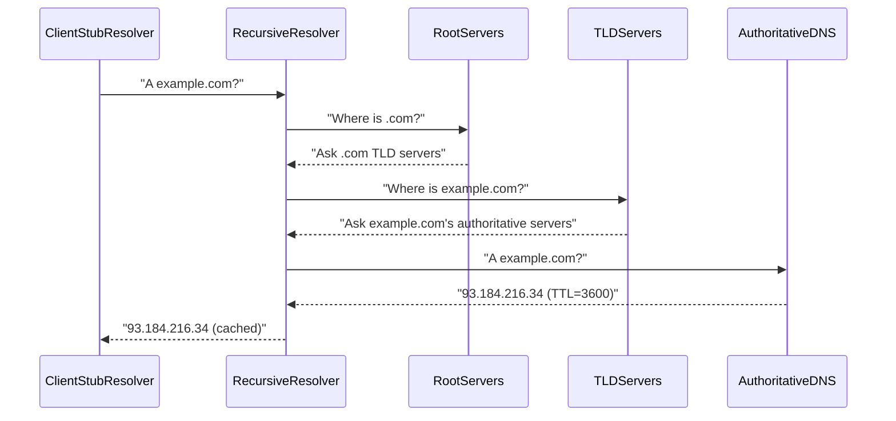
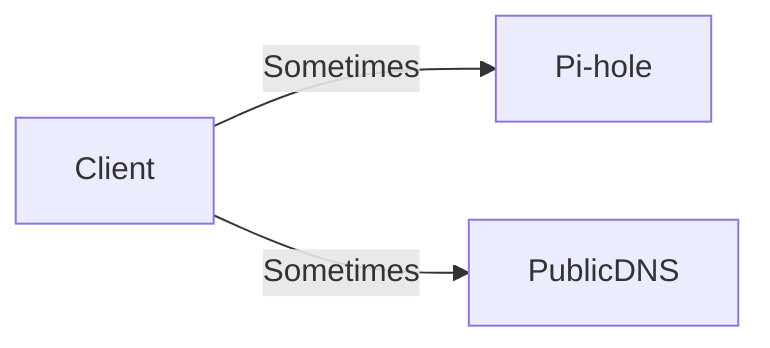
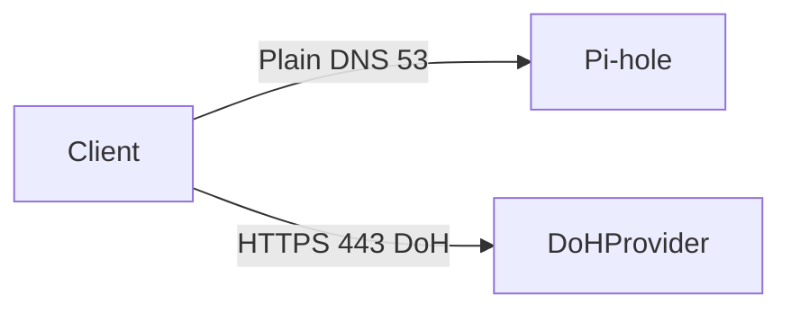

# DNS (How Names Become IPs)

DNS is the reason Pi-hole works: Pi-hole blocks ads by filtering DNS lookups.

---

## 0. Prerequisites

- If you don’t know **IP/subnet/gateway** yet: [`ip-addressing.md`](ip-addressing.md)
- DNS tools:
  - [`../../shell-commands/02-commands/nslookup.md`](../../shell-commands/02-commands/nslookup.md)
  - [`../../shell-commands/02-commands/dig.md`](../../shell-commands/02-commands/dig.md)

---

## 1. What DNS is (in one sentence)

**DNS translates names (e.g., `example.com`) into addresses (e.g., `93.184.216.34`)** and includes metadata like TTLs that control caching.

---

## 2. The actors (who does what)

- **Stub resolver:** Your device/OS component that asks DNS questions.
- **Recursive resolver:** The system that does the work to find answers.
- **Authoritative DNS:** The “source of truth” servers for a domain.
- **Root + TLD servers:** The directory that points you toward the right authoritative servers.

---

## 3. The recursion story (root → TLD → authoritative)



Why this matters:

- If you run **Unbound**, you can have local recursion.
- If you use Cloudflare/Google, you’re forwarding to a public recursive resolver.

---

## 4. Caching and TTL (why things “stick”)

- **TTL** tells resolvers how long they may cache an answer.
- Caching happens at multiple layers (client, Pi-hole, upstream).


Real-world consequence:

- After changing router DHCP DNS to Pi-hole, clients may keep old DNS until the DHCP lease renews.

---

## 4.1 DNS transport (UDP/TCP 53)

Most DNS lookups use **UDP 53**. DNS can also use **TCP 53** (larger responses, truncation, some edge cases).

See: [`tcp-udp-ports.md`](tcp-udp-ports.md)

---

## 5. Why “Secondary DNS” breaks Pi-hole

If DHCP provides two DNS servers, many clients will bypass Pi-hole sometimes.



That’s why the recommended approach is:

- DHCP DNS = Pi-hole only
- Optional firewall rules that force DNS to Pi-hole

See router model: [`home-router-model.md`](home-router-model.md).

---

## 6. DoH/DoT bypass model

If the client uses DoH (HTTPS 443) or DoT (TLS 853), Pi-hole may never see queries.



Mitigations:

- Prefer policy (managed browsers) and router settings to disable DoH/DoT where possible.
- Use firewall rules (defense-in-depth) if you need enforcement.

Port mapping cheat-sheet:

- DNS: UDP/TCP **53**
- DoT: TCP **853**
- DoH: TCP **443**

See: [`tcp-udp-ports.md`](tcp-udp-ports.md) and [`nat-firewalls.md`](nat-firewalls.md)

---

## 7. Exercises (teach your brain the model)

1. Verify your device is using the expected resolver:
   - Learn: [`nslookup`](../../shell-commands/02-commands/nslookup.md)
   ```bash
   nslookup example.com
   ```
2. Verify bypass to public DNS is blocked (after firewall rules):
   ```bash
   nslookup example.com 8.8.8.8
   ```

---

## Next

- Home router model (where DNS settings live): [`home-router-model.md`](home-router-model.md)
