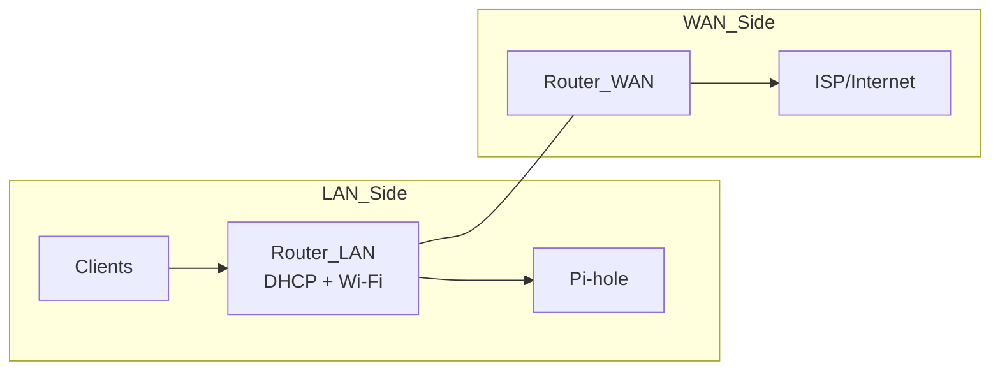

# Home Router Model (LAN vs WAN, DHCP DNS vs WAN DNS)

This page is about **where settings live** on consumer routers, and why tutorials often mislead people configuring Pi-hole.

---

## 1. The two sides of a router

- **LAN side** is your home network. This is where clients get their DNS settings.
- **WAN side** is the internet-facing side. This is how the router itself reaches the internet.

---

## 2. DHCP DNS vs WAN DNS (the #1 Pi-hole pitfall)

### DHCP DNS (LAN)

This tells **clients** which DNS server to use.

For Pi-hole you want:

- Primary DNS: Pi-hole IP
- Secondary DNS: empty / `0.0.0.0`

### WAN/Internet DNS (WAN)

This tells the **router** what DNS to use for itself (often irrelevant for Pi-hole blocking).

Rule: **Pi-hole belongs in DHCP DNS (LAN), not WAN DNS.**

---

## 3. What different router brands call the same thing

These are “common paths,” but firmware differs:

- TP-Link: `Advanced → Network → DHCP Server`
- ASUS: `LAN → DHCP Server`
- Netgear: `Advanced → Setup → LAN Setup`
- OpenWRT: `Network → Interfaces → LAN → DHCP Server`

---

## 4. DNS encryption settings that bypass Pi-hole

Some routers implement:

- DNS Privacy
- Secure DNS
- DoH / DoT

If enabled on the router, clients may never send plain DNS to Pi-hole.

Mental model:

- If your DNS is encrypted before it reaches Pi-hole, Pi-hole can’t filter it.

See DNS: [`dns.md`](dns.md).

---

## 4.1 Where firewall/NAT policy lives

If you need to enforce “DNS must go to Pi-hole,” you’re talking about:

- outbound firewall rules
- (optional) NAT redirect for port 53

See:

- [`nat-firewalls.md`](nat-firewalls.md)
- [`tcp-udp-ports.md`](tcp-udp-ports.md)

---

## 5. Minimal “definition of done” for Pi-hole on a LAN

- DHCP DNS advertises **only** Pi-hole.
- Clients show Pi-hole as DNS and queries appear in the Pi-hole dashboard.
- IPv6 DNS is also handled (RDNSS/DHCPv6 points to Pi-hole or is disabled).

---

## Next

- Troubleshooting flow: [`troubleshooting.md`](troubleshooting.md)
- DHCP (how DHCP DNS works): [`dhcp.md`](dhcp.md)
- DNS (understanding DNS bypass): [`dns.md`](dns.md)
- NAT and firewalls (enforcing DNS policies): [`nat-firewalls.md`](nat-firewalls.md)
