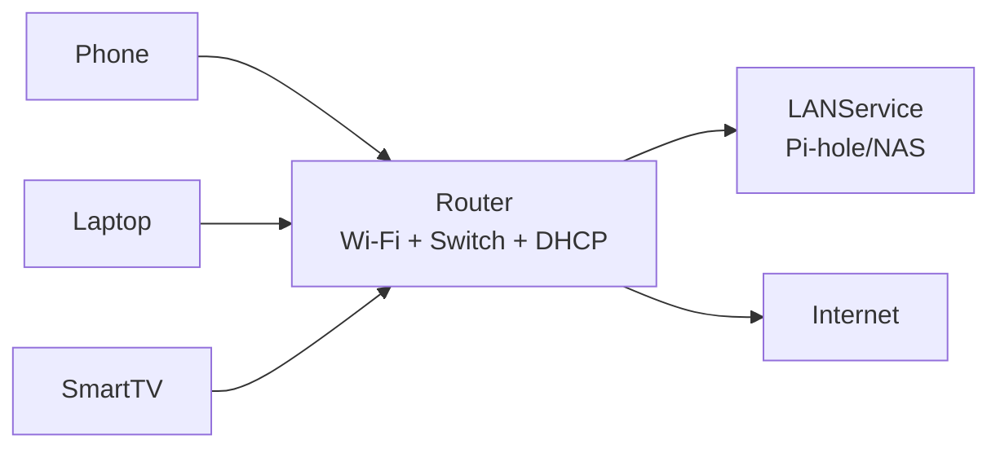
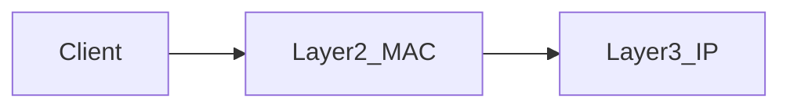
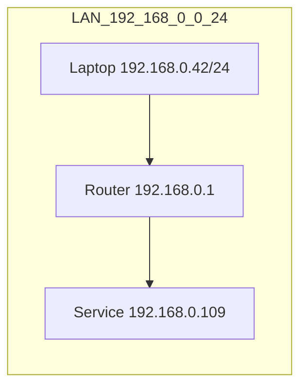

# IP Addressing (IP, Subnet, Subnet Mask, Gateway)

This page gives you the **addressing model** needed for almost every home-network task: Pi-hole, routers, static routes, VLANs/guest networks.

---

## 1. The one picture you need (home network)

---

## 2. What is an IP address?

An **IP address** is a numeric address for a device on a network.

- **IPv4 example:** `192.168.0.42`
- **IPv6 example:** `fd00::109`

Analogy: IP is like a **street address**. Packets are “letters” addressed to that number.

Glossary: [`../../docs/GLOSSARY.md`](../../docs/GLOSSARY.md) (IP Address, IPv4, IPv6).

---

## 2.1 IP is a *logical* address (why “logical”?)

IP addresses are called **logical** because they are:
- **Hierarchical** (subnets/prefixes like `192.168.0.0/24`)
- **Routable** (routers make decisions based on prefixes)
- **Re-assignable** (your laptop can become `192.168.0.42` at home and `10.0.0.15` at work)

Contrast:
- A **MAC address** identifies a network interface **on the local link** (Ethernet/Wi‑Fi).
- IP identifies a device **in the addressing/routing system**.

See Layer 2: [`layer2-mac-arp.md`](layer2-mac-arp.md)

## 3. What is a subnet / subnet mask / prefix?

A **subnet** is a group of IPs that are “local” to each other.

Two equivalent ways to represent it:

- **Subnet mask:** `255.255.255.0`
- **CIDR prefix:** `/24`

Common home LAN example:

- Subnet: `192.168.0.0/24` ⇔ mask `255.255.255.0`
- Typical usable range: `192.168.0.1` through `192.168.0.254`

Why you care:

- Devices in the same subnet can communicate locally via the router/switch.
- Devices in different subnets require routing rules (common with guest networks/VLANs).

---

## 4. What is the gateway?

The **default gateway** is the router IP your device uses to reach non-local networks (commonly `192.168.0.1`).

Analogy: the gateway is the **exit door** of your building. If the destination isn’t inside, you go through the exit.

---

## 5. LAN vs WAN (why router settings are confusing)

- **LAN settings** affect your devices (phones/laptops/TVs).
- **WAN/Internet settings** affect the router’s upstream connection only.

If you configure something under “Internet/WAN DNS,” that might affect the router itself, but not necessarily your clients. For client behavior, the key is usually **LAN DHCP**.

See: [`home-router-model.md`](home-router-model.md).

---

## 6. Quick “show me my IP + gateway” (by OS)

These commands answer:

- What IP do I have?
- What subnet/prefix am I on?
- What is my default gateway?

- Linux: [`../../shell-commands/02-commands/ip.md`](../../shell-commands/02-commands/ip.md)
- Windows: [`../../shell-commands/02-commands/ipconfig.md`](../../shell-commands/02-commands/ipconfig.md)
- Legacy/macOS-friendly: [`../../shell-commands/02-commands/ifconfig.md`](../../shell-commands/02-commands/ifconfig.md)

---

## 7. Next

- DHCP (how devices receive IP + gateway + DNS): [`dhcp.md`](dhcp.md)
- DNS (how names become IPs): [`dns.md`](dns.md)
