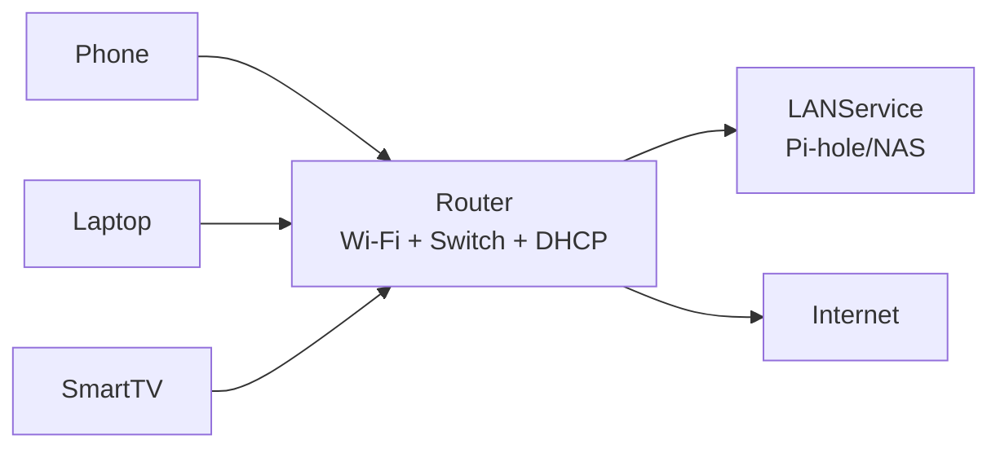
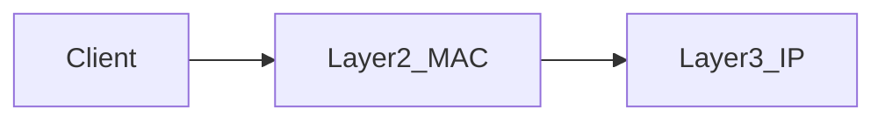
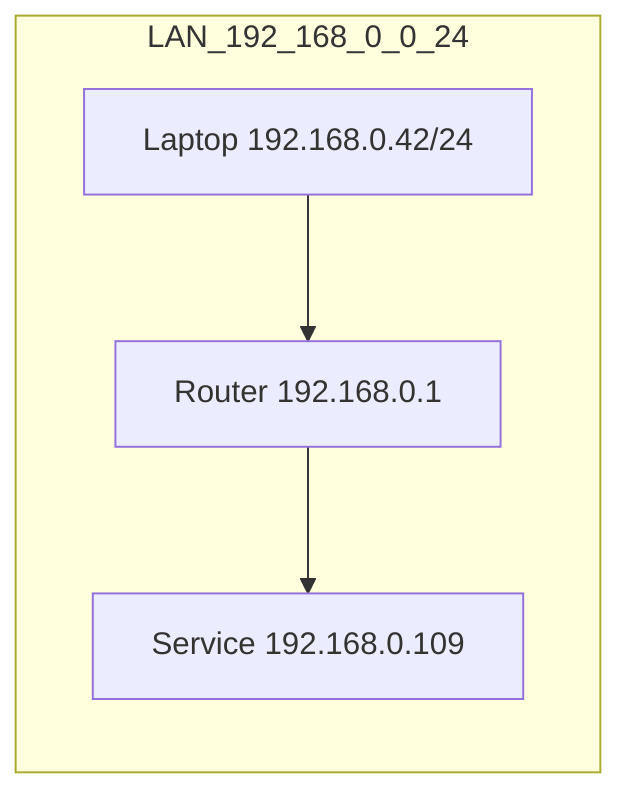

# IP Addressing (IP, Subnet, Subnet Mask, Gateway)

This page gives you the **addressing model** needed for almost every home-network task: Pi-hole, routers, static routes, VLANs/guest networks.

---

## 1. The one picture you need (home network)



---

## 2. What is an IP Address?

An **IP address** is a numeric address that uniquely identifies a device on a network, allowing other devices to send data to it.

### Why We Need IP Addresses

**The problem:** When you send data over a network, how does the network know where to deliver it?

**The solution:** Every device gets a unique IP address, like a mailing address for your house.

**Without IP addresses:**

- Routers wouldn't know where to send packets
- Devices couldn't communicate across networks
- The internet wouldn't work

**With IP addresses:**

- Routers read the destination IP and forward packets accordingly
- Devices can communicate across the entire internet
- Data knows where to go

**Real-world analogy:**

- Sending a letter needs a street address
- Sending a packet needs an IP address
- Just like you can't mail a letter without an address, you can't send network data without an IP

### IP Address Structure

**IPv4 addresses** (most common) are made of **32 bits**, divided into **4 octets** (8 bits each):

**Example:** `192.168.0.42`

**Breaking it down:**

- `192` = first octet (8 bits)
- `168` = second octet (8 bits)
- `0` = third octet (8 bits)
- `42` = fourth octet (8 bits)

**Binary representation:**

```
192.168.0.42 = 11000000.10101000.00000000.00101010
```

**Dotted decimal notation:**

- Each octet ranges from `0` to `255` (2^8 = 256 possible values)
- Four octets separated by dots
- Easier to read than binary

**Why 4 octets?**

- Historical design decision (IPv4 created in 1980s)
- 32 bits = 4,294,967,296 possible addresses
- This seemed like enough at the time (but we're running out!)

**IPv6 addresses** (newer standard):

- **128 bits** = 16 octets
- Example: `fd00::109` (shorthand notation)
- Much larger address space (won't run out)

### IP Address Components

Every IP address has two parts:

1. **Network portion** - Identifies which network the device belongs to
2. **Host portion** - Identifies which specific device on that network

**Example:** `192.168.0.42` with subnet mask `255.255.255.0`

- **Network portion:** `192.168.0` (first 24 bits)
- **Host portion:** `42` (last 8 bits)

**Why this matters:**

- Routers use the network portion to decide where to forward packets
- Devices use the host portion to identify specific devices on their network
- Like a phone number: area code (network) + local number (host)

**Visual breakdown:**

```
IP Address:  192.168.0.42
             └─┬─┘ └─┬─┘
           Network  Host
           (which  (which device
            network) on network)
```

### Real-World Examples

**Your home network:**

- Router: `192.168.0.1` (usually the gateway)
- Your laptop: `192.168.0.42`
- Pi-hole: `192.168.0.109`
- Phone: `192.168.0.50`

All share the same network portion (`192.168.0`), so they're on the same subnet.

**Different networks:**

- Your home: `192.168.0.42`
- Your work: `10.0.0.15`
- Friend's home: `192.168.1.100`

Different network portions = different networks = need routing to communicate.

Glossary: [`../../docs/GLOSSARY.md`](../../docs/GLOSSARY.md) (IP Address, IPv4, IPv6).

---

## 2.1 IP is a _Logical_ Address (Why "Logical"?)

IP addresses are called **logical** because they are **software-assigned, changeable, and hierarchical** - unlike physical addresses (MAC addresses) which are **hardware-burned and permanent**.

### What "Logical" Means

**Logical = Software-Assigned:**

- IP addresses are assigned by software (DHCP, manual configuration)
- Can be changed easily
- Not tied to hardware permanently

**Physical = Hardware-Burned:**

- MAC addresses are burned into network hardware
- Cannot be changed (permanent)
- Identifies the physical device

**Analogy:**

- **MAC address** = Your Social Security Number (permanent, identifies you)
- **IP address** = Your mailing address (can change, identifies your location)

### Hierarchical Explained

IP addresses are **hierarchical** - they have structure and levels, like a postal address.

**Postal address hierarchy:**

```
Country → State → City → Street → Number
```

**IP address hierarchy:**

```
Network → Subnet → Host
```

**Example:** `192.168.0.42`

- **Network:** `192.168.0` (identifies your home network)
- **Subnet:** `192.168.0.0/24` (all devices on your LAN)
- **Host:** `42` (your specific device)

**Why hierarchy matters:**

- Routers use hierarchy to make forwarding decisions
- Router sees `192.168.0.x` → knows "this is my LAN, forward locally"
- Router sees `8.8.8.8` → knows "this is internet, forward to gateway"
- Like postal system: reads address from general to specific

**Concrete example:**

- Router receives packet to `192.168.0.109`
- Router checks: "Is `192.168.0` my network?" → Yes
- Router forwards to local network (no internet needed)
- Router receives packet to `93.184.216.34`
- Router checks: "Is `93.184.216` my network?" → No
- Router forwards to internet gateway

### Routable Explained

**Routable** means routers can read IP addresses and decide where to forward packets.

**How routing works:**

1. Router receives packet with destination IP
2. Router checks routing table (list of networks it knows about)
3. Router finds matching network (or default route)
4. Router forwards packet to appropriate interface/gateway

**Example routing decision:**

- Packet arrives: destination `8.8.8.8`
- Router checks routing table:
  - `192.168.0.0/24` → LAN interface (doesn't match)
  - `0.0.0.0/0` → Internet gateway (matches - default route)
- Router forwards packet to internet gateway

**Why this matters:**

- Without routing, packets couldn't leave your local network
- Routing enables internet communication
- Routers use IP prefixes (network portions) to make decisions efficiently

**Step-by-step routing example:**

```
Your laptop (192.168.0.42) wants to visit example.com (93.184.216.34)

1. Laptop checks: Is 93.184.216.34 in my subnet (192.168.0.0/24)? No
2. Laptop sends packet to gateway (192.168.0.1)
3. Router receives packet
4. Router checks routing table: 93.184.216.34 not in local networks
5. Router uses default route → forwards to internet gateway
6. Packet continues toward destination
```

### Re-assignable Explained

**Re-assignable** means your device can have different IP addresses in different places.

**Example:**

- **At home:** Your laptop gets `192.168.0.42` (from home router DHCP)
- **At work:** Your laptop gets `10.0.0.15` (from work router DHCP)
- **At coffee shop:** Your laptop gets `172.16.0.50` (from coffee shop router)

**Why this works:**

- IP addresses are assigned dynamically (by DHCP)
- Your MAC address stays the same (hardware identifier)
- Your IP address changes (logical identifier)

**Real-world analogy:**

- **MAC address** = Your name (stays the same everywhere)
- **IP address** = Your seat number (changes in different venues)

**Why re-assignability matters:**

- Allows devices to move between networks
- Enables dynamic IP assignment (DHCP)
- Makes network management easier (no manual configuration needed)

**Contrast with MAC addresses:**

- A **MAC address** identifies a network interface **on the local link** (Ethernet/Wi‑Fi)
- MAC addresses are permanent (burned into hardware)
- Used for local network communication only

- **IP address** identifies a device **in the addressing/routing system**
- IP addresses are changeable (assigned by software)
- Used for routing across networks (including internet)

See Layer 2: [`layer2-mac-arp.md`](layer2-mac-arp.md)



## 3. What is a Subnet / Subnet Mask / Prefix?

A **subnet** is a logical grouping of IP addresses that belong to the same network segment. Devices in the same subnet can communicate directly with each other without needing a router.

### What is a Subnet? (Detailed Explanation)

**Simple definition:** A subnet is a group of IP addresses that are treated as "local" to each other.

**More detailed:** A subnet defines which IP addresses belong to the same network segment. Devices in the same subnet share the same network portion of their IP address.

**Real-world analogy:**

- **Same subnet** = Same apartment building

  - All apartments in building can talk directly (same network)
  - No need to go through main entrance (router) to reach neighbors

- **Different subnet** = Different apartment buildings
  - Need to go through main entrance (router) to reach other buildings
  - Requires routing between buildings

**Concrete example:**

- **Subnet:** `192.168.0.0/24`
- **What this means:** All IPs from `192.168.0.1` to `192.168.0.254` are in the same subnet
- **Your laptop:** `192.168.0.42` ✅ (same subnet)
- **Pi-hole:** `192.168.0.109` ✅ (same subnet)
- **Router:** `192.168.0.1` ✅ (same subnet)
- **All can talk directly** (no routing needed)

**Different subnet example:**

- **Guest network subnet:** `192.168.50.0/24`
- **Guest phone:** `192.168.50.20` ❌ (different subnet from main LAN)
- **Can't directly reach** `192.168.0.109` (different subnet)
- **Needs router** to forward (routing required)

### Why Subnets Exist

Subnets solve several important problems:

**1. Organization:**

- Groups related devices together (all your home devices)
- Makes network management easier
- Example: All your devices on `192.168.0.0/24`, all guest devices on `192.168.50.0/24`

**2. Security:**

- Isolates networks from each other
- Guest Wi-Fi can't access main LAN (different subnets)
- Firewall rules can block traffic between subnets

**3. Efficiency:**

- Routers only need to know about networks, not individual IPs
- Router: "Send to `192.168.0.0/24`" instead of tracking 254 individual IPs
- Reduces routing table size

**4. Scalability:**

- Can have millions of devices by organizing into subnets
- Internet = millions of subnets, not millions of individual routes
- Makes internet routing feasible

### What "Local" Actually Means

**Same subnet = Local:**

- Devices are on the same physical/logical network segment
- Devices can reach each other via switch/ARP (no routing needed)
- Communication happens at Layer 2 (MAC addresses)
- Fast, direct communication

**Different subnet = Not Local:**

- Devices are on different network segments
- Devices need router to communicate (routing required)
- Communication happens at Layer 3 (IP addresses)
- Router forwards packets between subnets

**Example: Same subnet communication:**

```
Laptop (192.168.0.42) → Pi-hole (192.168.0.109)
- Both in 192.168.0.0/24 (same subnet)
- Laptop uses ARP to find Pi-hole's MAC address
- Packet sent directly via switch
- No router involved
```

**Example: Different subnet communication:**

```
Guest phone (192.168.50.20) → Pi-hole (192.168.0.109)
- Different subnets (192.168.50.0/24 vs 192.168.0.0/24)
- Phone sends packet to gateway (192.168.50.1)
- Router receives packet, checks routing table
- Router forwards to 192.168.0.0/24 network
- Router involved (routing required)
```

### Subnet Mask Explained (Step-by-Step)

A **subnet mask** tells your device: **"Which part of my IP address is the network portion, and which part is the host portion?"**

**How subnet masks work:**

**Subnet mask format:** `255.255.255.0`

**Binary representation:**

```
255.255.255.0 = 11111111.11111111.11111111.00000000
```

**Breaking it down:**

- **1s** = Network portion (these bits identify the network)
- **0s** = Host portion (these bits identify the device)

**Example:** `192.168.0.42` with subnet mask `255.255.255.0`

**Step 1: Convert to binary**

```
IP:      192.168.0.42  = 11000000.10101000.00000000.00101010
Mask:    255.255.255.0 = 11111111.11111111.11111111.00000000
```

**Step 2: Apply mask (AND operation)**

```
IP:      11000000.10101000.00000000.00101010
Mask:    11111111.11111111.11111111.00000000
Result:  11000000.10101000.00000000.00000000
         └───────────┬──────────────┘ └───┬───┘
              Network Portion      Host Portion
```

**Step 3: Convert back to decimal**

```
Network: 192.168.0.0   (first 24 bits)
Host:    42             (last 8 bits)
```

**What this means:**

- Network portion: `192.168.0` (identifies your home network)
- Host portion: `42` (identifies your specific device)
- All devices with `192.168.0.x` are on the same subnet

**Visual representation:**

```
IP Address:  192.168.0.42
Subnet Mask: 255.255.255.0
             └─┬─┘ └─┬─┘
           Network  Host
           (24 bits) (8 bits)

All devices with 192.168.0.x are in the same subnet
```

### CIDR Notation Explained

**CIDR** (Classless Inter-Domain Routing) notation is a shorthand way to represent subnets.

**Format:** `/24` (pronounced "slash twenty-four")

**What it means:** "24 bits are used for the network portion"

**Why `/24`?**

- Count the number of 1s in the subnet mask
- `255.255.255.0` = 24 ones = `/24`

**Conversion table:**

```
Subnet Mask          Binary (1s)    CIDR
255.255.255.0        24 ones        /24
255.255.255.240      28 ones        /28
255.255.0.0          16 ones        /16
255.255.255.252      30 ones        /30
```

**Visual comparison:**

```
Subnet Mask:  255.255.255.0
Binary:       11111111.11111111.11111111.00000000
CIDR:         /24
              └─┬─┘
            24 bits for network
```

**Why CIDR notation is useful:**

- Shorter to write: `/24` vs `255.255.255.0`
- Easier to understand: "24 bits for network"
- Standard way to represent subnets

### Two Equivalent Ways to Represent Subnets

**Method 1: Subnet mask**

- `255.255.255.0`
- Shows the mask directly

**Method 2: CIDR prefix**

- `/24`
- Shows how many bits are network

**They're equivalent:**

- `255.255.255.0` = `/24`
- Both mean "24 bits for network, 8 bits for host"

**Common home LAN example:**

- **Subnet:** `192.168.0.0/24` ⇔ mask `255.255.255.0`
- **What this means:** Network `192.168.0`, 24 bits for network, 8 bits for host
- **Usable IP range:** `192.168.0.1` through `192.168.0.254` (254 devices)
- **Network address:** `192.168.0.0` (reserved - identifies the network)
- **Broadcast address:** `192.168.0.255` (reserved - broadcast to all devices)

### Why You Care About Subnets

**Same subnet:**

- Devices can communicate locally via router/switch
- Fast, direct communication
- No routing needed

**Different subnets:**

- Devices require routing rules to communicate
- Router must forward packets between subnets
- Common with guest networks/VLANs
- Firewall rules can control access between subnets



---

## 3.1 Subnet Calculations (Practical)

### Why We Calculate Subnets

**Reasons to understand subnet calculations:**

1. **Network Planning:** Know how many devices can fit in a subnet
2. **Troubleshooting:** Understand why devices can't communicate
3. **Configuration:** Set up correct subnet masks and IP ranges
4. **Security:** Understand network boundaries for firewall rules

**Example scenarios:**

- "Can I fit 300 devices on a /24 subnet?" → No, only 254 usable IPs
- "Why can't my guest device reach my Pi-hole?" → Different subnets
- "What subnet mask should I use?" → Depends on how many devices you need

### How to Calculate Usable IP Range from CIDR Notation

**CIDR notation:** `/24` means "24 bits are network, 8 bits are host"

**The formula:**

- **Host bits** = 32 total bits - prefix length
- **Total IPs** = 2^(host bits)
- **Usable hosts** = Total IPs - 2
  - Subtract 2: network address (first IP) and broadcast address (last IP)

**Why subtract 2?**

- **Network address** (`192.168.0.0`): Reserved - identifies the network itself
- **Broadcast address** (`192.168.0.255`): Reserved - sends to all devices in subnet
- **Usable IPs** (`192.168.0.1` through `192.168.0.254`): Can be assigned to devices

**Step-by-step calculation example:**

**Given:** `192.168.0.0/24`

**Step 1:** Calculate host bits

- Total bits: 32
- Network bits: 24
- Host bits: 32 - 24 = **8 bits**

**Step 2:** Calculate total IPs

- 2^8 = **256 total IPs**

**Step 3:** Calculate usable IPs

- 256 - 2 = **254 usable IPs**

**Step 4:** Determine IP range

- Network address: `192.168.0.0` (reserved)
- First usable: `192.168.0.1`
- Last usable: `192.168.0.254`
- Broadcast address: `192.168.0.255` (reserved)

**Visual representation:**

```
Subnet: 192.168.0.0/24
        └─────┬─────┘ └─┬─┘
         Network (24)  Host (8)

IP Range:
192.168.0.0   → Network address (reserved)
192.168.0.1   → First usable IP
192.168.0.2   → Usable IP
...
192.168.0.254 → Last usable IP
192.168.0.255 → Broadcast address (reserved)

Total: 256 IPs
Usable: 254 IPs (256 - 2)
```

**Common examples:**

| CIDR  | Host Bits | Total IPs | Usable Hosts | Subnet Mask       |
| ----- | --------- | --------- | ------------ | ----------------- |
| `/24` | 8         | 256       | 254          | `255.255.255.0`   |
| `/28` | 4         | 16        | 14           | `255.255.255.240` |
| `/30` | 2         | 4         | 2            | `255.255.255.252` |
| `/16` | 16        | 65,536    | 65,534       | `255.255.0.0`     |

### Example 1: /24 Subnet (Common Home LAN)

**Subnet:** `192.168.0.0/24`

**This is the most common subnet size for home networks.**

**Calculation walkthrough:**

**Step 1:** Identify components

- Network: `192.168.0`
- Prefix: `/24` (24 bits for network)
- Host bits: 32 - 24 = **8 bits**

**Step 2:** Calculate capacity

- Total IPs: 2^8 = **256 IPs**
- Usable hosts: 256 - 2 = **254 devices**

**Step 3:** Determine range

- Network address: `192.168.0.0` (reserved - identifies network)
- Usable range: `192.168.0.1` through `192.168.0.254` (can assign to devices)
- Broadcast address: `192.168.0.255` (reserved - broadcast to all devices)

**Subnet mask:** `255.255.255.0`

**Binary breakdown:**

```
Subnet Mask: 255.255.255.0
Binary:       11111111.11111111.11111111.00000000
              └───────────┬──────────────┘ └───┬───┘
                  24 bits (network)      8 bits (host)
```

**What this means:**

- First 24 bits are 1s (network portion - identifies your LAN)
- Last 8 bits are 0s (host portion - identifies specific device)
- All devices with `192.168.0.x` are on the same subnet

**Real-world usage:**

- Perfect for home networks (254 devices is plenty)
- Your router: `192.168.0.1`
- Your laptop: `192.168.0.42`
- Pi-hole: `192.168.0.109`
- All can communicate directly (same subnet)

### Example 2: /28 Subnet (Small Network)

**Subnet:** `192.168.1.0/28`

**Calculation:**

- Host bits: 32 - 28 = 4
- Total IPs: 2^4 = 16
- Usable hosts: 16 - 2 = 14

**IP range:**

- Network address: `192.168.1.0` (reserved)
- Usable range: `192.168.1.1` through `192.168.1.14`
- Broadcast address: `192.168.1.15` (reserved)

**Subnet mask:** `255.255.255.240`

- First 28 bits are 1s (network)
- Last 4 bits are 0s (host)

### Subnet Mask to CIDR Conversion

**Method:** Count the number of consecutive 1s from left to right in the subnet mask.

**Why convert?**

- Subnet masks (`255.255.255.0`) are verbose
- CIDR notation (`/24`) is shorter and clearer
- Both represent the same thing

**Step-by-step conversion:**

**Example 1:** `255.255.255.0` → `/24`

**Step 1:** Convert each octet to binary

- `255` = `11111111` (8 ones)
- `255` = `11111111` (8 ones)
- `255` = `11111111` (8 ones)
- `0` = `00000000` (0 ones)

**Step 2:** Count total ones

- Total: 8 + 8 + 8 + 0 = **24 ones**

**Step 3:** Write as CIDR

- **24 ones** → `/24`

**Visual:**

```
Subnet Mask: 255.255.255.0
Binary:       11111111.11111111.11111111.00000000
              └───────────┬──────────────┘
                   24 ones
CIDR:         /24
```

**Example 2:** `255.255.255.240` → `/28`

**Step 1:** Convert each octet to binary

- `255` = `11111111` (8 ones)
- `255` = `11111111` (8 ones)
- `255` = `11111111` (8 ones)
- `240` = `11110000` (4 ones)

**Step 2:** Count total ones

- Total: 8 + 8 + 8 + 4 = **28 ones**

**Step 3:** Write as CIDR

- **28 ones** → `/28`

**Visual:**

```
Subnet Mask: 255.255.255.240
Binary:       11111111.11111111.11111111.11110000
              └───────────────┬────────────────┘
                        28 ones
CIDR:         /28
```

**Common conversions to memorize:**

- `255.255.255.0` = `/24` (most common home network)
- `255.255.255.240` = `/28` (small networks, 14 devices)
- `255.255.255.252` = `/30` (point-to-point links, 2 devices)
- `255.255.0.0` = `/16` (large networks, 65,534 devices)

### Practice Examples (With Detailed Solutions)

**Example A:** What is the usable IP range for `10.0.0.0/24`?

**Solution:**

- Subnet: `10.0.0.0/24`
- Host bits: 32 - 24 = 8 bits
- Total IPs: 2^8 = 256
- Usable hosts: 256 - 2 = 254
- **Answer:** `10.0.0.1` through `10.0.0.254` (254 usable hosts)
- Network: `10.0.0.0` (reserved)
- Broadcast: `10.0.0.255` (reserved)

**Example B:** How many usable hosts in `192.168.50.0/28`?

**Solution:**

- Subnet: `192.168.50.0/28`
- Host bits: 32 - 28 = 4 bits
- Total IPs: 2^4 = 16
- Usable hosts: 16 - 2 = 14
- **Answer:** 14 usable hosts
- Range: `192.168.50.1` through `192.168.50.14`
- Network: `192.168.50.0` (reserved)
- Broadcast: `192.168.50.15` (reserved)

**Example C:** Convert subnet mask `255.255.0.0` to CIDR notation

**Solution:**

- `255` = `11111111` (8 ones)
- `255` = `11111111` (8 ones)
- `0` = `00000000` (0 ones)
- `0` = `00000000` (0 ones)
- Total: 8 + 8 + 0 + 0 = 16 ones
- **Answer:** `/16` (16 consecutive ones)

**Example D:** What subnet mask corresponds to `/30`?

**Solution:**

- `/30` means 30 bits are network, 2 bits are host
- Need 30 ones in subnet mask
- `255` = `11111111` (8 ones)
- `255` = `11111111` (8 ones)
- `255` = `11111111` (8 ones)
- Need 6 more ones: `11111100` = `252`
- **Answer:** `255.255.255.252` (30 ones, 2 zeros)
- This gives 2^2 = 4 total IPs, 2 usable (perfect for point-to-point links)

---

## 3.2 Gateway Selection Logic

### Why Gateway Must Be in Same Subnet

The **gateway** (router) must be reachable on the **local network**:

- Your device uses **ARP** to find the gateway's MAC address
- ARP only works within the same subnet
- If gateway is in different subnet, ARP fails → packets can't reach gateway

**Example:**

- Your IP: `192.168.0.42/24` (subnet: `192.168.0.0/24`)
- Gateway: `192.168.0.1` ✅ (same subnet, works)
- Gateway: `192.168.1.1` ❌ (different subnet, won't work)

### What Happens If Gateway Is Wrong

**Scenario:** Device configured with wrong gateway

**Configuration:**

- Device IP: `192.168.0.42/24`
- Gateway: `192.168.1.1` (wrong - different subnet)

**What happens:**

1. Device wants to reach internet (`8.8.8.8`)
2. Device checks routing: destination not in `192.168.0.0/24`
3. Device tries to send packet to gateway `192.168.1.1`
4. Device uses ARP to find `192.168.1.1` MAC address
5. **ARP fails** (gateway not in same subnet)
6. Packet cannot be sent → **no internet access**

**Symptom:** Device has IP address but cannot reach internet or other subnets

### Default Gateway vs Specific Routes

**Default gateway:**

- Used for **all destinations** not matching more specific routes
- Typically points to your router (`192.168.0.1`)
- Handles internet traffic and unknown destinations

**Specific routes:**

- Used for **specific networks** that need different gateway
- Example: VPN route (`10.8.0.0/24 → 10.8.0.1`)
- More specific routes take precedence over default route

**Example routing table:**

```
Destination        Gateway          Interface
10.8.0.0/24        10.8.0.1         tun0        (specific route)
0.0.0.0/0          192.168.0.1       eth0        (default route)
```

**Packet to `10.8.0.5`:**

- Matches specific route `/24` → uses gateway `10.8.0.1`

**Packet to `8.8.8.8`:**

- Doesn't match `/24` route
- Matches default route `/0` → uses gateway `192.168.0.1`

---

## 4. What is the Gateway?

The **default gateway** is the router IP your device uses to reach non-local networks (commonly `192.168.0.1`).

Analogy: the gateway is the **exit door** of your building. If the destination isn't inside, you go through the exit.

**How gateway selection works:**

- Device checks if destination is in same subnet
- If yes: direct delivery (no gateway needed)
- If no: send packet to gateway (router forwards it)

See gateway selection logic: [Section 3.2](#32-gateway-selection-logic)

---

## 5. LAN vs WAN (why router settings are confusing)

- **LAN settings** affect your devices (phones/laptops/TVs).
- **WAN/Internet settings** affect the router’s upstream connection only.

If you configure something under “Internet/WAN DNS,” that might affect the router itself, but not necessarily your clients. For client behavior, the key is usually **LAN DHCP**.

See: [`home-router-model.md`](home-router-model.md).

---

## 6. Quick “show me my IP + gateway” (by OS)

These commands answer:

- What IP do I have?
- What subnet/prefix am I on?
- What is my default gateway?

- Linux: [`../../shell-commands/02-commands/ip.md`](../../shell-commands/02-commands/ip.md)
- Windows: [`../../shell-commands/02-commands/ipconfig.md`](../../shell-commands/02-commands/ipconfig.md)
- Legacy/macOS-friendly: [`../../shell-commands/02-commands/ifconfig.md`](../../shell-commands/02-commands/ifconfig.md)

---

## 7. Practice Drills

- Addressing drills: [`../practice/addressing-drills.md`](../practice/addressing-drills.md)

---

## 8. Next

- DHCP (how devices receive IP + gateway + DNS): [`dhcp.md`](dhcp.md)
- DNS (how names become IPs): [`dns.md`](dns.md)
- Layer 2 basics (MAC addresses, ARP): [`layer2-mac-arp.md`](layer2-mac-arp.md)
