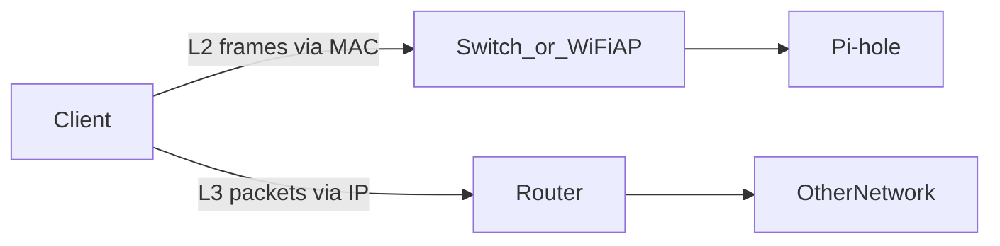
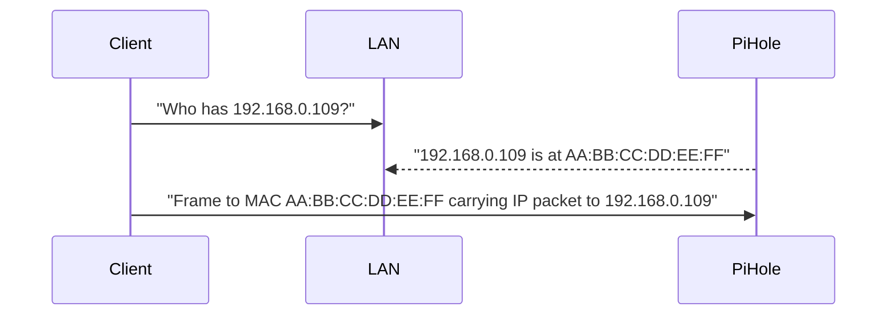

# Layer 2 Basics (MAC Addresses, Switching, ARP)

This page explains what happens **before** IP routing works: how devices find each other on the local link.

If you’ve ever wondered:

- “What is a MAC address?”
- “Why do DHCP reservations use MAC?”
- “Why can’t I reach a device even though it has an IP?”

…this page is the missing layer.

---

## 0. Prerequisite

- IP/subnet/gateway basics: [`ip-addressing.md`](ip-addressing.md)

---

## 1. MAC address: the local, link-layer identifier

A **MAC address** (Media Access Control address) is a hardware identifier used on the **local network link** (Ethernet/Wi‑Fi).

Key idea:

- **MAC is used locally** (inside your LAN segment) to deliver frames.
- **IP is used logically** (for routing between networks).

MAC looks like:

- `AA:BB:CC:DD:EE:FF`

---

## 2. “IP is logical” vs “MAC is local”

### Why IP is called “logical”

IP addresses are **hierarchical** and **routable**:

- They’re allocated to subnets (`192.168.0.0/24`)
- Routers can summarize and route based on prefixes
- They can change when you move networks

### Why MAC is “local”

MAC addresses are used to deliver frames **on the local link**:

- Your switch/AP forwards frames based on MAC tables
- Routers do not forward L2 frames unchanged across networks

---

## 3. Switching vs routing (the simplest mental model)

- **Switching (Layer 2):** within the same LAN segment, based on MAC addresses.
- **Routing (Layer 3):** between different networks/subnets, based on IP addresses.

If your device is on **guest Wi‑Fi**, many routers treat it as a different subnet/VLAN and block routing to the main LAN.

See: [`routing-vlans-guest.md`](routing-vlans-guest.md)

---

## 4. ARP: how IPv4 maps IP → MAC

On IPv4 LANs, a device must learn the MAC address for a destination IP to send a frame. That mapping is done using **ARP** (Address Resolution Protocol).

If ARP fails:

- You cannot reach the device by IP even on the same subnet.

---

## 5. IPv6 note: Neighbor Discovery (high level)

IPv6 uses **Neighbor Discovery** (ND) instead of ARP, but the concept is similar: map an IPv6 address to a link-layer address.

For Pi-hole purposes, you mostly care that IPv6 DNS can bypass your IPv4 DNS if advertised incorrectly.

See Pi-hole IPv6: [`../../pi-hole/docs/ipv6.md`](../../pi-hole/docs/ipv6.md)

---

## 6. Why DHCP reservations use MAC

A DHCP reservation is basically:

> “When you see **this MAC**, always hand out **that IP**.”

That’s why you can reinstall the OS on a Pi and still get the same IP (as long as the NIC/MAC stays the same).

See DHCP: [`dhcp.md`](dhcp.md)

---

## 7. Practical checks (drills)

Learn commands:

- Neighbor/ARP cache (Linux/macOS): `ip neigh` (documented in [`../../shell-commands/02-commands/arp.md`](../../shell-commands/02-commands/arp.md))
- Windows: `arp -a`

Practice:

- [`../practice/l2-drills.md`](../practice/l2-drills.md)
