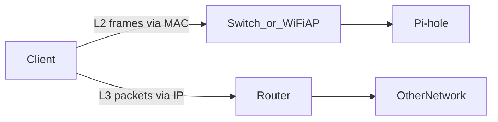
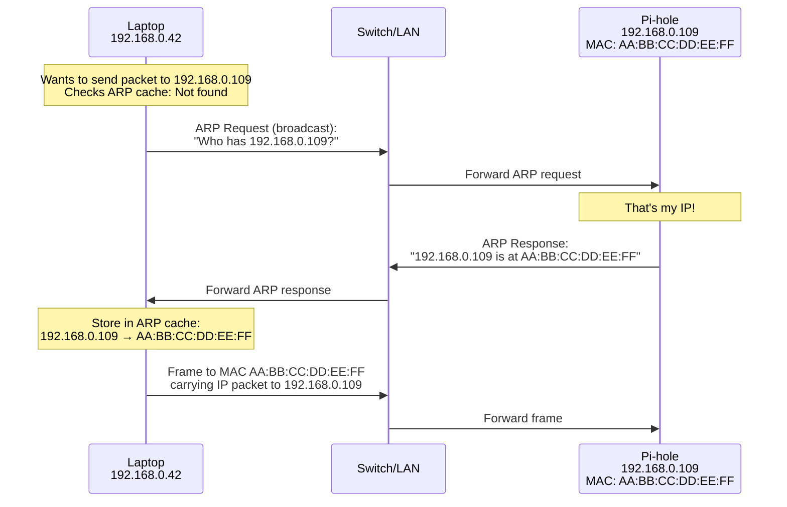

# Layer 2 Basics (MAC Addresses, Switching, ARP)

This page explains what happens **before** IP routing works: how devices find each other on the local link.

If you’ve ever wondered:

- “What is a MAC address?”
- “Why do DHCP reservations use MAC?”
- “Why can’t I reach a device even though it has an IP?”

…this page is the missing layer.

---

## 0. Prerequisite

- IP/subnet/gateway basics: [`ip-addressing.md`](ip-addressing.md)

---

## 1. MAC Address: The Local, Link-Layer Identifier

A **MAC address** (Media Access Control address) is a **permanent hardware identifier** burned into your network interface card (NIC). It's used on the **local network link** (Ethernet/Wi‑Fi) to deliver frames between devices.

### Why MAC Addresses Exist

**The problem:** IP addresses are logical (can change), but networks need a permanent way to identify devices at the hardware level.

**Why MAC addresses exist:**

- **IPs are logical** - Can change (DHCP assigns different IPs)
- **Need permanent identifier** - To identify device hardware
- **Switches use MAC** - To forward frames on local network
- **Layer 2 communication** - MAC addresses used before IP routing

**Real-world analogy:**

- **MAC address** = Your Social Security Number (permanent, identifies you)
- **IP address** = Your mailing address (can change, identifies location)

**Key idea:**

- **MAC is used locally** (inside your LAN segment) to deliver frames.
- **IP is used logically** (for routing between networks).

### MAC Address Structure

**Format:** `AA:BB:CC:DD:EE:FF`

**Components:**

- **48 bits total** = 6 octets (8 bits each)
- **Format:** Hexadecimal (0-9, A-F)
- **Separator:** Colons (`:`) or hyphens (`-`)

**Breaking it down:**

- **First 3 octets** (`AA:BB:CC`): OUI (Organizationally Unique Identifier)

  - Identifies manufacturer
  - Example: `00:1B:44` = Intel Corporation

- **Last 3 octets** (`DD:EE:FF`): Device serial number
  - Unique to device
  - Assigned by manufacturer

**Example MAC address:**

```
AA:BB:CC:DD:EE:FF
└─┬─┘ └─────┬─────┘
OUI      Serial
(Manufacturer) (Device)
```

**Real-world example:**

- MAC: `00:1B:44:11:3A:B7`
- OUI: `00:1B:44` = Intel Corporation
- Serial: `11:3A:B7` = Unique to this device

### MAC vs IP: Key Differences

**MAC Address:**

- **Permanent** - Burned into hardware, can't change
- **Local** - Only used on same network segment
- **Layer 2** - Used by switches for frame forwarding
- **Flat** - No hierarchy, just a unique identifier
- **Example:** `AA:BB:CC:DD:EE:FF`

**IP Address:**

- **Changeable** - Assigned by DHCP or manually
- **Global** - Used for routing across networks
- **Layer 3** - Used by routers for packet forwarding
- **Hierarchical** - Has network and host portions
- **Example:** `192.168.0.42`

**When each is used:**

- **Same subnet:** MAC addresses used (Layer 2, direct delivery)
- **Different subnet:** IP addresses used (Layer 3, routing)

**Visual comparison:**

```
Same Subnet Communication:
Device A → Switch (uses MAC) → Device B
MAC: AA:BB:CC:DD:EE:01 → AA:BB:CC:DD:EE:02

Different Subnet Communication:
Device A → Router (uses IP) → Internet → Device B
IP: 192.168.0.42 → 93.184.216.34
```

---

## 2. "IP is Logical" vs "MAC is Local"

### Why IP is Called "Logical"

IP addresses are **hierarchical** and **routable**:

**Hierarchical:**

- They're allocated to subnets (`192.168.0.0/24`)
- Have structure: Network → Subnet → Host
- Routers use hierarchy to make forwarding decisions
- Example: Router sees `192.168.0.x` → knows it's your LAN

**Routable:**

- Routers can summarize and route based on prefixes
- Can route packets across networks
- Internet routing works because IPs are hierarchical
- Example: Router forwards `8.8.8.8` to internet gateway

**Changeable:**

- They can change when you move networks
- DHCP assigns different IPs in different places
- Your laptop: `192.168.0.42` at home, `10.0.0.15` at work
- MAC address stays same, IP changes

**Why "logical":**

- Software-assigned (not hardware)
- Represents logical location (which network)
- Can be changed/reassigned
- Used for routing (logical addressing)

### Why MAC is "Local"

MAC addresses are used to deliver frames **on the local link**:

**Local network only:**

- Your switch/AP forwards frames based on MAC tables
- Works only within same network segment
- Cannot route across networks using MAC

**Switch forwarding:**

- Switches learn MAC addresses from frames
- Build MAC address table (which MAC on which port)
- Forward frames based on destination MAC
- Example: Frame to `AA:BB:CC:DD:EE:FF` → switch forwards to correct port

**Routers don't forward MAC:**

- Routers do not forward L2 frames unchanged across networks
- Router receives frame, extracts IP packet
- Router forwards IP packet (not MAC frame) to next network
- MAC address changes at each router hop

**Why "local":**

- Hardware-burned (permanent)
- Represents physical device (not location)
- Cannot be changed
- Used for local delivery (physical addressing)

**Visual comparison:**

**Same subnet (uses MAC):**

```
Laptop → Switch (MAC forwarding) → Pi-hole
MAC: AA:BB:CC:DD:EE:01 → AA:BB:CC:DD:EE:FF
```

**Different subnet (uses IP):**

```
Laptop → Router (IP routing) → Internet → Server
IP: 192.168.0.42 → 93.184.216.34
MAC changes at router (new MAC for each network)
```



---

## 3. Switching vs routing (the simplest mental model)

- **Switching (Layer 2):** within the same LAN segment, based on MAC addresses.
- **Routing (Layer 3):** between different networks/subnets, based on IP addresses.

If your device is on **guest Wi‑Fi**, many routers treat it as a different subnet/VLAN and block routing to the main LAN.

See: [`routing-vlans-guest.md`](routing-vlans-guest.md)

---

## 4. ARP: How IPv4 Maps IP → MAC

On IPv4 LANs, a device must learn the **MAC address** for a destination IP to send a frame. That mapping is done using **ARP** (Address Resolution Protocol).

### Why ARP is Needed

**The problem:**

- Device knows IP address (`192.168.0.109`)
- Device needs MAC address to send frame on local network
- How does device find MAC for IP?

**Why ARP exists:**

- **IPs are logical** - Can change, don't identify hardware
- **MACs are physical** - Permanent, identify hardware
- **Switches use MAC** - To forward frames on local network
- **Need translation** - From IP (logical) to MAC (physical)

**Real-world analogy:**

- **IP address** = Person's name (logical identifier)
- **MAC address** = Person's face (physical identifier)
- **ARP** = Looking up someone's face when you know their name

### Step-by-Step ARP Process

**Scenario:** Your laptop (`192.168.0.42`) wants to send a packet to Pi-hole (`192.168.0.109`)

**Step 1: Check ARP Cache**

- Device first checks: "Do I already know the MAC for `192.168.0.109`?"
- ARP cache stores recent IP → MAC mappings
- If found: Use cached MAC, skip to Step 5
- If not found: Continue to Step 2

**Step 2: Broadcast ARP Request**

- Device broadcasts: "Who has IP `192.168.0.109`? Tell `192.168.0.42`"
- Broadcast goes to all devices on local network
- Uses MAC broadcast address: `FF:FF:FF:FF:FF:FF`

**Step 3: Device Responds**

- Pi-hole receives ARP request
- Pi-hole checks: "That's my IP (`192.168.0.109`)"
- Pi-hole responds: "`192.168.0.109` is at MAC `AA:BB:CC:DD:EE:FF`"
- Response sent directly to requesting device's MAC

**Step 4: Store in ARP Cache**

- Laptop receives ARP response
- Laptop stores: `192.168.0.109` → `AA:BB:CC:DD:EE:FF` in ARP cache
- Cache entry has timeout (typically 2-4 minutes)

**Step 5: Send Frame Using MAC**

- Laptop now knows MAC address
- Laptop sends frame to MAC `AA:BB:CC:DD:EE:FF`
- Frame contains IP packet destined for `192.168.0.109`
- Switch forwards frame using MAC address

**Visual flow:**



### ARP Cache Explained

**What is ARP cache:**

- Temporary storage of IP → MAC mappings
- Stored in device's memory
- Speeds up communication (no need to ARP every time)

**Cache entry structure:**

```
IP Address      MAC Address         Age
192.168.0.109   AA:BB:CC:DD:EE:FF   30s
192.168.0.1     AA:BB:CC:DD:EE:01   120s
```

**Cache timeout:**

- Entries expire after timeout (typically 2-4 minutes)
- Why timeout? MAC addresses can change (virtual machines, network changes)
- Expired entries trigger new ARP request

**Viewing ARP cache:**

- Linux: `ip neigh` or `arp -a`
- Windows: `arp -a`
- Shows all known IP → MAC mappings

### What Happens If ARP Fails

**If ARP fails:**

- Device cannot find MAC address for IP
- Cannot send frame on local network
- **You cannot reach the device by IP even on the same subnet**

**Common causes of ARP failure:**

1. **Device is down** - No response to ARP request
2. **Wrong subnet** - Device not on same network segment
3. **Firewall blocking** - ARP packets blocked
4. **Network issue** - Physical connectivity problem

**Symptoms:**

- `ping` fails (can't find MAC to send packet)
- "Destination host unreachable"
- Works on different subnet but not same subnet

**Troubleshooting:**

- Check ARP cache: `arp -a` or `ip neigh`
- Check if device is on same subnet
- Check physical connectivity
- Check firewall rules

---

## 5. IPv6 note: Neighbor Discovery (high level)

IPv6 uses **Neighbor Discovery** (ND) instead of ARP, but the concept is similar: map an IPv6 address to a link-layer address.

For Pi-hole purposes, you mostly care that IPv6 DNS can bypass your IPv4 DNS if advertised incorrectly.

See Pi-hole IPv6: [`../../pi-hole/docs/ipv6.md`](../../pi-hole/docs/ipv6.md)

---

## 6. Why DHCP reservations use MAC

A DHCP reservation is basically:

> “When you see **this MAC**, always hand out **that IP**.”

That’s why you can reinstall the OS on a Pi and still get the same IP (as long as the NIC/MAC stays the same).

See DHCP: [`dhcp.md`](dhcp.md)

---

## 7. Practical checks (drills)

Learn commands:

- Neighbor/ARP cache (Linux/macOS): `ip neigh` (documented in [`../../shell-commands/02-commands/arp.md`](../../shell-commands/02-commands/arp.md))
- Windows: `arp -a`

Practice:

- [`../practice/l2-drills.md`](../practice/l2-drills.md)

---

## Next

- DHCP (how devices get IP addresses): [`dhcp.md`](dhcp.md)
- Routing (how packets move between subnets): [`routing-vlans-guest.md`](routing-vlans-guest.md)
