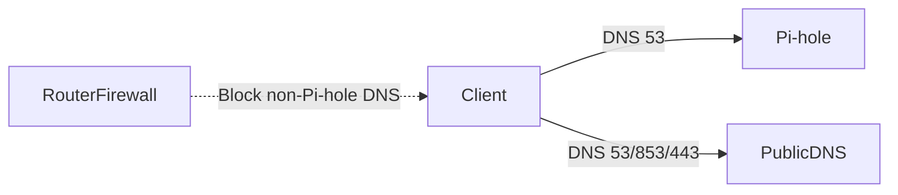

# NAT and Firewalls (Home Router Reality)

This page explains why “block outbound DNS except Pi-hole” works, and how home routers typically enforce (or fail to enforce) policies.

---

## 0. Prerequisites

- Router model (LAN vs WAN): [`home-router-model.md`](home-router-model.md)
- Ports and transport: [`tcp-udp-ports.md`](tcp-udp-ports.md)

---

## 1. NAT vs routing (what NAT does and doesn’t do)

### Routing (concept)

Routing is how traffic moves between networks/subnets based on IP prefixes.

### NAT (Network Address Translation)

NAT rewrites addresses/ports so many private LAN devices can share one public IP.

Key point:

- **NAT is not “security.”**
- Firewalls provide policy; NAT is address translation.

---

## 2. Stateful firewalls (connection tracking)

Most home routers use a **stateful firewall**:

- Outbound connections are allowed by default
- Return traffic is allowed if it matches an existing “state”
- Inbound unsolicited connections from the internet are blocked by default

This matters because DNS bypass is usually **outbound**:

- Clients can reach public DNS unless you explicitly restrict it.

---

## 3. Why “force DNS to Pi-hole” works

If you make Pi-hole authoritative, you need to prevent “escape paths”:

The enforcement patterns are:

1. **Allow DNS only to Pi-hole**

- Allow UDP/TCP 53 to Pi-hole IP
- Drop UDP/TCP 53 to all other destinations

2. **Optional DNAT redirect**

- Redirect any outbound UDP/TCP 53 to Pi-hole IP:53
- Useful for stubborn clients that hardcode public resolvers

3. **DoH/DoT mitigation**

- Disable router-level DoH/DoT
- For clients: policies (browser settings) or block known DoH endpoints (best-effort)

See ports: [`tcp-udp-ports.md`](tcp-udp-ports.md)

---

## 4. Common home router capabilities (what you might see)

- **DNSFilter / Parental Controls** (ASUSwrt-Merlin, some OEM firmwares)
- **Firewall rules** (OpenWRT, pfSense, OPNsense)
- **Guest network isolation** (prevents LAN access by design)
- **DoH/DoT toggles** (sometimes called DNS Privacy, Secure DNS)

---

## 5. Practical checks (drills)

Practice:

- [`../practice/nat-firewall-drills.md`](../practice/nat-firewall-drills.md)

Pi-hole bypass guide:

- [`../../pi-hole/docs/hardcoded-dns.md`](../../pi-hole/docs/hardcoded-dns.md)
