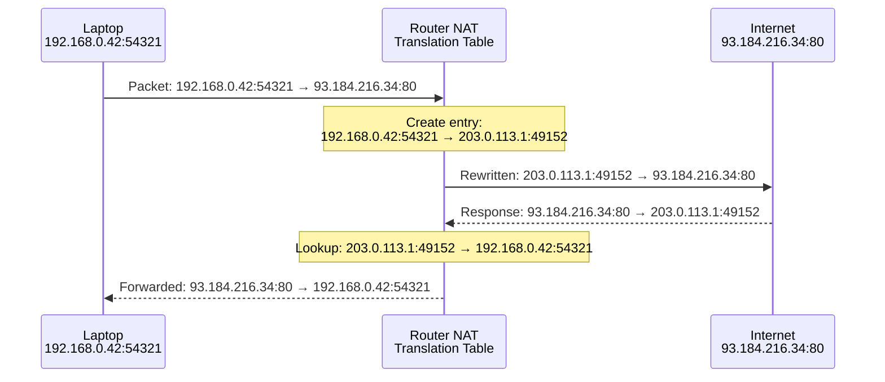
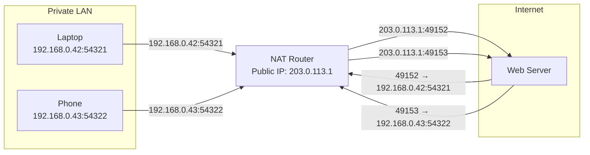
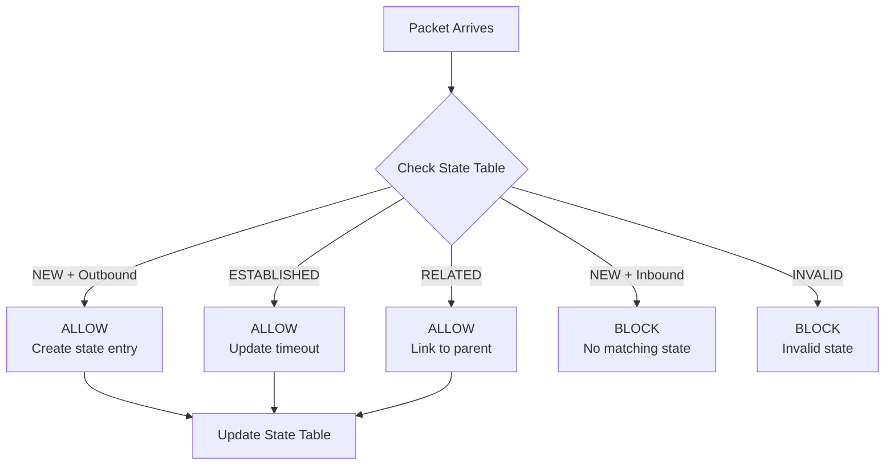
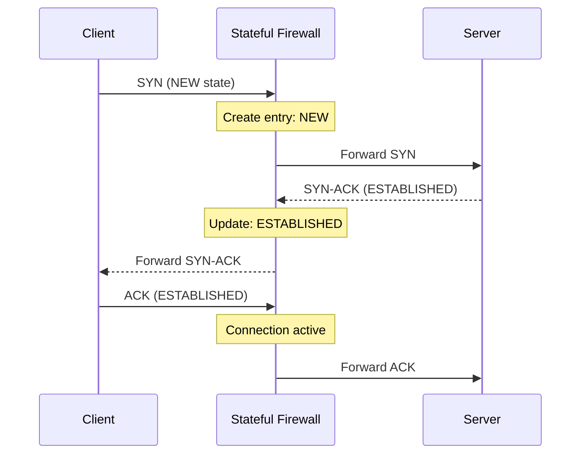
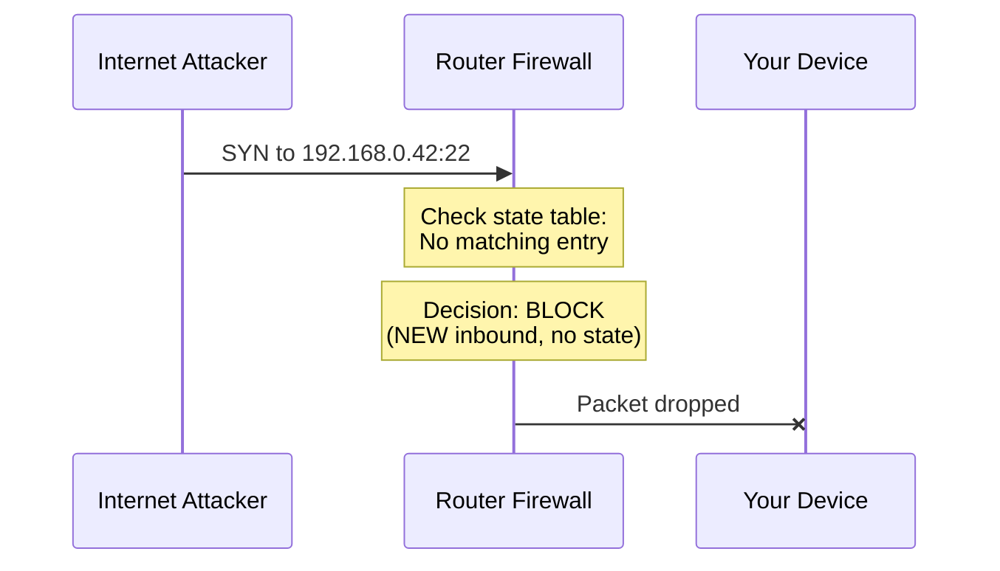
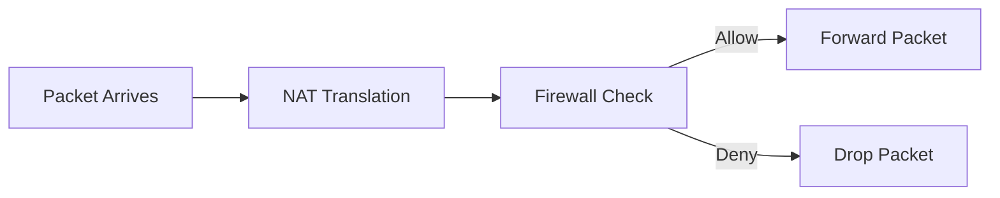
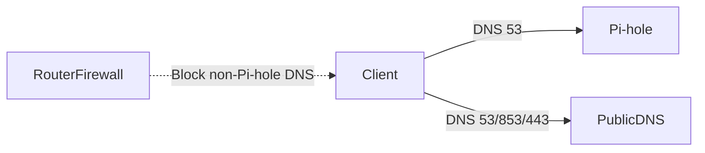

# NAT and Firewalls (Home Router Reality)

This page explains why “block outbound DNS except Pi-hole” works, and how home routers typically enforce (or fail to enforce) policies.

---

## 0. Prerequisites

- IP/subnet/gateway basics: [`ip-addressing.md`](ip-addressing.md)
- Router model (LAN vs WAN): [`home-router-model.md`](home-router-model.md)
- Ports and transport: [`tcp-udp-ports.md`](tcp-udp-ports.md)

---

## 1. NAT vs routing (what NAT does and doesn't do)

### Routing (concept)

Routing is how traffic moves between networks/subnets based on IP prefixes.

See detailed routing explanation: [`routing-vlans-guest.md`](routing-vlans-guest.md)

### NAT (Network Address Translation)

NAT rewrites addresses/ports so many private LAN devices can share one public IP.

**What NAT does:**

- **Translates** private IP:port → public IP:port (outbound)
- **Translates** public IP:port → private IP:port (inbound)
- **Maintains** translation table to track connections
- **Enables** multiple devices to share one public IP

**What NAT doesn't do:**

- **Doesn't provide security** (hides IPs, but doesn't block attacks)
- **Doesn't filter traffic** (doesn't decide allow/deny)
- **Doesn't inspect packets** (just rewrites addresses)

**Key point:**

- **NAT is not "security."**
- Firewalls provide policy; NAT is address translation.
- NAT hides your private IPs (obscurity), but doesn't protect you
- Firewall provides actual security (blocks malicious traffic)

---

## 1.1 How NAT Works Internally

NAT maintains a **translation table** that maps private IP:port combinations to public IP:port combinations. This table is the key to understanding how NAT works.

### Why NAT Exists

**The problem:**

- **IPv4 address shortage:** Only ~4.3 billion IPv4 addresses exist
- **Can't give every device a public IP:** Not enough addresses
- **Solution:** Many private IPs share one public IP

**The NAT solution:**

- Your home network: 10-50 devices, all with private IPs (`192.168.0.x`)
- Your router: One public IP (`203.0.113.1`)
- NAT translates: Private IPs → Public IP for internet communication

**Real-world analogy:**

- **NAT** = Company switchboard
- **Public IP** = Company's main phone number (external calls see this)
- **Private IPs** = Internal extensions (employees have extensions)
- **Switchboard** = Routes calls, translates extension ↔ main number

**Without NAT:**

- Every device needs public IP
- Would run out of IPv4 addresses quickly
- Expensive (public IPs cost money)

**With NAT:**

- Many devices share one public IP
- Efficient use of IPv4 addresses
- Cost-effective (one public IP for entire home)

### The Translation Table

The **translation table** is NAT's memory - it remembers which private IP:port maps to which public IP:port.

**Table structure:**

```
Private IP:Port          → Public IP:Port
192.168.0.42:54321       → 203.0.113.1:49152
192.168.0.43:54322       → 203.0.113.1:49153
192.168.0.50:54323       → 203.0.113.1:49154
```

**What it stores:**

- **Private IP:Port** - Your device's actual address
- **Public IP:Port** - What internet sees
- **Protocol** - TCP or UDP
- **Timeout** - When entry expires

**Why ports matter:**

- Multiple devices can share same public IP
- Ports distinguish which device gets which response
- Example: Laptop uses port `54321`, phone uses port `54322`
- Both get unique public ports (`49152`, `49153`)

### How NAT Works (Step-by-Step)

When a device on your LAN sends a packet to the internet, NAT performs these steps:

**Step 1: Record the connection**

- NAT receives packet from private IP:port
- Creates entry in translation table
- Assigns unique public port
- Records mapping: Private → Public

**Step 2: Rewrite the source address**

- Changes source from private IP:port to public IP:port
- Destination unchanged
- Example: `192.168.0.42:54321` → `203.0.113.1:49152`

**Step 3: Forward the packet**

- Sends rewritten packet to internet
- Internet sees public IP:port as source
- Internet responds to public IP:port

**Step 4: When response arrives**

- NAT receives response to public IP:port
- Looks up translation table: Public → Private
- Finds original private IP:port
- Rewrites destination: Public → Private
- Forwards packet to original device

**Visual flow:**

**Outbound (device → internet):**

```
Device sends:  192.168.0.42:54321 → 93.184.216.34:80
NAT rewrites: 203.0.113.1:49152 → 93.184.216.34:80
Internet sees: 203.0.113.1:49152 → 93.184.216.34:80
```

**Inbound (internet → device):**

```
Internet sends: 93.184.216.34:80 → 203.0.113.1:49152
NAT looks up:   49152 → 192.168.0.42:54321
NAT rewrites:   93.184.216.34:80 → 192.168.0.42:54321
Device receives: 93.184.216.34:80 → 192.168.0.42:54321
```

### Step-by-Step: Outbound Packet Flow

**Scenario:** Your laptop (`192.168.0.42`) wants to visit `example.com` (port 80).

**Before NAT (what your laptop sends):**

- Source: `192.168.0.42:54321` (private IP, random port)
- Destination: `93.184.216.34:80` (example.com)

**After NAT (what the internet sees):**

- Source: `203.0.113.1:49152` (router's public IP, mapped port)
- Destination: `93.184.216.34:80` (unchanged)

**Translation table entry:**

```
Private IP:Port          → Public IP:Port
192.168.0.42:54321       → 203.0.113.1:49152
```



### Why Ports Matter

Ports are crucial for NAT because:

- **Multiple devices** can share the same public IP
- **Port mapping** distinguishes which private device gets which response
- Example: Laptop uses port `54321`, phone uses port `54322` → both get unique public ports

### Multiple Clients Sharing One Public IP



**Translation table:**

```
192.168.0.42:54321  → 203.0.113.1:49152
192.168.0.43:54322  → 203.0.113.1:49153
```

---

## 1.2 NAT Types (SNAT, DNAT, Port Forwarding)

### Source NAT (SNAT) - What Home Routers Do

**SNAT** rewrites the **source** address/port (outbound traffic).

- Used when: LAN devices access the internet
- What happens: Private IP:port → Public IP:port
- This is what your home router does automatically

### Destination NAT (DNAT) - Port Forwarding

**DNAT** rewrites the **destination** address/port (inbound traffic).

- Used when: Internet wants to reach a specific device on your LAN
- What happens: Public IP:port → Private IP:port
- Example: Port forwarding SSH (port 22) to your server

**Port forwarding example:**

```
Internet → Router (203.0.113.1:22) → Server (192.168.0.50:22)
```

**Translation table entry:**

```
Public IP:Port          → Private IP:Port
203.0.113.1:22          → 192.168.0.50:22
```

### When Each Is Used

- **SNAT:** Default behavior for outbound traffic (web browsing, DNS queries)
- **DNAT:** Explicit port forwarding rules (hosting servers, remote access)

---

## 2. How Stateful Firewalls Work

Most home routers use a **stateful firewall** that tracks **connections** (not just individual packets). This allows the firewall to make intelligent decisions about which traffic to allow or block.

### Why Stateful Firewalls Exist

**The problem:** How does a firewall know if traffic is legitimate or malicious?

**Stateless firewall (simple):**

- Checks each packet independently
- Doesn't remember previous packets
- Can't tell if packet is part of existing connection
- Less intelligent decisions

**Stateful firewall (advanced):**

- Tracks connections (remembers previous packets)
- Knows if packet is part of existing connection
- Makes intelligent decisions based on connection state
- More secure and efficient

**Real-world analogy:**

- **Stateless** = Bouncer who checks ID but doesn't remember who's inside
- **Stateful** = Bouncer who remembers who came in, allows them back out

### Connection Tracking Explained

A stateful firewall maintains a **state table** that remembers active connections:

**State table entry structure:**

```
Source IP:Port → Destination IP:Port | Protocol | State | Timeout
192.168.0.42:54321 → 93.184.216.34:80 | TCP | ESTABLISHED | 3600s
```

**What each field means:**

- **Source IP:Port** - Where packet came from
- **Destination IP:Port** - Where packet is going
- **Protocol** - TCP or UDP
- **State** - Connection state (NEW, ESTABLISHED, etc.)
- **Timeout** - When entry expires

**Connection states:**

**NEW:**

- First packet of a new connection
- Firewall hasn't seen this connection before
- Example: SYN packet (TCP connection start)

**ESTABLISHED:**

- Connection is active (handshake completed)
- Firewall has seen bidirectional traffic
- Example: Active web browsing session

**RELATED:**

- Related to an existing connection
- Example: FTP data channel related to FTP control connection
- Firewall allows because it's related to allowed connection

**INVALID:**

- Doesn't match any known state
- Malformed packet or suspicious traffic
- Example: Response without request, wrong sequence numbers

### How Firewall Makes Decisions



### TCP Connection Tracking

For TCP, the firewall tracks the **three-way handshake**:



**State table after handshake:**

```
192.168.0.42:54321 → 93.184.216.34:80 | TCP | ESTABLISHED | 3600s
```

### UDP Connection Tracking

UDP is **stateless** (no handshake), so firewalls use **timeout-based tracking**:

- First packet creates a state entry
- Return packets within timeout window are allowed
- Entry expires after timeout (typically 30-120 seconds)

**Example: DNS query (UDP)**

```
1. Client sends DNS query → NEW state created
2. Response arrives within timeout → ESTABLISHED, allowed
3. After timeout → Entry expires, new query creates new state
```

### Why Unsolicited Inbound Is Blocked

**Scenario:** Someone on the internet tries to connect to your device.



**Why it's blocked:**

- Packet has **NEW** state (first packet)
- Packet is **inbound** (from internet to LAN)
- **No matching state** exists (device didn't initiate connection)
- **Default policy:** Block unsolicited inbound

### Firewall Decision Flow

**Outbound connection (allowed by default):**

1. Client sends packet → **NEW** state, outbound
2. Firewall: **ALLOW** (outbound policy)
3. Create state table entry
4. Return packets match state → **ALLOW**

**Inbound connection attempt (blocked by default):**

1. Internet sends packet → **NEW** state, inbound
2. Firewall: **BLOCK** (no matching state, unsolicited inbound)
3. Packet dropped

**Established connection (allowed):**

1. Return packet arrives → **ESTABLISHED** state found
2. Firewall: **ALLOW** (matches existing connection)
3. Update timeout

### Default Policies

Most home routers use:

- **Outbound:** Allow by default (NEW outbound → ALLOW)
- **Inbound:** Block by default (NEW inbound → BLOCK)
- **Established:** Allow (matches existing connection)
- **Related:** Allow (related to existing connection)

This matters because DNS bypass is usually **outbound**:

- Clients can reach public DNS unless you explicitly restrict it.

---

## 2.1 Firewall Rules vs NAT

### Clear Separation

**NAT = Translation** (address rewriting)

- Changes packet headers (IP addresses, ports)
- Doesn't decide allow/deny

**Firewall = Policy** (allow/deny decisions)

- Decides whether packets pass through
- Uses state tracking and rules

### How They Work Together

**Processing order:**

1. **NAT happens first** (rewrites addresses)
2. **Firewall checks second** (allows/denies based on rules and state)



**Example flow:**

1. Laptop sends packet: `192.168.0.42:54321 → 93.184.216.34:80`
2. **NAT rewrites:** `203.0.113.1:49152 → 93.184.216.34:80`
3. **Firewall checks:** NEW outbound → ALLOW (default policy)
4. Packet forwarded to internet

### Why NAT Alone Isn't Security

**Common misconception:** "NAT protects me from hackers"

**Reality:**

- NAT hides your private IPs (obscurity, not security)
- NAT doesn't block malicious packets
- **Firewall** provides actual security (blocks unsolicited inbound)

**Example:** If you disable the firewall but keep NAT:

- Your private IPs are still hidden
- But malicious inbound packets would pass through (if firewall is off)
- NAT translation happens, but firewall doesn't block

**Best practice:** NAT + Firewall work together for both address translation and security.

---

## 3. Why "force DNS to Pi-hole" works

If you make Pi-hole authoritative, you need to prevent “escape paths”:



The enforcement patterns are:

1. **Allow DNS only to Pi-hole**

- Allow UDP/TCP 53 to Pi-hole IP
- Drop UDP/TCP 53 to all other destinations

2. **Optional DNAT redirect**

- Redirect any outbound UDP/TCP 53 to Pi-hole IP:53
- Useful for stubborn clients that hardcode public resolvers

3. **DoH/DoT mitigation**

- Disable router-level DoH/DoT
- For clients: policies (browser settings) or block known DoH endpoints (best-effort)

See ports: [`tcp-udp-ports.md`](tcp-udp-ports.md)

---

## 4. Practical Examples

### Example 1: Web Browsing (Outbound Allowed, Return Allowed)

**Scenario:** Your laptop visits `example.com`

**Step 1: Outbound request**

- Laptop: `192.168.0.42:54321 → 93.184.216.34:80` (SYN)
- NAT: Rewrites to `203.0.113.1:49152 → 93.184.216.34:80`
- Firewall: NEW outbound → **ALLOW**
- State table: `192.168.0.42:54321 → 93.184.216.34:80 | ESTABLISHED`

**Step 2: Return response**

- Server: `93.184.216.34:80 → 203.0.113.1:49152` (SYN-ACK)
- NAT: Looks up `49152` → finds `192.168.0.42:54321`
- Firewall: ESTABLISHED state found → **ALLOW**
- Packet forwarded to laptop

**Result:** Connection works, browsing succeeds

---

### Example 2: Inbound SSH Attempt (Blocked - No State)

**Scenario:** Someone on the internet tries to SSH to your server

**Step 1: Inbound attempt**

- Attacker: `203.0.113.99:54321 → 203.0.113.1:22` (SYN)
- NAT: Would forward to `192.168.0.50:22` (if port forwarding exists)
- Firewall: NEW inbound, no matching state → **BLOCK**
- Packet dropped

**Result:** Connection blocked, server protected

**Note:** Even with port forwarding (DNAT), firewall still checks state. If you want to allow SSH, you need:

1. Port forwarding rule (DNAT)
2. Firewall rule allowing inbound on port 22

---

### Example 3: Port Forwarding (DNAT + Firewall Rule)

**Scenario:** You want to allow SSH from internet to your server

**Setup required:**

1. **DNAT rule (port forwarding):**

   ```
   Public IP:Port → Private IP:Port
   203.0.113.1:22 → 192.168.0.50:22
   ```

2. **Firewall rule:**
   ```
   Allow inbound TCP port 22 from internet
   ```

**Flow:**

- Internet: `203.0.113.99:54321 → 203.0.113.1:22` (SYN)
- NAT: DNAT rewrites to `192.168.0.50:22`
- Firewall: Rule allows inbound port 22 → **ALLOW**
- Packet forwarded to server

**Result:** SSH connection works from internet

---

### Example 4: DNS Bypass Prevention (Firewall Blocks Outbound 53 Except Pi-hole)

**Scenario:** Prevent clients from using public DNS (force Pi-hole)

**Firewall rules needed:**

1. **Allow DNS to Pi-hole:**

   ```
   Allow UDP/TCP 53 to 192.168.0.109 (Pi-hole IP)
   ```

2. **Block DNS to all other destinations:**
   ```
   Block UDP/TCP 53 to any other IP
   ```

**Flow when client tries public DNS:**

- Client: `192.168.0.42:54321 → 8.8.8.8:53` (DNS query)
- NAT: Rewrites source (normal SNAT)
- Firewall: Checks destination `8.8.8.8:53`
- Firewall: Rule says "block DNS to non-Pi-hole" → **BLOCK**
- Packet dropped

**Flow when client uses Pi-hole:**

- Client: `192.168.0.42:54321 → 192.168.0.109:53` (DNS query)
- NAT: No translation needed (same subnet)
- Firewall: Checks destination `192.168.0.109:53`
- Firewall: Rule says "allow DNS to Pi-hole" → **ALLOW**
- Packet forwarded to Pi-hole

**Result:** Clients can only use Pi-hole for DNS

---

## 5. Common home router capabilities (what you might see)

- **DNSFilter / Parental Controls** (ASUSwrt-Merlin, some OEM firmwares)
- **Firewall rules** (OpenWRT, pfSense, OPNsense)
- **Guest network isolation** (prevents LAN access by design)
- **DoH/DoT toggles** (sometimes called DNS Privacy, Secure DNS)

---

## 6. Practical checks (drills)

Practice:

- [`../practice/nat-firewall-drills.md`](../practice/nat-firewall-drills.md)

Pi-hole bypass guide:

- [`../../pi-hole/docs/hardcoded-dns.md`](../../pi-hole/docs/hardcoded-dns.md)

---

## Next

- Routing and VLANs (how routing and firewalls work together): [`routing-vlans-guest.md`](routing-vlans-guest.md)
- Home router model (where firewall settings live): [`home-router-model.md`](home-router-model.md)
- Troubleshooting (diagnosing firewall-related issues): [`troubleshooting.md`](troubleshooting.md)
