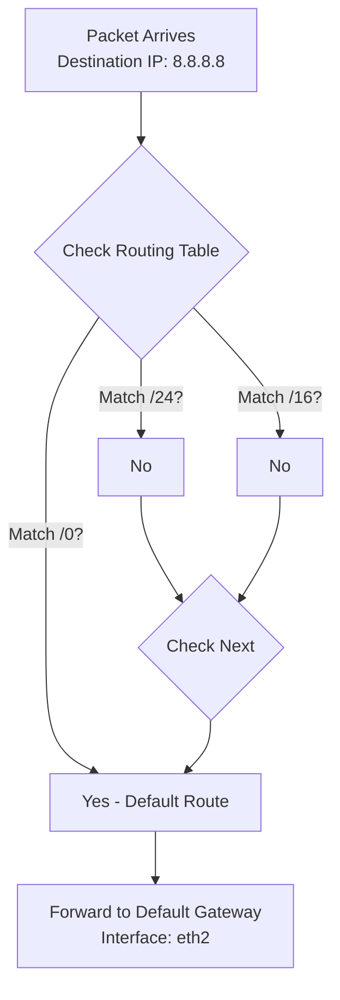
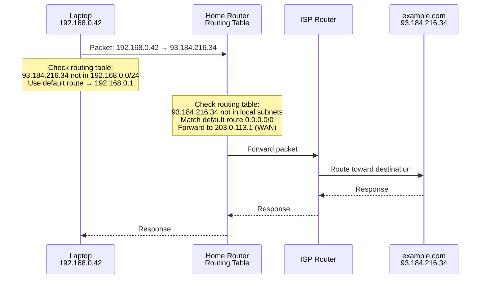
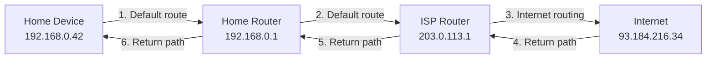
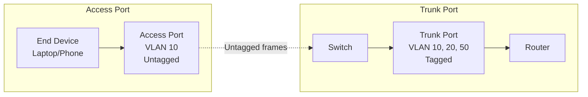
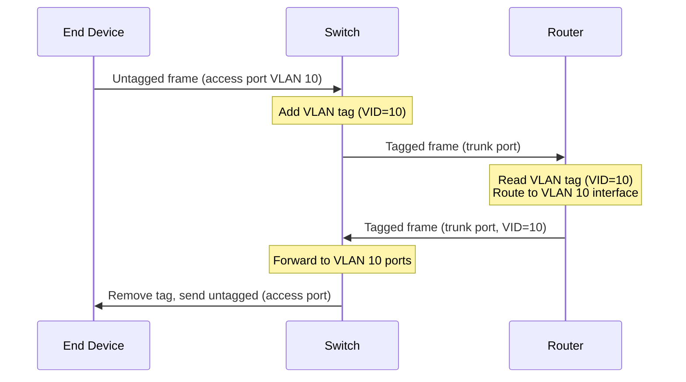
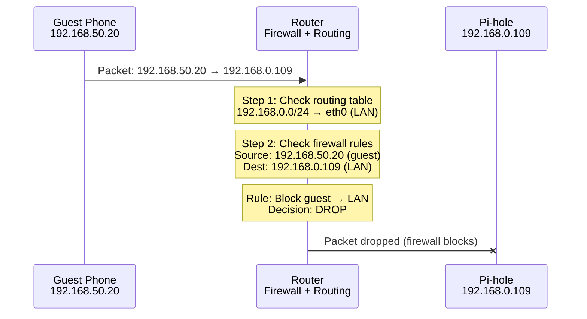

# Routing, VLANs, and Guest Networks (Beginner-Safe)

This page explains why “it works on Ethernet but not on guest Wi‑Fi” happens, and how routing rules affect whether devices can reach Pi-hole.

---

## 0. Prerequisites

- IP/subnet basics: [`ip-addressing.md`](ip-addressing.md)
- Router model: [`home-router-model.md`](home-router-model.md)
- Layer 2 basics (ARP): [`layer2-mac-arp.md`](layer2-mac-arp.md) (for understanding same-subnet delivery)
- Firewall basics: [`nat-firewalls.md`](nat-firewalls.md) (for understanding isolation rules)

---

## 1. How Routing Works

**Routing is how traffic moves between different subnets** (e.g., LAN ↔ guest network) based on IP prefixes.

### Why Routing Exists

**The problem:** Internet has millions of networks. How do packets get from source to destination?

**Why routing exists:**

- **Internet = millions of networks** - Each network is separate
- **Need way to get packets** from source network to destination network
- **Routers make forwarding decisions** - Decide where to send packets next

**Without routing:**

- Packets couldn't leave your local network
- No internet communication
- Each network would be isolated

**With routing:**

- Routers forward packets toward destination
- Packets can traverse multiple networks
- Internet communication works

**Real-world analogy:**

- **Routing** = Postal system
- **Router** = Post office
- **Routing table** = Address directory
- **Packet** = Letter
- **Router reads destination** → Looks up route → Forwards letter

**How postal system works:**

1. You mail letter with destination address
2. Post office reads address
3. Post office looks up route (which post office handles this address?)
4. Post office forwards letter to next post office
5. Process repeats until letter reaches destination

**How internet routing works:**

1. Device sends packet with destination IP
2. Router reads destination IP
3. Router looks up routing table (which interface/gateway for this IP?)
4. Router forwards packet to next router
5. Process repeats until packet reaches destination

### Routing Table Structure

Routers maintain a **routing table** that tells them where to forward packets:

**Routing table format:**

```
Destination Network    Gateway          Interface    Metric
192.168.0.0/24        -               eth0         -        (directly connected)
192.168.50.0/24       -               wlan1        -        (directly connected)
0.0.0.0/0             203.0.113.1      eth1         100      (default route)
```

**Fields explained:**

- **Destination Network:** IP prefix (subnet) this route applies to
- **Gateway:** Next hop router (or `-` if directly connected)
- **Interface:** Network interface to send packet out
- **Metric:** Route priority (lower = preferred)

### Longest Prefix Match Algorithm

When a packet arrives, the router:

1. **Checks destination IP** against all routes
2. **Finds the most specific match** (longest prefix)
3. **Forwards packet** to the gateway/interface of that route

**Example routing table:**

```
192.168.0.0/24     → eth0 (direct)
192.168.0.0/16     → eth1 (less specific)
0.0.0.0/0          → eth2 (default route)
```

**Packet to `192.168.0.42`:**

- Matches `/24` (most specific) → forwarded to `eth0`
- `/16` and `/0` also match, but `/24` wins (longest prefix)

**Packet to `8.8.8.8`:**

- Doesn't match `/24` or `/16`
- Matches `/0` (default route) → forwarded to `eth2`



### Default Route (0.0.0.0/0)

The **default route** (`0.0.0.0/0`) is the "catch-all" route:

- **Matches everything** that doesn't match more specific routes
- **Points to your internet gateway** (router's upstream connection)
- **Used for internet traffic** (anything not on your LAN)

**Example:**

- Packet to `192.168.0.42` → matches `/24` route (LAN)
- Packet to `8.8.8.8` → matches default route (internet)

### Step-by-Step: Router Forwarding Decision

**Scenario:** Laptop (`192.168.0.42`) wants to visit `example.com` (`93.184.216.34`)

**Step 1: Laptop checks its own routing table**

- Destination: `93.184.216.34`
- Doesn't match `192.168.0.0/24` (local subnet)
- Matches default route → send to gateway `192.168.0.1`

**Step 2: Router receives packet**

- Destination: `93.184.216.34`
- Checks routing table:
  - Doesn't match `192.168.0.0/24` (LAN)
  - Doesn't match `192.168.50.0/24` (guest network)
  - Matches `0.0.0.0/0` (default route)
- Forwards to gateway `203.0.113.1` via `eth1` (WAN interface)

**Step 3: ISP router receives packet**

- Continues routing toward destination
- Eventually reaches `example.com` server



---

## 1.1 Routing Between Subnets

### Same Subnet: Direct Delivery (ARP)

When destination is in the **same subnet**, routing is simple:

- Packet stays on local network
- Router uses **ARP** to find MAC address
- Packet delivered directly (no routing needed)

**Example:** Laptop (`192.168.0.42`) → Pi-hole (`192.168.0.109`)

- Both in `192.168.0.0/24`
- Direct delivery via switch/ARP
- Router not involved in forwarding

See ARP details: [`layer2-mac-arp.md`](layer2-mac-arp.md)

### Different Subnet: Send to Gateway

When destination is in a **different subnet**, routing is required:

- Packet sent to **default gateway** (router)
- Router checks routing table
- Router forwards to appropriate interface/gateway

**Example:** Guest phone (`192.168.50.20`) → Internet (`8.8.8.8`)

- Phone in `192.168.50.0/24`
- Internet not in any local subnet
- Send to gateway `192.168.50.1`
- Router forwards via default route to WAN

### Multi-Hop Routing Example

**Path:** Home → Router → ISP → Internet



**Each hop:**

1. Device checks routing table
2. Finds best match (longest prefix)
3. Forwards to next hop
4. Process repeats until destination reached

### Why Guest Network Can't Reach LAN

**Scenario:** Guest device (`192.168.50.20`) tries to reach Pi-hole (`192.168.0.109`)

**Step 1: Guest device checks routing**

- Destination: `192.168.0.109`
- Not in `192.168.50.0/24` (guest subnet)
- Send to gateway `192.168.50.1`

**Step 2: Router receives packet**

- Source: `192.168.50.20` (guest network)
- Destination: `192.168.0.109` (LAN)
- Router checks routing table:
  - `192.168.0.0/24` route exists (LAN)
  - Could forward to LAN interface

**Step 3: Firewall blocks**

- Router has **firewall rule** blocking guest → LAN
- Packet dropped (isolation policy)

**Result:** Guest device cannot reach LAN devices, even though routing table allows it

**Key insight:** Routing determines **where** packets go, but firewall determines **if** they're allowed.

See firewall details: [`nat-firewalls.md`](nat-firewalls.md)

---

## 2. How VLANs Work

### VLAN Concept: Logical Separation on Same Physical Network

A **VLAN (Virtual LAN)** creates **logical networks** on the same physical infrastructure:

- **Physical:** All devices connected to same switch/router
- **Logical:** Devices in different VLANs are isolated (can't communicate)

### Why VLANs Exist

**The problem:** How do you separate networks when devices are on the same physical switch?

**Without VLANs:**

- All devices on same switch = same network
- Can't isolate guest devices from main LAN
- All devices can communicate directly
- Security risk (guests can access LAN)

**With VLANs:**

- Same physical switch, different logical networks
- Guest devices isolated from main LAN
- Firewall rules control communication
- Security improved

**Why VLANs exist:**

**1. Security:**

- Isolate guest devices from main LAN
- Prevent guests from accessing your NAS, Pi-hole, etc.
- Separate untrusted devices from trusted devices

**2. Organization:**

- Separate departments, services, or device types
- Example: IT department VLAN, Sales department VLAN
- Easier network management

**3. Traffic management:**

- Control which devices can communicate
- Apply different firewall rules per VLAN
- Manage bandwidth per VLAN

**Real-world analogy:**

**Physical network = Apartment building:**

- All apartments in same building (same physical switch)
- Same physical infrastructure (cables, switches)

**VLANs = Different floors:**

- Floor 10 = Main LAN (VLAN 10)
- Floor 50 = Guest network (VLAN 50)
- Same building, different floors (same switch, different VLANs)
- Can't access other floors without permission (firewall rules)

**Hotel analogy:**

- **Physical:** All rooms in same hotel building
- **Logical:** Different floors (VLANs)
- Floor 10 = Regular guests (main LAN)
- Floor 50 = Conference attendees (guest network)
- Same building, isolated floors

### 802.1Q Tagging Explained

VLANs use **802.1Q tags** inserted into Ethernet frames to identify which VLAN a frame belongs to.

**Why tagging is needed:**

- Frames need to carry VLAN information
- Switch/router needs to know which VLAN frame belongs to
- Tagging allows multiple VLANs on same physical link

**Ethernet frame structure:**

**Normal frame (untagged):**

```
[Destination MAC] [Source MAC] [Type] [Data] [CRC]
```

**Tagged frame (with VLAN tag):**

```
[Destination MAC] [Source MAC] [802.1Q Tag] [Type] [Data] [CRC]
```

**802.1Q tag (4 bytes = 32 bits):**

**Tag structure:**

- **TPID (Tag Protocol Identifier):** `0x8100` (16 bits)

  - Identifies this as a tagged frame
  - Like a label saying "this frame has VLAN tag"

- **PCP (Priority Code Point):** 3 bits

  - Quality of service priority
  - Higher priority = faster forwarding

- **DEI (Drop Eligible Indicator):** 1 bit

  - Can this frame be dropped if network is congested?
  - 0 = Don't drop, 1 = Can drop

- **VID (VLAN ID):** 12 bits
  - VLAN number (1-4094)
  - This is what identifies the VLAN

**Example:** VLAN 10 tag

```
VID = 10 (binary: 000000001010)
Tag = 0x8100 + PCP + DEI + VID
```

**What the tag does:**

- Tells switch/router: "This frame belongs to VLAN 10"
- Switch forwards frame only to ports in VLAN 10
- Prevents frames from leaking between VLANs

### Tagged vs Untagged Frames

**Tagged frames:**

- Contain 802.1Q tag with VLAN ID
- Used on **trunk ports** (carry multiple VLANs)
- Router/switch reads tag to determine VLAN

**Untagged frames:**

- No VLAN tag (normal Ethernet frame)
- Used on **access ports** (single VLAN)
- Router/switch assigns VLAN based on port configuration

### Access Ports vs Trunk Ports

**Access Port (untagged, single VLAN):**

- Connects to **end devices** (laptops, phones, servers)
- Frames are **untagged**
- Port assigned to **one VLAN**
- Example: Guest Wi-Fi access point → VLAN 50

**Trunk Port (tagged, multiple VLANs):**

- Connects **switches/routers** together
- Frames are **tagged** with VLAN ID
- Carries **multiple VLANs**
- Example: Router ↔ Switch (carries VLAN 10, 20, 50)



### VLAN Tag Insertion/Removal

**When device sends frame (access port):**

1. Device sends untagged frame
2. Switch receives on access port (VLAN 10)
3. Switch **adds VLAN tag** (VID=10) internally
4. Frame forwarded with tag

**When frame leaves access port:**

1. Switch receives tagged frame (VID=10)
2. Switch checks destination port
3. If access port for VLAN 10: **remove tag**, send untagged
4. If trunk port: **keep tag**, forward tagged

**When frame crosses trunk:**

1. Tagged frame arrives on trunk port
2. Switch reads VLAN ID (VID=10)
3. Forwards to ports in VLAN 10
4. Tag preserved on trunk, removed on access ports



---

## 2.1 Guest Network Isolation

### How Guest Wi-Fi Creates Separate VLAN/Subnet

Guest Wi-Fi is typically implemented as:

1. **Separate VLAN** (e.g., VLAN 50)
2. **Separate subnet** (e.g., `192.168.50.0/24`)
3. **Firewall rules** blocking guest → LAN

**Router configuration example:**

```
Interface: wlan1 (Guest Wi-Fi)
VLAN ID: 50
Subnet: 192.168.50.0/24
Gateway: 192.168.50.1
```

### Firewall Rules That Block Guest → LAN

**Typical firewall rules:**

```
Rule 1: Allow guest → internet (outbound)
Rule 2: Block guest → LAN (isolation)
Rule 3: Allow guest → guest (same VLAN)
```

See firewall details: [`nat-firewalls.md`](nat-firewalls.md)

**Why guest → internet works:**

- Guest device sends packet to `8.8.8.8`
- Router checks routing: matches default route
- Router checks firewall: outbound allowed
- Packet forwarded to internet

**Why guest → Pi-hole fails:**

- Guest device sends packet to `192.168.0.109` (Pi-hole)
- Router checks routing: `192.168.0.0/24` route exists
- Router checks firewall: **guest → LAN blocked**
- Packet dropped

### Step-by-Step Packet Flow: Guest Device → Router → Check Firewall

**Scenario:** Guest phone (`192.168.50.20`) tries to access Pi-hole (`192.168.0.109`)



**Detailed flow:**

1. **Guest device sends packet**

   - Source: `192.168.50.20:54321`
   - Destination: `192.168.0.109:53` (DNS)

2. **Router receives packet**

   - Interface: `wlan1` (guest Wi-Fi, VLAN 50)
   - Checks routing table: destination `192.168.0.109` matches `192.168.0.0/24` route

3. **Router checks firewall**

   - Source IP: `192.168.50.20` (guest network)
   - Destination IP: `192.168.0.109` (LAN)
   - Firewall rule: **Block guest → LAN**
   - Decision: **DROP**

4. **Packet dropped**
   - Pi-hole never receives the packet
   - Guest device sees timeout/no response

**Why guest → internet works:**

- Same flow, but destination is `8.8.8.8` (internet)
- Firewall rule: **Allow guest → internet** (outbound)
- Packet forwarded via default route

See firewall details: [`nat-firewalls.md`](nat-firewalls.md)

---

## 3. Practical Examples

### Example 1: Laptop on LAN Accessing Pi-hole (Same Subnet, Direct)

**Scenario:** Laptop (`192.168.0.42`) queries Pi-hole (`192.168.0.109`)

**Step 1: Laptop checks routing**

- Destination: `192.168.0.109`
- Matches `192.168.0.0/24` (same subnet)
- **Direct delivery** (no gateway needed)

**Step 2: ARP resolution**

- Laptop uses ARP to find Pi-hole's MAC address
- Packet sent directly via switch

See ARP details: [`layer2-mac-arp.md`](layer2-mac-arp.md)

**Step 3: Pi-hole receives packet**

- Same subnet, no routing needed
- Firewall allows (same subnet, no isolation)

See firewall details: [`nat-firewalls.md`](nat-firewalls.md)

**Result:** DNS query succeeds

---

### Example 2: Guest Phone Accessing Internet (Different Subnet, Routed, Allowed)

**Scenario:** Guest phone (`192.168.50.20`) visits `example.com` (`93.184.216.34`)

**Step 1: Phone checks routing**

- Destination: `93.184.216.34`
- Not in `192.168.50.0/24` (guest subnet)
- Send to gateway `192.168.50.1`

**Step 2: Router receives packet**

- Source: `192.168.50.20` (guest)
- Destination: `93.184.216.34` (internet)
- Routing: Matches default route `0.0.0.0/0`
- Firewall: Guest → internet allowed

**Step 3: Router forwards**

- Packet forwarded to WAN interface
- Continues toward destination

**Result:** Internet access works

---

### Example 3: Guest Phone Accessing Pi-hole (Different Subnet, Firewall Blocks)

**Scenario:** Guest phone (`192.168.50.20`) tries to query Pi-hole (`192.168.0.109`)

**Step 1: Phone checks routing**

- Destination: `192.168.0.109`
- Not in `192.168.50.0/24` (guest subnet)
- Send to gateway `192.168.50.1`

**Step 2: Router receives packet**

- Source: `192.168.50.20` (guest)
- Destination: `192.168.0.109` (LAN)
- Routing: Matches `192.168.0.0/24` route (LAN exists)
- Firewall: **Guest → LAN blocked**

**Step 3: Packet dropped**

- Firewall rule prevents forwarding
- Pi-hole never receives packet

See firewall details: [`nat-firewalls.md`](nat-firewalls.md)

**Result:** DNS query fails (timeout)

---

### Example 4: Router Forwarding Decision (Routing Table Lookup)

**Router's routing table:**

```
192.168.0.0/24     → eth0 (LAN, directly connected)
192.168.50.0/24    → wlan1 (Guest, directly connected)
0.0.0.0/0          → eth1 (WAN, default route)
```

**Packet 1:** `192.168.0.42 → 192.168.0.109`

- Matches `192.168.0.0/24` → forward to `eth0` (LAN)

**Packet 2:** `192.168.50.20 → 8.8.8.8`

- Doesn't match `/24` routes
- Matches `0.0.0.0/0` → forward to `eth1` (WAN)

**Packet 3:** `192.168.50.20 → 192.168.0.109`

- Matches `192.168.0.0/24` → forward to `eth0` (LAN)
- **But firewall blocks** (guest → LAN isolation)

**Key insight:** Routing determines **where** to forward, firewall determines **if** forwarding is allowed.

See firewall details: [`nat-firewalls.md`](nat-firewalls.md)

---

## 4. How This Impacts Pi-hole

If Pi-hole lives on Main LAN but your client is on Guest LAN:

- the client may not be able to reach Pi-hole IP
- even if DHCP DNS points to Pi-hole, DNS queries will fail

**Why it fails:**

1. Guest device gets Pi-hole IP from DHCP (`192.168.0.109`)
2. Guest device tries to send DNS query to Pi-hole
3. Router receives packet (guest → LAN)
4. Firewall blocks (guest isolation rule)
5. Packet dropped, DNS query fails

**Symptoms:**

- `ping <pihole-ip>` fails from guest devices
- `nslookup` times out
- DNS queries never reach Pi-hole

---

## 5. Beginner Checks (Safe)

1. **Confirm your IP/subnet:**

- Linux: `ip -4 a`
- Windows: `ipconfig /all`

2. **Confirm reachability:**

- `ping -c 1 <pihole-ip>`

3. **If reachability fails, it's a routing/firewall policy issue:**

- Move Pi-hole to the same segment as clients, or
- Allow guest → Pi-hole rules on a router that supports it, or
- Don't use guest network for devices that must use Pi-hole.

---

## 6. Practice Drills

- Routing drills: [`../practice/routing-drills.md`](../practice/routing-drills.md)
- VLAN drills: [`../practice/vlan-drills.md`](../practice/vlan-drills.md)

---

## 7. Next

- Troubleshooting flow: [`troubleshooting.md`](troubleshooting.md)
- Pi-hole module: [`../../pi-hole/README.md`](../../pi-hole/README.md)
