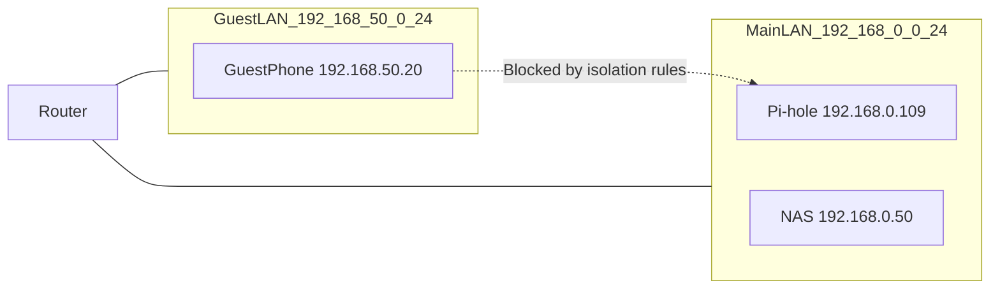

# Routing, VLANs, and Guest Networks (Beginner-Safe)

This page explains why “it works on Ethernet but not on guest Wi‑Fi” happens, and how routing rules affect whether devices can reach Pi-hole.

---

## 0. Prerequisite

- IP/subnet basics: [`ip-addressing.md`](ip-addressing.md)
- Router model: [`home-router-model.md`](home-router-model.md)

---

## 1. Routing in one sentence

**Routing is how traffic moves between different subnets** (e.g., LAN ↔ guest network) based on IP prefixes.

---

## 2. VLANs and guest networks (why they exist)

Guest Wi‑Fi is usually implemented as:

- a separate subnet/VLAN
- firewall rules that block access to the main LAN

This prevents guests from reaching your NAS/printer/Pi-hole.

---

## 3. How this impacts Pi-hole

If Pi-hole lives on Main LAN but your client is on Guest LAN:

- the client may not be able to reach Pi-hole IP
- even if DHCP DNS points to Pi-hole, DNS queries will fail

Symptoms:

- `ping <pihole-ip>` fails from guest devices
- `nslookup` times out

---

## 4. Beginner checks (safe)

1. Confirm your IP/subnet:

- Linux: `ip -4 a`
- Windows: `ipconfig /all`

2. Confirm reachability:

- `ping -c 1 <pihole-ip>`

3. If reachability fails, it’s a routing/firewall policy issue:

- Move Pi-hole to the same segment as clients, or
- Allow guest → Pi-hole rules on a router that supports it, or
- Don’t use guest network for devices that must use Pi-hole.

---

## 5. Next

- Troubleshooting flow: [`troubleshooting.md`](troubleshooting.md)
- Pi-hole module: [`../../pi-hole/README.md`](../../pi-hole/README.md)
