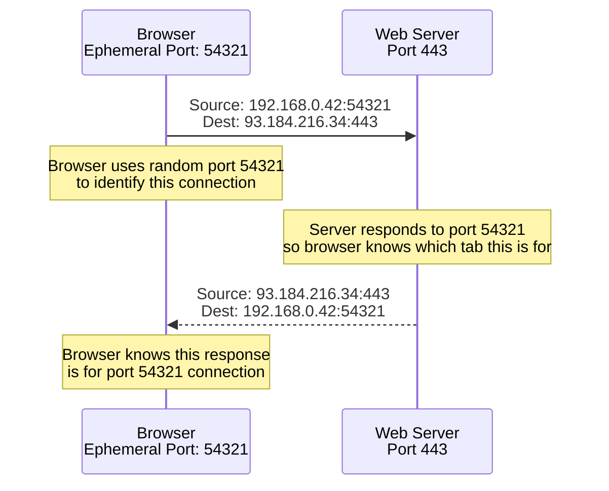
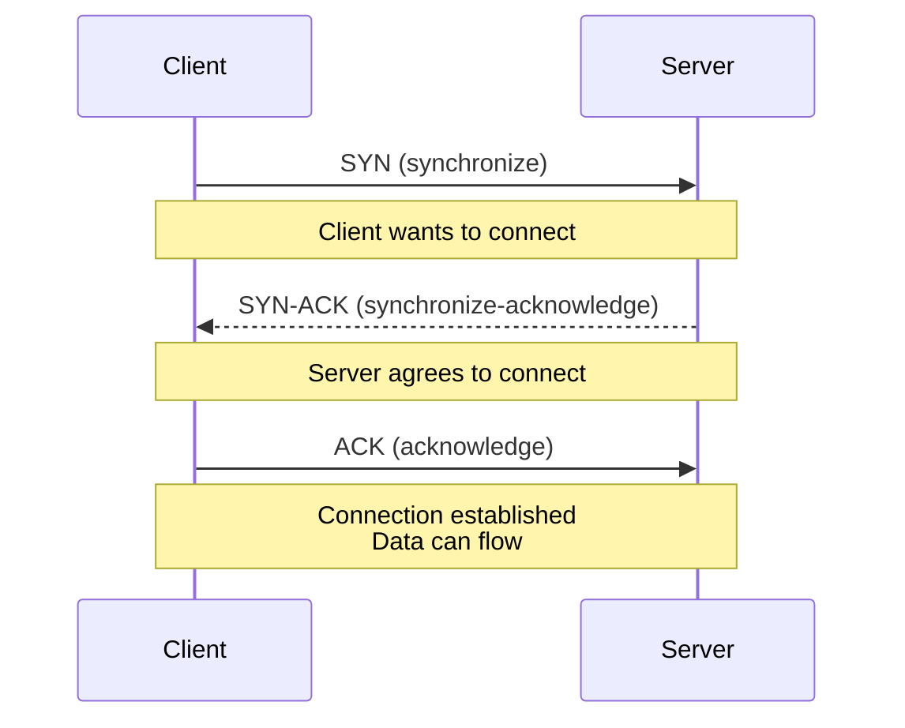

# TCP vs UDP vs Ports (Enough to Debug Real Networks)

This page makes sense of:

- **Ports** (what they are and why they matter)
- **TCP vs UDP** (the difference in behavior)
- Why Pi-hole “bypass” topics talk about **53**, **853**, and **443**

---

## 0. Prerequisites

- IP/subnet/gateway: [`ip-addressing.md`](ip-addressing.md)

---

## 1. Ports: "Which Door on the Same House"

An IP address tells you **which device**.
A port tells you **which service on that device**.

### Why Ports Exist

**The problem:** One device (one IP address) can run multiple services simultaneously.

**Example server:**
- IP address: `192.168.0.50` (one device)
- Web server: Port 80 (HTTP)
- SSH server: Port 22
- DNS server: Port 53
- Email server: Port 25

**Without ports:**
- How would you know which service to connect to?
- All services would conflict
- Can't run multiple services on same device

**With ports:**
- Each service uses different port
- Port identifies which service
- Multiple services can run simultaneously
- No conflicts

**Real-world analogy:**

- **IP address** = Building address (which building)
- **Port** = Apartment number / door (which apartment/service)

**Concrete example:**
- Building: `192.168.0.50` (server IP)
- Apartment 80: Web server (HTTP)
- Apartment 22: SSH server
- Apartment 53: DNS server
- Apartment 25: Email server

All in same building (same IP), different apartments (different ports).

### Port Structure

**Port range:** 0 to 65535 (16 bits = 2^16 possible ports)

**Port categories:**

**Well-known ports (0-1023):**
- Reserved for common services
- Examples: 80 (HTTP), 443 (HTTPS), 53 (DNS), 22 (SSH)
- Require root/admin privileges to use

**Registered ports (1024-49151):**
- Assigned to specific applications
- Examples: 3306 (MySQL), 5432 (PostgreSQL)
- Can be used by applications

**Ephemeral ports (49152-65535):**
- Used by clients for temporary connections
- Assigned dynamically by OS
- Examples: 54321, 54322 (browser connections)

**Example:**

- Pi-hole DNS typically listens on **UDP/TCP 53** on the Pi-hole IP.
- Pi-hole admin UI is typically **HTTP 80** or **HTTPS 443** (depending on setup).

**What this means:**
- Pi-hole IP: `192.168.0.109`
- Port 53: DNS service (queries go here)
- Port 80/443: Web interface (admin UI)
- Same device, different ports, different services

### Well-Known Ports (0-1023)

**Common services and their ports:**

| Port      | Protocol | Service | Purpose                    |
| --------- | -------- | ------- | -------------------------- |
| **53**    | UDP/TCP  | DNS     | Domain name resolution     |
| **80**    | TCP      | HTTP    | Web browsing (unencrypted) |
| **443**   | TCP      | HTTPS   | Web browsing (encrypted)   |
| **22**    | TCP      | SSH     | Secure shell access        |
| **25**    | TCP      | SMTP    | Email sending              |
| **110**   | TCP      | POP3    | Email receiving            |
| **143**   | TCP      | IMAP    | Email receiving            |
| **853**   | TCP      | DoT     | DNS over TLS               |
| **67/68** | UDP      | DHCP    | IP address assignment      |

### Ephemeral Ports (Why Clients Use Random High Ports)

**Ephemeral ports** are temporary ports used by **clients** (not servers) to identify their side of a connection.

**Definition:**
- **Ephemeral** = Temporary, short-lived
- Used by clients (your browser, apps)
- Not used by servers (servers use well-known ports)

**Range:** Typically `32768-65535` (varies by OS)
- Linux: Usually `32768-65535`
- Windows: Usually `49152-65535`
- macOS: Usually `49152-65535`

**Purpose:** Identify which application/connection on client side

**Why random:** Allows multiple connections from same client

**The problem ephemeral ports solve:**

**Scenario:** Your browser opens 3 tabs, all connecting to `example.com:443`

**Without ephemeral ports:**
- All tabs use same source port
- Server can't distinguish which response goes to which tab
- Responses would get mixed up

**With ephemeral ports:**
- Tab 1: Source port `54321`
- Tab 2: Source port `54322`
- Tab 3: Source port `54323`
- Server responds to correct port
- Browser knows which tab gets which response

**Example: Web browsing**



**Why ephemeral ports matter:**

**1. Multiple connections:**
- Multiple browser tabs can connect simultaneously (each gets unique port)
- Each connection has unique source port
- Server can distinguish between connections

**2. NAT translation:**
- NAT uses ephemeral ports to distinguish connections
- Multiple devices share one public IP
- NAT maps: Private IP:ephemeral_port → Public IP:mapped_port
- Ephemeral ports help NAT keep connections separate

**3. Firewall tracking:**
- Firewalls track connections using source IP:port combinations
- Each connection has unique source IP:port
- Firewall can track state per connection

**Concrete example:** Laptop opens 3 browser tabs

**Tab 1:** `example.com`
- Source: `192.168.0.42:54321`
- Destination: `93.184.216.34:443`
- Ephemeral port: `54321`

**Tab 2:** `example.com` (different tab)
- Source: `192.168.0.42:54322`
- Destination: `93.184.216.34:443`
- Ephemeral port: `54322`

**Tab 3:** `google.com`
- Source: `192.168.0.42:54323`
- Destination: `172.217.164.110:443`
- Ephemeral port: `54323`

**Key points:**
- All use same destination port (443 - HTTPS)
- Different source ports (ephemeral - unique per connection)
- Browser can distinguish responses by source port
- Server responds to correct ephemeral port

---

## 2. TCP vs UDP (Plain Language)

**TCP** and **UDP** are two different ways to send data over networks. They serve different purposes and have different characteristics.

### UDP (User Datagram Protocol)

**UDP is "Send and hope it arrives"**

**Characteristics:**

**No built-in connection:**
- No handshake before sending data
- Just send packet, no confirmation
- Like sending a postcard - you send it, hope it arrives

**Lower overhead:**
- Smaller packet headers
- Faster transmission
- Less processing required

**No guarantees:**
- **No guarantee** of delivery (packet might be lost)
- **No guarantee** of order (packets might arrive out of order)
- **No guarantee** of no duplicates (packet might arrive twice)

**Great for:**
- Small request/response patterns
- Real-time applications
- Applications that can tolerate packet loss

**Use cases:**

**1. DNS queries:**
- Fast, small packets
- Request → Response pattern
- Can retry if lost
- Example: "What is IP for example.com?" → "93.184.216.34"

**2. Video streaming:**
- Can tolerate packet loss (missing frame)
- Low latency important
- Real-time delivery
- Example: Live video stream

**3. Online gaming:**
- Low latency critical
- Can tolerate occasional packet loss
- Real-time updates
- Example: Game position updates

**Real-world analogy:**
- UDP = Shouting across a room
- Fast, but might not hear you
- No confirmation you were heard
- Good for non-critical, fast communication

### TCP (Transmission Control Protocol)

**TCP is "Reliable, ordered delivery"**

**Characteristics:**

**Connection-oriented:**
- **Handshake required** before sending data
- Establishes connection first
- Like making a phone call - connect first, then talk

**Reliable delivery:**
- **Guarantees** delivery (retransmits if lost)
- **Guarantees** order (packets arrive in order)
- **Guarantees** no duplicates (handles duplicates)

**Heavier but robust:**
- Larger packet headers
- More processing required
- Slower than UDP
- But reliable and ordered

**Use cases:**

**1. Web browsing (HTTP/HTTPS):**
- Need reliable delivery (can't lose web page data)
- Need correct order (web page loads correctly)
- Example: Loading a website

**2. Email (SMTP):**
- Need reliable delivery (can't lose email)
- Need correct order (email content correct)
- Example: Sending an email

**3. File transfers (FTP):**
- Need reliable delivery (can't lose file data)
- Need correct order (file integrity)
- Example: Downloading a file

**4. SSH (secure shell):**
- Need reliable delivery (can't lose commands)
- Need correct order (commands execute correctly)
- Example: Remote server access

**Real-world analogy:**
- TCP = Registered mail with delivery confirmation
- Slower, but guaranteed delivery
- Confirmation you received it
- Good for critical, reliable communication

### Key Differences Summary

| Feature | UDP | TCP |
|--------|-----|-----|
| **Connection** | No handshake | Handshake required |
| **Delivery** | No guarantee | Guaranteed |
| **Order** | No guarantee | Guaranteed |
| **Speed** | Fast | Slower |
| **Overhead** | Low | High |
| **Use case** | Real-time, can lose data | Critical, need reliability |

**When to use UDP:**
- Speed is more important than reliability
- Can tolerate packet loss
- Real-time applications
- Small, simple queries

**When to use TCP:**
- Reliability is critical
- Can't lose data
- Need correct order
- File transfers, web browsing, email

### TCP Connection Establishment Flow

**Three-way handshake:**



**Why handshake matters:**

- Establishes connection before data transfer
- Both sides agree on sequence numbers
- Firewalls track this handshake (stateful firewall)

**Connection teardown:**

- FIN (finish) packets to close connection
- Both sides must acknowledge closure

---

## 3. Why DNS uses UDP _and_ TCP 53

Most DNS queries use **UDP 53** because it’s fast and lightweight.
DNS can also use **TCP 53** for:

- larger responses
- zone transfers (not typical for home users)
- when UDP responses are truncated

---

## 4. DoT and DoH: why these bypass Pi-hole

### DoT (DNS over TLS)

- DNS encrypted over **TCP 853**
- If a client uses DoT directly to the internet, Pi-hole won’t see the query.

### DoH (DNS over HTTPS)

- DNS encrypted over **TCP 443** (looks like web traffic)
- Harder to block without breaking normal web browsing

Mapping:

- DNS: UDP/TCP **53**
- DoT: TCP **853**
- DoH: TCP **443**

This is why Pi-hole “hardcoded DNS bypass” mitigation often talks about blocking or controlling traffic on those ports.

See: [`nat-firewalls.md`](nat-firewalls.md) and Pi-hole bypass doc: [`../../pi-hole/docs/hardcoded-dns.md`](../../pi-hole/docs/hardcoded-dns.md)

---

## 5. Interpreting Common Failures

### Timeout

**Meaning:** Packet didn't get through

**Possible causes:**

- **Routing issue:** Destination unreachable (wrong gateway, no route)
- **Firewall blocking:** Packet dropped by firewall rule
- **Wrong IP:** Destination doesn't exist or unreachable
- **Wrong port:** Service not listening on that port
- **VLAN isolation:** Device in different VLAN, firewall blocks

**How to diagnose:**

```bash
# Test reachability
ping <destination-ip>

# Test specific port
nc -zv <destination-ip> <port>
```

### Connection Refused (TCP)

**Meaning:** You reached the host, but nothing is listening on that port

**Possible causes:**

- **Service down:** Application not running
- **Wrong port:** Service listening on different port
- **Firewall:** Service running but firewall blocks

**How to diagnose:**

```bash
# Check if service is running
systemctl status <service-name>

# Check what's listening on port
ss -tlnp | grep <port>
# or
netstat -tlnp | grep <port>
```

### Connection Reset

**Meaning:** Connection was established but then closed

**Possible causes:**

- **Service crashed:** Application terminated during connection
- **Firewall:** Firewall actively reset connection
- **Network issue:** Connection lost mid-session

### No Route to Host

**Meaning:** Cannot reach destination network

**Possible causes:**

- **Routing table:** No route to destination subnet
- **Gateway unreachable:** Default gateway down or wrong
- **Network down:** Physical connection issue

**How to diagnose:**

```bash
# Check routing table
ip route
# or
route -n

# Check gateway reachability
ping <gateway-ip>
```

---

## 6. Practical checks (drills)

Learn commands:

- Linux sockets: `ss` (see `../../shell-commands/02-commands/ss.md`)
- Legacy: `netstat` (existing command guide: `../../shell-commands/02-commands/netstat.md`)

Practice:

- [`../practice/ports-drills.md`](../practice/ports-drills.md)

---

## Next

- NAT and firewalls (how ports are used in firewall rules): [`nat-firewalls.md`](nat-firewalls.md)
- DNS (why DNS uses port 53): [`dns.md`](dns.md)
- Troubleshooting (diagnosing port-related issues): [`troubleshooting.md`](troubleshooting.md)
