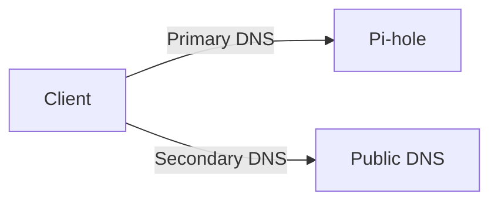

# Pi-hole Module

**Last Updated:** December 2025
**Difficulty:** Beginner → Intermediate
**Time Required:** 45-70 minutes (router UI steps vary by brand)

Centralize DNS and ad-blocking for your home network with Pi-hole on a Raspberry Pi. This module mirrors the structure of other ArchStarterPack guides: a concise quick start, a single source of truth for required router settings, and links to advanced topics (Unbound, IPv6, hardcoded DNS blocking).

---

## Key Terms (quick glossary)

- **IP address:** Numeric address of a device (e.g., `192.168.0.109` or `fd00::109`).
- **Gateway:** Your router’s LAN IP; the “exit” for your subnet (e.g., `192.168.0.1`).
- **DHCP server:** Hands out IP + gateway + DNS to clients (usually the router).
- **DHCP reservation:** Router mapping of a device MAC → fixed IP; survives reboots.
- **DNS resolver (Pi-hole):** Answers domain lookups for your LAN; applies blocklists.
- **Upstream DNS / recursion:** Where Pi-hole sends queries it can’t answer (Cloudflare/Google or local Unbound).
- **DoH/DoT:** Encrypted DNS that can bypass Pi-hole if enabled on router/clients.
- **RDNSS/DHCPv6:** IPv6 methods to advertise DNS; must point to Pi-hole to avoid bypass.

See the fuller networking primer with examples in [`docs/learning.md`](docs/learning.md).
For deeper learning, also see [`docs/dns.md`](docs/dns.md) and [`docs/dhcp.md`](docs/dhcp.md).

---

## What This Covers

- Reliable Pi-hole install on Raspberry Pi OS Lite (64-bit)
- Correct DHCP/DNS wiring on common routers (TP-Link, ASUS, Netgear, OpenWRT)
- Safe defaults: single DNS path, no secondary DNS, DoH/DoT off on the router
- Verification and quick troubleshooting
- Advanced add-ons:
  - Local recursive DNS via Unbound (`docs/unbound.md`)
  - IPv6-safe deployment (`docs/ipv6.md`)
  - Blocking hardcoded DNS/DoH clients (`docs/hardcoded-dns.md`)

---

## Network Model (goal state)

```mermaid
flowchart LR
    Clients[Clients<br/>Phones/Laptops/TVs]
    Router[Router<br/>DHCP Server]
    PiHole[Pi-hole<br/>DNS + Blocklists]
    Upstream[Upstream DNS]
    Internet[Internet]

    Clients -->|DHCP (IP + DNS)| Router
    Router -->|DNS queries only| PiHole
    PiHole --> Upstream --> Internet

    %% Critical rule: only Pi-hole handles DNS for clients
```

**Rules that keep Pi-hole authoritative**

- Router gives IPs **and** the Pi-hole IP as the only DNS server.
- No secondary DNS in DHCP.
- Router DoH/DoT must be **off** (Pi-hole needs plaintext DNS from clients).
- Redundancy lives inside Pi-hole (multiple upstreams), not in DHCP.

---

## Prerequisites

- Raspberry Pi 3B+ or newer, Ethernet recommended (Wi-Fi works).
- Raspberry Pi OS Lite (64-bit) image and SD card.
- Router access with DHCP settings (LAN side).
- A fixed/reserved IP for the Pi (recommended).

---

## Quick Start (happy path)

1. Flash Raspberry Pi OS Lite (64-bit) with Raspberry Pi Imager.
2. If Imager settings (SSH/Wi-Fi/user) **did not apply**, boot with monitor+keyboard and:
   ```bash
   sudo apt update
   sudo apt install -y openssh-server
   sudo systemctl enable --now ssh
   sudo hostnamectl set-hostname pihole
   ```
3. SSH in: `ssh pi@<pi-ip>` (accept host key).
4. Install Pi-hole (official installer).
5. Log in to admin UI: `http://<pi-ip>/admin` and confirm queries increment when using `nslookup` locally.
6. Configure router DHCP **DNS** to point to Pi-hole only:
   - DHCP Server: Enabled
   - Default Gateway: Router IP (e.g., `192.168.0.1`)
   - Primary DNS: Pi-hole IP (e.g., `192.168.0.109`)
   - Secondary DNS: Empty / `0.0.0.0`
7. Disable router DoH/DoT (“DNS Privacy”, “Secure DNS”, “Encrypted DNS”) — set to **Off**.
8. Reserve the Pi-hole IP via DHCP reservation (MAC → static IP).
9. Renew leases: reboot router once, or toggle Wi-Fi off/on on clients.
10. Verify from a client:
    ```bash
    nslookup doubleclick.net
    ```
    Expect `0.0.0.0` or your Pi-hole IP (not a public IP).

---

## Router Paths (common UIs)

- **TP-Link:** `Advanced → Network → DHCP Server`
- **ASUS:** `LAN → DHCP Server`
- **Netgear:** `Advanced → Setup → LAN Setup`
- **OpenWRT:** `Network → Interfaces → LAN → DHCP`

---

## DHCP DNS Settings (must-do)

| Setting           | Value                                  |
| ----------------- | -------------------------------------- |
| DHCP Server       | Enabled                                |
| Default Gateway   | Router IP (e.g., `192.168.0.1`)        |
| **Primary DNS**   | **Pi-hole IP (e.g., `192.168.0.109`)** |
| **Secondary DNS** | **Empty or `0.0.0.0`**                 |

**Why no secondary DNS?**



Clients do not ask permission; many will bypass Pi-hole if a secondary DNS exists. Put redundancy inside Pi-hole (multiple upstreams) instead of DHCP.

---

## Troubleshooting (fast triage)

1. Ads not blocked:
   - DHCP Primary DNS = Pi-hole; Secondary DNS = empty.
   - Router DoH/DoT off.
   - Client renewed lease (toggle Wi-Fi or reboot).
2. SSH host key warning after reflashing:
   ```bash
   ssh-keygen -R <pi-ip>
   ```
   Reconnect and accept the new key.
3. Pi-hole down = no internet: expected when DNS is centralized. Fix Pi-hole; do **not** add fallback DNS in DHCP.

---

## Advanced Topics (separate docs)

- Local recursive DNS with Unbound: see [`docs/unbound.md`](docs/unbound.md)
- IPv6-safe setup: see [`docs/ipv6.md`](docs/ipv6.md)
- Blocking hardcoded DNS / DoH clients: see [`docs/hardcoded-dns.md`](docs/hardcoded-dns.md)
- Networking primer and real-world patterns: see [`docs/learning.md`](docs/learning.md)
- DNS deep dive (recursion, caching, DoH/DoT): see [`docs/dns.md`](docs/dns.md)
- DHCP deep dive (leases, reservations, renewals): see [`docs/dhcp.md`](docs/dhcp.md)

---

## Final Checklist (definition of done)

- Pi-hole admin UI reachable.
- SSH enabled and reachable.
- DHCP Primary DNS = Pi-hole, Secondary DNS empty.
- Router DoH/DoT off.
- Clients visible in Pi-hole dashboard; queries increment.
- `nslookup doubleclick.net` returns blocked/0.0.0.0.

When all are true, Pi-hole is authoritative for your LAN.
