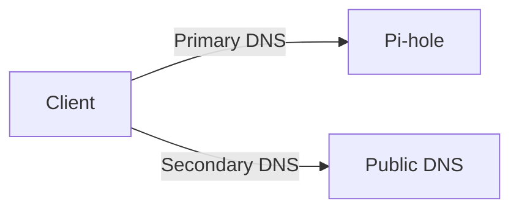

# Pi-hole Module

**Last Updated:** December 2025
**Difficulty:** Beginner → Intermediate
**Time Required:** 45-70 minutes (router UI steps vary by brand)

Centralize DNS and ad-blocking for your home network with Pi-hole on a Raspberry Pi. This module mirrors the structure of other ArchStarterPack guides: a concise quick start, a single source of truth for required router settings, and links to advanced topics (Unbound, IPv6, hardcoded DNS blocking).

## What Is Pi-hole?

### Definition

**Pi-hole** is a network-wide ad blocker and DNS sinkhole that blocks advertisements, tracking domains, and malicious websites at the DNS level for all devices on your network.

### Why Pi-hole Exists

**The problem:** Traditional ad blocking has limitations:

- **Per-device blocking:** Must install ad blockers on each device
- **App-level blocking:** Some apps ignore browser ad blockers
- **Tracking:** Advertisers track you across devices
- **Malware:** Malicious domains can infect devices
- **Privacy:** Your DNS queries reveal browsing habits

**The solution:** Pi-hole:

- **Network-wide blocking:** Blocks ads for all devices automatically
- **DNS-level blocking:** Works at network level, not app level
- **Centralized control:** Manage blocking from one place
- **Privacy protection:** Prevents DNS queries from leaving your network
- **Performance:** Faster browsing (blocked domains don't load)

**Real-world analogy:**

- **Pi-hole = Network security guard** (checks all traffic before it leaves)
- **Traditional ad blocker = Personal bodyguard** (only protects one device)
- **DNS queries = Mail requests** (Pi-hole intercepts and filters)
- **Blocked domains = Junk mail** (Pi-hole throws them away)
- **Result = Clean, fast, private network** (all devices protected)

### How Pi-hole Works

**Step-by-step process:**

1. **Device requests website:** Your phone/laptop wants to visit `example.com`
2. **DNS query sent:** Device asks "What is the IP address of example.com?"
3. **Query goes to Pi-hole:** Router forwards DNS query to Pi-hole (not public DNS)
4. **Pi-hole checks blocklist:** Pi-hole checks if domain is blocked
5. **Decision made:**
   - **Blocked domain:** Pi-hole returns `0.0.0.0` (nothing loads)
   - **Allowed domain:** Pi-hole forwards query to upstream DNS, returns real IP
6. **Device receives response:** Device gets IP address (or blocked response)
7. **Website loads (or doesn't):** Device connects to website or gets nothing

**Key insight:** Pi-hole sits between your devices and the internet's DNS servers, intercepting and filtering all DNS queries.

**Visual flow:**

```
Device → Router → Pi-hole → Upstream DNS → Internet
         (DHCP)   (Filter)   (If allowed)
```

**Why this works:**

- **DNS is required:** Every website visit needs DNS lookup
- **Centralized control:** All DNS queries go through Pi-hole
- **Transparent:** Devices don't know Pi-hole exists (works automatically)
- **Effective:** Blocks ads, tracking, malware at source

---

## Key Terms (Detailed Glossary)

### Understanding Network Concepts for Pi-hole

**Why these terms matter:** Pi-hole integrates deeply with your network. Understanding these concepts helps you configure Pi-hole correctly and troubleshoot issues.

**1. IP Address**

**Definition:** **IP address** is a numeric identifier assigned to each device on your network, like a mailing address for network communication.

**Example:** `192.168.0.109` (Pi-hole's IP address)

**Why it matters for Pi-hole:**

- **Pi-hole needs IP:** Router must know Pi-hole's IP to forward DNS queries
- **DHCP assignment:** Pi-hole gets IP from router (or static assignment)
- **Client communication:** Devices use Pi-hole's IP to send DNS queries
- **Troubleshooting:** Need IP to test connectivity (`ping 192.168.0.109`)

**How it works:**

- **Router assigns:** Router's DHCP server assigns IP to Pi-hole
- **Static recommended:** Static IP ensures Pi-hole always has same address
- **Subnet membership:** Pi-hole must be on same subnet as clients

**Learn more:** See [`../networking/docs/ip-addressing.md`](../networking/docs/ip-addressing.md) for detailed IP addressing explanation.

**2. Subnet / Subnet Mask (/24)**

**Definition:** **Subnet** is a logical division of your network. Devices on the same subnet can communicate directly without routing.

**Example:** `192.168.0.0/24` means all devices from `192.168.0.1` to `192.168.0.254` are on the same subnet.

**Why it matters for Pi-hole:**

- **Same subnet required:** Pi-hole and clients must be on same subnet
- **Direct communication:** Same subnet = direct communication (no routing)
- **Gateway not needed:** Devices on same subnet don't need gateway for local communication
- **Troubleshooting:** Wrong subnet = Pi-hole unreachable

**How it works:**

- **Subnet mask:** `/24` means first 24 bits identify network, last 8 bits identify device
- **Network portion:** `192.168.0` identifies your network
- **Host portion:** Last octet (`.109`) identifies specific device
- **Same subnet check:** If network portions match, devices are on same subnet

**Real-world example:**

- **Pi-hole:** `192.168.0.109` (network: `192.168.0`, host: `109`)
- **Laptop:** `192.168.0.42` (network: `192.168.0`, host: `42`)
- **Same subnet:** ✅ Can communicate directly

**Learn more:** See [`../networking/docs/ip-addressing.md`](../networking/docs/ip-addressing.md) for detailed subnet explanation.

**3. Gateway (Default Gateway)**

**Definition:** **Gateway** is your router's IP address on your local network. It's the "exit door" for traffic going to the internet.

**Example:** `192.168.0.1` (router's LAN IP address)

**Why it matters for Pi-hole:**

- **Router is gateway:** Router connects your LAN to internet
- **DNS forwarding:** Router forwards DNS queries to Pi-hole
- **Pi-hole not gateway:** Pi-hole is DNS server, not gateway
- **Client configuration:** Clients use router as gateway, Pi-hole as DNS

**How it works:**

- **Router has two IPs:** LAN IP (gateway) and WAN IP (internet-facing)
- **Clients use gateway:** All internet traffic goes through gateway
- **DNS exception:** DNS queries go to Pi-hole, not through gateway
- **DHCP provides:** Router's DHCP tells clients what gateway to use

**Real-world example:**

- **Client wants internet:** Sends packet to `8.8.8.8` (Google DNS)
- **Router checks:** "Is `8.8.8.8` on my subnet?" → No
- **Router forwards:** Sends packet to internet via gateway
- **DNS query:** Client sends DNS query to Pi-hole (same subnet, direct)

**Learn more:** See [`../networking/docs/ip-addressing.md`](../networking/docs/ip-addressing.md) for detailed gateway explanation.

**4. DHCP Server**

**Definition:** **DHCP (Dynamic Host Configuration Protocol) server** automatically assigns network configuration (IP, gateway, DNS) to devices when they connect.

**Why it matters for Pi-hole:**

- **Router is DHCP server:** Router assigns IPs and tells clients what DNS to use
- **DNS assignment:** Router must tell clients to use Pi-hole as DNS
- **Centralized control:** Change DNS in one place (router), all devices get update
- **Automatic configuration:** Devices get Pi-hole DNS automatically

**How it works:**

1. **Device connects:** Phone/laptop connects to Wi-Fi
2. **DHCP request:** Device asks router "Give me network settings"
3. **Router responds:** Router assigns IP, gateway, and DNS (Pi-hole IP)
4. **Device configured:** Device now knows to use Pi-hole for DNS
5. **DNS queries:** All DNS queries go to Pi-hole

**Real-world example:**

- **Before Pi-hole:** Router DHCP says "Use `8.8.8.8` for DNS"
- **After Pi-hole:** Router DHCP says "Use `192.168.0.109` (Pi-hole) for DNS"
- **Result:** All devices automatically use Pi-hole ✅

**Learn more:** See [`../networking/docs/dhcp.md`](../networking/docs/dhcp.md) for detailed DHCP explanation.

**5. DHCP Reservation**

**Definition:** **DHCP reservation** is a router setting that assigns a fixed IP address to a specific device (identified by MAC address), ensuring the device always gets the same IP.

**Why it matters for Pi-hole:**

- **Stable IP:** Pi-hole needs consistent IP address
- **Router configuration:** Router must know Pi-hole's IP to forward DNS
- **Survives reboots:** Reservation ensures Pi-hole gets same IP after restart
- **Prevents conflicts:** Router won't assign Pi-hole's IP to another device

**How it works:**

1. **Get MAC address:** Find Pi-hole's MAC address (`ip link` or router UI)
2. **Create reservation:** In router, map MAC address → IP address
3. **Router remembers:** Router always assigns this IP to this MAC
4. **Consistent IP:** Pi-hole always gets same IP (e.g., `192.168.0.109`)

**Real-world example:**

- **Without reservation:** Pi-hole might get `192.168.0.109` today, `192.168.0.150` tomorrow
- **Router confused:** Router doesn't know which IP is Pi-hole
- **DNS breaks:** Clients can't find Pi-hole ❌
- **With reservation:** Pi-hole always gets `192.168.0.109`
- **Router knows:** Router always knows Pi-hole's IP
- **DNS works:** Clients always find Pi-hole ✅

**Learn more:** See [`../networking/docs/dhcp.md`](../networking/docs/dhcp.md) for detailed DHCP lease and reservation explanation.

**6. DNS Resolver (Pi-hole)**

**Definition:** **DNS resolver** is a server that answers DNS queries (domain name → IP address lookups). Pi-hole acts as a DNS resolver for your network.

**Why it matters:**

- **Pi-hole is DNS resolver:** Pi-hole answers DNS queries from your devices
- **Blocklist application:** Pi-hole checks blocklists before answering
- **Upstream forwarding:** Pi-hole forwards allowed queries to upstream DNS
- **Network-wide:** All devices use Pi-hole as DNS resolver

**How it works:**

1. **Client queries:** Device asks "What is IP of `example.com`?"
2. **Pi-hole receives:** Pi-hole gets DNS query
3. **Check blocklist:** Pi-hole checks if `example.com` is blocked
4. **Decision:**
   - **Blocked:** Return `0.0.0.0` (nothing loads)
   - **Allowed:** Forward to upstream DNS, return real IP
5. **Client receives:** Device gets IP address (or blocked response)

**Real-world example:**

- **Ad domain:** `doubleclick.net` (Google ad server)
- **Client queries:** "What is IP of `doubleclick.net`?"
- **Pi-hole checks:** `doubleclick.net` is in blocklist
- **Pi-hole responds:** `0.0.0.0` (blocked)
- **Result:** Ad doesn't load ✅

**Learn more:** See [`../networking/docs/dns.md`](../networking/docs/dns.md) for detailed DNS explanation.

**7. Upstream DNS / Recursion**

**Definition:** **Upstream DNS** is the DNS server that Pi-hole forwards queries to when it can't answer them itself (usually a public DNS like Google's `8.8.8.8` or Cloudflare's `1.1.1.1`).

**Why it matters:**

- **Pi-hole doesn't know everything:** Pi-hole can't answer all DNS queries
- **Upstream does recursion:** Upstream DNS performs full DNS resolution
- **Pi-hole forwards:** Pi-hole forwards queries to upstream, gets answer, returns to client
- **Privacy:** Upstream DNS sees your queries (unless using Unbound)

**How it works:**

1. **Client queries:** "What is IP of `example.com`?"
2. **Pi-hole checks:** Not in blocklist, not in cache
3. **Pi-hole forwards:** Sends query to upstream DNS (e.g., `8.8.8.8`)
4. **Upstream resolves:** Upstream DNS performs full DNS resolution
5. **Upstream responds:** Returns IP address to Pi-hole
6. **Pi-hole caches:** Stores answer for future queries
7. **Pi-hole responds:** Returns IP to client

**Real-world example:**

- **New website:** Client visits `newsite.com` (not blocked, not cached)
- **Pi-hole forwards:** Sends query to `8.8.8.8`
- **Upstream resolves:** `8.8.8.8` queries root servers, TLD servers, gets IP
- **Pi-hole gets answer:** Receives IP address
- **Pi-hole responds:** Returns IP to client
- **Future queries:** Pi-hole uses cached answer (faster)

**Learn more:** See [`../networking/docs/dns.md`](../networking/docs/dns.md) for detailed DNS recursion explanation, and [Unbound](docs/unbound.md) for local recursive DNS.

**8. DoH/DoT (DNS over HTTPS / DNS over TLS)**

**Definition:** **DoH (DNS over HTTPS)** and **DoT (DNS over TLS)** are encrypted DNS protocols that send DNS queries over HTTPS (port 443) or TLS (port 853) instead of plain UDP (port 53).

**Why it matters for Pi-hole:**

- **Bypass risk:** DoH/DoT can bypass Pi-hole if enabled on router/clients
- **Encrypted queries:** Pi-hole can't see encrypted DNS queries
- **Router DoH/DoT:** If router has DoH/DoT enabled, it bypasses Pi-hole
- **Client DoH/DoT:** Some browsers/apps use DoH/DoT, bypassing Pi-hole

**How it works:**

- **Traditional DNS:** Queries sent as plain UDP packets (port 53)
- **Pi-hole sees:** Pi-hole can intercept and filter plain DNS
- **DoH/DoT:** Queries sent as encrypted HTTPS/TLS (ports 443/853)
- **Pi-hole can't see:** Encrypted queries look like regular web traffic
- **Bypass:** Queries go directly to public DNS, bypassing Pi-hole

**Real-world example:**

- **Router DoH enabled:** Router uses Cloudflare DoH (`1.1.1.1`)
- **Client queries:** Device sends DNS query
- **Router encrypts:** Router wraps query in HTTPS
- **Router bypasses:** Router sends encrypted query directly to Cloudflare
- **Pi-hole never sees:** Pi-hole doesn't see query, can't block ❌

**Solution:** Disable DoH/DoT on router and clients, use plain DNS through Pi-hole.

**Learn more:** See [`../networking/docs/dns.md`](../networking/docs/dns.md) for detailed DoH/DoT explanation, and [Hardcoded DNS/DoH](docs/hardcoded-dns.md) for blocking methods.

**9. RDNSS/DHCPv6 (IPv6 DNS Advertisement)**

**Definition:** **RDNSS (Router Advertisement DNS Server)** and **DHCPv6** are IPv6 methods that routers use to tell devices what DNS servers to use.

**Why it matters for Pi-hole:**

- **IPv6 bypass:** If router advertises public IPv6 DNS, clients bypass Pi-hole
- **IPv6 DNS:** Must advertise Pi-hole's IPv6 address as DNS
- **Dual-stack:** Many networks use both IPv4 and IPv6
- **Complete coverage:** Need Pi-hole for both IPv4 and IPv6

**How it works:**

- **IPv4 DNS:** Router DHCP tells clients IPv4 DNS (Pi-hole IPv4)
- **IPv6 DNS:** Router RDNSS/DHCPv6 tells clients IPv6 DNS (should be Pi-hole IPv6)
- **If wrong:** Router advertises public IPv6 DNS → clients use it → bypass Pi-hole
- **If correct:** Router advertises Pi-hole IPv6 → clients use it → Pi-hole blocks ✅

**Real-world example:**

- **Router advertises:** Google IPv6 DNS (`2001:4860:4860::8888`)
- **Client uses:** Client uses Google IPv6 DNS for IPv6 queries
- **Pi-hole bypassed:** IPv6 DNS queries go directly to Google, bypassing Pi-hole ❌
- **Solution:** Router advertises Pi-hole IPv6 (`fd00::109`)
- **Client uses:** Client uses Pi-hole IPv6 DNS
- **Pi-hole works:** IPv6 queries go through Pi-hole ✅

**Learn more:** See [IPv6-safe setup](docs/ipv6.md) for detailed IPv6 configuration.

Beginner path: [`../networking/README.md`](../networking/README.md) → setup below.

## Tools you’ll use (linked)

- DNS checks: [`../shell-commands/02-commands/nslookup.md`](../shell-commands/02-commands/nslookup.md), [`../shell-commands/02-commands/dig.md`](../shell-commands/02-commands/dig.md)
- Show your network config: Linux [`../shell-commands/02-commands/ip.md`](../shell-commands/02-commands/ip.md), Windows [`../shell-commands/02-commands/ipconfig.md`](../shell-commands/02-commands/ipconfig.md)

---

## What This Covers

- Reliable Pi-hole install on Raspberry Pi OS Lite (64-bit)
- Correct DHCP/DNS wiring on common routers (TP-Link, ASUS, Netgear, OpenWRT)
- Safe defaults: single DNS path, no secondary DNS, DoH/DoT off on the router
- Verification and quick troubleshooting
- Advanced add-ons:
  - Local recursive DNS via Unbound (`docs/unbound.md`)
  - IPv6-safe deployment (`docs/ipv6.md`)
  - Blocking hardcoded DNS/DoH clients (`docs/hardcoded-dns.md`)

---

## Network Model (Goal State)

### What This Model Shows

**Definition:** This diagram shows how Pi-hole integrates into your network architecture to provide network-wide ad blocking.

**Why understand the model:**

- **Architecture:** Understand how components interact
- **Troubleshooting:** Identify where problems occur
- **Configuration:** Know what to configure and why
- **Verification:** Understand what "working" looks like

### Detailed Network Flow

```mermaid
flowchart LR
    Clients[Clients<br/>Phones/Laptops/TVs]
    Router[Router<br/>DHCP Server]
    PiHole[Pi-hole<br/>DNS + Blocklists]
    Upstream[Upstream DNS]
    Internet[Internet]

    Clients -->|DHCP (IP + DNS)| Router
    Router -->|DNS queries only| PiHole
    PiHole --> Upstream --> Internet

    %% Critical rule: only Pi-hole handles DNS for clients
```

### Step-by-Step Flow Explanation

**1. Clients connect to network:**

**What happens:**

- **Device connects:** Phone/laptop connects to Wi-Fi
- **DHCP request:** Device asks router "Give me network settings"
- **Router responds:** Router assigns IP, gateway, and DNS (Pi-hole IP)
- **Device configured:** Device now knows network settings

**Networking context:** See [`../networking/docs/dhcp.md`](../networking/docs/dhcp.md) for detailed DHCP explanation.

**2. Router provides DHCP settings:**

**What router gives:**

- **IP address:** Device's IP on network (e.g., `192.168.0.42`)
- **Gateway:** Router's IP (e.g., `192.168.0.1`)
- **DNS:** Pi-hole's IP (e.g., `192.168.0.109`) ← **Critical**

**Why DNS is critical:**

- **Tells device where to send DNS queries:** Device uses Pi-hole for DNS
- **Network-wide:** All devices get Pi-hole DNS automatically
- **Centralized:** Change DNS in one place (router), affects all devices

**3. Device sends DNS query:**

**What happens:**

- **User visits website:** Types `example.com` in browser
- **DNS query needed:** Browser needs IP address for `example.com`
- **Query sent:** Device sends DNS query to Pi-hole (not public DNS)
- **Query format:** "What is IP address of example.com?"

**Networking context:** See [`../networking/docs/dns.md`](../networking/docs/dns.md) for detailed DNS explanation.

**4. Pi-hole processes query:**

**What Pi-hole does:**

- **Receives query:** Pi-hole gets DNS query from device
- **Checks blocklist:** Pi-hole checks if domain is blocked
- **Decision:**
  - **Blocked:** Returns `0.0.0.0` (nothing loads)
  - **Allowed:** Forwards to upstream DNS, gets IP, returns to device

**How blocking works:**

- **Blocklist check:** Pi-hole has list of blocked domains
- **Match found:** Domain in blocklist → blocked
- **No match:** Domain not in blocklist → allowed
- **Response:** Pi-hole responds with IP or `0.0.0.0`

**5. Upstream DNS resolution (if allowed):**

**What happens:**

- **Query forwarded:** Pi-hole forwards query to upstream DNS (e.g., `8.8.8.8`)
- **Upstream resolves:** Upstream DNS performs full DNS resolution
- **IP returned:** Upstream DNS returns IP address to Pi-hole
- **Pi-hole caches:** Pi-hole stores answer for future queries
- **Pi-hole responds:** Pi-hole returns IP to device

**Why upstream DNS:**

- **Pi-hole doesn't know everything:** Can't answer all queries
- **Upstream does recursion:** Performs full DNS resolution
- **Caching:** Pi-hole caches answers for speed

**Networking context:** See [`../networking/docs/dns.md`](../networking/docs/dns.md) for detailed DNS recursion explanation.

**6. Device receives response:**

**What happens:**

- **IP received:** Device gets IP address (or `0.0.0.0` if blocked)
- **Connection attempt:**
  - **If allowed:** Device connects to website
  - **If blocked:** Device can't connect (nothing loads)

**Real-world example:**

**Ad domain query:**

1. **User visits website:** Website tries to load ad from `doubleclick.net`
2. **DNS query:** Device asks Pi-hole "What is IP of doubleclick.net?"
3. **Pi-hole checks:** `doubleclick.net` is in blocklist
4. **Pi-hole responds:** Returns `0.0.0.0` (blocked)
5. **Ad doesn't load:** Website can't load ad ✅

**Regular website query:**

1. **User visits website:** Types `example.com` in browser
2. **DNS query:** Device asks Pi-hole "What is IP of example.com?"
3. **Pi-hole checks:** `example.com` not in blocklist
4. **Pi-hole forwards:** Sends query to upstream DNS
5. **Upstream responds:** Returns IP address
6. **Pi-hole responds:** Returns IP to device
7. **Website loads:** Browser connects to website ✅

### Rules That Keep Pi-hole Authoritative

**What "authoritative" means:** Pi-hole is the single source of DNS for your network. All DNS queries go through Pi-hole.

**Rule 1: Router gives IPs **and** the Pi-hole IP as the only DNS server.**

**What this means:**

- **DHCP provides DNS:** Router's DHCP tells devices to use Pi-hole
- **Only Pi-hole:** No other DNS server configured
- **Network-wide:** All devices use Pi-hole automatically

**Why this matters:**

- **Single point of control:** All DNS goes through Pi-hole
- **Consistent blocking:** All devices get same blocking
- **Easy management:** Change blocking in one place

**What happens if violated:**

- **Multiple DNS servers:** Devices may use different DNS
- **Inconsistent blocking:** Some devices bypass Pi-hole
- **Management complexity:** Hard to track what's happening ❌

**Rule 2: No secondary DNS in DHCP.**

**What this means:**

- **Primary DNS only:** Only Pi-hole IP configured
- **Secondary DNS empty:** No fallback DNS server
- **Forced to use Pi-hole:** Devices must use Pi-hole

**Why this matters:**

- **Prevents bypass:** Devices can't fall back to public DNS
- **Consistent blocking:** All queries go through Pi-hole
- **No workarounds:** Devices can't bypass blocking

**What happens if violated:**

- **Secondary DNS set:** Devices use secondary when primary "fails"
- **Bypass occurs:** Ad queries go to secondary DNS, bypass Pi-hole
- **Blocking ineffective:** Ads load despite Pi-hole ❌

**Learn more:** See explanation in Step 6 of Quick Start for detailed secondary DNS bypass explanation.

**Rule 3: Router DoH/DoT must be **off** (Pi-hole needs plaintext DNS from clients).**

**What this means:**

- **Plain DNS only:** Router uses unencrypted DNS (port 53)
- **DoH/DoT disabled:** Encrypted DNS features turned off
- **Pi-hole can see:** Pi-hole can intercept plain DNS queries

**Why this matters:**

- **Pi-hole visibility:** Pi-hole can see and filter plain DNS
- **Encrypted bypass:** Encrypted DNS bypasses Pi-hole
- **Consistent filtering:** All queries go through Pi-hole

**What happens if violated:**

- **DoH/DoT enabled:** Router encrypts DNS queries
- **Pi-hole can't see:** Encrypted queries look like regular web traffic
- **Bypass occurs:** Queries go directly to public DNS, bypass Pi-hole ❌

**Learn more:** See [`../networking/docs/dns.md`](../networking/docs/dns.md) for detailed DoH/DoT explanation, and [Hardcoded DNS/DoH](docs/hardcoded-dns.md) for blocking methods.

**Rule 4: Redundancy lives inside Pi-hole (multiple upstreams), not in DHCP.**

**What this means:**

- **Pi-hole redundancy:** Pi-hole can have multiple upstream DNS servers
- **Not DHCP redundancy:** Don't use multiple DNS in DHCP
- **Pi-hole manages:** Pi-hole handles failover internally

**Why this matters:**

- **Single DNS path:** All queries go through Pi-hole
- **Pi-hole failover:** If upstream fails, Pi-hole tries next upstream
- **No bypass:** Devices always use Pi-hole, Pi-hole handles redundancy

**What happens if violated:**

- **DHCP redundancy:** Multiple DNS in DHCP (primary + secondary)
- **Device failover:** Devices bypass Pi-hole when primary "fails"
- **Inconsistent:** Some queries bypass Pi-hole ❌

**How Pi-hole redundancy works:**

- **Multiple upstreams:** Pi-hole configured with multiple DNS servers
- **Failover:** If first upstream fails, Pi-hole tries next
- **Transparent:** Devices don't know about failover
- **Consistent:** All queries still go through Pi-hole ✅

**Real-world example:**

**Correct setup:**

- **DHCP DNS:** Only Pi-hole IP (`192.168.0.109`)
- **Pi-hole upstreams:** `8.8.8.8`, `1.1.1.1` (multiple upstreams)
- **Device queries:** Always go to Pi-hole
- **Pi-hole failover:** Pi-hole handles upstream failover
- **Result:** Consistent blocking, redundancy handled ✅

**Incorrect setup:**

- **DHCP DNS:** Pi-hole (`192.168.0.109`) + Google (`8.8.8.8`)
- **Device queries:** Go to Pi-hole, fall back to Google
- **Bypass occurs:** Some queries bypass Pi-hole
- **Result:** Inconsistent blocking ❌

---

## Prerequisites

- Raspberry Pi 3B+ or newer, Ethernet recommended (Wi-Fi works).
- Raspberry Pi OS Lite (64-bit) image and SD card.
- Router access with DHCP settings (LAN side).
- A fixed/reserved IP for the Pi (recommended).

---

## Quick Start (happy path)

1. Flash Raspberry Pi OS Lite (64-bit) with Raspberry Pi Imager.
2. If Imager settings (SSH/Wi-Fi/user) **did not apply**, boot with monitor+keyboard and:
   ```bash
   sudo apt update
   sudo apt install -y openssh-server
   sudo systemctl enable --now ssh
   sudo hostnamectl set-hostname pihole
   ```
3. SSH in: `ssh pi@<pi-ip>` (accept host key).
4. Install Pi-hole (official installer).
5. Log in to admin UI: `http://<pi-ip>/admin` and confirm queries increment when using `nslookup` locally.
6. Configure router DHCP **DNS** to point to Pi-hole only:
   - DHCP Server: Enabled
   - Default Gateway: Router IP (e.g., `192.168.0.1`)
   - Primary DNS: Pi-hole IP (e.g., `192.168.0.109`)
   - Secondary DNS: Empty / `0.0.0.0`
7. Disable router DoH/DoT (“DNS Privacy”, “Secure DNS”, “Encrypted DNS”) — set to **Off**.
8. Reserve the Pi-hole IP via DHCP reservation (MAC → static IP).
9. Renew leases: reboot router once, or toggle Wi-Fi off/on on clients.
10. Verify from a client:
    ```bash
    nslookup doubleclick.net
    ```
    Expect `0.0.0.0` or your Pi-hole IP (not a public IP).

---

## Router Paths (common UIs)

- **TP-Link:** `Advanced → Network → DHCP Server`
- **ASUS:** `LAN → DHCP Server`
- **Netgear:** `Advanced → Setup → LAN Setup`
- **OpenWRT:** `Network → Interfaces → LAN → DHCP`

---

## DHCP DNS Settings (must-do)

| Setting           | Value                                  |
| ----------------- | -------------------------------------- |
| DHCP Server       | Enabled                                |
| Default Gateway   | Router IP (e.g., `192.168.0.1`)        |
| **Primary DNS**   | **Pi-hole IP (e.g., `192.168.0.109`)** |
| **Secondary DNS** | **Empty or `0.0.0.0`**                 |

**Why no secondary DNS?**



Clients do not ask permission; many will bypass Pi-hole if a secondary DNS exists. Put redundancy inside Pi-hole (multiple upstreams) instead of DHCP.

---

## Troubleshooting (Detailed Guide)

### Systematic Troubleshooting Approach

**What this section does:** Provides detailed troubleshooting steps for common Pi-hole issues.

**Why systematic approach:**

- **Efficiency:** Check most likely issues first
- **Completeness:** Don't miss important checks
- **Documentation:** Record what was checked
- **Learning:** Understand why issues occur

**Troubleshooting order:**

1. **Verify Pi-hole is running:** Check Pi-hole service status
2. **Check network connectivity:** Verify Pi-hole is reachable
3. **Verify DNS configuration:** Check router DHCP DNS settings
4. **Check client DNS:** Verify clients are using Pi-hole
5. **Test DNS queries:** Test queries to Pi-hole directly
6. **Check blocklists:** Verify blocklists are enabled and working

### Issue 1: Ads Not Blocked

**Symptoms:**

- Ads still appear on websites
- Blocked domains resolve to real IPs (not `0.0.0.0`)
- Pi-hole dashboard shows no queries or blocks

**Diagnosis steps:**

**Step 1: Check DHCP Primary DNS = Pi-hole; Secondary DNS = empty.**

**What to check:**

- **Router admin UI:** Navigate to DHCP settings
- **Primary DNS:** Should be Pi-hole IP (e.g., `192.168.0.109`)
- **Secondary DNS:** Should be empty or `0.0.0.0`

**How to verify:**

- **Router UI:** Check DHCP DNS settings
- **Expected:** Primary = Pi-hole IP, Secondary = empty ✅
- **If wrong:** Update settings, save, reboot router

**Why this matters:**

- **Primary DNS:** Devices use this for DNS queries
- **If not Pi-hole:** Devices use wrong DNS, bypass Pi-hole ❌
- **Secondary DNS:** Devices fall back to this if primary "fails"
- **If set:** Devices bypass Pi-hole when using secondary ❌

**Step 2: Check Router DoH/DoT off.**

**What to check:**

- **Router admin UI:** Find DoH/DoT settings
- **DoH:** Should be "Off" or "Disabled"
- **DoT:** Should be "Off" or "Disabled"
- **Secure DNS:** Should be "Off" or "Disabled"

**How to verify:**

- **Router UI:** Check DNS/security settings
- **Expected:** DoH/DoT disabled ✅
- **If enabled:** Disable, save, reboot router

**Why this matters:**

- **Encrypted DNS:** DoH/DoT encrypts DNS queries
- **Pi-hole can't see:** Encrypted queries bypass Pi-hole
- **Bypass occurs:** Queries go directly to public DNS ❌

**Step 3: Client renewed lease (toggle Wi-Fi or reboot).**

**What to do:**

- **On client device:** Disconnect Wi-Fi, reconnect
- **Or:** Reboot client device
- **Or:** Reboot router (affects all devices)

**Why this is needed:**

- **Old settings cached:** Device may have old DNS settings
- **New settings:** Router now has Pi-hole DNS configured
- **Force update:** Renew lease forces device to get new settings

**How to verify:**

- **Check DNS:** Verify device is using Pi-hole DNS
- **Linux:** `cat /etc/resolv.conf` (should show Pi-hole IP)
- **Windows:** `ipconfig /all` (should show Pi-hole IP in DNS servers)

**Real-world example:**

**Before renewal:**

- **Router DNS:** `8.8.8.8` (old setting)
- **Client DNS:** `8.8.8.8` (cached)
- **Pi-hole configured:** Router now has Pi-hole DNS
- **Client still uses:** Client still uses old DNS ❌

**After renewal:**

- **Router DNS:** `192.168.0.109` (Pi-hole)
- **Client DNS:** `192.168.0.109` (new setting)
- **Pi-hole works:** Client uses Pi-hole ✅

**Additional checks:**

**Check Pi-hole is running:**

```bash
# On Pi
sudo systemctl status pihole-FTL
```

**What to look for:**

- **Status:** Should be "active (running)" ✅
- **If stopped:** Start with `sudo systemctl start pihole-FTL`

**Check Pi-hole is listening:**

```bash
# On Pi
sudo netstat -tulpn | grep 53
```

**What to look for:**

- **Port 53:** Should show Pi-hole listening ✅
- **If not:** Pi-hole not running or misconfigured

**Test DNS query:**

```bash
# On client
nslookup doubleclick.net
```

**Expected output:**

```
Server:		192.168.0.109
Address:	192.168.0.109#53

Name:	doubleclick.net
Address: 0.0.0.0
```

**What this means:**

- **Server:** `192.168.0.109` (Pi-hole IP) ✅
- **Address:** `0.0.0.0` (blocked) ✅
- **Pi-hole working:** Domain blocked correctly ✅

**If wrong output:**

- **Server:** Shows public DNS (not Pi-hole) ❌
- **Address:** Shows real IP (not blocked) ❌
- **Action:** Check DHCP DNS settings, renew lease

**Learn more:** See [`../networking/docs/troubleshooting.md`](../networking/docs/troubleshooting.md) for systematic troubleshooting approach.

### Issue 2: SSH Host Key Warning After Reflashing

**Symptoms:**

- SSH connection shows host key warning
- "Host key verification failed" error
- Can't connect to Pi via SSH

**Why this happens:**

- **Host key changed:** Pi was reflashed, new SSH keys generated
- **Old key cached:** Your computer has old host key cached
- **Security check:** SSH detects key mismatch, blocks connection

**Solution:**

**SSH host key warning after reflashing:**

```bash
ssh-keygen -R <pi-ip>
```

**What this command does:**

**`ssh-keygen -R <pi-ip>`:**

- **`ssh-keygen`:** SSH key management tool
- **`-R`:** Remove host key from known_hosts file
- **`<pi-ip>`:** Pi's IP address (e.g., `192.168.0.109`)
- **Result:** Removes old host key from known_hosts ✅

**How it works:**

- **Known hosts file:** `~/.ssh/known_hosts` stores trusted host keys
- **Old key:** File contains old host key for Pi's IP
- **Remove:** Command removes old key entry
- **New connection:** Next connection will prompt to accept new key

**Reconnect and accept the new key:**

**After removing old key:**

```bash
ssh pi@192.168.0.109
```

**What happens:**

- **Connection attempt:** SSH tries to connect
- **New key prompt:** SSH asks to verify new host key
- **Type "yes":** Accept new host key
- **Connected:** Connection succeeds ✅

**Real-world example:**

**Before fix:**

```bash
$ ssh pi@192.168.0.109
@@@@@@@@@@@@@@@@@@@@@@@@@@@@@@@@@@@@@@@@@@@@@@@@@@@@@@@@@@@
@    WARNING: REMOTE HOST IDENTIFICATION HAS CHANGED!     @
@@@@@@@@@@@@@@@@@@@@@@@@@@@@@@@@@@@@@@@@@@@@@@@@@@@@@@@@@@@
IT IS POSSIBLE THAT SOMEONE IS DOING SOMETHING NASTY!
Host key verification failed.
```

**After fix:**

```bash
$ ssh-keygen -R 192.168.0.109
# Host 192.168.0.109 found: line 5
/Users/username/.ssh/known_hosts updated.
Original contents retained as /Users/username/.ssh/known_hosts.old

$ ssh pi@192.168.0.109
The authenticity of host '192.168.0.109 (192.168.0.109)' can't be established.
ECDSA key fingerprint is SHA256:...
Are you sure you want to continue connecting (yes/no/[fingerprint])? yes
Warning: Permanently added '192.168.0.109' to the list of known hosts.
pi@192.168.0.109's password:
# Connected successfully ✅
```

**Troubleshooting:**

- **Command not found:** `ssh-keygen` may not be in PATH, use full path
- **Permission denied:** Check file permissions on `~/.ssh/known_hosts`
- **Still can't connect:** Check Pi SSH is running, check network connectivity

**Learn more:** See [`../shell-commands/02-commands/ssh.md`](../shell-commands/02-commands/ssh.md) for detailed SSH usage.

### Issue 3: Pi-hole Down = No Internet

**Symptoms:**

- No internet access when Pi-hole is down
- Websites don't load
- DNS queries fail

**Why this happens:**

- **DNS centralized:** All DNS queries go through Pi-hole
- **Pi-hole down:** No DNS resolution = no internet
- **Expected behavior:** This is normal when DNS is centralized

**Pi-hole down = no internet: expected when DNS is centralized. Fix Pi-hole; do **not** add fallback DNS in DHCP.**

**Why this is expected:**

- **Single DNS path:** All devices use Pi-hole for DNS
- **No fallback:** No secondary DNS configured
- **Pi-hole required:** Internet requires DNS, DNS requires Pi-hole
- **Normal behavior:** This is how centralized DNS works

**What to do:**

**Fix Pi-hole (correct approach):**

- **Check Pi status:** `sudo systemctl status pihole-FTL`
- **Restart Pi-hole:** `sudo systemctl restart pihole-FTL`
- **Check logs:** `sudo journalctl -u pihole-FTL -n 50`
- **Fix issue:** Resolve whatever caused Pi-hole to stop

**Do NOT add fallback DNS in DHCP (wrong approach):**

- **Don't add secondary DNS:** This bypasses Pi-hole
- **Don't change primary DNS:** Keep Pi-hole as only DNS
- **Don't disable Pi-hole:** Fix Pi-hole instead

**Why not add fallback DNS:**

- **Bypass occurs:** Devices use fallback DNS, bypass Pi-hole
- **Inconsistent:** Some queries bypass Pi-hole
- **Defeats purpose:** Pi-hole becomes ineffective

**Real-world example:**

**Pi-hole down:**

- **Internet broken:** No websites load
- **DNS queries fail:** Can't resolve domain names
- **Expected:** This is normal ✅

**Wrong fix (adding fallback DNS):**

- **Add secondary DNS:** `8.8.8.8` in router DHCP
- **Internet works:** Websites load again
- **But:** Devices bypass Pi-hole, ads load ❌

**Correct fix (fix Pi-hole):**

- **Check Pi-hole:** Find why it stopped
- **Restart Pi-hole:** `sudo systemctl restart pihole-FTL`
- **Internet works:** Websites load again
- **Pi-hole works:** Ads still blocked ✅

**Prevention:**

**Monitor Pi-hole:**

- **Check status regularly:** `sudo systemctl status pihole-FTL`
- **Set up monitoring:** Use monitoring tools to alert if Pi-hole down
- **Keep Pi updated:** Regular updates prevent issues
- **Backup configuration:** Backup Pi-hole config for quick restore

**Redundancy (advanced):**

- **Multiple Pi-holes:** Run multiple Pi-holes for redundancy
- **Load balancing:** Use load balancer to distribute queries
- **Keep it simple:** Single Pi-hole is usually sufficient for home use

**Learn more:** See [`../networking/docs/troubleshooting.md`](../networking/docs/troubleshooting.md) for systematic troubleshooting approach.

---

## Advanced Topics (separate docs)

- Local recursive DNS with Unbound: see [`docs/unbound.md`](docs/unbound.md)
- IPv6-safe setup: see [`docs/ipv6.md`](docs/ipv6.md)
- Blocking hardcoded DNS / DoH clients: see [`docs/hardcoded-dns.md`](docs/hardcoded-dns.md)
- Networking fundamentals (reading path + practice): see [`../networking/README.md`](../networking/README.md)

---

## Final Checklist (definition of done)

- Pi-hole admin UI reachable.
- SSH enabled and reachable.
- DHCP Primary DNS = Pi-hole, Secondary DNS empty.
- Router DoH/DoT off.
- Clients visible in Pi-hole dashboard; queries increment.
- `nslookup doubleclick.net` returns blocked/0.0.0.0.

When all are true, Pi-hole is authoritative for your LAN.
