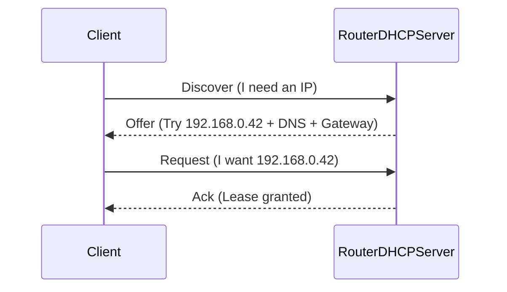

# DHCP Fundamentals (How Devices Get IP, Gateway, DNS)

This doc teaches DHCP so router settings for Pi-hole feel obvious instead of magical.

---

## 0. Prerequisites (don’t skip if you’re new)

- If you don’t know **IP/subnet/gateway/subnet mask** yet: read [`networking-101.md`](networking-101.md).
- If you need the “show me my IP/gateway/DNS” commands:
  - Linux: [`../../shell-commands/02-commands/ip.md`](../../shell-commands/02-commands/ip.md)
  - Windows: [`../../shell-commands/02-commands/ipconfig.md`](../../shell-commands/02-commands/ipconfig.md)
  - DNS check: [`../../shell-commands/02-commands/nslookup.md`](../../shell-commands/02-commands/nslookup.md)

---

## 1. What DHCP is

**DHCP is the protocol that automatically gives devices network settings**:

- IP address
- Subnet mask / prefix
- Default gateway (router)
- DNS servers (where Pi-hole must be advertised)
- Lease time (how long settings stick)

---

## 2. The DHCP “DORA” handshake

When a device joins your Wi‑Fi/LAN, it typically does:



### Why this matters for Pi-hole

Pi-hole becomes authoritative only if the DHCP server hands out:

- DNS = Pi-hole IP (and no secondary DNS)

---

## 3. Leases (why changes don’t apply instantly)

DHCP settings are attached to a **lease**. Until the client renews the lease, it may keep old DNS.

Typical renewal behavior:

- renew at ~50% of lease time (varies by OS)
- immediate refresh after Wi‑Fi toggle, reconnect, or reboot


---

## 4. DHCP reservation vs static IP (what to use)

### DHCP reservation (recommended)

You configure the router: `Pi MAC → 192.168.0.109`.

- Pros: centralized, avoids conflicts, survives reinstalls
- Cons: needs router UI access

### Static IP (use if reservation is impossible)

You configure the Pi itself.

- Pros: works without router features
- Cons: easiest way to break networking (wrong gateway/DNS, conflicts)

Rule of thumb: **Use DHCP reservation whenever you can.**

---

## 5. Real router setting examples

Example LAN:

- Router/gateway: `192.168.0.1`
- DHCP range: `192.168.0.50 – 192.168.0.200`
- Pi-hole reservation: `192.168.0.109` (inside range is okay if reserved; or reserve outside range)

Router DHCP DNS fields should be:

- Primary DNS: `192.168.0.109`
- Secondary DNS: empty / `0.0.0.0`

---

## 6. Common mistakes (and what they look like)

- **Changed WAN/Internet DNS only**

  - Router may use Pi-hole for itself, but clients keep using old DNS.
  - Fix: change **LAN DHCP DNS** (not WAN DNS).

- **Secondary DNS set to public resolver**

  - Pi-hole query log shows fewer requests; ads still load.
  - Fix: remove secondary DNS; optionally block outbound DNS.

- **Pi-hole IP changes**
  - Everything breaks after reboot.
  - Fix: DHCP reservation for Pi-hole.

---

## 7. Exercises

1. Confirm client settings:

- On Linux: prefer [`ip`](../../shell-commands/02-commands/ip.md) (`ip -4 a`, `ip -4 r`), or NetworkManager: `nmcli dev show | grep -E 'IP4.DNS|IP4.GATEWAY|IP4.ADDRESS'`
- On macOS: `scutil --dns | head`
- On Windows: [`ipconfig /all`](../../shell-commands/02-commands/ipconfig.md)

2. Force a fresh lease:

- Toggle Wi‑Fi, reboot, or “renew lease” in OS network settings.

3. Confirm Pi-hole is used:

```bash
nslookup example.com
```

The DNS “Server” should be your Pi-hole.

Learn the tool: [`nslookup`](../../shell-commands/02-commands/nslookup.md)

---

## See Also

- Networking primer (overview + patterns): [`learning.md`](learning.md)
- DNS fundamentals (recursion, caching, DoH): [`dns.md`](dns.md)
