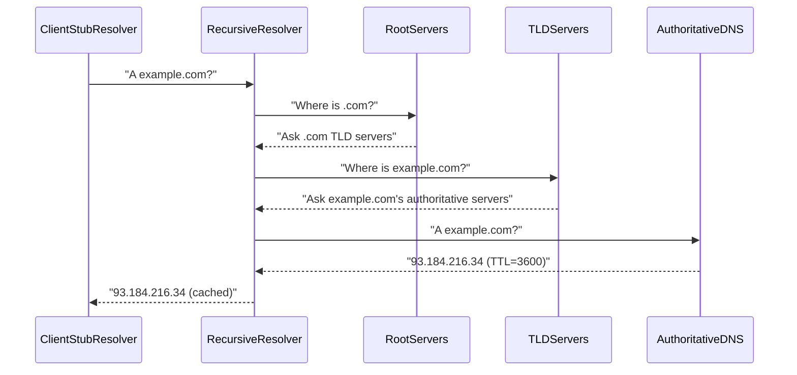
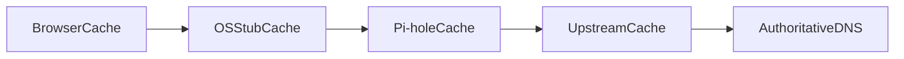
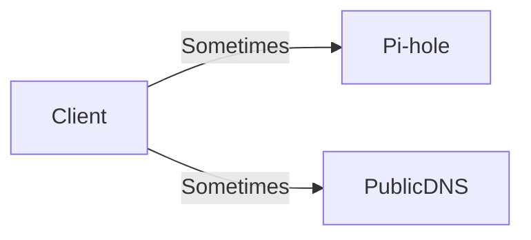

# DNS Fundamentals (How Names Become IPs)

This doc teaches DNS from first principles so Pi-hole configuration “clicks” in your head.

---

## 0. Prerequisites (don’t skip if you’re new)

- If you don’t know **IP/subnet/gateway** yet: read [`networking-101.md`](networking-101.md).
- If you want the practical DNS commands first:
  - [`../../shell-commands/02-commands/nslookup.md`](../../shell-commands/02-commands/nslookup.md)
  - [`../../shell-commands/02-commands/dig.md`](../../shell-commands/02-commands/dig.md)

---

## 1. What DNS is (in one sentence)

**DNS translates names (e.g., `example.com`) into addresses (e.g., `93.184.216.34`)** and includes metadata like TTLs that control caching.

---

## 2. The actors (who does what)

- **Stub resolver:** Your device/OS component that asks DNS questions.
- **Recursive resolver:** The system that does the work to find answers (Pi-hole can forward to one, or you can run your own recursion via Unbound).
- **Authoritative DNS:** The servers that are “sources of truth” for a domain (the owner’s DNS).
- **Root + TLD servers:** The directory that points you toward the right authoritative servers.

---

## 3. The recursion story (root → TLD → authoritative)

When you use **recursive DNS**, your resolver walks the tree:



### Why this matters for Pi-hole

- If you run **Unbound**, Pi-hole can forward to your **local recursive resolver** (privacy, fewer third parties).
- If you use Cloudflare/Google, you’re using a **forwarder** (simpler, but you’re trusting that provider).

---

## 4. Forwarding vs recursion (what Pi-hole normally does)


If you add Unbound locally:


---

## 5. Caching and TTL (why things “stick”)

- **TTL** is a timer (seconds) that tells resolvers how long they may cache an answer.
- Caching happens at multiple layers:
  - Client/OS cache
  - Browser cache (some browsers)
  - Pi-hole cache
  - Upstream resolver cache (if you forward)



### Real-world consequence

If you change router DHCP DNS to point at Pi-hole, clients may keep using old DNS until the **DHCP lease renews** or the OS cache flushes.

---

## 6. Why “Secondary DNS” breaks Pi-hole

If DHCP provides two DNS servers, many clients race them or failover aggressively.



If PublicDNS works, Pi-hole is bypassed. That’s why the repo recommends **no secondary DNS** and (optionally) firewall rules that force DNS to Pi-hole.

---

## 7. DNS encryption: DoH/DoT (how bypass happens)

```mermaid
flowchart LR
    Client[Client]
    PiHole[Pi-hole]
    DoH[DoHProvider]

    Client -->|Plain DNS (53)| PiHole
    Client -->|HTTPS (443) DoH| DoH
```

If the client uses DoH, Pi-hole never sees queries unless:

- the browser is configured to use system DNS, or
- the router/firewall blocks known DoH endpoints, or
- you enforce policy (managed devices).

---

## 8. Exercises (teach your brain the model)

1. **See which resolver answers your client** (learn: [`nslookup`](../../shell-commands/02-commands/nslookup.md))

```bash
nslookup example.com
```

Confirm the “Server” line is your Pi-hole IP.

2. **Prove bypass is blocked** (learn: [`nslookup`](../../shell-commands/02-commands/nslookup.md))

```bash
nslookup example.com 8.8.8.8
```

After you add firewall rules, this should fail or be redirected.

3. **Observe caching**

- Query the same domain repeatedly and watch Pi-hole’s query log; repeated lookups should be faster and may not hit upstream every time.

---

## See Also

- The Pi-hole networking primer: [`learning.md`](learning.md)
- Networking 101 (IP/subnet/gateway/subnet mask): [`networking-101.md`](networking-101.md)
- Unbound recursion with Pi-hole: [`unbound.md`](unbound.md)
- Hardcoded DNS/DoH blocking patterns: [`hardcoded-dns.md`](hardcoded-dns.md)
