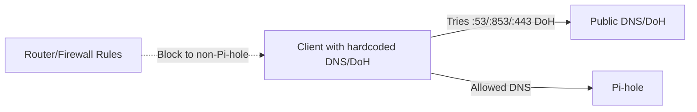

# Blocking Hardcoded DNS and DoH Clients

**Goal:** Stop devices/apps that ignore DHCP DNS (e.g., smart TVs, some Android builds, browsers with DoH) from bypassing Pi-hole.

---

## Prerequisites (recommended)

- DHCP model (why DHCP DNS matters): [`../../networking/docs/dhcp.md`](../../networking/docs/dhcp.md)
- DNS model (secondary DNS, DoH/DoT bypass): [`../../networking/docs/dns.md`](../../networking/docs/dns.md)
- Home router model: [`../../networking/docs/home-router-model.md`](../../networking/docs/home-router-model.md)
- Ports (53/853/443) and why they matter: [`../../networking/docs/tcp-udp-ports.md`](../../networking/docs/tcp-udp-ports.md)
- NAT/firewall enforcement thinking: [`../../networking/docs/nat-firewalls.md`](../../networking/docs/nat-firewalls.md)

---

## Threat model



We enforce that DNS traffic (plain or encrypted) must go to Pi-hole, or is blocked.

---

## Approach

1. **Keep DHCP DNS = Pi-hole (only).**
2. **Block outbound DNS** to anything except Pi-hole:
   - UDP/TCP 53 to Pi-hole allowed; block all other destinations.
3. **Tame DoH/DoT where possible:**
   - Disable router-level “Secure DNS”/DoH/DoT.
   - For browsers that honor enterprise policies (Chrome/Edge/Firefox), disable DoH or force allowlist.
4. **Optional:** Redirect outbound 53 to Pi-hole (NAT DNAT) if your router supports it.

---

## Router/firewall examples

> Exact steps vary by firmware. Below are patterns you can adapt.

- **OpenWRT (nftables conceptually):**

  ```
  # Allow DNS to Pi-hole only
  ip daddr <PIHOLE_V4> udp dport 53 accept
  ip daddr <PIHOLE_V4> tcp dport 53 accept
  ip6 daddr <PIHOLE_V6> udp dport 53 accept
  ip6 daddr <PIHOLE_V6> tcp dport 53 accept

  # Drop other DNS
  ip udp dport 53 drop
  ip tcp dport 53 drop
  ip6 udp dport 53 drop
  ip6 tcp dport 53 drop
  ```

- **ASUSwrt-Merlin/Router that supports DNSFilter:**

  - Mode: **Router**
  - DNS servers: Pi-hole IPs
  - Block listed clients or apply globally.

- **If DNAT is available (fallback for stubborn clients):**
  - Redirect any outbound 53 to Pi-hole IP:53.
  - Note: DoH/DoT on 443/853 will still bypass unless blocked.

---

## Handling DoH/DoT

- **Browser policy (managed devices):**

  - Chrome/Edge: set `DnsOverHttpsMode=off`.
  - Firefox: `network.trr.mode=5` (use system resolver).

- **Router-level block (coarse):**

  - Block known DoH endpoints (e.g., Cloudflare, Google) on 443/853.
  - Maintain a small list; DoH endpoints change, so this is best-effort.

- **Best practice:** Rely on DNS firewalling first; use DoH blocks as a supplement.

---

## Verification

From a client:

```bash
# Should succeed
nslookup example.com <pi-hole-ip>

# Should fail or be redirected
nslookup example.com 8.8.8.8

# DoH probe (expect fail/blocked if you blocked endpoints)
curl -I https://cloudflare-dns.com/dns-query
```

If the second command succeeds, outbound DNS to public resolvers is still allowed—tighten firewall/NAT rules.
