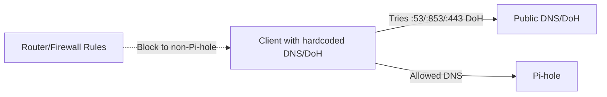

# Blocking Hardcoded DNS and DoH Clients

**Goal:** Stop devices/apps that ignore DHCP DNS (e.g., smart TVs, some Android builds, browsers with DoH) from bypassing Pi-hole.

---

## Prerequisites (recommended)

- DHCP model (why DHCP DNS matters): [`../../networking/docs/dhcp.md`](../../networking/docs/dhcp.md)
- DNS model (secondary DNS, DoH/DoT bypass): [`../../networking/docs/dns.md`](../../networking/docs/dns.md)
- Home router model: [`../../networking/docs/home-router-model.md`](../../networking/docs/home-router-model.md)
- Ports (53/853/443) and why they matter: [`../../networking/docs/tcp-udp-ports.md`](../../networking/docs/tcp-udp-ports.md)
- NAT/firewall enforcement thinking: [`../../networking/docs/nat-firewalls.md`](../../networking/docs/nat-firewalls.md)

---

## Threat model



We enforce that DNS traffic (plain or encrypted) must go to Pi-hole, or is blocked.

---

## Approach

1. **Keep DHCP DNS = Pi-hole (only).**
2. **Block outbound DNS** to anything except Pi-hole:
   - UDP/TCP 53 to Pi-hole allowed; block all other destinations.
3. **Tame DoH/DoT where possible:**
   - Disable router-level “Secure DNS”/DoH/DoT.
   - For browsers that honor enterprise policies (Chrome/Edge/Firefox), disable DoH or force allowlist.
4. **Optional:** Redirect outbound 53 to Pi-hole (NAT DNAT) if your router supports it.

---

## Router/firewall examples

> Exact steps vary by firmware. Below are patterns you can adapt.

- **OpenWRT (nftables conceptually):**

  ```
  # Allow DNS to Pi-hole only
  ip daddr <PIHOLE_V4> udp dport 53 accept
  ip daddr <PIHOLE_V4> tcp dport 53 accept
  ip6 daddr <PIHOLE_V6> udp dport 53 accept
  ip6 daddr <PIHOLE_V6> tcp dport 53 accept

  # Drop other DNS
  ip udp dport 53 drop
  ip tcp dport 53 drop
  ip6 udp dport 53 drop
  ip6 tcp dport 53 drop
  ```

- **ASUSwrt-Merlin/Router that supports DNSFilter:**

  - Mode: **Router**
  - DNS servers: Pi-hole IPs
  - Block listed clients or apply globally.

- **If DNAT is available (fallback for stubborn clients):**
  - Redirect any outbound 53 to Pi-hole IP:53.
  - Note: DoH/DoT on 443/853 will still bypass unless blocked.

---

## Handling DoH/DoT

- **Browser policy (managed devices):**

  - Chrome/Edge: set `DnsOverHttpsMode=off`.
  - Firefox: `network.trr.mode=5` (use system resolver).

- **Router-level block (coarse):**

  - Block known DoH endpoints (e.g., Cloudflare, Google) on 443/853.
  - Maintain a small list; DoH endpoints change, so this is best-effort.

- **Best practice:** Rely on DNS firewalling first; use DoH blocks as a supplement.

---

## Regex Deny Patterns (Pi-hole "Regex deny" examples)

Regex patterns allow you to block domains matching specific patterns, including subdomains. This is useful for blocking tracking, telemetry, and advertising domains that use predictable naming patterns.

**How regex patterns work:**

- **`(^|\\.)`** - Matches start of domain or a dot (allows subdomains)
- **`domain\\.com$`** - Matches exact domain name (escaped dot)
- **`$`** - End of string anchor (ensures exact match)

**Example:** `(^|\\.)facebook\\.com$` matches:

- `facebook.com` ✅
- `www.facebook.com` ✅
- `m.facebook.com` ✅
- `api.facebook.com` ✅
- `notfacebook.com` ❌ (doesn't match)

### OEM Telemetry Domains

If you're seeing vendor telemetry domains from phones (common with OPPO/OnePlus variants), you can add Pi-hole regex deny rules that match the base domain and all subdomains:

- **OPPO/OnePlus:** `(^|\\.)heytapmobile\\.com$` - Blocks OPPO/OnePlus telemetry
- **OPPO/OnePlus:** `(^|\\.)heytapdl\\.com$` - Blocks OPPO/OnePlus download telemetry
- **OPPO/OnePlus:** `(^|\\.)allawnos\\.com$` - Blocks OPPO/OnePlus analytics

**Note:** Can add more regex for other OEMs. Discover candidate domains in **Pi-hole Query Log** (or a phone-side monitor like PCAPdroid). Prefer blocking the base domain with a safe regex: `(^|\\.)domain\\.tld$`

### Social Media Tracking

**Facebook:**

- **Pattern:** `(^|\\.)facebook\\.com$`
- **What it blocks:** Facebook and all subdomains (tracking, ads, analytics)
- **Examples:** `facebook.com`, `www.facebook.com`, `m.facebook.com`, `graph.facebook.com`, `connect.facebook.com`
- **Note:** This blocks Facebook entirely. Use only if you want to block Facebook completely.

**Instagram:**

- **Pattern:** `(^|\\.)instagram\\.com$`
- **What it blocks:** Instagram and all subdomains
- **Examples:** `instagram.com`, `www.instagram.com`, `i.instagram.com`

**TikTok:**

- **Pattern:** `(^|\\.)tiktok\\.com$` or `(^|\\.)tiktokcdn\\.com$`
- **What it blocks:** TikTok and TikTok CDN domains
- **Examples:** `tiktok.com`, `www.tiktok.com`, `m.tiktok.com`, `cdn.tiktokcdn.com`

**Twitter/X:**

- **Pattern:** `(^|\\.)twitter\\.com$` or `(^|\\.)x\\.com$` or `(^|\\.)twimg\\.com$`
- **What it blocks:** Twitter/X and Twitter image domains
- **Examples:** `twitter.com`, `x.com`, `api.twitter.com`, `pbs.twimg.com`

### Tech Giants (Tracking/Telemetry)

**Google Analytics:**

- **Pattern:** `(^|\\.)google-analytics\\.com$` or `(^|\\.)googletagmanager\\.com$`
- **What it blocks:** Google Analytics and Google Tag Manager tracking
- **Examples:** `google-analytics.com`, `www.google-analytics.com`, `googletagmanager.com`
- **Note:** May break websites that rely on Google Analytics for functionality

**Google Ads:**

- **Pattern:** `(^|\\.)doubleclick\\.net$` or `(^|\\.)googlesyndication\\.com$`
- **What it blocks:** Google's ad serving networks
- **Examples:** `doubleclick.net`, `ad.doubleclick.net`, `googlesyndication.com`
- **Note:** These are commonly blocked by default blocklists

**Microsoft Telemetry:**

- **Pattern:** `(^|\\.)telemetry\\.microsoft\\.com$` or `(^|\\.)vortex-win\\.data\\.microsoft\\.com$`
- **What it blocks:** Windows telemetry and data collection
- **Examples:** `telemetry.microsoft.com`, `vortex-win.data.microsoft.com`, `v10.events.data.microsoft.com`
- **Note:** May affect Windows Update functionality

**Apple Analytics:**

- **Pattern:** `(^|\\.)analytics\\.apple\\.com$` or `(^|\\.)metrics\\.icloud\\.com$`
- **What it blocks:** Apple analytics and iCloud metrics
- **Examples:** `analytics.apple.com`, `metrics.icloud.com`
- **Note:** May affect Apple services functionality

**Amazon Ads:**

- **Pattern:** `(^|\\.)amazon-adsystem\\.com$`
- **What it blocks:** Amazon's advertising system
- **Examples:** `amazon-adsystem.com`, `c.amazon-adsystem.com`
- **Note:** Commonly blocked by default blocklists

### Analytics/Tracking Services

**Adobe Analytics:**

- **Pattern:** `(^|\\.)omtrdc\\.net$` or `(^|\\.)adobedtm\\.com$`
- **What it blocks:** Adobe Analytics and Adobe Dynamic Tag Management
- **Examples:** `omtrdc.net`, `adobedtm.com`, `assets.adobedtm.com`
- **Note:** May break websites using Adobe Analytics

**Segment:**

- **Pattern:** `(^|\\.)segment\\.(com|io)$`
- **What it blocks:** Segment analytics platform
- **Examples:** `segment.com`, `segment.io`, `api.segment.io`

**Amplitude:**

- **Pattern:** `(^|\\.)amplitude\\.com$`
- **What it blocks:** Amplitude analytics
- **Examples:** `amplitude.com`, `api.amplitude.com`

**Mixpanel:**

- **Pattern:** `(^|\\.)mixpanel\\.com$`
- **What it blocks:** Mixpanel analytics
- **Examples:** `mixpanel.com`, `api.mixpanel.com`

### Common Tracking Patterns

**Generic Tracking Subdomains:**

- **Pattern:** `(^|\\.)tracking\\..*\\.com$`
- **What it blocks:** Any domain with "tracking" as a subdomain
- **Examples:** `tracking.example.com`, `tracking.ads.com`
- **Note:** Very broad pattern, may cause false positives

**Analytics Subdomains:**

- **Pattern:** `(^|\\.)analytics\\..*\\.com$`
- **What it blocks:** Any domain with "analytics" as a subdomain
- **Examples:** `analytics.example.com`, `analytics.google.com`
- **Note:** May block legitimate analytics services

**Telemetry Subdomains:**

- **Pattern:** `(^|\\.)telemetry\\..*\\.com$`
- **What it blocks:** Any domain with "telemetry" as a subdomain
- **Examples:** `telemetry.microsoft.com`, `telemetry.example.com`

### How to Add Regex Patterns

**Using Pi-hole Admin Web Interface:**

1. **Navigate:** Pi-hole Admin → Group Management → Regex Denylist
2. **Add pattern:** Click "Add" button
3. **Enter regex:** Paste regex pattern (e.g., `(^|\\.)facebook\\.com$`)
4. **Add comment:** Add description (e.g., "Block Facebook tracking")
5. **Save:** Click "Add" to save

**Using Command Line:**

```bash
# Add regex pattern
pihole --regex "(^|\\.)facebook\\.com$" "Block Facebook tracking"
```

**What this does:**

- **`pihole --regex`:** Adds regex pattern to Pi-hole
- **Pattern:** The regex pattern to match
- **Comment:** Description of what the pattern blocks

### Whitelisting False Positives

If a regex pattern blocks legitimate domains, you can whitelist them:

**Exact domain whitelist:**

```bash
# Whitelist specific domain
pihole -w legitimate.example.com
```

**Regex whitelist:**

```bash
# Whitelist pattern (allows domains matching pattern)
pihole --white-regex "(^|\\.)legitimate\\.example\\.com$"
```

**When to whitelist vs refine regex:**

- **Whitelist:** If only a few domains are incorrectly blocked
- **Refine regex:** If many domains are incorrectly blocked (make regex more specific)

**Learn more:** See [Blocklists and Whitelists Guide](blocklists-whitelists.md) for managing blocklists, regex patterns, and preventing false positives.

---

## Verification

From a client:

```bash
# Should succeed
nslookup example.com <pi-hole-ip>

# Should fail or be redirected
nslookup example.com 8.8.8.8

# DoH probe (expect fail/blocked if you blocked endpoints)
curl -I https://cloudflare-dns.com/dns-query
```

If the second command succeeds, outbound DNS to public resolvers is still allowed—tighten firewall/NAT rules.
