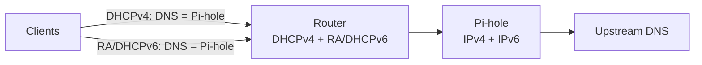

# IPv6-Safe Pi-hole Deployment

**Goal:** Keep Pi-hole authoritative when IPv6 is enabled so clients do not bypass it via global resolvers.

---

## Prerequisites (recommended)

- Networking basics (IP/subnet/gateway): [`../../networking/docs/ip-addressing.md`](../../networking/docs/ip-addressing.md)
- DNS model (bypass, caching): [`../../networking/docs/dns.md`](../../networking/docs/dns.md)
- Home router model (LAN vs WAN + where DNS lives): [`../../networking/docs/home-router-model.md`](../../networking/docs/home-router-model.md)
- Routing/guest networks (why clients might not reach Pi-hole): [`../../networking/docs/routing-vlans-guest.md`](../../networking/docs/routing-vlans-guest.md)

---

## Flow (IPv4 + IPv6)



Rules:

- Advertise **only** the Pi-hole addresses as DNS over IPv6.
- Avoid handing out public resolvers in RDNSS/DHCPv6.
- Disable router DoH/DoT so Pi-hole sees queries.

---

## Steps (router + Pi-hole)

1. **Give Pi-hole stable IPv6**

   - Use a DHCPv6 reservation or static address (link-local is not enough).
   - Example: `fd00::109` or delegated prefix address.

2. **Router advertisements / DHCPv6**

   - RDNSS / DHCPv6 DNS: set to Pi-hole IPv6.
   - Do not include secondary/public IPv6 resolvers.

3. **Pi-hole settings**

   - Settings → System → Enable IPv6 blocking.
   - Verify Pi-hole shows an IPv6 address under “Internet”.

4. **Test from a client**

   ```bash
   # Resolve over IPv6
   dig AAAA google.com @<pi-hole-IPv6>
   nslookup doubleclick.net <pi-hole-IPv6>
   ```

   Expect blocked domains to resolve to `::` or Pi-hole sink address.

5. **Firewall sanity (optional)**
   - Block outbound DNS (53/853) except to Pi-hole addresses (v4 + v6).
   - This prevents IPv6 DNS leakage to public resolvers.

---

## Common pitfalls

- Router hands out ISP/public IPv6 DNS alongside Pi-hole → clients bypass.
- Pi-hole has IPv4 only but router advertises IPv6 DNS → v6 traffic bypasses Pi-hole.
- SLAAC-only setups without RDNSS override: add DHCPv6 or RDNSS advertising Pi-hole.

---

## Quick checklist

- [ ] Pi-hole has reachable IPv6 address (ping it).
- [ ] Router advertises **only** Pi-hole for DNS (RDNSS/DHCPv6).
- [ ] Clients show Pi-hole IPv6 in `ipconfig`/`networksetup`/`nmcli`.
- [ ] `dig @<pi-hole-IPv6> example.com AAAA` works.
- [ ] No public IPv6 resolvers present in client network config.
