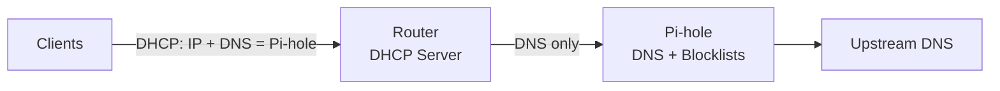
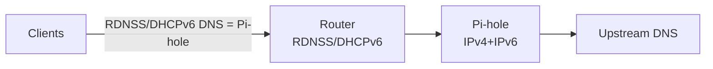

# Networking Basics for Pi-hole (With Real Examples)

Use this primer to understand the minimum networking concepts needed to keep Pi-hole authoritative on your LAN. It includes diagrams, sample router patterns, and verification drills.

---

## 1. DNS/DHCP Flow (Authoritative Path)



Principles:

- DHCP must hand out exactly one DNS: the Pi-hole IP.
- No secondary DNS in DHCP (bypass risk).
- Router DoH/DoT off so Pi-hole can see queries.
- Redundancy lives inside Pi-hole (multiple upstreams or Unbound), not in DHCP.

---

## 2. Router DHCP Patterns (LAN side)

Common UI paths:

- TP-Link: `Advanced → Network → DHCP Server`
- ASUS: `LAN → DHCP Server`
- Netgear: `Advanced → Setup → LAN Setup`
- OpenWRT: `Network → Interfaces → LAN → DHCP`

Settings to apply:

- DHCP Server: Enabled
- Gateway: Router IP (e.g., `192.168.0.1`)
- Primary DNS: Pi-hole IP
- Secondary DNS: Empty or `0.0.0.0`
- DNS Privacy / Secure DNS / DoH / DoT: Off
- DHCP reservation: Pi-hole MAC → fixed IP

Real-world note: Many ISP routers expose “Internet DNS” but hide DHCP DNS under LAN/DHCP. Always change the LAN/DHCP DNS, not WAN.

---

## 3. Detecting DNS Bypass (Clients Behaving Badly)

Symptoms:

- Ads still showing
- Pi-hole query counter low/flat
- `nslookup` to public resolvers succeeds

Checks:

- Client DNS config shows only Pi-hole.
- `nslookup example.com 8.8.8.8` should fail or be blocked.
- Router firewall: block outbound 53/853 except to Pi-hole.
- Disable router DoH/DoT; enforce browser policy where possible.

---

## 4. Verification Drills (Do These After Config)

On a client:

```bash
# Should resolve through Pi-hole
nslookup doubleclick.net <pi-ip>

# Should fail or be blocked (tests bypass)
nslookup example.com 8.8.8.8

# If Unbound is enabled
dig google.com @<pi-ip> -p 53
```

On the router (if it has a diag page): confirm DHCP shows Pi-hole as the only DNS handed out.

---

## 5. Firewall / NAT Patterns (Optional but Strong)

Goal: allow DNS only to Pi-hole, block the rest.

- Allow: UDP/TCP 53 to Pi-hole (v4 + v6).
- Drop: UDP/TCP 53 to others.
- Optional DNAT: redirect outbound 53 to Pi-hole IP:53 (helps stubborn clients; DoH still needs blocking/policy).
- For DoH/DoT: block known endpoints on 443/853 if policy control is unavailable.

Example (conceptual nftables for OpenWRT):

```
ip daddr <PIHOLE_V4> udp dport 53 accept
ip daddr <PIHOLE_V4> tcp dport 53 accept
ip udp dport 53 drop
ip tcp dport 53 drop

ip6 daddr <PIHOLE_V6> udp dport 53 accept
ip6 daddr <PIHOLE_V6> tcp dport 53 accept
ip6 udp dport 53 drop
ip6 tcp dport 53 drop
```

---

## 6. IPv6 Essentials (Avoid Bypass)



Must-do:

- Give Pi-hole a stable IPv6 (reservation/static).
- Router RDNSS/DHCPv6 advertises only Pi-hole IPv6 for DNS.
- Do not hand out public IPv6 resolvers.
- Test: `dig AAAA example.com @<pi-hole-IPv6>`.

---

## 7. Real-World Scenarios & Tips

- ISP routers with locked DNS: look for LAN/DHCP override or place Pi-hole behind a better router; fallback is DNAT on an advanced router.
- Guest/IoT VLANs: ensure their DHCP points to Pi-hole; consider firewall rules to block cross-VLAN except DNS to Pi-hole.
- DoH-enabled browsers: set managed policies (Chrome/Edge `DnsOverHttpsMode=off`, Firefox `network.trr.mode=5`) or block known DoH endpoints as defense-in-depth.
- Smart TVs / streaming sticks: many hardcode public DNS; firewall outbound 53/853, optionally DNAT 53 to Pi-hole.
- VPN split-tunnel: ensure LAN DNS still points to Pi-hole; full-tunnel VPN may bypass Pi-hole by design.

---

## 8. If Things Break

- No internet when Pi-hole is down: expected—Pi-hole is authoritative. Fix Pi-hole; do not add secondary DNS.
- SSH host key changed after reflash:
  ```bash
  ssh-keygen -R <pi-ip>
  ```
  Reconnect and accept the new key.
- Still leaking? Re-run the drills in section 4, then tighten firewall per section 5.

---

## See Also

- Quick start and router steps: [`../README.md`](../README.md)
- Unbound (local recursion): [`unbound.md`](unbound.md)
- IPv6-safe setup: [`ipv6.md`](ipv6.md)
- Hardcoded DNS/DoH blocking: [`hardcoded-dns.md`](hardcoded-dns.md)
