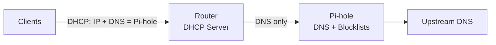
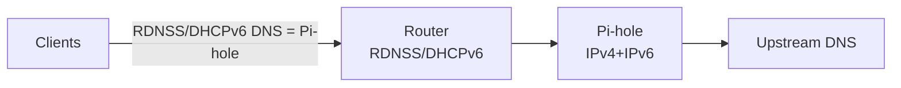

# Networking Basics for Pi-hole (With Real Examples)

Use this primer to understand the minimum networking concepts needed to keep Pi-hole authoritative on your LAN. It includes diagrams, sample router patterns, and verification drills.

---

## 1. Core Concepts (quick definitions + examples)

- **IP address:** Numeric address of a device. Example: your router `192.168.0.1`, Pi-hole `192.168.0.109`, TV `192.168.0.42`. IPv6 example: `fd00::109`.
- **Subnet:** Group of IPs that talk directly. Example: `192.168.0.0/24` covers `192.168.0.1–192.168.0.254`.
- **Gateway:** Router LAN IP; traffic leaves your subnet here (e.g., `192.168.0.1`).
- **DHCP server:** Hands out IP + gateway + DNS. Usually the router. It must point DNS to Pi-hole only.
- **DHCP reservation:** Router maps a device MAC → fixed IP (e.g., Pi-hole MAC → `192.168.0.109`). Survives reboots and avoids conflicts; preferred over static IP on the Pi.
- **Static IP:** Manually set on a device. Risk: conflicts or wrong gateway/DNS. Use only if you cannot set a reservation.
- **DNS resolver (Pi-hole):** Answers domain lookups for your LAN and applies blocklists. It can forward to upstream or recurse locally (Unbound).
- **Upstream DNS:** Where Pi-hole sends queries it cannot answer (Cloudflare `1.1.1.1`, Google `8.8.8.8`, or Unbound on `127.0.0.1#5335`).
- **Recursive vs forwarder:** Recursive (Unbound) walks root → authoritative servers (better privacy, no single provider). Forwarder just passes queries to a provider.
- **DoH/DoT:** Encrypted DNS. If enabled on router/clients, Pi-hole can’t inspect traffic; disable or block endpoints/policy-enforce.
- **RDNSS/DHCPv6:** IPv6 ways to advertise DNS. Must list only Pi-hole IPv6; otherwise clients bypass over IPv6.
- **NAT + firewall:** Decide what leaves your LAN. Use to block DNS to anything except Pi-hole (and optionally DNAT redirect stubborn clients).

If you want the “full story” (with diagrams):

- DNS deep dive (recursion, caching, DoH/DoT): [`dns.md`](dns.md)
- DHCP deep dive (DORA, leases, reservations): [`dhcp.md`](dhcp.md)

---

## 2. DNS/DHCP Flow (Authoritative Path)



Principles:

- DHCP must hand out exactly one DNS: the Pi-hole IP.
- No secondary DNS in DHCP (bypass risk).
- Router DoH/DoT off so Pi-hole can see queries.
- Redundancy lives inside Pi-hole (multiple upstreams or Unbound), not in DHCP.

---

## 3. Router DHCP Patterns (LAN side)

Common UI paths:

- TP-Link: `Advanced → Network → DHCP Server`
- ASUS: `LAN → DHCP Server`
- Netgear: `Advanced → Setup → LAN Setup`
- OpenWRT: `Network → Interfaces → LAN → DHCP`

Settings to apply:

- DHCP Server: Enabled
- Gateway: Router IP (e.g., `192.168.0.1`)
- Primary DNS: Pi-hole IP
- Secondary DNS: Empty or `0.0.0.0`
- DNS Privacy / Secure DNS / DoH / DoT: Off
- DHCP reservation: Pi-hole MAC → fixed IP

Real-world note: Many ISP routers expose “Internet DNS” but hide DHCP DNS under LAN/DHCP. Always change the LAN/DHCP DNS, not WAN.

---

## 4. Detecting DNS Bypass (Clients Behaving Badly)

Symptoms:

- Ads still showing
- Pi-hole query counter low/flat
- `nslookup` to public resolvers succeeds

Checks:

- Client DNS config shows only Pi-hole.
- `nslookup example.com 8.8.8.8` should fail or be blocked.
- Router firewall: block outbound 53/853 except to Pi-hole.
- Disable router DoH/DoT; enforce browser policy where possible.

---

## 5. Verification Drills (Do These After Config)

On a client:

```bash
# Should resolve through Pi-hole
nslookup doubleclick.net <pi-ip>

# Should fail or be blocked (tests bypass)
nslookup example.com 8.8.8.8

# If Unbound is enabled
dig google.com @<pi-ip> -p 53
```

On the router (if it has a diag page): confirm DHCP shows Pi-hole as the only DNS handed out.

---

## 6. Firewall / NAT Patterns (Optional but Strong)

Goal: allow DNS only to Pi-hole, block the rest.

- Allow: UDP/TCP 53 to Pi-hole (v4 + v6).
- Drop: UDP/TCP 53 to others.
- Optional DNAT: redirect outbound 53 to Pi-hole IP:53 (helps stubborn clients; DoH still needs blocking/policy).
- For DoH/DoT: block known endpoints on 443/853 if policy control is unavailable.

Example (conceptual nftables for OpenWRT):

```
ip daddr <PIHOLE_V4> udp dport 53 accept
ip daddr <PIHOLE_V4> tcp dport 53 accept
ip udp dport 53 drop
ip tcp dport 53 drop

ip6 daddr <PIHOLE_V6> udp dport 53 accept
ip6 daddr <PIHOLE_V6> tcp dport 53 accept
ip6 udp dport 53 drop
ip6 tcp dport 53 drop
```

---

## 7. IPv6 Essentials (Avoid Bypass)



Must-do:

- Give Pi-hole a stable IPv6 (reservation/static).
- Router RDNSS/DHCPv6 advertises only Pi-hole IPv6 for DNS.
- Do not hand out public IPv6 resolvers.
- Test: `dig AAAA example.com @<pi-hole-IPv6>`.

---

## 8. Real-World Scenarios & Tips

- ISP routers with locked DNS: look for LAN/DHCP override or place Pi-hole behind a better router; fallback is DNAT on an advanced router.
- Guest/IoT VLANs: ensure their DHCP points to Pi-hole; consider firewall rules to block cross-VLAN except DNS to Pi-hole.
- DoH-enabled browsers: set managed policies (Chrome/Edge `DnsOverHttpsMode=off`, Firefox `network.trr.mode=5`) or block known DoH endpoints as defense-in-depth.
- Smart TVs / streaming sticks: many hardcode public DNS; firewall outbound 53/853, optionally DNAT 53 to Pi-hole.
- VPN split-tunnel: ensure LAN DNS still points to Pi-hole; full-tunnel VPN may bypass Pi-hole by design.

---

## 9. If Things Break

---

## 10. Concept Walk-Throughs (with examples)

### A) DHCP handing out Pi-hole (happy path)

1. Router DHCP has:
   - Gateway: `192.168.0.1`
   - Primary DNS: `192.168.0.109` (Pi-hole)
   - Secondary DNS: empty
2. Laptop joins Wi-Fi, gets lease:
   - IP `192.168.0.42`
   - DNS `192.168.0.109`
3. Laptop runs `nslookup example.com` → asks Pi-hole → Pi-hole forwards to upstream/Unbound → returns answer (blocked if on list).

### B) Bypass via secondary DNS (what goes wrong)

1. Router DHCP has Primary DNS = Pi-hole, Secondary DNS = `8.8.8.8`.
2. Some clients prefer the secondary; ads appear; Pi-hole dashboard shows few queries.
3. Fix: remove secondary DNS; block outbound 53/853 to non-Pi-hole; renew leases.

### C) DoH on router (what goes wrong)

1. Router “Secure DNS/DoH” enabled.
2. Router encrypts DNS straight to the internet; Pi-hole never sees queries.
3. Fix: disable DoH/DoT on router; keep DHCP DNS = Pi-hole.

### D) IPv6 bypass

1. Router hands out public IPv6 DNS via RDNSS.
2. Clients with IPv6 use that DNS, skipping Pi-hole.
3. Fix: give Pi-hole stable IPv6; set RDNSS/DHCPv6 DNS = Pi-hole IPv6 only; retest with `dig AAAA`.

### E) Stubborn devices (smart TV)

1. TV hardcodes `8.8.8.8`.
2. Add firewall rule: allow DNS only to Pi-hole; drop others. Optional DNAT: redirect 53 to Pi-hole.
3. Verify: `nslookup example.com 8.8.8.8` should fail/redirect.

### F) Recursive Pi-hole with Unbound

1. Install Unbound, listen on `127.0.0.1#5335`.
2. Pi-hole upstream = `127.0.0.1#5335`; disable other upstreams.
3. Benefit: privacy (no single provider), independence from public resolvers.

- No internet when Pi-hole is down: expected—Pi-hole is authoritative. Fix Pi-hole; do not add secondary DNS.
- SSH host key changed after reflash:
  ```bash
  ssh-keygen -R <pi-ip>
  ```
  Reconnect and accept the new key.
- Still leaking? Re-run the drills in section 4, then tighten firewall per section 5.

---

## See Also

- Quick start and router steps: [`../README.md`](../README.md)
- Unbound (local recursion): [`unbound.md`](unbound.md)
- IPv6-safe setup: [`ipv6.md`](ipv6.md)
- Hardcoded DNS/DoH blocking: [`hardcoded-dns.md`](hardcoded-dns.md)
