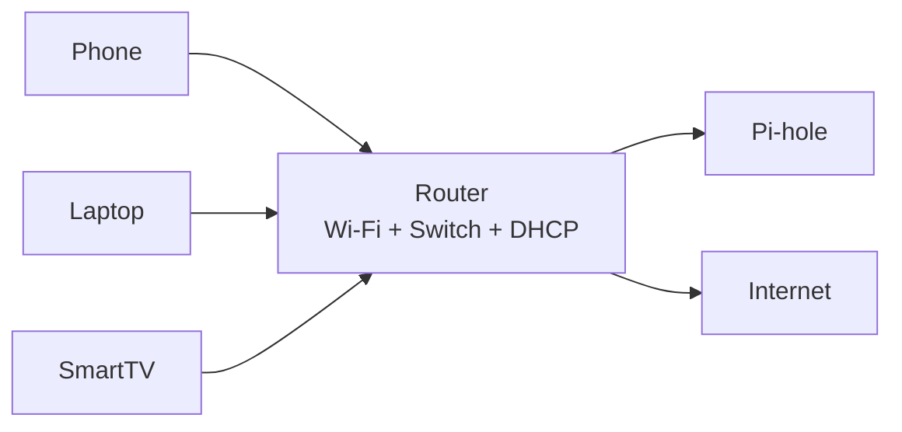
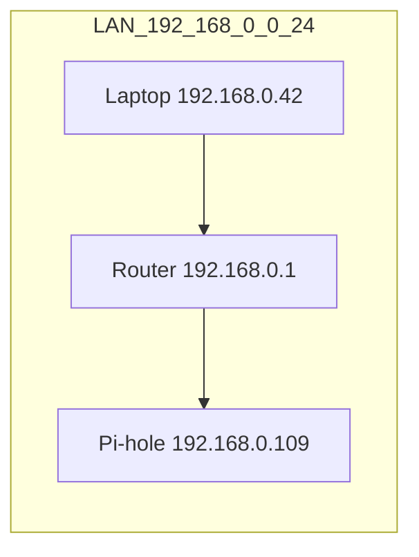
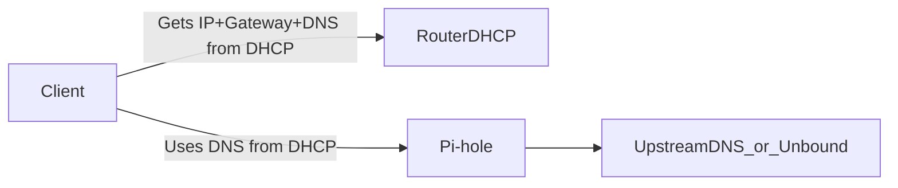

# Networking 101 (IP, Subnet, Gateway, DNS) for Pi-hole

If you’re new to networking, this doc is the missing “mental model” you need before configuring Pi-hole. After reading, router DHCP settings should feel obvious (not like random checkboxes).

---

## 1. The one picture you need (home network)

In a typical home:

- The **router** is the “traffic director.”
- Devices talk to the router.
- DNS must go through **Pi-hole** if you want Pi-hole to block ads.

---

## 2. What is an IP address?

An **IP address** is a numeric address for a device on a network.

- **IPv4 example:** `192.168.0.42`
- **IPv6 example:** `fd00::109`

### Real-world analogy

IP is like a **street address**. If you want to send a letter (a packet) to a house (a device), you need the address.

### Typical home setup (example)

- Router: `192.168.0.1`
- Pi-hole: `192.168.0.109`
- Laptop: `192.168.0.42`

See also: [`../docs/GLOSSARY.md`](../../docs/GLOSSARY.md) (IP, IPv4, IPv6).

---

## 3. What is a subnet / subnet mask / prefix?

A **subnet** is a group of IPs that are “local” to each other.

You’ll see it written in two common ways:

- **Subnet mask:** `255.255.255.0`
- **CIDR prefix:** `/24`

They mean the same thing in common home networks:

- `192.168.0.0/24` ⇔ mask `255.255.255.0`
- This includes `192.168.0.1` through `192.168.0.254`

### Why you care

If devices are in the same subnet, they can talk directly via the router/switch.
If not, traffic must be routed between subnets (VLANs, guest networks).

---

## 4. What is the gateway?

The **gateway** is your router’s LAN IP (commonly `192.168.0.1`).

It’s where your device sends traffic that is **not** local (e.g., `google.com` servers).

### Analogy

Gateway is like the **exit door** of your building: if the destination isn’t in your building, you go through the exit.

---

## 5. What is DNS (and why Pi-hole depends on it)?

DNS turns names into IPs:

- `example.com` → `93.184.216.34`

Pi-hole blocks ads by refusing (or “sinking”) DNS answers for known ad/tracker domains.

If your device uses some other DNS server, Pi-hole never sees the request, so it can’t block.

See: [`dns.md`](dns.md) for a deep model (recursion, caching, DoH/DoT).

---

## 6. What is DHCP (and why it’s the correct place to configure Pi-hole)?

**DHCP** is how devices automatically receive:

- IP address
- subnet/prefix
- gateway
- DNS servers

So if you want all devices to use Pi-hole DNS, you configure the router’s **LAN DHCP DNS** fields to point at Pi-hole.

See: [`dhcp.md`](dhcp.md) for DORA, leases, reservations, renewals.

---

## 7. WAN vs LAN (the setting that confuses everyone)

- **LAN settings** affect your devices (phone/laptop/TV).
- **WAN/Internet settings** affect only the router itself.

If you set “Internet DNS” to Pi-hole but don’t change DHCP DNS, your devices may still bypass Pi-hole.

---

## 8. How to “read” your network on each OS (beginner path)

These commands answer the same questions:

- What IP do I have?
- What is my gateway?
- What DNS servers am I using?

### Windows

- Use [`ipconfig`](../../shell-commands/02-commands/ipconfig.md).

### Linux (recommended)

- Use [`ip`](../../shell-commands/02-commands/ip.md).

### macOS

- You can use `ifconfig` (legacy) or `networksetup`/`scutil`. If you want parity with Linux/Windows in this repo, see the `ifconfig` note in [`ip.md`](../../shell-commands/02-commands/ip.md).

---

## 9. How this maps to Pi-hole config (end-to-end)

If DHCP says:

- DNS = Pi-hole → Pi-hole is authoritative for your LAN.
- DNS = Pi-hole + Public DNS → bypass risk.

---

## 10. Next steps (learn + do)

- Read the Pi-hole learning hub: [`learning.md`](learning.md)
- If you want to understand names → IPs deeply: [`dns.md`](dns.md)
- If you want to understand leases/renewals: [`dhcp.md`](dhcp.md)
- Then configure Pi-hole: [`../README.md`](../README.md)
