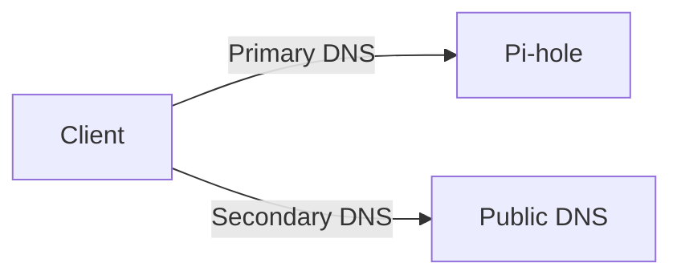
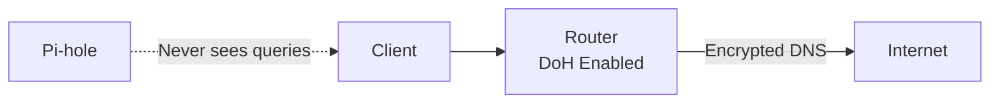

Perfect constraint 👍 — Mermaid is exactly the right choice for a repo README.

Below is a **revised, final README** that:

* Is **step-by-step**
* Uses **Mermaid for all diagrams**
* Includes **troubleshooting**
* Covers **multiple router brands**
* Explicitly documents **Imager settings not sticking**
* Is copy-paste ready for GitHub / GitLab

I’ve kept the tone beginner-friendly but technically honest.

---

# Raspberry Pi + Pi-hole

## Step-by-Step Setup Guide (with Diagrams & Troubleshooting)

This guide documents a **working, repeatable** way to run Pi-hole on a Raspberry Pi and integrate it correctly with a home router.

It is written for:

* People new to Raspberry Pi
* People new to Pi-hole
* People who got stuck because “tutorials skipped the important parts”

---

## 1. What we are building (mental model first)

Before touching settings, understand the flow.
Pi-hole only works if **DNS has exactly one path**.

### Network flow (final goal)

```mermaid
flowchart LR
    A[Devices<br/>Phones / PCs / TVs]
    B[Router<br/>DHCP Server]
    C[Pi-hole<br/>DNS Server]
    D[Upstream DNS<br/>Cloudflare / Google / ISP]
    E[Internet]

    A -->|DHCP (IP + DNS)| B
    B -->|DNS queries only| C
    C -->|Allowed queries| D
    D --> E
```

**Key rules**

* Router gives **IP addresses**
* Router tells clients **where DNS lives**
* **Only Pi-hole** handles DNS
* Pi-hole decides what gets blocked

If clients can reach *any other DNS*, Pi-hole is bypassed.

---

## 2. Flashing Raspberry Pi OS (and the big gotcha)

### Recommended OS

* **Raspberry Pi OS Lite (64-bit)**

### Raspberry Pi Imager (what it *claims* to do)

It allows pre-configuring:

* Hostname
* Username & password
* SSH
* Wi-Fi
* Locale / timezone

### ⚠️ Reality check (very important)

These settings **may not apply**, especially if:

* The SD card was previously used
* The Pi boots once before setup completes
* Firmware / EEPROM versions differ
* You re-flash multiple times

This is **normal** behavior.

👉 **Do not keep reflashing. Fix it on the Pi instead.**

---

## 3. If Imager settings did NOT apply (common case)

### 3.1 First boot (monitor + keyboard)

If you see a setup wizard:

* Create user (recommended: `pi`)
* Set password
* Set locale / timezone
* Enable SSH (password authentication)

Once you reach a login prompt, setup is done.

---

### 3.2 Enable SSH manually (mandatory)

Log in locally and run:

```bash
sudo apt update
sudo apt install -y openssh-server
sudo systemctl enable ssh
sudo systemctl start ssh
sudo systemctl status ssh
```

You want:

```
Active: active (running)
```

---

### 3.3 Set hostname (recommended)

```bash
sudo hostnamectl set-hostname pihole
sudo reboot
```

---

### 3.4 Fix Wi-Fi country warning (even if using Ethernet)

```bash
sudo raspi-config
```

Navigate:

```
Localisation Options → WLAN Country → your country
```

This prevents rfkill and Wi-Fi issues later.

---

## 4. SSH host key warnings (this is NOT an attack)

If you see:

```
WARNING: REMOTE HOST IDENTIFICATION HAS CHANGED
```

This happens because:

* You reinstalled the OS
* SSH keys changed
* IP stayed the same

### Fix (Linux / macOS)

```bash
ssh-keygen -R 192.168.0.109
```

Reconnect and accept the new key.

This is **expected security behavior**, not a problem.

---

## 5. Install Pi-hole

Install Pi-hole using the official installer.

After installation:

* Admin UI:

  ```
  http://<pi-ip>/admin
  ```
* Confirm queries appear

At this point Pi-hole works **locally**, but your network is not using it yet.

---

## 6. Router configuration (most important section)

### ❌ Do NOT configure Pi-hole here

* Internet / WAN DNS
* ISP DNS fields
* Router “upstream DNS”

Those affect **the router**, not your devices.

---

## 7. Correct place: DHCP Server (LAN side)

Every router has this, even if the UI looks different.

### Common paths

* **TP-Link**: `Advanced → Network → DHCP Server`
* **ASUS**: `LAN → DHCP Server`
* **Netgear**: `Advanced → Setup → LAN Setup`
* **OpenWRT**: `Network → Interfaces → LAN → DHCP`

---

### 7.1 DHCP DNS settings (non-negotiable)

Set:

| Setting           | Value                                 |
| ----------------- | ------------------------------------- |
| DHCP Server       | Enabled                               |
| Default Gateway   | Router IP (e.g. `192.168.0.1`)        |
| **Primary DNS**   | **Pi-hole IP (e.g. `192.168.0.109`)** |
| **Secondary DNS** | **EMPTY or `0.0.0.0`**                |

### Why secondary DNS must be empty



Clients **do not ask permission**.
If a secondary DNS exists, many clients will bypass Pi-hole.

**Redundancy belongs inside Pi-hole, not DHCP.**

---

## 8. Disable router DNS encryption (DoH / DoT)

On the router, find:

* DNS Privacy
* Secure DNS
* DoH / DoT

Set:

```
OFF / NONE
```

### Why this matters



Router-level DoH encrypts DNS **before Pi-hole** can see it.
Blocking fails silently.

---

## 9. Reserve Pi-hole IP (strongly recommended)

Find:

```
Address Reservation / Static DHCP
```

Reserve:

```
Pi MAC → 192.168.0.109
```

This prevents DNS breaking after reboot.

---

## 10. Force clients to pick up new DNS

Clients cache DNS aggressively.

Do **one**:

* Reboot router once
* Toggle Wi-Fi OFF → ON on clients
* Renew DHCP lease

---

## 11. Verify everything works

### 11.1 Pi-hole dashboard

* Queries increasing
* Clients visible
* Blocked percentage > 0%

### 11.2 Command-line test

```bash
nslookup doubleclick.net
```

Expected:

* `0.0.0.0`
* or Pi-hole IP
  ❌ Not a public IP

---

## 12. Troubleshooting (read before reflashing)

### SSH: connection refused

* SSH not installed or running

```bash
sudo systemctl start ssh
```

---

### SSH: connection timeout

* Network isolation (Wi-Fi vs Ethernet)
* Wrong IP
* VLAN / guest network

Test:

```bash
ping <pi-ip>
```

---

### Ads not blocked

Check **in this order**:

1. DHCP Primary DNS = Pi-hole
2. DHCP Secondary DNS = empty
3. Router DoH/DoT disabled
4. Client renewed DHCP

---

### Some apps bypass Pi-hole

* Hardcoded DNS (Android, smart TVs)
* Requires firewall rules (advanced topic)

---

### Pi-hole down = no internet

This is **correct behavior**.
It proves DNS is centralized.

Fix Pi-hole — do not add fallback DNS.

---

## 13. Router brand notes (quick reference)

### TP-Link

* DHCP Server → Network
* DNS Privacy → OFF
* Leave Internet DNS untouched

### ASUS

* LAN → DHCP Server
* Disable “DNS Privacy Protocol”
* DNSFilter → Router

### Netgear

* LAN Setup → DHCP
* Disable Secure DNS
* No secondary DNS

### OpenWRT

* DHCP option 6 → Pi-hole IP
* Disable dnsmasq forwarding
* Advanced but powerful

---

## 14. Final checklist (definition of “done”)

* Pi-hole admin UI reachable ✅
* SSH works headless ✅
* DHCP Primary DNS = Pi-hole ✅
* No secondary DNS ✅
* Router DoH/DoT OFF ✅
* Clients visible in Pi-hole ✅

When all are true, Pi-hole is **authoritative**.

---

## Where to go next (optional, advanced)

* Conditional forwarding (real device names)
* Unbound (local recursive DNS)
* Per-device policies
* Firewall rules for hardcoded DNS

---

### Final note

Pi-hole is simple software sitting on top of **very strict networking rules**.
Once those rules are respected, the system becomes boringly reliable.

That’s not a flaw — that’s infrastructure done right.

---

TODO 
* Restructure
* Docs for learning materials and concepts (everything that is described with real world examples)
* Add **Unbound + Pi-hole diagram**
* Add **IPv6-safe setup**
* Add **hardcoded DNS blocking rules**
* If needed split into `/docs` with diagrams per section, and into readme 
