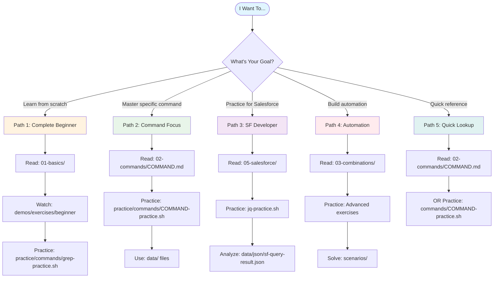

# Shell Commands Mastery Guide

Complete guide to Unix/Linux shell commands used in Salesforce development and automation.

---

## 📚 Course Structure

```mermaid
graph TD
    Start([Shell Commands Course]) --> Part1[Part 1: Fundamentals]
    Start --> Part2[Part 2: Essential Commands]
    Start --> Part3[Part 3: Command Combinations]
    Start --> Part4[Part 4: Practice Exercises]
    Start --> Part4_5[Part 4.5: Interactive Practice]
    Start --> Part5[Part 5: Salesforce-Specific]

    Part1 --> P1A[Operators & Symbols]
    Part1 --> P1B[Input/Output Redirection]

    Part2 --> P2A[Text Processing<br/>grep, sed, awk, cut, etc.]
    Part2 --> P2B[File Operations<br/>find, cat, diff, etc.]
    Part2 --> P2C[System & Process<br/>ps, top, df/du]
    Part2 --> P2D[Archives<br/>tar, zip, gzip]
    Part2 --> P2E[Network<br/>curl, wget, ping]
    Part2 --> P2F[Advanced Text<br/>jq, comm, paste]
    Part2 --> P2G[Shell Utilities<br/>echo, date, xargs]

    Part3 --> P3A[Piping Patterns]
    Part3 --> P3B[Command Chaining]
    Part3 --> P3C[Linux System Patterns]
    Part3 --> P3D[Advanced Patterns]

    Part4 --> P4A[Beginner: 20 exercises]
    Part4 --> P4B[Intermediate: 20 exercises]
    Part4 --> P4C[Advanced: 20 exercises]
    Part4 --> P4D[Expert: 20 exercises]

    Part4_5 --> P45A[35 Practice Files<br/>383 Exercises]
    Part4_5 --> P45B[Automatic Validation]
    Part4_5 --> P45C[Progress Tracking]

    Part5 --> P5A[SF CLI Integration]
    Part5 --> P5B[Apex Log Analysis]
    Part5 --> P5C[Deployment Scripts]

    style Start fill:#4caf50,color:#fff
    style Part1 fill:#2196f3,color:#fff
    style Part2 fill:#ff9800,color:#fff
    style Part3 fill:#9c27b0,color:#fff
    style Part4 fill:#f44336,color:#fff
    style Part4_5 fill:#00bcd4,color:#fff
    style Part5 fill:#795548,color:#fff
```



### **Part 1: Fundamentals**

- [Shell Operators & Symbols](./01-basics/operators.md) - `|`, `>`, `>>`, `2>&1`, `&&`, `||`
- [Input/Output Redirection](./01-basics/redirection.md) - stdin, stdout, stderr

### **Part 2: Essential Commands**

**Text Processing:**

- [grep - Search & Filter](./02-commands/grep.md) - Text pattern matching
- [sed - Stream Editor](./02-commands/sed.md) - Text transformation
- [awk - Text Processing](./02-commands/awk.md) - Column-based processing
- [cut - Extract Columns](./02-commands/cut.md) - Extract fields and columns
- [sort - Sort Lines](./02-commands/sort.md) - Sort text lines
- [uniq - Filter Duplicates](./02-commands/uniq.md) - Remove duplicate lines
- [tr - Translate Characters](./02-commands/tr.md) - Transform characters
- [wc - Count Lines/Words](./02-commands/wc.md) - Count lines, words, bytes

**File Operations:**

- [find - Search Files](./02-commands/find.md) - Find files and directories
- [tail/head - File Viewing](./02-commands/tail-head.md) - View file portions
- [cat - Concatenate](./02-commands/cat.md) - Display & combine files
- [diff - Compare Files](./02-commands/diff.md) - Show file differences
- [tee - Duplicate Output](./02-commands/tee.md) - Split output streams

**System & Process:**

- [ps - Process Status](./02-commands/ps.md) - Display running processes
- [top - System Monitor](./02-commands/top.md) - Real-time process monitoring
- [df/du - Disk Usage](./02-commands/df-du.md) - Filesystem and directory space

**Archives & Compression:**

- [tar - Archive Files](./02-commands/tar.md) - Create and extract archives
- [zip/unzip - ZIP Files](./02-commands/zip.md) - ZIP compression
- [gzip/gunzip - Compression](./02-commands/gzip.md) - GNU compression

**Network & Download:**

- [curl - Transfer Data](./02-commands/curl.md) - Download and API calls
- [wget - Download Files](./02-commands/wget.md) - Network downloader
- [ping - Test Connectivity](./02-commands/ping.md) - Network connectivity test
- [netstat - Network Stats](./02-commands/netstat.md) - Network connections

**Advanced Text:**

- [jq - JSON Processor](./02-commands/jq.md) - Parse JSON data
- [comm - Compare Sorted](./02-commands/comm.md) - Compare sorted files
- [paste - Merge Lines](./02-commands/paste.md) - Merge file lines
- [column - Format Columns](./02-commands/column.md) - Columnize output

**Shell Utilities:**

- [echo - Print Text](./02-commands/echo.md) - Output text
- [xargs - Command Builder](./02-commands/xargs.md) - Build commands from input
- [date - Date/Time](./02-commands/date.md) - Display and format dates
- [chmod - Permissions](./02-commands/chmod.md) - Change file permissions
- [env - Environment](./02-commands/env.md) - Environment variables
- [alias - Shortcuts](./02-commands/alias.md) - Command aliases
- [history - Command History](./02-commands/history.md) - Command history management

### **Part 3: Command Combinations**

- [Piping Patterns](./03-combinations/piping.md) - Chain commands with `|`
- [Command Chaining](./03-combinations/chaining.md) - Sequential execution
- [Linux System Patterns](./03-combinations/linux-system-patterns.md) - Generic system administration
- [Advanced Patterns](./03-combinations/advanced-patterns.md) - Complex workflows

### **Part 4: Practice Exercises**

- [Beginner Level](./04-practice/beginner.md) - 20 exercises ✅
- [Intermediate Level](./04-practice/intermediate.md) - 20 exercises ✅
- [Advanced Level](./04-practice/advanced.md) - 20 exercises ✅
- [Expert Level](./04-practice/expert.md) - 20 exercises ✅

### **Part 4.5: Interactive Practice System** ⭐ NEW!

**Active learning with automatic validation and progress tracking!**

The interactive practice system provides hands-on exercises where you **type commands yourself** and get **immediate feedback** on your answers.

**Location:** [`practice-environment/practice/`](./practice-environment/practice/)

#### What's Included

- **35 Practice Command Files** - One for each documented command
- **383 Total Exercises** - Beginner to expert level
- **Automatic Validation** - System checks your commands and output
- **Progress Tracking** - JSON-based progress saved per user
- **Practice Menu System** - Interactive menu organized by category
- **6 Validation Modes** - Exact, numeric, contains, regex, lines, sorted
- **3 Attempts Per Question** - Hints after wrong attempts, solutions after 3 failures

#### Quick Start

```bash
# Navigate to practice directory
cd practice-environment/practice

# Use interactive menu
./practice-menu.sh

# Or practice a specific command directly
./commands/grep-practice.sh
./commands/awk-practice.sh
./commands/jq-practice.sh
```

#### Practice vs Reading Exercises

| Feature            | Reading Exercises (Part 4) | Interactive Practice (Part 4.5)  |
| ------------------ | -------------------------- | -------------------------------- |
| **Location**       | `04-practice/*.md`         | `practice-environment/practice/` |
| **Learning Style** | Read and understand        | Type commands yourself           |
| **Validation**     | Manual (check solutions)   | Automatic validation             |
| **Feedback**       | After reading solution     | Immediate (correct/incorrect)    |
| **Progress**       | Manual tracking            | Automatic JSON tracking          |
| **Scoring**        | None                       | Yes, with assessment             |
| **Best For**       | Understanding concepts     | Building muscle memory           |

#### View Your Progress

```bash
cd practice-environment/practice

# Interactive progress menu
./progress.sh

# Quick summary
./progress.sh summary

# Detailed report
./progress.sh show

# Commands needing work
./progress.sh needs

# Mastered commands
./progress.sh mastered
```

#### Available Practice Commands

**High Priority (Start Here):**

- `grep-practice.sh` - 15 exercises
- `awk-practice.sh` - 15 exercises
- `sed-practice.sh` - 15 exercises
- `jq-practice.sh` - 15 exercises
- `find-practice.sh` - 15 exercises

**All 35 Commands Available:**

- Text Processing: grep, awk, sed, cut, sort, uniq, wc, tr
- File Operations: cat, head, tail, find, diff, tee, chmod
- Data Processing: jq, column, paste, comm
- Archives: tar, gzip, zip
- Network: curl, wget, ping, netstat
- System: ps, top, df-du, env
- Utilities: echo, date, xargs, alias, history

📖 **Complete Guide:** [`practice-environment/README.md`](./practice-environment/README.md) - Single comprehensive guide covering all components (practice, demos, data, exercises, and more)

### **Part 5: Salesforce-Specific**

- [SF CLI Integration](./05-salesforce/sf-cli-patterns.md) - Salesforce CLI workflows
- [Apex Log Analysis](./05-salesforce/log-analysis.md) - Parse & filter logs
- [Deployment Scripts](./05-salesforce/deployment-scripts.md) - Automation patterns

---

## 🎯 Learning Path

```mermaid
gantt
    title 4-Week Shell Commands Learning Path
    dateFormat YYYY-MM-DD
    section Week 1: Basics
    Read operators.md                    :w1a, 2024-01-01, 1d
    Practice: grep, cut, sort           :w1b, after w1a, 3d
    Read grep.md, tail-head.md          :w1c, after w1a, 1d
    Complete beginner exercises         :w1d, after w1b, 2d
    section Week 2: Core Commands
    Read sed.md, awk.md                 :w2a, after w1d, 1d
    Practice: sed, awk, jq              :w2b, after w2a, 3d
    Read jq.md, xargs.md                :w2c, after w2a, 1d
    Complete intermediate exercises     :w2d, after w2b, 2d
    section Week 3: Combinations
    Read piping.md, chaining.md         :w3a, after w2d, 1d
    Practice: Advanced exercises        :w3b, after w3a, 3d
    Read advanced-patterns.md           :w3c, after w3a, 1d
    Track progress                      :w3d, after w3b, 1d
    section Week 4: Mastery
    Complete expert exercises            :w4a, after w3d, 2d
    Master all 35 practice files        :w4b, after w4a, 3d
    Read SF CLI guides                  :w4c, after w4a, 1d
    Build automation scripts            :w4d, after w4b, 2d
```

### **Week 1: Basics**

1. Read operators.md
2. Complete beginner practice (1-10) from `04-practice/beginner.md`
3. **Practice interactively:** `cd practice-environment/practice && ./commands/grep-practice.sh`
4. Read grep.md and tail-head.md
5. Complete beginner practice (11-20)
6. **Practice interactively:** `./commands/cut-practice.sh`

### **Week 2: Core Commands**

1. Read sed.md and awk.md
2. **Practice interactively:** `./commands/sed-practice.sh` and `./commands/awk-practice.sh`
3. Complete intermediate practice (1-10) from `04-practice/intermediate.md`
4. Read jq.md and xargs.md
5. **Practice interactively:** `./commands/jq-practice.sh`
6. Complete intermediate practice (11-20)

### **Week 3: Combinations**

1. Read piping.md and chaining.md
2. **Practice interactively:** Try advanced exercises in practice menu
3. Complete advanced practice (1-10) from `04-practice/advanced.md`
4. Read advanced-patterns.md
5. **Track progress:** `./progress.sh show`
6. Complete advanced practice (11-20)

### **Week 4: Mastery**

1. Complete expert practice (1-20) from `04-practice/expert.md`
2. **Master all commands:** Complete all 35 practice files
3. **View mastery:** `./progress.sh mastered`
4. Read SF CLI integration guides
5. Build your own automation scripts

---

## 🎯 Quick Decision Guide

**"What should I do based on my situation?"**



---

## 🔥 Quick Reference

### Most Common Patterns

**Generic Linux:**

```bash
# Monitor system logs for errors
tail -f /var/log/syslog | grep --color=always -iE "error|fail"

# Find large files
find /var/log -type f -size +100M -exec ls -lh {} \;

# Extract IP addresses from access log
grep -oE "\b([0-9]{1,3}\.){3}[0-9]{1,3}\b" access.log | sort | uniq -c

# Parse JSON API response
curl -s "https://api.example.com/users" | jq -r '.users[].name'

# Process CSV data
awk -F',' '$3 > 100 {print $1","$2","$3}' data.csv

# Check Docker container health
docker ps --format "table {{.Names}}\t{{.Status}}\t{{.Ports}}"
```

**Salesforce-Specific:**

```bash
# Filter and format Apex logs
sf apex run --file script.apex | grep "ERROR" | tail -10

# Deploy with test validation
sf project deploy start && sf apex run test --test-level RunLocalTests

# Process SOQL query results
sf data query --query "SELECT Id FROM Account" --json | jq '.result.records[]'

# Extract deployment errors
sf project deploy start --json | jq -r '.result.details.componentFailures[]'
```

**Data Processing:**

```bash
# Count occurrences
grep "pattern" file.txt | wc -l

# Extract and sort columns
cat data.csv | awk -F',' '{print $2}' | sort | uniq -c

# Save output and errors
command 2>&1 | tee output.log

# Chain commands conditionally
backup && verify || alert
```

---

## 📖 How to Use This Guide

### Scenario-Based Guide: What to Do When

**"I want to learn shell commands from scratch"**

```bash
# Step 1: Read fundamentals
cd shell-commands
cat 01-basics/operators.md
cat 01-basics/redirection.md

# Step 2: Watch examples
cd practice-environment/demos/exercises/beginner
./01-grep-basics.sh

# Step 3: Practice interactively
cd ../practice
./commands/grep-practice.sh

# Step 4: Read command documentation
cd ../../02-commands
cat grep.md
```

**"I know basics, want to master specific commands"**

```bash
# Step 1: Read command guide
cd shell-commands/02-commands
cat awk.md  # or sed.md, jq.md, etc.

# Step 2: Practice that command
cd ../practice-environment/practice
./commands/awk-practice.sh

# Step 3: Practice on real data
cd ../data
awk -F',' '{print $2}' csv/accounts.csv

# Step 4: Check progress
cd ../practice
./progress.sh show
```

**"I want to practice for Salesforce development"**

```bash
# Step 1: Read Salesforce-specific guides
cd shell-commands/05-salesforce
cat sf-cli-patterns.md
cat log-analysis.md

# Step 2: Practice JSON processing (critical for SF)
cd ../practice-environment/practice
./commands/jq-practice.sh

# Step 3: Practice on Salesforce data
cd ../data
jq '.result.records[].Name' json/sf-query-result.json

# Step 4: Analyze Salesforce logs
grep "ERROR" logs/apex-debug.log | tail -10
```

**"I want to build automation scripts"**

```bash
# Step 1: Master command combinations
cd shell-commands/03-combinations
cat piping.md
cat chaining.md
cat advanced-patterns.md

# Step 2: Practice advanced exercises
cd ../practice-environment/practice
./practice-menu.sh  # Select advanced commands

# Step 3: Study deployment scripts
cd ../05-salesforce
cat deployment-scripts.md

# Step 4: Practice real scenarios
cd ../practice-environment/scenarios
cd deployment-failure
cat README.md
# Solve the challenge
```

**"I want to track my learning progress"**

```bash
# Step 1: Use interactive practice (tracks automatically)
cd shell-commands/practice-environment/practice
./practice-menu.sh
# Complete exercises

# Step 2: Check progress
./progress.sh summary
./progress.sh mastered
./progress.sh needs

# Step 3: Export progress
./progress.sh export > my-progress.csv

# Step 4: Focus on weak areas
./progress.sh needs
# Practice commands that need work
```

**"I need quick reference for a specific command"**

```bash
# Option 1: Read command guide
cd shell-commands/02-commands
cat grep.md  # Replace with your command

# Option 2: Quick practice
cd practice-environment/practice
./commands/grep-practice.sh

# Option 3: See examples
cd ../demos/exercises/beginner
./01-grep-basics.sh
```

### General Learning Workflow

1. **Read**: Each topic has explanations and examples
2. **Watch**: Use demos to see commands in action (`practice-environment/demos/`)
3. **Practice**: Try examples in your terminal
4. **Validate**: Use interactive practice (`practice-environment/practice/`) for immediate feedback
5. **Exercise**: Complete practice problems (reading exercises in `04-practice/`)
6. **Apply**: Use real data files (`practice-environment/data/`)
7. **Review**: Check solutions and track your progress

---

## 🛠️ Prerequisites

- Access to a Unix/Linux terminal (macOS, Linux, or WSL on Windows)
- Basic command line familiarity
- Salesforce CLI installed (for SF-specific sections)

---

## 💡 Tips for Success

1. **Type, Don't Copy**: Type commands manually to build muscle memory
2. **Experiment**: Try variations of examples
3. **Read Errors**: Understanding errors is key to learning
4. **Build Incrementally**: Start simple, add complexity
5. **Document**: Keep notes of useful patterns

---

## 🎓 Certification

Complete all practice exercises to earn your "Shell Master" badge! 🏆

**Reading Exercises (80 total):**

- [ ] Beginner (20/20)
- [ ] Intermediate (20/20)
- [ ] Advanced (20/20)
- [ ] Expert (20/20)

**Interactive Practice (383 exercises across 35 commands):**

- Use `cd practice-environment/practice && ./progress.sh` to track your progress
- Master all 35 command practice files
- Aim for 90%+ score on each command

---

**Ready to begin? Start with [Shell Operators](./01-basics/operators.md)!**
