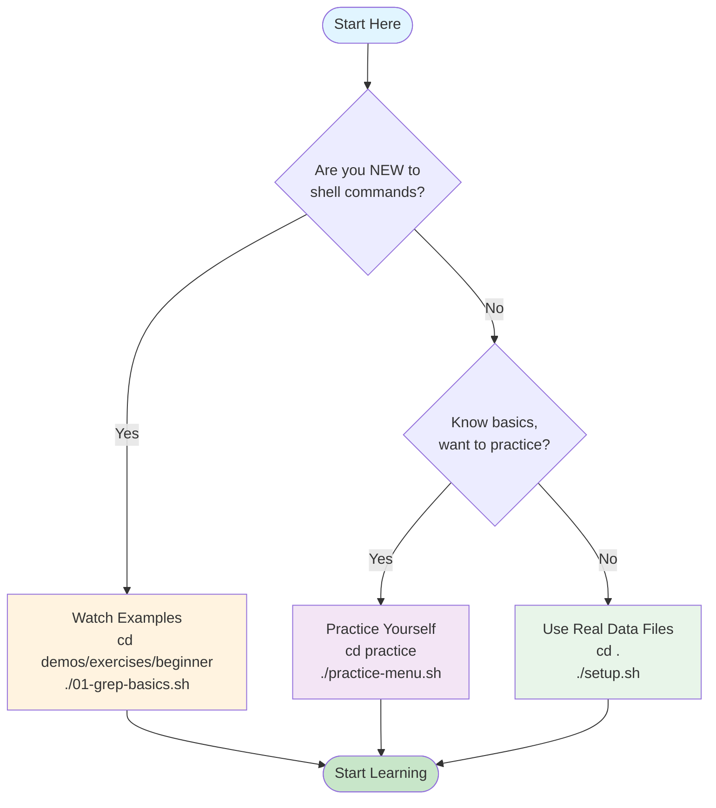
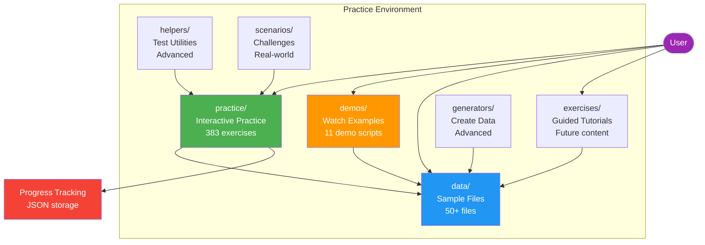
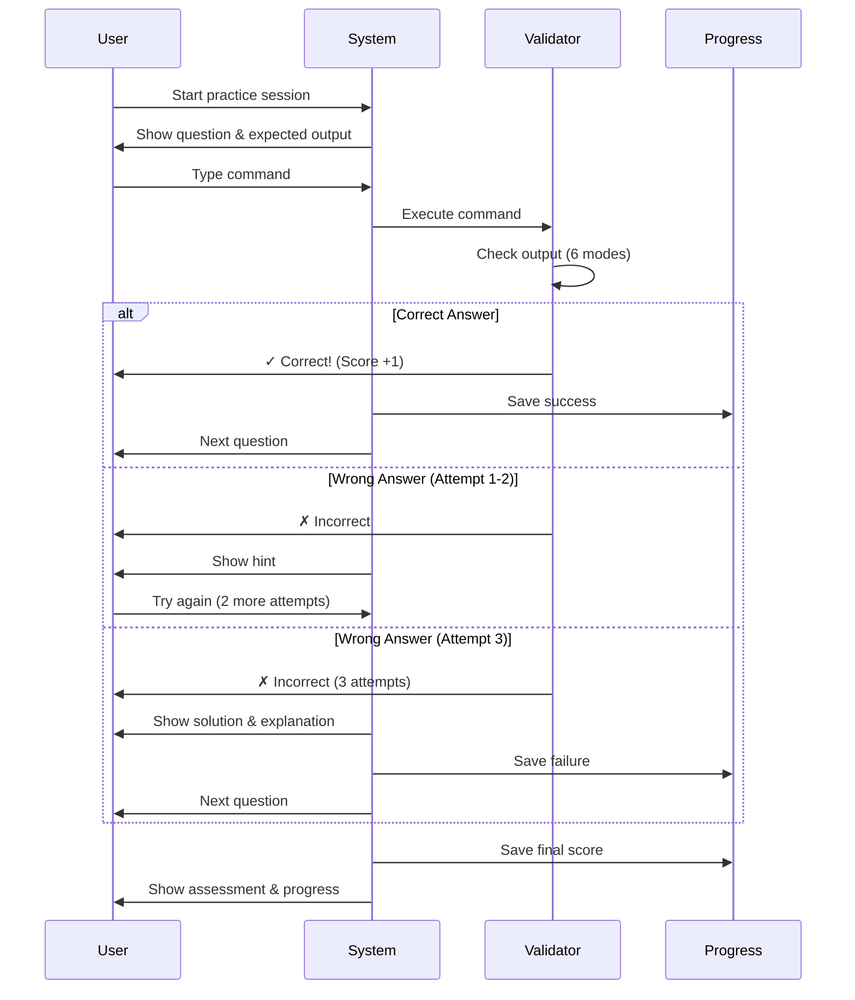
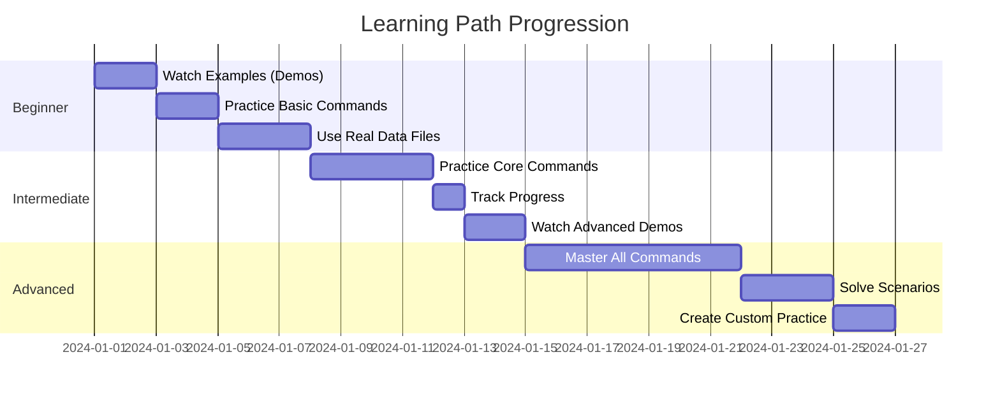

# Shell Commands Practice Environment

**Complete guide to practicing Unix/Linux shell commands with real data and interactive exercises.**

---

## 🚀 Quick Start (30 seconds)

**Choose your path:**



### Path 1: New to Shell Commands

```bash
cd shell-commands/practice-environment/demos/exercises/beginner
./01-grep-basics.sh
# Press Enter to see each example
```

### Path 2: Know Basics, Want to Practice

```bash
cd shell-commands/practice-environment/practice
./practice-menu.sh
# Select a command → Type commands → Get feedback
```

### Path 3: Want to Use Real Data Files

```bash
cd shell-commands/practice-environment
./setup.sh  # One-time setup
grep "ERROR" data/logs/application.log
```

---

## 🏗️ Component Architecture



---

## 📚 Sections

### Section 1: Interactive Practice (`practice/`) ⭐ RECOMMENDED

**What:** Type commands yourself and get immediate validation feedback. System checks your answers automatically.

**When to use:**

- You know basic commands and want to practice
- You want to test your knowledge
- You want to track your progress
- You want immediate feedback on your answers

**How to launch:**

**Option 1: Interactive Menu (Easiest)**

```bash
cd shell-commands/practice-environment/practice
./practice-menu.sh
# Select category → Select command → Start practicing
```

**Option 2: Direct Command Practice**

```bash
cd shell-commands/practice-environment/practice
./commands/grep-practice.sh
# Type commands when prompted
```

**What happens:**



**Step-by-step process:**

1. System shows you a question (e.g., "Count lines containing 'ERROR'")
2. You type your command
3. System executes it and checks if output matches expected result
4. You get immediate feedback: ✓ Correct or ✗ Try again
5. After 3 wrong attempts, solution is shown
6. Your progress is saved automatically

**Available Commands (35 total, 383 exercises):**

**High Priority (Start Here):**

- `grep-practice.sh` - 15 exercises (pattern matching)
- `awk-practice.sh` - 15 exercises (text processing)
- `sed-practice.sh` - 15 exercises (stream editing)
- `jq-practice.sh` - 15 exercises (JSON processing)
- `find-practice.sh` - 15 exercises (file searching)

**All 35 Commands:**

**Text Processing (8):**

- `grep-practice.sh` - 15 exercises
- `awk-practice.sh` - 15 exercises
- `sed-practice.sh` - 15 exercises
- `cut-practice.sh` - 12 exercises
- `sort-practice.sh` - 12 exercises
- `uniq-practice.sh` - 10 exercises
- `wc-practice.sh` - 10 exercises
- `tr-practice.sh` - 10 exercises

**File Operations (7):**

- `cat-practice.sh` - 10 exercises
- `head-practice.sh` - 10 exercises
- `tail-practice.sh` - 12 exercises
- `find-practice.sh` - 15 exercises
- `diff-practice.sh` - 10 exercises
- `tee-practice.sh` - 10 exercises
- `chmod-practice.sh` - 10 exercises

**Data Processing (4):**

- `jq-practice.sh` - 15 exercises
- `column-practice.sh` - 10 exercises
- `paste-practice.sh` - 10 exercises
- `comm-practice.sh` - 10 exercises

**Archives (3):**

- `tar-practice.sh` - 12 exercises
- `gzip-practice.sh` - 10 exercises
- `zip-practice.sh` - 10 exercises

**Network (4):**

- `curl-practice.sh` - 10 exercises (conceptual)
- `wget-practice.sh` - 10 exercises (conceptual)
- `ping-practice.sh` - 8 exercises (conceptual)
- `netstat-practice.sh` - 8 exercises (conceptual)

**System (4):**

- `ps-practice.sh` - 10 exercises
- `top-practice.sh` - 8 exercises
- `df-du-practice.sh` - 12 exercises
- `env-practice.sh` - 10 exercises

**Utilities (5):**

- `echo-practice.sh` - 10 exercises
- `date-practice.sh` - 12 exercises
- `xargs-practice.sh` - 12 exercises
- `alias-practice.sh` - 10 exercises
- `history-practice.sh` - 10 exercises

**Progress Tracking:**

```bash
cd shell-commands/practice-environment/practice

# Interactive progress menu
./progress.sh

# Quick summary
./progress.sh summary

# Detailed report
./progress.sh show

# Commands needing work
./progress.sh needs

# Mastered commands (90%+)
./progress.sh mastered

# Export to CSV
./progress.sh export
```

**Scoring System:**

- **90-100%**: ⭐⭐⭐ Master Level
- **75-89%**: ⭐⭐ Advanced Level
- **60-74%**: ⭐ Intermediate Level
- **< 60%**: Keep practicing!

**Special Commands While Practicing:**

- Type `skip` or `s` - Skip current question
- Type `solution` or `sol` - Show solution and explanation
- Press `Ctrl+C` - Exit practice session

**Examples:**

```bash
# Practice grep
cd shell-commands/practice-environment/practice
./commands/grep-practice.sh

# Practice awk
./commands/awk-practice.sh

# Use menu for all options
./practice-menu.sh

# Check progress
./progress.sh summary
```

---

### Section 2: Watch Examples (`demos/`)

**What:** Scripts that show you examples. You press Enter to see each step. Passive learning.

**When to use:**

- You're completely new to shell commands
- You want to see how a command works before trying it
- You need a quick reference/reminder
- You want to learn by watching

**How to launch:**

```bash
cd shell-commands/practice-environment/demos/exercises/beginner
./01-grep-basics.sh
# Press Enter to see each example
```

**Available Demos:**

**Beginner Level:**

- `beginner/01-grep-basics.sh` - grep pattern matching (10 min)
- `beginner/02-piping-basics.sh` - Chaining commands (10 min)
- `beginner/03-json-processing.sh` - jq for JSON (15 min, requires jq)
- `beginner/04-file-operations.sh` - cat, head, tail, wc (10 min)
- `beginner/05-csv-basics.sh` - awk, cut, sort for CSV (15 min)

**Intermediate Level:**

- `intermediate/01-log-analysis.sh` - Real log scenarios (20 min)
- `intermediate/02-salesforce-analysis.sh` - SF debugging (25 min)
- `intermediate/03-data-transformation.sh` - Format conversion (20 min)

**Advanced Level:**

- `advanced/01-complex-pipelines.sh` - Multi-stage processing (30 min)
- `advanced/02-automation-scripts.sh` - Script building (30 min)

**Expert Level:**

- `expert/01-production-scenarios.sh` - Real incidents (45 min)

**Examples:**

```bash
# Watch grep basics
cd shell-commands/practice-environment/demos/exercises/beginner
./01-grep-basics.sh

# Watch JSON processing
./03-json-processing.sh

# Watch log analysis
cd ../intermediate
./01-log-analysis.sh
```

---

### Section 3: Use Real Data (`data/`)

**What:** Real data files (logs, JSON, CSV, text) that you can practice commands on.

**When to use:**

- You want to practice commands on real files
- You're following tutorials and need sample data
- You want to experiment without creating your own files
- You need realistic data for testing

**How to setup:**

```bash
cd shell-commands/practice-environment
./setup.sh  # One-time setup (creates sample data)
```

**Available Data Files:**

**Log Files (`data/logs/`):**

- `application.log` - Generic application logs (500+ lines)
- `apex-debug.log` - Salesforce Apex debug log
- `deployment.log` - Salesforce deployment output
- `web-access.log` - Apache/Nginx format access logs
- `system.log` - System logs
- `error-mixed.log` - Mixed error logs

**JSON Files (`data/json/`):**

- `sf-query-result.json` - Salesforce CLI query output
- `api-response.json` - REST API responses
- `deploy-result.json` - SF deployment result
- `nested-complex.json` - Complex nested JSON
- `users.json` - User data

**CSV Files (`data/csv/`):**

- `accounts.csv` - Salesforce Accounts (100+ rows)
- `contacts.csv` - Contacts data
- `sales-data.csv` - Sales transactions (1000+ rows)
- `large-dataset.csv` - Performance testing (10K+ rows)
- `server-metrics.csv` - Server metrics

**Text Files (`data/text/`):**

- `sample-code.cls` - Apex class files
- `urls.txt` - URL list
- `emails.txt` - Email addresses
- `mixed-content.txt` - Mixed text content
- `config-files.txt` - Configuration files

**XML Files (`data/xml/`):**

- `metadata.xml` - Salesforce metadata
- `package.xml` - Package manifest

**Archives (`data/archives/`):**

- `sample-archive.tar` - Tar archive
- `sample-archive.tar.gz` - Compressed tar
- `sample-archive.zip` - ZIP archive
- `sample.log` - Log file
- `sample.log.gz` - Compressed log

**Example Commands:**

```bash
cd shell-commands/practice-environment

# Count ERROR lines
grep -c "ERROR" data/logs/application.log

# Extract account names from JSON
jq -r '.result.records[].Name' data/json/sf-query-result.json

# Show first 10 accounts
head -10 data/csv/accounts.csv

# Extract specific columns
cut -d',' -f2,3,4 data/csv/accounts.csv

# Filter by industry
awk -F',' '$3 == "Technology" {print $2}' data/csv/accounts.csv

# Count total records
jq '.result.totalSize' data/json/sf-query-result.json
```

---

### Section 4: Guided Tutorials (`exercises/`)

**What:** Tutorial scripts that walk you through concepts step-by-step. Currently, most exercises are in `demos/exercises/`.

**When to use:**

- You want structured, guided learning
- You prefer step-by-step explanations
- You want to understand workflows and scenarios

**How to launch:**

```bash
# Exercises are in demos/exercises/ directory
cd shell-commands/practice-environment/demos/exercises/beginner
./01-grep-basics.sh
# Follow along with the tutorial
```

**Available Exercises:**

Same as demos (see Section 2 above). The `exercises/` folder structure is prepared for future content.

**Examples:**

```bash
# Beginner exercises
cd shell-commands/practice-environment/demos/exercises/beginner
./01-grep-basics.sh
./02-piping-basics.sh
./03-json-processing.sh

# Intermediate exercises
cd ../intermediate
./01-log-analysis.sh
./02-salesforce-analysis.sh
```

---

### Section 5: Advanced Tools

#### Generators (`generators/`)

**What:** Scripts that generate additional sample data files for extended practice.

**When to use:**

- You need more data files for practice
- You want to test with larger datasets
- You're creating custom practice scenarios
- You've exhausted the default sample files
- You want to test performance with bigger files

**How to use:**

```bash
cd shell-commands/practice-environment/generators
./generate-all.sh
# Creates additional data files in data/ directory
```

**What it generates:**

- Additional log files with more entries
- Larger CSV datasets
- More JSON files
- Extended text files

**Complete Example Workflow:**

```bash
# Step 1: Navigate to generators
cd shell-commands/practice-environment/generators

# Step 2: Generate additional data
./generate-all.sh

# Step 3: Verify new files were created
cd ../data
ls -lh logs/    # Check for new log files
ls -lh csv/     # Check for larger CSV files

# Step 4: Practice on new data
grep "ERROR" logs/new-application.log
wc -l csv/large-dataset.csv
jq '.records | length' json/extended-data.json

# Step 5: Test performance with larger files
time grep "pattern" logs/large-log.log
```

**Use Cases:**

**Case 1: Need More Log Entries**

```bash
cd generators
./generate-all.sh
cd ../data/logs
# Now you have more log files to practice grep, awk, sed on
grep -c "ERROR" large-application.log
```

**Case 2: Testing with Large CSV Files**

```bash
cd generators
./generate-all.sh
cd ../data/csv
# Practice awk, cut, sort on larger datasets
awk -F',' 'NR>1 && $4 > 1000000 {print $2}' large-dataset.csv | wc -l
```

**Case 3: Creating Custom Practice Scenarios**

```bash
cd generators
./generate-all.sh
# Modify generated files for your specific practice needs
cd ../data
# Add your own test cases to the generated files
```

#### Helpers (`helpers/`)

**What:** Helper scripts for testing and practice scenarios that simulate real-world conditions.

**When to use:**

- You're practicing error handling (failing commands)
- You're practicing process monitoring (slow processes)
- You're creating test file structures
- You want to test command chaining with failures (`&&`, `||`)
- You need to practice `ps` and `top` commands

**How to use:**

```bash
cd shell-commands/practice-environment/helpers

# Simulate a failing command
./failing-command.sh 1 "Connection timeout"

# Simulate a long-running process (for ps/top practice)
./slow-process.sh

# Create test file structure (for find practice)
./create-test-files.sh
```

**Complete Examples:**

**Example 1: Practice Error Handling**

```bash
cd shell-commands/practice-environment/helpers

# Simulate a command that fails with exit code 1
./failing-command.sh 1 "Connection timeout"
echo $?  # Should output: 1

# Use in command chaining practice
./failing-command.sh 1 "Error" && echo "Success" || echo "Failed"
# Output: Error message, then "Failed"

# Practice with different exit codes
./failing-command.sh 2 "Permission denied"
./failing-command.sh 127 "Command not found"
```

**Example 2: Practice Process Monitoring**

```bash
cd shell-commands/practice-environment/helpers

# Start a slow process in background
./slow-process.sh &
SLOW_PID=$!

# Now practice ps command
ps aux | grep slow-process
ps -p $SLOW_PID -o pid,cmd,%cpu,%mem

# Practice top command (interactive)
top -p $SLOW_PID

# Kill the process when done
kill $SLOW_PID
```

**Example 3: Practice find Command**

```bash
cd shell-commands/practice-environment/helpers

# Create test file structure
./create-test-files.sh

# Now practice find commands
find . -name "*.txt" -type f
find . -size +1M -exec ls -lh {} \;
find . -mtime -1 -type f

# Clean up when done
rm -rf test-dir-*
```

**Example 4: Combined Practice Session**

```bash
cd shell-commands/practice-environment/helpers

# Create test files
./create-test-files.sh

# Start slow process
./slow-process.sh &
SLOW_PID=$!

# Practice finding and monitoring
find . -name "*.log" -exec grep "ERROR" {} \;
ps aux | grep slow-process | grep -v grep

# Test error handling
./failing-command.sh 1 "Test error" || echo "Handled error gracefully"

# Clean up
kill $SLOW_PID 2>/dev/null
rm -rf test-dir-*
```

#### Scenarios (`scenarios/`)

**What:** Challenge problems based on real-world scenarios that require combining multiple commands.

**When to use:**

- You've mastered basic commands
- You want to solve realistic problems
- You're preparing for real-world tasks
- You want to practice complex command combinations
- You're ready for expert-level challenges

**How to use:**

```bash
cd shell-commands/practice-environment/scenarios/deployment-failure
cat README.md  # Read the challenge
# Use your skills to solve it
```

**Available Scenarios:**

- `deployment-failure/` - Debug a failed deployment
- `log-investigation/` - Investigate production issues
- `data-migration/` - Transform and validate data
- `performance-tuning/` - Optimize slow scripts

**Complete Example: Deployment Failure Scenario**

```bash
# Step 1: Navigate to scenario
cd shell-commands/practice-environment/scenarios/deployment-failure

# Step 2: Read the challenge
cat README.md
# Challenge: Find all deployment errors, extract component names,
# count failures by type, and create a summary report

# Step 3: Explore available files
ls -la
# You'll find: deployment.log, error-summary.txt, etc.

# Step 4: Solve the challenge using shell commands
# Example solution approach:
grep "ERROR" deployment.log | \
  awk '{print $3}' | \
  sort | uniq -c | \
  sort -nr > error-summary.txt

# Step 5: Verify your solution
cat error-summary.txt
```

**Example: Log Investigation Scenario**

```bash
cd shell-commands/practice-environment/scenarios/log-investigation

# Read challenge
cat README.md
# Challenge: Find root cause of production incident from logs

# Analyze logs
grep -E "ERROR|FATAL" logs/application.log | \
  tail -20 | \
  awk '{print $1, $2, $4}' | \
  sort -u

# Extract error patterns
grep "ERROR" logs/application.log | \
  sed 's/.*ERROR: //' | \
  sort | uniq -c | \
  sort -nr | head -10

# Create investigation report
{
  echo "=== Error Summary ==="
  grep -c "ERROR" logs/application.log
  echo ""
  echo "=== Top Errors ==="
  grep "ERROR" logs/application.log | \
    sed 's/.*ERROR: //' | \
    sort | uniq -c | \
    sort -nr | head -5
} > investigation-report.txt
```

**Example: Data Migration Scenario**

```bash
cd shell-commands/practice-environment/scenarios/data-migration

# Read challenge
cat README.md
# Challenge: Transform CSV data, validate format, and generate report

# Transform data
awk -F',' 'NR>1 {
  gsub(/"/, "", $2)
  print $1","$2","toupper($3)","$4
}' source-data.csv > transformed-data.csv

# Validate transformation
wc -l source-data.csv transformed-data.csv
# Should have same line count (minus header)

# Generate validation report
{
  echo "=== Migration Report ==="
  echo "Source records: $(tail -n +2 source-data.csv | wc -l)"
  echo "Transformed records: $(tail -n +2 transformed-data.csv | wc -l)"
  echo ""
  echo "=== Sample Transformed Data ==="
  head -5 transformed-data.csv
} > migration-report.txt
```

**Example: Performance Tuning Scenario**

```bash
cd shell-commands/practice-environment/scenarios/performance-tuning

# Read challenge
cat README.md
# Challenge: Optimize slow script, identify bottlenecks

# Time the original script
time ./slow-script.sh

# Profile the script
strace -c ./slow-script.sh 2>&1 | tail -20

# Find slow operations
./slow-script.sh 2>&1 | \
  grep -E "took|slow|timeout" | \
  sort -k2 -nr

# Optimize and compare
time ./optimized-script.sh
```

**Tips for Solving Scenarios:**

1. **Read the challenge carefully** - Understand what's being asked
2. **Explore available files** - `ls -la` to see what data you have
3. **Start simple** - Use basic commands first, then combine
4. **Test incrementally** - Verify each step before moving on
5. **Document your solution** - Save commands in a script for reference

---

## 🎯 Learning Paths



### Path 1: Complete Beginner (Week 1-2)

**Day 1-2: Watch Examples**

```bash
cd shell-commands/practice-environment/demos/exercises/beginner
./01-grep-basics.sh
./02-piping-basics.sh
./04-file-operations.sh
```

**Day 3-4: Practice Interactively**

```bash
cd shell-commands/practice-environment/practice
./commands/grep-practice.sh
./commands/cut-practice.sh
./commands/sort-practice.sh
```

**Day 5-7: Practice on Real Data**

```bash
cd shell-commands/practice-environment
grep "ERROR" data/logs/application.log
head -20 data/csv/accounts.csv
jq '.result.records[].Name' data/json/sf-query-result.json
```

### Path 2: Intermediate (Week 3-4)

**Practice Core Commands:**

```bash
cd shell-commands/practice-environment/practice
./commands/awk-practice.sh
./commands/sed-practice.sh
./commands/jq-practice.sh
./commands/find-practice.sh
```

**Track Progress:**

```bash
./progress.sh show
```

**Work on Weak Areas:**

```bash
./progress.sh needs
# Practice commands that need work
```

**Watch Advanced Demos:**

```bash
cd ../demos/exercises/intermediate
./01-log-analysis.sh
./02-salesforce-analysis.sh
```

### Path 3: Advanced (Week 5+)

**Master All Commands:**

```bash
cd shell-commands/practice-environment/practice
./practice-menu.sh
# Complete all 35 practice files
```

**Solve Scenarios:**

```bash
cd ../scenarios
# Work through challenge problems
cd deployment-failure
cat README.md
```

**Create Custom Practice:**

```bash
cd ../generators
./generate-all.sh
# Generate your own data
```

**View Mastery:**

```bash
cd ../practice
./progress.sh mastered
```

---

## 📋 Command Reference

**Quick reference: Want to X? → cd here → run this**

| You Want To...                | cd here                        | run this                                 |
| ----------------------------- | ------------------------------ | ---------------------------------------- |
| **See how a command works**   | `demos/exercises/beginner`     | `./01-grep-basics.sh`                    |
| **Practice typing commands**  | `practice`                     | `./practice-menu.sh`                     |
| **Practice specific command** | `practice`                     | `./commands/grep-practice.sh`            |
| **Track your progress**       | `practice`                     | `./progress.sh`                          |
| **Use real data files**       | `.` (root)                     | `grep "ERROR" data/logs/application.log` |
| **Setup data files**          | `.` (root)                     | `./setup.sh`                             |
| **Generate more data**        | `generators`                   | `./generate-all.sh`                      |
| **Test error handling**       | `helpers`                      | `./failing-command.sh`                   |
| **Solve real problems**       | `scenarios/deployment-failure` | `cat README.md`                          |
| **Watch JSON demo**           | `demos/exercises/beginner`     | `./03-json-processing.sh`                |
| **Watch log analysis**        | `demos/exercises/intermediate` | `./01-log-analysis.sh`                   |

---

## 🔧 Setup & Maintenance

### First Time Setup

```bash
cd shell-commands/practice-environment
./setup.sh
# Creates sample data files
```

### Reset Environment

```bash
cd shell-commands/practice-environment
./reset.sh
# Cleans up and resets
./setup.sh
# Re-run setup
```

### Check Setup Status

```bash
cd shell-commands/practice-environment
ls -la .setup_complete
# If file exists, setup is complete
```

---

## ❓ Frequently Asked Questions

### Q: I'm confused. Where do I start?

**A:** If you're new, start with `demos/`. If you know basics, start with `practice/`.

```bash
# New? Watch examples:
cd demos/exercises/beginner && ./01-grep-basics.sh

# Know basics? Practice:
cd practice && ./practice-menu.sh
```

### Q: What's the difference between `demos/` and `practice/`?

**A:**

- `demos/` = You watch (passive learning)
- `practice/` = You type (active learning with validation)

### Q: Do I need to run `setup.sh`?

**A:** Only if you want to use `data/` files. The `practice/` system works without it.

```bash
# If you want to use data files:
./setup.sh

# If you only want interactive practice:
cd practice && ./practice-menu.sh  # No setup needed!
```

### Q: How do I know which commands I've mastered?

**A:** Use the progress tracker:

```bash
cd practice
./progress.sh mastered  # Shows commands with 90%+ score
./progress.sh needs     # Shows commands needing work
```

### Q: Can I practice without the interactive system?

**A:** Yes! Use the `data/` files directly:

```bash
grep "ERROR" data/logs/application.log
jq '.result.records[]' data/json/sf-query-result.json
```

### Q: What are `generators/` and `helpers/` for?

**A:**

- `generators/` = Create more sample data (advanced)
- `helpers/` = Test error handling and process monitoring (advanced)

You can ignore these if you're just starting out.

---

## 📊 Statistics

- **35 Practice Command Files** - One for each documented command
- **383 Total Exercises** - Beginner to expert level
- **11 Demo Scripts** - Guided demonstrations
- **50+ Sample Data Files** - Logs, JSON, CSV, text, XML, archives
- **4 Real-World Scenarios** - Challenge problems

---

## 🎓 Summary: Start Here!

**New to shell commands?**

```bash
cd shell-commands/practice-environment/demos/exercises/beginner
./01-grep-basics.sh
```

**Know basics, want to practice?**

```bash
cd shell-commands/practice-environment/practice
./practice-menu.sh
```

**Want to use real data files?**

```bash
cd shell-commands/practice-environment
./setup.sh
grep "ERROR" data/logs/application.log
```

**That's it!** Everything else is optional and for advanced use.

---

## 📚 Additional Resources

- **Main Shell Commands Guide:** [`../README.md`](../README.md)
- **Command Tutorials:** [`../02-commands/`](../02-commands/)
- **Reading Exercises:** [`../04-practice/`](../04-practice/)

---

**Ready to start? Choose your path above and begin learning!** 🚀
