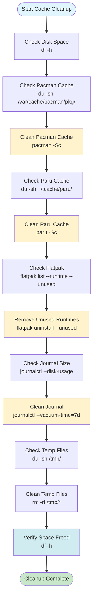

# Cache Cleanup Guide

**Clean package manager caches, logs, and temporary files to reclaim disk space.**

This guide covers cleaning caches for `pacman`, `paru`, `flatpak`, systemd journals, and other temporary files on Arch/CachyOS systems.

## What Is Cache Cleanup?

### Definition

**Cache cleanup** is the process of removing old, unused cache files to free disk space while preserving recent caches for performance.

### Why Cache Cleanup Exists

**The problem:** Caches accumulate over time:

- **Old packages:** Downloaded packages no longer needed
- **Build artifacts:** Temporary build files
- **Logs:** System logs growing large
- **Temporary files:** Various temporary data

**The solution:** Cache cleanup:

- **Removes old files:** Deletes outdated cache files
- **Keeps recent:** Preserves recent caches for speed
- **Frees space:** Reclaims disk space
- **Maintains performance:** Keeps system fast

**Real-world analogy:**

- **Cache = Storage room** (keeps things for quick access)
- **Old cache = Old items** (no longer needed, taking space)
- **Cleanup = Organizing** (remove old, keep useful)
- **Result = More space, still fast**

### How Cache Cleanup Works

**Step-by-step process:**

1. **Identify caches:** Find cache locations
2. **Check sizes:** See how much space caches use
3. **Review contents:** Understand what's cached
4. **Clean safely:** Remove old/unused cache files
5. **Verify results:** Confirm space freed

---

## Understanding Caches

### What Are Caches?

**Definition:** **Caches** are temporary storage locations that keep frequently accessed data for quick retrieval.

**Why caches exist:**

- **Speed:** Faster than downloading/rebuilding
- **Efficiency:** Avoid redundant operations
- **Performance:** Improve system responsiveness
- **Convenience:** Quick access to data

**How caches work:**

1. **Data accessed:** Package downloaded, file built, etc.
2. **Stored in cache:** Saved for future use
3. **Next access:** Retrieved from cache (faster)
4. **Over time:** Cache grows with more data

**Caches store downloaded packages, build artifacts, and temporary data to speed up operations. Over time, these can consume significant disk space.**

**What this means:**

- **Downloaded packages:** Package files saved for reinstallation
- **Build artifacts:** Compiled files from building packages
- **Temporary data:** Various temporary files
- **Space consumption:** Can grow to gigabytes over time

### Common Cache Locations

**Why know cache locations:**

- **Manual cleanup:** Can clean specific caches
- **Size checking:** See how much space each cache uses
- **Troubleshooting:** Find where cache issues occur

**1. Pacman: `/var/cache/pacman/pkg/`**

- **What:** Downloaded package files
- **Purpose:** Allows reinstallation without re-downloading
- **Size:** Can be several gigabytes
- **Cleanup:** Remove old package versions

**2. Paru: `~/.cache/paru/`**

- **What:** AUR build cache and cloned repositories
- **Purpose:** Speeds up AUR package building
- **Size:** Can be large (hundreds of MB to GB)
- **Cleanup:** Remove old build artifacts

**3. Flatpak: `~/.var/app/` and `/var/lib/flatpak/`**

- **What:** Application data and runtimes
- **Purpose:** Stores Flatpak app data and shared runtimes
- **Size:** Can be very large (GBs)
- **Cleanup:** Remove unused runtimes and app data

**4. Systemd Journal: `/var/log/journal/`**

- **What:** System logs
- **Purpose:** System event logging
- **Size:** Can grow large over time
- **Cleanup:** Rotate/remove old logs

**5. Temporary Files: `/tmp/`, `~/.cache/`**

- **What:** Various application caches
- **Purpose:** Temporary storage for apps
- **Size:** Varies by application
- **Cleanup:** Remove old temporary files

---

## Pacman Cache Cleanup

### What Is Pacman Cache?

**Definition:** **Pacman cache** stores downloaded package files to allow reinstallation without re-downloading.

**Why it exists:**

- **Reinstallation:** Can reinstall packages without downloading again
- **Speed:** Faster than downloading from internet
- **Offline use:** Can install packages without internet
- **Efficiency:** Saves bandwidth and time

**Pacman stores downloaded packages in `/var/cache/pacman/pkg/` to allow reinstallation without re-downloading.**

**How it works:**

1. **Package downloaded:** Pacman downloads package file
2. **Stored in cache:** Saved to `/var/cache/pacman/pkg/`
3. **Installed:** Package installed from cache
4. **Cache kept:** Package file remains in cache
5. **Reinstall:** Can reinstall from cache (no download needed)

**Real-world analogy:**

- **Pacman cache = Package storage** (keeps downloaded packages)
- **Cache directory = Storage room** (where packages are kept)
- **Reinstallation = Using stored package** (no need to download again)
- **Cleanup = Removing old packages** (free space, keep recent)

### Check Cache Size

**What this does:** Shows how much disk space the pacman cache is using.

**Why it's useful:**

- **Space awareness:** Know how much space cache uses
- **Cleanup planning:** Decide if cleanup is needed
- **Monitoring:** Track cache growth over time

```bash
# Check pacman cache size
du -sh /var/cache/pacman/pkg/

# List cache contents
ls -lh /var/cache/pacman/pkg/ | head -20

# Count cached packages
ls /var/cache/pacman/pkg/ | wc -l
```

**What each command does:**

**`du -sh /var/cache/pacman/pkg/`:**

- **`du`:** Disk usage command
- **`-s`:** Summary (total size only)
- **`-h`:** Human-readable format (GB, MB)
- **`/var/cache/pacman/pkg/`:** Cache directory
- **Result:** Total cache size (e.g., "5.2G")

**`ls -lh /var/cache/pacman/pkg/ | head -20`:**

- **`ls -lh`:** List files with details, human-readable sizes
- **`/var/cache/pacman/pkg/`:** Cache directory
- **`| head -20`:** Show first 20 files
- **Result:** List of cached packages with sizes

**`ls /var/cache/pacman/pkg/ | wc -l`:**

- **`ls`:** List files
- **`/var/cache/pacman/pkg/`:** Cache directory
- **`| wc -l`:** Count lines (number of files)
- **Result:** Number of cached packages

**Real-world example:**

**Check cache size:**

```bash
$ du -sh /var/cache/pacman/pkg/
5.2G    /var/cache/pacman/pkg/
```

**Analysis:**

- Cache using 5.2GB disk space
- May want to clean if disk space low
- Can free space by cleaning ✅

### Clean Unused Packages (Recommended)

**What this does:** Removes packages that are not installed and not in the sync database.

**Why it's recommended:**

- **Safe:** Only removes unused packages
- **Keeps recent:** Preserves recent package versions
- **Frees space:** Removes old/unused packages
- **Maintains speed:** Keeps recent caches for performance

**This removes packages that are not installed and not in the sync database:**

**What "unused packages" means:**

- **Not installed:** Package not currently installed
- **Not in sync database:** Package not available in repositories
- **Old versions:** Older versions of installed packages (keeps recent)
- **Safe to remove:** Won't affect system

**How it works:**

1. **Pacman checks:** Scans cache directory
2. **Identifies unused:** Finds packages not installed/available
3. **Keeps recent:** Preserves recent versions of installed packages
4. **Removes old:** Deletes old/unused packages
5. **Frees space:** Reclaims disk space

```bash
# Clean unused packages (keeps last 2 versions of installed packages)
sudo pacman -Sc

# Review what will be removed first (dry-run)
sudo pacman -Sc --noconfirm --print
```

**What each command does:**

**`sudo pacman -Sc`:**

- **`sudo`:** Root privileges needed (cache in system directory)
- **`pacman -Sc`:** Clean cache (remove unused packages)
- **Keeps last 2:** Preserves 2 most recent versions of installed packages
- **Result:** Unused packages removed, space freed

**`sudo pacman -Sc --noconfirm --print`:**

- **`--noconfirm`:** Don't ask for confirmation
- **`--print`:** Print what would be removed (dry-run)
- **Result:** Shows what would be removed without actually removing

**Real-world example:**

**Before cleanup:**

```bash
$ du -sh /var/cache/pacman/pkg/
5.2G    /var/cache/pacman/pkg/
```

**Dry-run (see what would be removed):**

```bash
$ sudo pacman -Sc --noconfirm --print
# Shows list of packages that would be removed
```

**Clean cache:**

```bash
$ sudo pacman -Sc
# Removes unused packages
```

**After cleanup:**

```bash
$ du -sh /var/cache/pacman/pkg/
2.1G    /var/cache/pacman/pkg/
# Freed 3.1GB ✅
```

**What `pacman -Sc` does:**

- Removes packages not in sync database
- Removes old versions (keeps last 2)
- Keeps packages for currently installed software

### Clean All Cache (Dangerous!)

**Warning:** This removes ALL cached packages. You'll need to re-download everything on next update.

```bash
# Clean all cache (use with caution!)
sudo pacman -Scc

# This will prompt for confirmation
```

**When to use `-Scc`:**

- Desperate for disk space
- Cache is corrupted
- You have fast internet and don't mind re-downloading

### Keep Specific Number of Versions

Pacman doesn't have a built-in option to keep N versions, but you can manually clean:

```bash
# Keep only last version (more aggressive)
# This requires manual cleanup or a script
```

**Recommended:** Use `pacman -Sc` which keeps last 2 versions automatically.

---

## Paru Cache Cleanup

Paru (AUR helper) caches build directories and cloned repositories in `~/.cache/paru/`.

### Check Paru Cache Size

```bash
# Check paru cache size
du -sh ~/.cache/paru/

# List cache contents
ls -lh ~/.cache/paru/

# Check build cache
du -sh ~/.cache/paru/build/
```

### Clean Paru Cache

```bash
# Clean paru cache (removes build artifacts)
paru -Sc

# This removes:
# - Build directories for installed packages
# - Old build artifacts
# - Keeps source tarballs for currently installed packages
```

### Clean Paru Build Cache Manually

```bash
# Remove all build directories (safe if packages are installed)
rm -rf ~/.cache/paru/build/*

# Remove cloned repositories (will re-clone on next build)
rm -rf ~/.cache/paru/clone/*

# Remove everything in paru cache
rm -rf ~/.cache/paru/*
```

**Note:** Paru will re-clone and rebuild as needed, so this is safe.

### Clean Specific Package Cache

```bash
# Remove cache for specific package
rm -rf ~/.cache/paru/build/package-name
rm -rf ~/.cache/paru/clone/package-name
```

---

## Flatpak Cache Cleanup

Flatpak applications store data in `~/.var/app/` and system-wide data in `/var/lib/flatpak/`.

### Check Flatpak Usage

```bash
# Check Flatpak disk usage
du -sh ~/.var/app/
du -sh /var/lib/flatpak/

# List installed applications
flatpak list

# List installed runtimes
flatpak list --runtime
```

### Remove Unused Runtimes

Runtimes are shared libraries used by Flatpak applications. Unused runtimes can be safely removed:

```bash
# List unused runtimes
flatpak list --runtime --unused

# Remove unused runtimes
flatpak uninstall --unused

# Remove unused runtimes (dry-run)
flatpak uninstall --unused --dry-run
```

### Clean Flatpak Cache

```bash
# Repair Flatpak (fixes broken installations and cleans cache)
flatpak repair

# Clean application cache (removes temporary files)
# Note: This doesn't remove application data
```

### Remove Application Data

**Warning:** This removes application settings and data!

```bash
# Remove application and its data
flatpak uninstall --delete-data app-id

# Example:
flatpak uninstall --delete-data org.zen.browser
```

### Clean Specific Application Cache

```bash
# Application data is in ~/.var/app/<app-id>/
# Check size
du -sh ~/.var/app/org.zen.browser/

# Remove cache (keeps settings)
rm -rf ~/.var/app/org.zen.browser/cache/

# Remove all temporary files
find ~/.var/app/ -type d -name "cache" -exec rm -rf {} +
```

---

## Systemd Journal Cleanup

Systemd stores logs in `/var/log/journal/` which can grow large over time.

### Check Journal Size

```bash
# Check journal disk usage
journalctl --disk-usage

# Check journal location
journalctl --list-boots
```

### Clean Journal Logs

```bash
# Keep last 7 days of logs
sudo journalctl --vacuum-time=7d

# Keep last 100MB of logs
sudo journalctl --vacuum-size=100M

# Keep last 10 files
sudo journalctl --vacuum-files=10

# Clean all logs older than 3 days
sudo journalctl --vacuum-time=3d
```

### Set Journal Size Limit

Edit `/etc/systemd/journald.conf`:

```ini
[Journal]
SystemMaxUse=500M
SystemKeepFree=1G
SystemMaxFileSize=50M
```

Then restart journald:

```bash
sudo systemctl restart systemd-journald
```

---

## Temporary Files Cleanup

Various applications create temporary files that can accumulate.

### Common Temporary Locations

```bash
# System temporary directory
/tmp/

# User cache directory
~/.cache/

# User temporary directory
~/.tmp/  # (if exists)

# Browser caches (if applicable)
~/.cache/mozilla/
~/.cache/google-chrome/
~/.cache/chromium/
```

### Clean Temporary Files

```bash
# Clean /tmp (system cleans on reboot, but you can clean manually)
sudo rm -rf /tmp/*

# Clean user cache (be careful - removes application caches)
rm -rf ~/.cache/*

# Clean specific application cache
rm -rf ~/.cache/firefox/
rm -rf ~/.cache/chromium/
```

### Safe Cache Cleanup

Some caches are important to keep:

```bash
# Keep these caches:
# - ~/.cache/pip/ (Python packages)
# - ~/.cache/pacman/ (if using)
# - ~/.cache/paru/ (AUR helper)

# Safe to remove:
# - Browser caches (will rebuild)
# - Old application caches
# - Temporary download files
```

---

## Cache Cleanup Process



---

## Automated Cache Cleanup Script

Use the provided script for automated cleanup:

```bash
# Run cache cleanup script
./scripts/cleanup-cache.sh
```

The script will:

- Check cache sizes before cleanup
- Clean pacman cache (keeps last 2 versions)
- Clean paru cache
- Remove unused Flatpak runtimes
- Rotate journal logs
- Show space saved

---

## Step-by-Step Cleanup Process

### Step 1: Check Current Disk Usage

```bash
# Check overall disk usage
df -h

# Check cache sizes
echo "=== Cache Sizes ===" > cache-report.txt
echo "Pacman: $(du -sh /var/cache/pacman/pkg/ | cut -f1)" >> cache-report.txt
echo "Paru: $(du -sh ~/.cache/paru/ 2>/dev/null | cut -f1 || echo 'N/A')" >> cache-report.txt
echo "Flatpak: $(du -sh ~/.var/app/ 2>/dev/null | cut -f1 || echo 'N/A')" >> cache-report.txt
echo "Journal: $(journalctl --disk-usage 2>/dev/null | awk '{print $7}' || echo 'N/A')" >> cache-report.txt

cat cache-report.txt
```

### Step 2: Clean Pacman Cache

```bash
# Check what will be removed
sudo pacman -Sc --noconfirm --print

# Clean cache (keeps last 2 versions)
sudo pacman -Sc

# Verify cache size reduced
du -sh /var/cache/pacman/pkg/
```

### Step 3: Clean Paru Cache

```bash
# Clean paru cache
paru -Sc

# Or manually clean build cache
rm -rf ~/.cache/paru/build/*

# Verify
du -sh ~/.cache/paru/
```

### Step 4: Clean Flatpak

```bash
# List unused runtimes
flatpak list --runtime --unused

# Remove unused runtimes
flatpak uninstall --unused

# Repair if needed
flatpak repair

# Verify
flatpak list --runtime
```

### Step 5: Clean Journal Logs

```bash
# Check current size
journalctl --disk-usage

# Clean (keep last 7 days)
sudo journalctl --vacuum-time=7d

# Verify
journalctl --disk-usage
```

### Step 6: Clean Temporary Files

```bash
# Clean /tmp (safe, system recreates on reboot)
sudo rm -rf /tmp/*

# Clean user cache (be selective)
# Remove browser caches if needed
rm -rf ~/.cache/firefox/
rm -rf ~/.cache/chromium/
```

### Step 7: Verify Space Freed

```bash
# Check disk usage again
df -h

# Compare with initial report
```

---

## Maintenance Schedule

### Weekly

- Clean temporary files (`/tmp/`)
- Check journal size

### Monthly

- Clean pacman cache (`pacman -Sc`)
- Clean paru cache (`paru -Sc`)
- Remove unused Flatpak runtimes

### Quarterly

- Review Flatpak applications
- Deep clean if needed (`pacman -Scc` - use with caution)

---

## Troubleshooting

### "Permission denied" when cleaning pacman cache

**Error:**

```
error: cannot open cache directory: Permission denied
```

**Solution:**

- Use `sudo` for pacman cache: `sudo pacman -Sc`
- Pacman cache is system-wide and requires root

### "Paru cache still large after cleanup"

**Solution:**

- Check for large source tarballs: `du -sh ~/.cache/paru/clone/*`
- Manually remove if needed: `rm -rf ~/.cache/paru/clone/package-name`
- Paru will re-clone on next build

### "Flatpak uninstall --unused doesn't free space"

**Solution:**

- Check application data: `du -sh ~/.var/app/*`
- Application data is separate from runtimes
- Remove unused applications: `flatpak uninstall app-id`

### "Journal still large after vacuum"

**Solution:**

- Check journal limits: `cat /etc/systemd/journald.conf`
- Set lower limits and restart: `sudo systemctl restart systemd-journald`
- Check for specific large logs: `journalctl --disk-usage`

---

## Best Practices

1. **Regular Cleanup:** Clean caches monthly
2. **Keep Recent Versions:** Use `pacman -Sc` (keeps last 2)
3. **Monitor Journal:** Set size limits in journald.conf
4. **Backup Before Deep Clean:** Before `pacman -Scc`
5. **Check Space Before Cleanup:** Know how much space you'll free
6. **Automate:** Use scripts for regular maintenance

---

## Quick Reference

```bash
# Check cache sizes
du -sh /var/cache/pacman/pkg/
du -sh ~/.cache/paru/
du -sh ~/.var/app/

# Clean pacman cache (keeps last 2)
sudo pacman -Sc

# Clean paru cache
paru -Sc

# Remove unused Flatpak runtimes
flatpak uninstall --unused

# Clean journal (keep last 7 days)
sudo journalctl --vacuum-time=7d

# Clean temporary files
sudo rm -rf /tmp/*
```

---

## Expected Space Savings

Typical space freed:

- **Pacman cache:** 500MB - 5GB (depends on installed packages)
- **Paru cache:** 100MB - 2GB (depends on AUR packages)
- **Flatpak runtimes:** 200MB - 1GB (depends on unused runtimes)
- **Journal logs:** 100MB - 2GB (depends on log retention)
- **Temporary files:** 50MB - 500MB

**Total:** Often 1-10GB depending on system usage.

---

**Next Steps:**

- After cleaning caches, remove unused packages: [Package Cleanup Guide](PACKAGE_CLEANUP.md)
- Optimize memory: [Memory Optimization Guide](MEMORY_OPTIMIZATION.md)
- Automate cleanup: [Maintenance Scripts Guide](MAINTENANCE_SCRIPTS.md)
