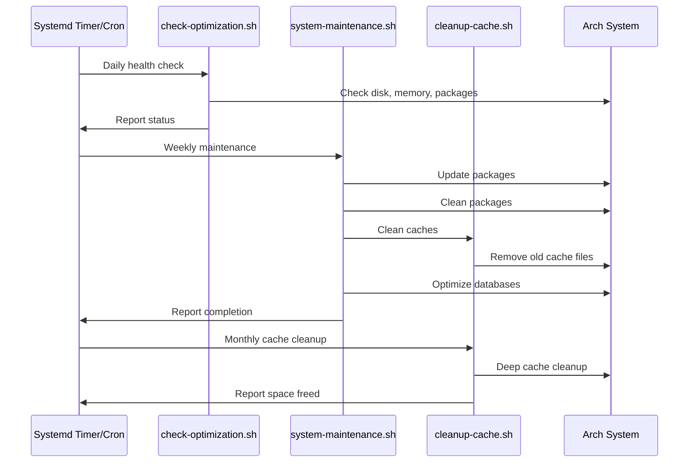

# Maintenance Scripts Guide

**Automate system maintenance with scripts and scheduled tasks.**

This guide covers using the provided maintenance scripts, scheduling automated tasks, and integrating maintenance into your workflow.

---

## Available Scripts

All scripts are located in the `scripts/` directory:

| Script                  | Purpose                  | Safety                          | Requires Root |
| ----------------------- | ------------------------ | ------------------------------- | ------------- |
| `check-optimization.sh` | System health check      | Read-only, safe                 | No            |
| `cleanup-packages.sh`   | Remove orphaned packages | Interactive, confirms           | Yes           |
| `cleanup-cache.sh`      | Clean all caches         | Shows what will be removed      | Yes           |
| `system-maintenance.sh` | Full system maintenance  | Comprehensive, includes updates | Yes           |

---

## check-optimization.sh

**Purpose:** Check system health and optimization status without making changes.

### Usage

**Run from local directory:**

```bash
# Run health check
./scripts/check-optimization.sh

# Or from system-optimization directory
cd system-optimization
./scripts/check-optimization.sh
```

**Run directly from GitHub (no download needed):**

```bash
# For Bash/Zsh
bash <(curl -s https://raw.githubusercontent.com/cjmaaz/ArchStarterPack/master/system-optimization/scripts/check-optimization.sh)

# For Fish shell
curl -s https://raw.githubusercontent.com/cjmaaz/ArchStarterPack/master/system-optimization/scripts/check-optimization.sh | bash

# Universal method (works in any shell)
curl -s https://raw.githubusercontent.com/cjmaaz/ArchStarterPack/master/system-optimization/scripts/check-optimization.sh | bash
```

### What It Checks

- Disk usage (`df -h`)
- Memory usage (`free -h`)
- Pacman cache size
- Paru cache size
- Flatpak cache size
- Journal log size
- Orphaned packages count
- Outdated packages
- Service status
- Boot time analysis

### Output Example

```
=== System Health Check ===

Disk Usage:
Filesystem      Size  Used Avail Use% Mounted on
/dev/sda1       100G   45G   50G  48% /

Memory Usage:
               total        used        free      shared  buff/cache   available
Mem:           15Gi       2.1Gi       8.5Gi       234Mi       4.8Gi        12Gi
Swap:         2.0Gi          0B       2.0Gi

Cache Sizes:
Pacman cache: 2.5G
Paru cache: 500M
Flatpak cache: 1.2G
Journal logs: 800M

Packages:
Orphaned packages: 5
Outdated packages: 12

Boot Time:
Startup finished in 3.2s (kernel) + 12.4s (userspace) = 15.6s
```

### When to Run

- Daily or weekly for monitoring
- Before running cleanup scripts
- After system changes
- When troubleshooting performance issues

---

## cleanup-packages.sh

**Purpose:** Safely remove orphaned and unused packages.

### Usage

**Run from local directory:**

```bash
# Run interactive cleanup
./scripts/cleanup-packages.sh

# Dry-run mode (shows what would be removed)
./scripts/cleanup-packages.sh --dry-run
```

**Run directly from GitHub:**

```bash
# Normal mode (requires sudo)
bash <(curl -s https://raw.githubusercontent.com/cjmaaz/ArchStarterPack/master/system-optimization/scripts/cleanup-packages.sh)

# Dry-run mode
bash <(curl -s https://raw.githubusercontent.com/cjmaaz/ArchStarterPack/master/system-optimization/scripts/cleanup-packages.sh) --dry-run

# For Fish shell
curl -s https://raw.githubusercontent.com/cjmaaz/ArchStarterPack/master/system-optimization/scripts/cleanup-packages.sh | bash -s -- --dry-run
```

### Features

- Lists orphaned packages
- Shows package sizes
- Asks for confirmation before removal
- Supports dry-run mode
- Creates backup of package list

### Interactive Flow

```bash
=== Package Cleanup ===

Found 5 orphaned packages:
1. linux-headers (50M)
2. python-setuptools (2M)
3. gcc-libs (10M)
...

Total size: 62M

Remove these packages? [y/N]: y
Removing packages...
✓ Packages removed successfully
```

### Safety Features

- Confirmation prompt before removal
- Backup creation before removal
- Dry-run mode to preview changes
- Lists packages before removal

---

## cleanup-cache.sh

**Purpose:** Clean package manager caches and temporary files.

### Usage

**Run from local directory:**

```bash
# Run cache cleanup
./scripts/cleanup-cache.sh

# Dry-run mode
./scripts/cleanup-cache.sh --dry-run
```

**Run directly from GitHub:**

```bash
# Normal mode (requires sudo)
bash <(curl -s https://raw.githubusercontent.com/cjmaaz/ArchStarterPack/master/system-optimization/scripts/cleanup-cache.sh)

# Dry-run mode
bash <(curl -s https://raw.githubusercontent.com/cjmaaz/ArchStarterPack/master/system-optimization/scripts/cleanup-cache.sh) --dry-run

# For Fish shell
curl -s https://raw.githubusercontent.com/cjmaaz/ArchStarterPack/master/system-optimization/scripts/cleanup-cache.sh | bash -s -- --dry-run
```

### What It Cleans

- Pacman cache (keeps last 2 versions)
- Paru cache
- Unused Flatpak runtimes
- Journal logs (keeps last 7 days)
- Temporary files (`/tmp/`)

### Output Example

```
=== Cache Cleanup ===

Before cleanup:
Pacman cache: 2.5G
Paru cache: 500M
Flatpak cache: 1.2G
Journal logs: 800M

Cleaning caches...
✓ Pacman cache cleaned (freed 1.8G)
✓ Paru cache cleaned (freed 300M)
✓ Flatpak runtimes removed (freed 200M)
✓ Journal logs rotated (freed 500M)

Total space freed: 2.8G
```

### Safety Features

- Shows cache sizes before cleanup
- Keeps recent package versions
- Preserves important data
- Dry-run mode available

---

## system-maintenance.sh

**Purpose:** Comprehensive system maintenance including updates and cleanup.

### Usage

**Run from local directory:**

```bash
# Run full maintenance
./scripts/system-maintenance.sh

# Skip updates (cleanup only)
./scripts/system-maintenance.sh --no-update

# Dry-run mode
./scripts/system-maintenance.sh --dry-run
```

**Run directly from GitHub:**

```bash
# Full maintenance (requires sudo)
bash <(curl -s https://raw.githubusercontent.com/cjmaaz/ArchStarterPack/master/system-optimization/scripts/system-maintenance.sh)

# Skip updates (cleanup only)
bash <(curl -s https://raw.githubusercontent.com/cjmaaz/ArchStarterPack/master/system-optimization/scripts/system-maintenance.sh) --no-update

# Dry-run mode
bash <(curl -s https://raw.githubusercontent.com/cjmaaz/ArchStarterPack/master/system-optimization/scripts/system-maintenance.sh) --dry-run

# For Fish shell
curl -s https://raw.githubusercontent.com/cjmaaz/ArchStarterPack/master/system-optimization/scripts/system-maintenance.sh | bash -s -- --dry-run
```

### What It Does

1. **System Updates**

   - Updates pacman packages (`pacman -Syu`)
   - Updates AUR packages (`paru -Syu`)
   - Updates Flatpak applications (`flatpak update`)

2. **Package Cleanup**

   - Removes orphaned packages
   - Removes unused dependencies

3. **Cache Cleanup**

   - Cleans pacman cache
   - Cleans paru cache
   - Removes unused Flatpak runtimes
   - Rotates journal logs

4. **Database Optimization**

   - Refreshes pacman file database
   - Updates locate database

5. **System Health Check**
   - Reports disk usage
   - Reports memory usage
   - Shows boot time

### Output Example

```
=== System Maintenance ===

Step 1/5: Updating system...
✓ Pacman packages updated
✓ AUR packages updated
✓ Flatpak applications updated

Step 2/5: Cleaning packages...
✓ Removed 5 orphaned packages (freed 62M)

Step 3/5: Cleaning caches...
✓ Pacman cache cleaned (freed 1.8G)
✓ Paru cache cleaned (freed 300M)
✓ Flatpak runtimes removed (freed 200M)
✓ Journal logs rotated (freed 500M)

Step 4/5: Optimizing databases...
✓ Pacman file database refreshed
✓ Locate database updated

Step 5/5: System health check...
Disk usage: 45G / 100G (45%)
Memory usage: 2.1G / 15G (14%)
Boot time: 15.6s

=== Maintenance Complete ===
Total space freed: 2.8G
```

### Safety Features

- Confirmation prompts for destructive operations
- Backup creation before major changes
- Dry-run mode
- Error handling and rollback

---

## Scheduling Maintenance

Automate maintenance tasks using systemd timers or cron.

### Using Systemd Timers (Recommended)

**Create timer file:**

```bash
sudo nano /etc/systemd/system/system-maintenance.timer
```

**Add:**

```ini
[Unit]
Description=System Maintenance Timer
Requires=system-maintenance.service

[Timer]
OnCalendar=weekly
OnCalendar=Mon 02:00
RandomizedDelaySec=1h
Persistent=true

[Install]
WantedBy=timers.target
```

**Create service file:**

```bash
sudo nano /etc/systemd/system/system-maintenance.service
```

**Add:**

```ini
[Unit]
Description=System Maintenance
After=network-online.target

[Service]
Type=oneshot
ExecStart=/path/to/system-optimization/scripts/system-maintenance.sh
StandardOutput=journal
StandardError=journal
```

**Enable timer:**

```bash
# Reload systemd
sudo systemctl daemon-reload

# Enable timer
sudo systemctl enable system-maintenance.timer

# Start timer
sudo systemctl start system-maintenance.timer

# Check status
systemctl status system-maintenance.timer

# List timers
systemctl list-timers
```

### Using Cron

**Edit crontab:**

```bash
# Edit user crontab
crontab -e

# Or root crontab
sudo crontab -e
```

**Add entries:**

```bash
# Weekly maintenance (Monday 2 AM)
0 2 * * 1 /path/to/system-optimization/scripts/system-maintenance.sh >> /var/log/maintenance.log 2>&1

# Daily health check (every day at 6 AM)
0 6 * * * /path/to/system-optimization/scripts/check-optimization.sh >> /var/log/health-check.log 2>&1

# Monthly cache cleanup (1st of month at 3 AM)
0 3 1 * * /path/to/system-optimization/scripts/cleanup-cache.sh >> /var/log/cache-cleanup.log 2>&1
```

---

## Maintenance Schedule Recommendations

### Daily

- Health check (`check-optimization.sh`)
- Monitor disk space
- Monitor memory usage

### Weekly

- Full maintenance (`system-maintenance.sh`)
- Package updates
- Cache cleanup

### Monthly

- Deep cache cleanup
- Package cleanup
- Review orphaned packages

### Quarterly

- Review system configuration
- Check boot time
- Optimize services

---

## Maintenance Workflow



---

## Customizing Scripts

### Modify Script Behavior

Edit scripts to customize behavior:

```bash
# Edit script
nano scripts/system-maintenance.sh

# Common customizations:
# - Change cache retention (default: 2 versions)
# - Change journal retention (default: 7 days)
# - Add/remove cleanup steps
# - Change notification method
```

### Add Notifications

Add email or desktop notifications:

```bash
# Add to script:
# Email notification
echo "Maintenance complete" | mail -s "System Maintenance" user@example.com

# Desktop notification (if notify-send available)
notify-send "System Maintenance" "Maintenance complete. Freed 2.8G"
```

---

## Logging

### Enable Logging

Scripts can log output to files:

```bash
# Run with logging
./scripts/system-maintenance.sh 2>&1 | tee maintenance-$(date +%Y%m%d).log

# Or redirect to log file
./scripts/system-maintenance.sh >> /var/log/maintenance.log 2>&1
```

### View Logs

```bash
# View recent logs
tail -f /var/log/maintenance.log

# View logs with journalctl (if using systemd service)
journalctl -u system-maintenance.service

# View logs by date
journalctl -u system-maintenance.service --since "2024-01-01"
```

---

## Troubleshooting

### "Script permission denied"

**Error:**

```
bash: ./scripts/check-optimization.sh: Permission denied
```

**Solution:**

```bash
# Make script executable
chmod +x scripts/check-optimization.sh

# Or run with bash
bash scripts/check-optimization.sh
```

### "Script not found"

**Error:**

```
bash: scripts/check-optimization.sh: No such file or directory
```

**Solution:**

```bash
# Check current directory
pwd

# Navigate to script directory
cd /path/to/system-optimization

# Or use full path
/path/to/system-optimization/scripts/check-optimization.sh
```

### "Timer not running"

**Check:**

```bash
# Check timer status
systemctl status system-maintenance.timer

# Check if enabled
systemctl is-enabled system-maintenance.timer

# Check timer list
systemctl list-timers
```

**Solution:**

- Ensure timer file syntax is correct
- Reload systemd: `sudo systemctl daemon-reload`
- Enable timer: `sudo systemctl enable system-maintenance.timer`

### "Script fails during execution"

**Check logs:**

```bash
# Check script output
journalctl -u system-maintenance.service

# Check system logs
journalctl -p err -b

# Run script manually to see errors
./scripts/system-maintenance.sh
```

**Common issues:**

- Missing dependencies
- Permission issues
- Network connectivity (for updates)
- Disk space (for cleanup)

---

## Best Practices

1. **Test Scripts First:** Run scripts manually before scheduling
2. **Use Dry-Run:** Test with `--dry-run` flag first
3. **Monitor Logs:** Check logs regularly for errors
4. **Backup Before Automation:** Ensure backups are in place
5. **Start Conservative:** Begin with less frequent schedules
6. **Review Regularly:** Check what scripts are doing

---

## Quick Reference

**Run scripts directly from GitHub:**

```bash
# Health check (no sudo needed)
bash <(curl -s https://raw.githubusercontent.com/cjmaaz/ArchStarterPack/master/system-optimization/scripts/check-optimization.sh)

# Clean packages (interactive, requires sudo)
bash <(curl -s https://raw.githubusercontent.com/cjmaaz/ArchStarterPack/master/system-optimization/scripts/cleanup-packages.sh)

# Clean caches (requires sudo)
bash <(curl -s https://raw.githubusercontent.com/cjmaaz/ArchStarterPack/master/system-optimization/scripts/cleanup-cache.sh)

# Full maintenance (requires sudo)
bash <(curl -s https://raw.githubusercontent.com/cjmaaz/ArchStarterPack/master/system-optimization/scripts/system-maintenance.sh)
```

**Or run from local directory:**

```bash
# Run health check
./scripts/check-optimization.sh

# Clean packages (interactive)
./scripts/cleanup-packages.sh

# Clean caches
./scripts/cleanup-cache.sh

# Full maintenance
./scripts/system-maintenance.sh
```

**Schedule with systemd timer:**

```bash
sudo systemctl enable system-maintenance.timer
sudo systemctl start system-maintenance.timer
```

**Schedule with cron:**

```bash
crontab -e
# Add: 0 2 * * 1 /path/to/scripts/system-maintenance.sh
```

---

**Next Steps:**

- Review individual optimization guides:
  - [Package Cleanup](PACKAGE_CLEANUP.md)
  - [Cache Cleanup](CACHE_CLEANUP.md)
  - [Memory Optimization](MEMORY_OPTIMIZATION.md)
  - [Speed Optimization](SPEED_OPTIMIZATION.md)
