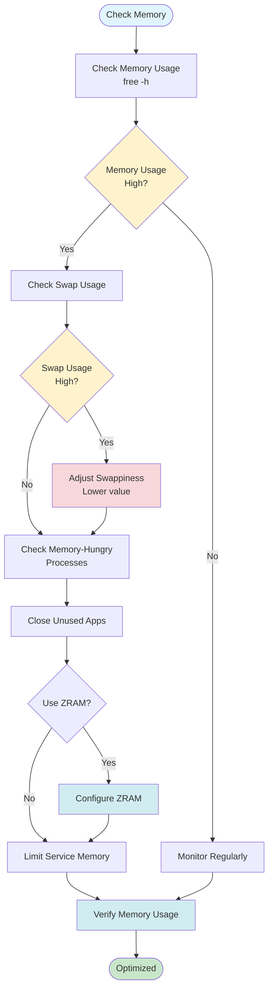

# Memory Optimization Guide

**Optimize memory usage, configure swap, and manage memory-hungry processes.**

This guide covers memory management, swap configuration, ZRAM setup, and optimizing memory usage on Arch/CachyOS systems.

## What Is Memory Optimization?

### Definition

**Memory optimization** is the process of improving how your system uses RAM (Random Access Memory) to maximize performance and prevent memory-related issues.

### Why Memory Optimization Exists

**The problem:** Systems can have memory issues:

- **Low memory:** Not enough RAM for applications
- **Swap overuse:** System using slow swap instead of fast RAM
- **Memory leaks:** Processes consuming more memory over time
- **Inefficient usage:** Memory not used optimally

**The solution:** Memory optimization:

- **Improves performance:** Better RAM usage = faster system
- **Reduces swap usage:** Less reliance on slow swap
- **Prevents issues:** Avoids out-of-memory problems
- **Manages resources:** Controls memory allocation

**Real-world analogy:**

- **Memory optimization = Managing workspace** (organize desk for efficiency)
- **RAM = Fast workspace** (quick access)
- **Swap = Slow storage** (slower access)
- **Optimization = Organizing** (use fast workspace efficiently)

### How Memory Optimization Works

**Step-by-step process:**

1. **Monitor memory:** Track RAM usage
2. **Identify issues:** Find memory problems
3. **Configure swap:** Set up virtual memory
4. **Tune settings:** Optimize memory management
5. **Manage processes:** Control memory usage
6. **Verify improvements:** Confirm optimizations work

---

## Understanding Memory

### What Is System Memory?

**Definition:** **System memory (RAM)** is fast, temporary storage used by running applications and the operating system.

**Why memory exists:**

- **Speed:** Much faster than disk storage
- **Temporary storage:** Holds data while applications run
- **Performance:** Fast access improves system speed
- **Multitasking:** Allows multiple applications to run

**System memory (RAM) is used by running applications and the kernel.**

**How it works:**

1. **Applications load:** Programs loaded into RAM
2. **Data stored:** Application data stored in RAM
3. **Fast access:** CPU accesses RAM quickly
4. **Temporary:** Data lost when power off

**When RAM is full, the system uses swap (disk space) as virtual memory, which is slower.**

**What this means:**

- **RAM full:** All RAM in use
- **Swap used:** System uses disk as memory
- **Slower:** Disk access much slower than RAM
- **Performance impact:** System becomes slower

**Real-world analogy:**

- **RAM = Fast workspace** (quick access, limited space)
- **Swap = Slow storage** (slower access, more space)
- **RAM full = Workspace full** (need to use slow storage)
- **Result = Slower work** (accessing slow storage)

### Memory Types

**1. Physical RAM:**

- **What:** Actual RAM chips in your computer
- **Speed:** Very fast (nanoseconds access time)
- **Capacity:** Limited (typically 4-32GB)
- **Volatility:** Data lost when power off
- **Use:** Primary memory for running applications

**2. Swap:**

- **What:** Disk-based virtual memory
- **Speed:** Slower than RAM (milliseconds access time)
- **Capacity:** Can be large (GBs)
- **Persistence:** Data persists on disk
- **Use:** Backup memory when RAM full

**3. ZRAM:**

- **What:** Compressed RAM (RAM that acts like swap)
- **Speed:** Faster than swap (compressed RAM)
- **Capacity:** Uses CPU to compress data
- **Trade-off:** Faster than swap but uses CPU
- **Use:** Better alternative to swap on systems with limited RAM

**Real-world comparison:**

**Physical RAM:**

- **Speed:** ⚡⚡⚡⚡⚡ (very fast)
- **Capacity:** Limited
- **Cost:** Expensive
- **Example:** 16GB RAM = 16GB fast memory

**Swap:**

- **Speed:** ⚡ (slow)
- **Capacity:** Large
- **Cost:** Cheap (uses disk space)
- **Example:** 8GB swap = 8GB slow virtual memory

**ZRAM:**

- **Speed:** ⚡⚡⚡ (faster than swap)
- **Capacity:** Compressed (more data in same space)
- **Cost:** CPU cycles
- **Example:** 4GB ZRAM = ~8GB compressed virtual memory

---

## Checking Memory Usage

### Why Check Memory Usage?

**The problem:** Need to know how much memory is being used to identify issues.

**Why it matters:**

- **Identify problems:** See if memory is low
- **Monitor usage:** Track memory over time
- **Optimize:** Know what to optimize
- **Troubleshoot:** Diagnose memory issues

**How checking works:**

- **Read memory stats:** System provides memory information
- **Display usage:** Show current memory state
- **Analyze:** Understand what numbers mean
- **Take action:** Optimize if needed

### Basic Memory Check

**What this does:** Shows current memory usage in human-readable format.

**Why it's useful:**

- **Quick overview:** See memory status at a glance
- **Identify issues:** Spot low memory situations
- **Monitor:** Track memory usage over time

```bash
# Show memory usage
free -h

# Output example:
#               total        used        free      shared  buff/cache   available
# Mem:           15Gi       2.1Gi       8.5Gi       234Mi       4.8Gi        12Gi
# Swap:         2.0Gi          0B       2.0Gi
```

**Understanding the output:**

**Memory (Mem) row:**

**`total:`** Total installed RAM

- **What:** All RAM in your system
- **Example:** `15Gi` = 15 gigabytes
- **Use:** Know system capacity

**`used:`** Currently used RAM

- **What:** RAM actively used by applications
- **Example:** `2.1Gi` = 2.1 gigabytes used
- **Use:** See current usage

**`free:`** Unused RAM

- **What:** RAM not currently used
- **Example:** `8.5Gi` = 8.5 gigabytes free
- **Use:** See available RAM

**`buff/cache:`** RAM used for buffers and cache (can be freed)

- **What:** RAM used for caching (can be reclaimed)
- **Example:** `4.8Gi` = 4.8 gigabytes cached
- **Use:** Understand cache usage
- **Important:** This RAM can be freed if needed

**`available:`** RAM available for new processes

- **What:** RAM that can be used (free + reclaimable cache)
- **Example:** `12Gi` = 12 gigabytes available
- **Use:** Know actual usable RAM
- **Most important:** This is what matters for new applications

**Swap row:**

**`Swap:`** Virtual memory on disk

- **What:** Disk space used as memory
- **Example:** `2.0Gi` total, `0B` used
- **Use:** See swap usage
- **Warning:** High swap usage = slow system

**Real-world example:**

**Healthy system:**

```
Mem: 15Gi total, 2.1Gi used, 12Gi available
Swap: 2.0Gi total, 0B used
```

- ✅ **Plenty of RAM:** 12GB available
- ✅ **No swap usage:** System fast
- ✅ **Good performance:** No memory pressure

**Low memory system:**

```
Mem: 8Gi total, 7.5Gi used, 500Mi available
Swap: 2.0Gi total, 1.5Gi used
```

- ❌ **Low RAM:** Only 500MB available
- ❌ **High swap usage:** System slow
- ❌ **Performance issues:** Memory pressure

### Detailed Memory Information

```bash
# Show memory in MB
free -m

# Show memory in GB
free -g

# Continuous monitoring (update every 2 seconds)
watch -n 2 free -h
```

### Using htop for Memory Monitoring

```bash
# Install htop if needed
sudo pacman -S htop

# Run htop
htop

# In htop:
# - Press F2 for setup
# - Press F5 for tree view
# - Sort by memory: Press F6, select "PERCENT_MEM"
```

---

## Identifying Memory-Hungry Processes

### Find Top Memory Consumers

```bash
# Top 10 processes by memory usage
ps aux --sort=-%mem | head -11

# More detailed view
ps aux --sort=-%mem | head -11 | awk '{print $2, $4, $11}'

# Using top command
top -o %MEM

# Using htop (interactive)
htop
```

### Check Process Memory Details

```bash
# Check specific process memory
ps -p <PID> -o pid,vsz,rss,%mem,cmd

# Example: Check Firefox memory
ps aux | grep firefox | awk '{print $2, $4, $11}'

# Check all processes memory usage
ps aux --sort=-%mem | less
```

### Monitor Memory Over Time

```bash
# Log memory usage every 5 seconds
while true; do
    echo "$(date): $(free -h | grep Mem | awk '{print $3 "/" $2}')"
    sleep 5
done > memory-log.txt
```

---

## Swap Optimization

Swap is disk space used as virtual memory when RAM is full.

### Check Swap Status

```bash
# Check swap usage
free -h | grep Swap

# Check swap devices
swapon --show

# Check swap usage details
cat /proc/swaps

# Check swap usage percentage
free | grep Swap | awk '{printf "Swap Usage: %.2f%%\n", $3/$2*100}'
```

### Swappiness Tuning

Swappiness controls how aggressively the kernel swaps memory to disk.

**Current swappiness:**

```bash
# Check current swappiness (0-100)
cat /proc/sys/vm/swappiness

# Default is usually 60
# Lower = less swapping (more RAM usage)
# Higher = more swapping (less RAM usage)
```

**Set swappiness temporarily:**

```bash
# Set to 10 (less aggressive swapping)
sudo sysctl vm.swappiness=10

# Set to 1 (minimal swapping)
sudo sysctl vm.swappiness=1

# Set to 0 (disable swapping unless necessary)
sudo sysctl vm.swappiness=0
```

**Set swappiness permanently:**
Edit `/etc/sysctl.d/99-sysctl.conf` or create `/etc/sysctl.d/99-swappiness.conf`:

```bash
# Create swappiness config
sudo bash -c 'echo "vm.swappiness=10" > /etc/sysctl.d/99-swappiness.conf'

# Apply immediately
sudo sysctl -p /etc/sysctl.d/99-swappiness.conf

# Verify
cat /proc/sys/vm/swappiness
```

**Recommended values:**

- **Desktop systems:** 10-20 (less swapping, better performance)
- **Servers:** 1-10 (minimal swapping)
- **Laptops:** 10-30 (balance between performance and battery)

### Creating Swap File

If you don't have swap or need more:

```bash
# Check current swap
swapon --show

# Create 4GB swap file
sudo fallocate -l 4G /swapfile

# Or use dd (slower but more compatible)
sudo dd if=/dev/zero of=/swapfile bs=1M count=4096

# Set correct permissions
sudo chmod 600 /swapfile

# Format as swap
sudo mkswap /swapfile

# Enable swap
sudo swapon /swapfile

# Make permanent (add to /etc/fstab)
echo '/swapfile none swap sw 0 0' | sudo tee -a /etc/fstab

# Verify
swapon --show
free -h
```

### Removing Swap File

```bash
# Disable swap
sudo swapoff /swapfile

# Remove from /etc/fstab
sudo sed -i '/swapfile/d' /etc/fstab

# Remove swap file
sudo rm /swapfile
```

---

## ZRAM Setup

ZRAM creates a compressed block device in RAM, providing faster virtual memory than disk-based swap.

### Check if ZRAM is Available

```bash
# Check if zram kernel module is loaded
lsmod | grep zram

# Check if zram-tools is installed
pacman -Q zram-generator 2>/dev/null || echo "Not installed"
```

### Install ZRAM Tools

```bash
# Install zram-generator (systemd-based)
sudo pacman -S zram-generator

# Or install zram-dkms for custom kernels
sudo pacman -S zram-dkms
```

### Configure ZRAM

Create `/etc/systemd/zram-generator.conf`:

```ini
[zram0]
zram-size = ram / 2
compression-algorithm = zstd
swap-priority = 100
fs-type = swap
```

**Configuration options:**

- **zram-size:** Size of ZRAM device
  - `ram / 2` = Half of RAM
  - `4G` = Fixed 4GB
  - `ram - 2G` = RAM minus 2GB
- **compression-algorithm:** `zstd`, `lz4`, `lzo` (zstd is best)
- **swap-priority:** Higher priority = used first (100 = before disk swap)

### Enable ZRAM

```bash
# Regenerate systemd units
sudo systemctl daemon-reload

# Start zram service
sudo systemctl start systemd-zram-setup@zram0.service

# Enable on boot
sudo systemctl enable systemd-zram-setup@zram0.service

# Verify
swapon --show
# Should show zram device
```

### CachyOS ZRAM Configuration

CachyOS may have ZRAM pre-configured. Check:

```bash
# Check existing zram config
cat /etc/systemd/zram-generator.conf 2>/dev/null

# Check zram status
swapon --show | grep zram
```

---

## OOM Killer Configuration

Out-Of-Memory (OOM) killer terminates processes when system runs out of memory.

### Check OOM Killer Status

```bash
# Check OOM killer score adjustment
cat /proc/sys/vm/oom_kill_allocating_task

# Check OOM score for process
cat /proc/<PID>/oom_score

# Lower score = less likely to be killed
```

### Adjust OOM Scores

```bash
# Make process less likely to be killed (lower score)
echo -1000 | sudo tee /proc/<PID>/oom_score_adj

# Make process more likely to be killed (higher score)
echo 1000 | sudo tee /proc/<PID>/oom_score_adj

# Check current score
cat /proc/<PID>/oom_score_adj
```

### Systemd Service Memory Limits

Limit memory for specific services:

```bash
# Edit service file
sudo systemctl edit service-name.service

# Add memory limit:
[Service]
MemoryMax=512M
MemoryHigh=256M
```

**Memory limits:**

- **MemoryMax:** Hard limit (service killed if exceeded)
- **MemoryHigh:** Soft limit (throttled if exceeded)

---

## Clearing Page Cache

Page cache stores file data in RAM for faster access. Clearing it can free RAM but may slow down file access.

### Check Page Cache

```bash
# Check cache usage
free -h
# Look at "buff/cache" column

# Detailed cache info
cat /proc/meminfo | grep -i cache
```

### Clear Page Cache (Use with Caution!)

```bash
# Clear page cache (requires root)
sudo sync
sudo sysctl vm.drop_caches=1

# Clear dentries and inodes
sudo sysctl vm.drop_caches=2

# Clear everything (page cache, dentries, inodes)
sudo sysctl vm.drop_caches=3

# Note: This is temporary - cache will rebuild
# Only use if you need immediate RAM
```

**Warning:** Clearing cache will slow down file operations until cache rebuilds. Only use in emergencies.

---

## Memory Leak Detection

Memory leaks occur when processes don't release memory they no longer need.

### Monitor for Memory Leaks

```bash
# Monitor process memory over time
watch -n 5 'ps aux | grep process-name | awk "{print \$4, \$11}"'

# Log memory usage
while true; do
    echo "$(date): $(ps aux | grep process-name | awk '{sum+=$4} END {print sum}')%"
    sleep 60
done > memory-leak-log.txt
```

### Using Valgrind (for Development)

```bash
# Install valgrind
sudo pacman -S valgrind

# Check for memory leaks
valgrind --leak-check=full ./your-program
```

---

## Memory Optimization Best Practices

### 1. Monitor Regularly

```bash
# Set up memory monitoring script
cat > ~/bin/check-memory.sh << 'EOF'
#!/bin/bash
echo "=== Memory Usage ==="
free -h
echo ""
echo "=== Top Memory Consumers ==="
ps aux --sort=-%mem | head -6
EOF

chmod +x ~/bin/check-memory.sh
```

### 2. Configure Swappiness

```bash
# Set appropriate swappiness for your system
# Desktop: 10-20
# Server: 1-10
sudo sysctl vm.swappiness=10
```

### 3. Use ZRAM (if available)

```bash
# Enable ZRAM for faster virtual memory
# See ZRAM setup section above
```

### 4. Limit Service Memory

```bash
# Set memory limits for services
sudo systemctl edit service-name.service
# Add MemoryMax and MemoryHigh
```

### 5. Close Unused Applications

```bash
# Find and close memory-hungry applications
ps aux --sort=-%mem | head -11
# Kill if needed: kill <PID>
```

---

## Memory Optimization Workflow



---

## Troubleshooting

### "System running out of memory"

**Symptoms:**

- System becomes slow
- Applications crash
- OOM killer messages in logs

**Solutions:**

1. Check memory usage: `free -h`
2. Find memory-hungry processes: `ps aux --sort=-%mem`
3. Close unused applications
4. Increase swap: Create swap file
5. Enable ZRAM: Faster than disk swap
6. Adjust swappiness: Lower value for less swapping

### "Swap not being used"

**Check:**

```bash
# Verify swap exists
swapon --show

# Check swappiness
cat /proc/sys/vm/swappiness

# If swappiness is 0, swap won't be used until RAM is full
```

**Solution:**

- Set swappiness to 10-20: `sudo sysctl vm.swappiness=10`
- Or create swap if missing

### "ZRAM not working"

**Check:**

```bash
# Check zram module
lsmod | grep zram

# Check zram service
systemctl status systemd-zram-setup@zram0.service

# Check zram device
swapon --show | grep zram
```

**Solution:**

- Load zram module: `sudo modprobe zram`
- Check configuration: `cat /etc/systemd/zram-generator.conf`
- Restart service: `sudo systemctl restart systemd-zram-setup@zram0.service`

---

## Quick Reference

```bash
# Check memory usage
free -h

# Find memory-hungry processes
ps aux --sort=-%mem | head -11

# Check swap
swapon --show

# Check swappiness
cat /proc/sys/vm/swappiness

# Set swappiness
sudo sysctl vm.swappiness=10

# Create swap file (4GB)
sudo fallocate -l 4G /swapfile
sudo chmod 600 /swapfile
sudo mkswap /swapfile
sudo swapon /swapfile

# Check ZRAM
swapon --show | grep zram

# Monitor memory continuously
watch -n 2 free -h
```

---

**Next Steps:**

- Optimize system speed: [Speed Optimization Guide](SPEED_OPTIMIZATION.md)
- Clean caches: [Cache Cleanup Guide](CACHE_CLEANUP.md)
- Automate maintenance: [Maintenance Scripts Guide](MAINTENANCE_SCRIPTS.md)
