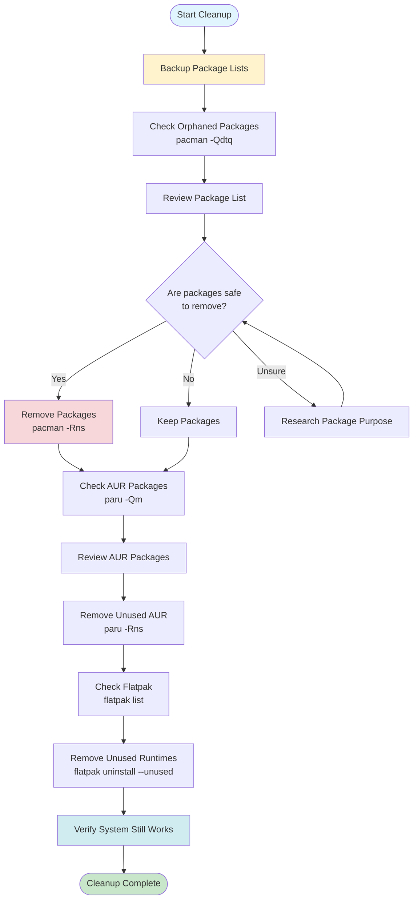

# Package Cleanup Guide

**Remove redundant, orphaned, and unused packages to free up space and reduce system bloat.**

This guide covers safe practices for identifying and removing unnecessary packages from your Arch/CachyOS system using `pacman`, `paru`, and `flatpak`.

---

## Safety First

**IMPORTANT:** Before removing packages:

1. **Review the list** of packages to be removed
2. **Understand dependencies** - some packages may be required by others
3. **Backup your system** or at least your package list
4. **Test in a safe environment** if possible

### Create Package List Backup

```bash
# Backup installed packages list
pacman -Qqe > installed-packages-$(date +%Y%m%d).txt

# Backup AUR packages (if using paru)
paru -Qqe > aur-packages-$(date +%Y%m%d).txt

# Backup Flatpak applications
flatpak list > flatpak-apps-$(date +%Y%m%d).txt
```

---

## Finding Orphaned Packages

Orphaned packages are packages that were installed as dependencies but are no longer required by any installed package.

### Check for Orphaned Packages

```bash
# List all orphaned packages
pacman -Qdtq

# List orphaned packages with details
pacman -Qdt

# Count orphaned packages
pacman -Qdtq | wc -l
```

### Understanding the Output

- `pacman -Qdtq` - Lists only package names (quiet mode)
- `pacman -Qdt` - Lists packages with version info
- `-Qdt` means: Query (`-Q`), Dependencies (`-d`), Unrequired (`-t`)

### Example Output

```bash
$ pacman -Qdtq
linux-headers
python-setuptools
gcc-libs
```

**Note:** Some packages may appear as orphaned but are actually needed. Always review before removal.

---

## Finding Unused Dependencies

These are packages that were installed as dependencies but are no longer needed.

### Check Unused Dependencies

```bash
# List unused dependencies
pacman -Qdt

# More detailed view
pacman -Qdt | less
```

### Safe Removal of Orphaned Packages

```bash
# Step 1: Review the list
pacman -Qdtq

# Step 2: Remove specific packages (safer)
sudo pacman -Rns package-name

# Step 3: Remove all orphaned packages (use with caution!)
sudo pacman -Rns $(pacman -Qdtq)
```

**Warning:** The last command removes ALL orphaned packages. Review the list first!

---

## Finding Large Packages

Identify packages taking up the most disk space.

### List Largest Packages

```bash
# If expac is installed
expac -H M '%m\t%n' | sort -h | tail -20

# Install expac if needed
sudo pacman -S expac

# Alternative: using pacman query
pacman -Qi | awk '/^Name/ {name=$3} /^Installed Size/ {print $4$5, name}' | sort -h | tail -20
```

### Check Package Size Before Removal

```bash
# Get size of a specific package
pacman -Qi package-name | grep "Installed Size"

# Get total size of orphaned packages
pacman -Qi $(pacman -Qdtq) | grep "Installed Size" | awk '{sum+=$4} END {print sum " MiB"}'
```

---

## Removing AUR Packages

AUR packages installed via `paru` or `yay` require different handling.

### List AUR Packages

```bash
# List all AUR packages
paru -Qm

# List AUR packages with details
paru -Qm | xargs paru -Qi
```

### Remove AUR Packages

```bash
# Remove specific AUR package
paru -Rns package-name

# Remove AUR package and its dependencies
paru -Rns --aur package-name

# Remove multiple AUR packages
paru -Rns package1 package2 package3
```

### Find Orphaned AUR Dependencies

```bash
# Check for AUR packages that are dependencies
paru -Qdt

# This shows both regular and AUR orphaned packages
```

---

## Cleaning Build Dependencies

After building AUR packages, build dependencies may remain.

### Find Build Dependencies

```bash
# List packages in base-devel group
pacman -Qg base-devel

# Check if base-devel packages are still needed
# (Keep these if you regularly build AUR packages)
```

### Remove Build Dependencies (Careful!)

```bash
# Remove all orphaned packages (includes build deps if unused)
sudo pacman -Rns $(pacman -Qdtq)

# Remove specific build tools (only if not building packages)
sudo pacman -Rns gcc make cmake
```

**Important:** If you regularly build AUR packages, keep `base-devel` group installed.

---

## Flatpak Package Cleanup

Clean up unused Flatpak runtimes and applications.

### List Flatpak Applications

```bash
# List installed applications
flatpak list

# List installed runtimes
flatpak list --runtime

# List unused runtimes
flatpak list --runtime --unused
```

### Remove Unused Flatpak Runtimes

```bash
# List unused runtimes (dry-run)
flatpak uninstall --unused --dry-run

# Remove unused runtimes
flatpak uninstall --unused

# Remove specific runtime
flatpak uninstall runtime-name
```

### Remove Flatpak Applications

```bash
# Remove specific application
flatpak uninstall app-id

# Example:
flatpak uninstall org.zen.browser

# Remove application and its data
flatpak uninstall --delete-data app-id
```

### Clean Flatpak Cache

```bash
# Repair Flatpak installation
flatpak repair

# Clean Flatpak cache
flatpak uninstall --unused
```

---

## Interactive Package Cleanup Script

Use the provided script for safer, interactive cleanup:

```bash
# Run interactive cleanup script
./scripts/cleanup-packages.sh
```

The script will:

- List orphaned packages
- Show package sizes
- Ask for confirmation before removal
- Provide dry-run mode

---

## Common Packages to Review

### Build Tools (Keep if building AUR packages)

- `base-devel` - Essential build tools
- `cmake` - Build system
- `gcc` - Compiler
- `make` - Build automation

**Decision:** Keep if you regularly install AUR packages, remove if you don't.

### Power Management (Keep if using)

- `thermald` - Thermal daemon
- `tlp` - Power management
- `powertop` - Power monitoring

**Decision:** Keep if you're using power management features (see `cachy_os_config`).

### Printer Setup (Keep if using printer)

- `cups` - Print system
- `avahi` - Network discovery
- `brother-dcpt820dw` - Printer driver (AUR)

**Decision:** Keep if you use a printer, remove if you don't.

### Development Tools

- `nvm` - Node version manager
- `nodejs` - JavaScript runtime
- `npm` - Package manager

**Decision:** Keep if doing development, remove if not.

---

## Safe Removal Workflow



---

## Step-by-Step Cleanup Process

### Step 1: Backup

```bash
# Create backup directory
mkdir -p ~/package-backups
cd ~/package-backups

# Backup package lists
pacman -Qqe > pacman-packages-$(date +%Y%m%d).txt
paru -Qqe > aur-packages-$(date +%Y%m%d).txt
flatpak list > flatpak-apps-$(date +%Y%m%d).txt

echo "Backups created in ~/package-backups/"
```

### Step 2: Identify Orphaned Packages

```bash
# List orphaned packages
echo "=== Orphaned Packages ===" > cleanup-report.txt
pacman -Qdtq >> cleanup-report.txt

# Count them
echo "" >> cleanup-report.txt
echo "Total orphaned packages: $(pacman -Qdtq | wc -l)" >> cleanup-report.txt

# View the report
cat cleanup-report.txt
```

### Step 3: Review Each Package

```bash
# Check what a package does
pacman -Qi package-name

# Check if it's required by anything
pacman -Qi package-name | grep "Required By"

# Search for package info online
# Or check: https://archlinux.org/packages/
```

### Step 4: Remove Packages (One by One or All)

```bash
# Remove specific package
sudo pacman -Rns package-name

# Or remove all orphaned (after review!)
sudo pacman -Rns $(pacman -Qdtq)
```

### Step 5: Clean AUR Packages

```bash
# List AUR packages
paru -Qm

# Remove unused AUR packages
paru -Rns package-name
```

### Step 6: Clean Flatpak

```bash
# Remove unused runtimes
flatpak uninstall --unused

# List and remove unused applications
flatpak list --app
```

### Step 7: Verify System

```bash
# Check system still works
sudo pacman -Syu  # Update system
sudo systemctl status  # Check services

# Test critical applications
# (browser, terminal, file manager, etc.)
```

---

## Troubleshooting

### "Package is required by another package"

**Error:**

```
error: failed to prepare transaction (could not satisfy dependencies)
package-name is required by: other-package
```

**Solution:**

- Don't remove packages that are dependencies
- Check what requires it: `pacman -Qi package-name | grep "Required By"`
- Remove the parent package first if you want to remove both

### "Cannot remove package: file conflicts"

**Error:**

```
error: failed to commit transaction (conflicting files)
```

**Solution:**

- Check for file conflicts: `pacman -Qo /path/to/file`
- May need to force removal: `sudo pacman -Rdd package-name` (dangerous!)
- Or resolve conflicts manually

### "Removed package but system broke"

**Solution:**

- Reinstall the package: `sudo pacman -S package-name`
- Or restore from backup: `sudo pacman -S - < installed-packages-backup.txt`
- Check logs: `journalctl -p err -b`

### "Can't find package in AUR"

**Error:**

```
error: target not found: package-name
```

**Solution:**

- Check if it's an AUR package: `paru -Ss package-name`
- Use paru for AUR packages: `paru -Rns package-name`
- Check if package was removed from AUR

---

## Best Practices

1. **Regular Cleanup:** Run cleanup monthly or quarterly
2. **Review Before Removal:** Always check what packages do
3. **Keep Backups:** Maintain package list backups
4. **Test After Cleanup:** Verify system still works
5. **Keep Build Tools:** If you build AUR packages, keep `base-devel`
6. **Document Removals:** Note why you removed packages

---

## Quick Reference

```bash
# Find orphaned packages
pacman -Qdtq

# Remove orphaned packages
sudo pacman -Rns $(pacman -Qdtq)

# Find large packages
expac -H M '%m\t%n' | sort -h | tail -20

# List AUR packages
paru -Qm

# Remove AUR package
paru -Rns package-name

# Remove unused Flatpak runtimes
flatpak uninstall --unused

# Backup package lists
pacman -Qqe > packages-backup.txt
```

---

**Next Steps:**

- After cleaning packages, clean caches: [Cache Cleanup Guide](CACHE_CLEANUP.md)
- Optimize memory: [Memory Optimization Guide](MEMORY_OPTIMIZATION.md)
- Automate cleanup: [Maintenance Scripts Guide](MAINTENANCE_SCRIPTS.md)
