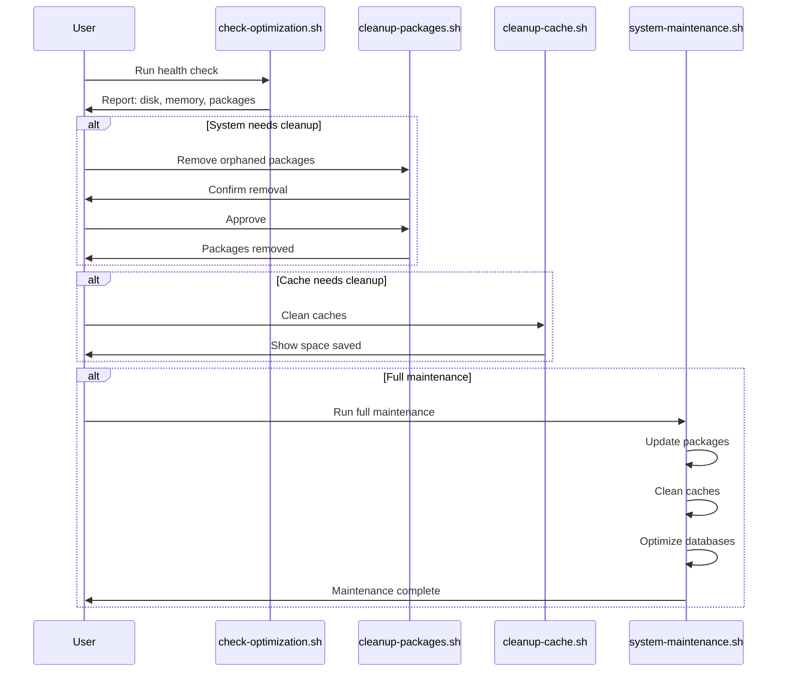

# System Optimization & Maintenance Guide

**Complete guide for optimizing, cleaning, and maintaining CachyOS/Arch-based systems.**

This guide covers removing redundant packages, optimizing memory usage, improving system speed, cleaning caches, and automating maintenance tasks for Arch Linux and Arch-based distributions.

---

## Quick Decision Tree


---

## What's Included

### 1. [Package Cleanup Guide](PACKAGE_CLEANUP.md)

Remove redundant, orphaned, and unused packages to free up space and reduce system bloat.

**Covers:**

- Finding orphaned packages (`pacman -Qdtq`)
- Identifying unused dependencies
- Removing AUR packages safely
- Cleaning build dependencies
- Finding large packages
- Flatpak runtime cleanup
- Safe removal practices

**Quick Start:**

```bash
# Check for orphaned packages
pacman -Qdtq

# Remove orphaned packages (review first!)
pacman -Rns $(pacman -Qdtq)
```

---

### 2. [Cache Cleanup Guide](CACHE_CLEANUP.md)

Clean package manager caches, logs, and temporary files to reclaim disk space.

**Covers:**

- Pacman cache cleanup (`/var/cache/pacman/pkg/`)
- Paru cache cleanup (`~/.cache/paru/`)
- Flatpak cache and unused runtimes
- Systemd journal log rotation
- Temporary files cleanup
- Browser caches (optional)

**Quick Start:**

```bash
# Clean pacman cache (keeps last 2 versions)
sudo pacman -Sc

# Clean paru cache
paru -Sc

# Clean Flatpak unused runtimes
flatpak uninstall --unused
```

---

### 3. [Memory Optimization Guide](MEMORY_OPTIMIZATION.md)

Optimize memory usage, configure swap, and manage memory-hungry processes.

**Covers:**

- Checking memory usage (`free -h`, `htop`)
- Identifying memory-hungry processes
- Swap optimization (file vs partition)
- Swappiness tuning
- ZRAM setup (CachyOS)
- OOM killer configuration
- Systemd service memory limits
- Memory leak detection

**Quick Start:**

```bash
# Check memory usage
free -h

# Check swappiness
cat /proc/sys/vm/swappiness

# Set swappiness (lower = less swap usage)
sudo sysctl vm.swappiness=10
```

---

### 4. [Speed Optimization Guide](SPEED_OPTIMIZATION.md)

Improve boot time, optimize databases, and tune filesystem performance.

**Covers:**

- Boot time optimization (`systemd-analyze`)
- Database optimization (pacman, locate)
- Filesystem optimization (TRIM, mount options)
- Kernel parameters (reference to `cachy_os_config`)
- CPU governor settings
- I/O scheduler optimization
- Network optimization

**Quick Start:**

```bash
# Analyze boot time
systemd-analyze blame

# Refresh pacman file database
sudo pacman -Fy

# TRIM SSD (if using SSD)
sudo fstrim -av
```

---

### 5. [Maintenance Scripts Guide](MAINTENANCE_SCRIPTS.md)

Automate system maintenance with scripts and scheduled tasks.

**Covers:**

- Automated maintenance scripts
- Scheduling with systemd timers
- Safety checks and dry-run modes
- Logging and reporting
- Integration with existing scripts

**Quick Start:**

**Run directly from GitHub:**

```bash
# Check system health (no sudo needed)
bash <(curl -s https://raw.githubusercontent.com/cjmaaz/ArchStarterPack/master/system-optimization/scripts/check-optimization.sh)

# Run comprehensive maintenance (requires sudo)
bash <(curl -s https://raw.githubusercontent.com/cjmaaz/ArchStarterPack/master/system-optimization/scripts/system-maintenance.sh)
```

**Or run from local directory:**

```bash
# Run comprehensive maintenance
./scripts/system-maintenance.sh

# Check system health
./scripts/check-optimization.sh
```

---

## Maintenance Workflow



---

## Safety First

**IMPORTANT:** Before running any optimization commands:

1. **Backup your system** or at least important data
2. **Review commands** before executing (especially removal commands)
3. **Use dry-run modes** when available
4. **Test in a safe environment** if possible
5. **Keep this guide open** for reference

### Backup Recommendations

```bash
# Backup pacman database
sudo tar -czf pacman-db-backup-$(date +%Y%m%d).tar.gz /var/lib/pacman/sync/

# Backup package list
pacman -Qqe > installed-packages-$(date +%Y%m%d).txt

# Backup AUR package list (if using paru)
paru -Qqe > aur-packages-$(date +%Y%m%d).txt
```

---

## Integration with Other Modules

This optimization guide works alongside other modules in this repository:

- **[CachyOS Configuration](../cachy_os_config/)** - Power management and performance tuning
- **[Linux Package Management](../linux-packages/)** - Package installation and management
- **[Shell Commands](../shell-commands/)** - Command-line tools for system management

**Example:** After optimizing power settings in `cachy_os_config`, use this guide to clean up unused packages and caches.

---

## Quick Reference

### Check System Health

**Run from local directory:**

```bash
# Run health check script
./scripts/check-optimization.sh
```

**Run directly from GitHub (no download needed):**

```bash
# For Bash/Zsh
bash <(curl -s https://raw.githubusercontent.com/cjmaaz/ArchStarterPack/master/system-optimization/scripts/check-optimization.sh)

# For Fish shell
curl -s https://raw.githubusercontent.com/cjmaaz/ArchStarterPack/master/system-optimization/scripts/check-optimization.sh | bash

# Universal method (works in any shell)
curl -s https://raw.githubusercontent.com/cjmaaz/ArchStarterPack/master/system-optimization/scripts/check-optimization.sh | bash
```

**Or manually check:**

```bash
df -h                    # Disk usage
free -h                  # Memory usage
pacman -Qdtq             # Orphaned packages
du -sh /var/cache/pacman/pkg/  # Cache size
```

### Common Optimization Tasks

**Using scripts (recommended):**

```bash
# Run scripts directly from GitHub

# 1. Check system health (no sudo needed)
bash <(curl -s https://raw.githubusercontent.com/cjmaaz/ArchStarterPack/master/system-optimization/scripts/check-optimization.sh)

# 2. Clean orphaned packages (interactive, requires sudo)
bash <(curl -s https://raw.githubusercontent.com/cjmaaz/ArchStarterPack/master/system-optimization/scripts/cleanup-packages.sh)

# 3. Clean all caches (requires sudo)
bash <(curl -s https://raw.githubusercontent.com/cjmaaz/ArchStarterPack/master/system-optimization/scripts/cleanup-cache.sh)

# 4. Full system maintenance (requires sudo)
bash <(curl -s https://raw.githubusercontent.com/cjmaaz/ArchStarterPack/master/system-optimization/scripts/system-maintenance.sh)
```

**Manual commands:**

```bash
# 1. Remove orphaned packages
pacman -Qdtq | sudo pacman -Rns -

# 2. Clean pacman cache (keep last 2)
sudo pacman -Sc

# 3. Clean paru cache
paru -Sc

# 4. Clean Flatpak unused runtimes
flatpak uninstall --unused

# 5. Rotate journal logs (keep last 7 days)
sudo journalctl --vacuum-time=7d

# 6. TRIM SSD
sudo fstrim -av
```

---

## Scripts Overview

All scripts are located in the `scripts/` directory:

| Script                  | Purpose                  | Safety                               |
| ----------------------- | ------------------------ | ------------------------------------ |
| `check-optimization.sh` | System health check      | Read-only, safe                      |
| `cleanup-packages.sh`   | Remove orphaned packages | Interactive, confirms before removal |
| `cleanup-cache.sh`      | Clean all caches         | Shows what will be removed           |
| `system-maintenance.sh` | Full system maintenance  | Comprehensive, includes updates      |

**All scripts include:**

- Dry-run modes where applicable
- Confirmation prompts for destructive operations
- Clear output and progress indicators
- Error handling

---

## When to Run Optimizations

### Daily/Weekly

- Check system health (`check-optimization.sh`)
- Clean temporary files

### Monthly

- Clean package caches
- Remove orphaned packages
- Rotate journal logs

### Quarterly

- Full system maintenance (`system-maintenance.sh`)
- Review and optimize memory settings
- Check boot time and optimize services

### As Needed

- When disk space is low
- When system feels slow
- After major package installations/removals

---

## Troubleshooting

### "Permission denied" errors

- Most optimization commands require `sudo` privileges
- Check you have sudo access: `sudo -v`

### "Package not found" errors

- Verify package names: `pacman -Ss <package>`
- Check if package is from AUR: `paru -Ss <package>`

### "Cache cleanup didn't free much space"

- Check other locations: `~/.cache/`, `~/.local/share/`
- Review Flatpak applications: `flatpak list`
- Check journal logs: `journalctl --disk-usage`

### "System still slow after optimization"

- Check CPU governor: `cpupower frequency-info`
- Review running services: `systemctl list-units --type=service --state=running`
- Check for memory leaks: `htop` or `top`

---

## Additional Resources

- **Arch Wiki:** https://wiki.archlinux.org/
- **CachyOS Wiki:** https://wiki.cachyos.org/
- **Systemd Documentation:** https://www.freedesktop.org/software/systemd/man/

---

## Related Guides

- **[Package Cleanup](PACKAGE_CLEANUP.md)** - Detailed package removal guide
- **[Cache Cleanup](CACHE_CLEANUP.md)** - Comprehensive cache management
- **[Memory Optimization](MEMORY_OPTIMIZATION.md)** - Memory tuning guide
- **[Speed Optimization](SPEED_OPTIMIZATION.md)** - Performance tuning
- **[Maintenance Scripts](MAINTENANCE_SCRIPTS.md)** - Automation guide

---

**For package installation and management, see [Linux Package Management](../linux-packages/README.md).**

**For power management and performance tuning, see [CachyOS Configuration](../cachy_os_config/asus_x_507_uf_readme.md).**
