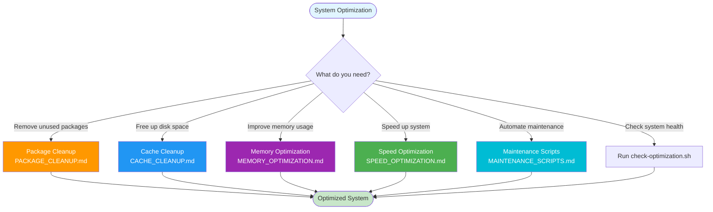
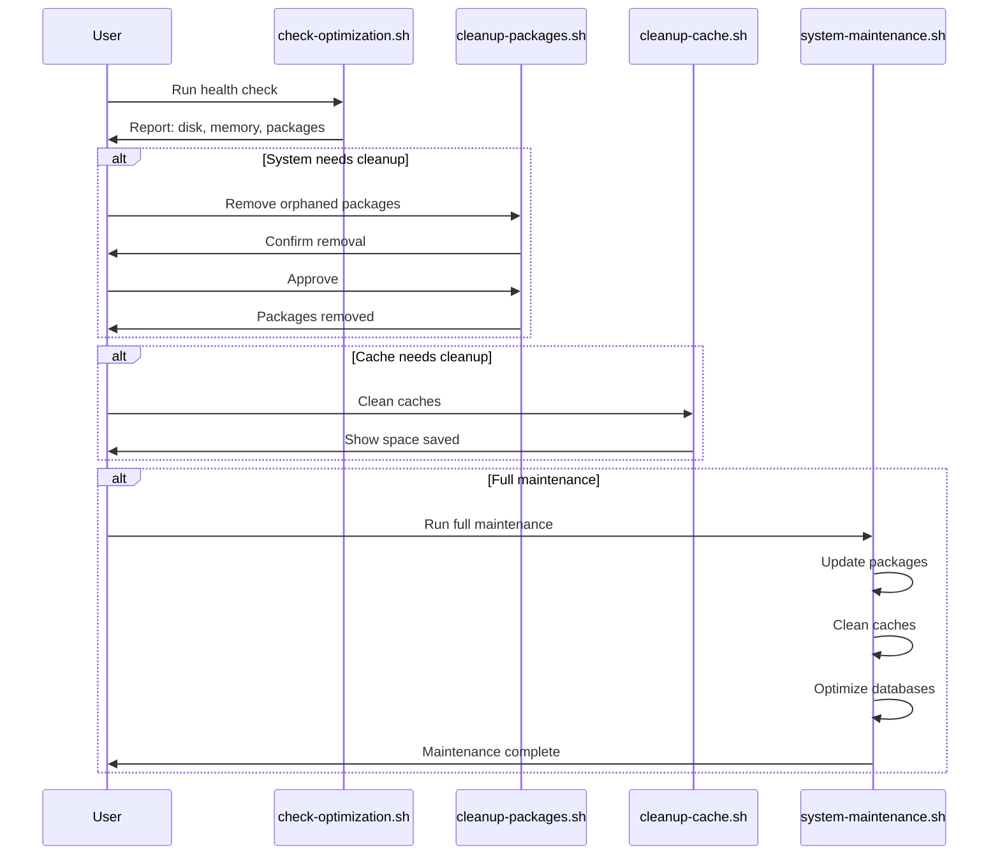

# System Optimization & Maintenance Guide

**Complete guide for optimizing, cleaning, and maintaining CachyOS/Arch-based systems.**

This guide covers removing redundant packages, optimizing memory usage, improving system speed, cleaning caches, and automating maintenance tasks for Arch Linux and Arch-based distributions.

## What Is System Optimization?

### Definition

**System optimization** is the process of improving your Linux system's performance, efficiency, and resource usage by removing unnecessary components, cleaning temporary files, optimizing configurations, and automating maintenance tasks.

### Why System Optimization Exists

**The problem:** Over time, Linux systems accumulate:

- **Unused packages:** Installed but no longer needed
- **Cache files:** Temporary files taking up disk space
- **Orphaned dependencies:** Packages no longer required
- **Inefficient configurations:** Settings that slow down the system
- **Memory waste:** Processes consuming unnecessary RAM

**The solution:** System optimization:

- **Removes bloat:** Eliminates unused packages and files
- **Frees resources:** Reclaims disk space and memory
- **Improves performance:** Optimizes system settings
- **Automates maintenance:** Makes upkeep easier

**Real-world analogy:**

- **System optimization = House cleaning** (remove clutter, organize, maintain)
- **Unused packages = Unused furniture** (taking up space)
- **Cache files = Temporary clutter** (can be cleaned)
- **Optimization = Organizing** (makes everything work better)

### How System Optimization Works

**Step-by-step process:**

1. **Identify issues:** Find what's wasting resources
2. **Analyze impact:** Understand what can be safely removed
3. **Apply optimizations:** Remove bloat, clean caches, optimize settings
4. **Verify results:** Confirm improvements
5. **Automate maintenance:** Set up scripts for ongoing optimization

**Key areas:**

- **Package cleanup:** Remove unused packages
- **Cache cleanup:** Clear temporary files
- **Memory optimization:** Improve RAM usage
- **Speed optimization:** Improve performance
- **Automation:** Maintain optimizations automatically

---

## Quick Decision Tree



---

## What's Included

### 1. [Package Cleanup Guide](PACKAGE_CLEANUP.md)

**What it does:** Remove redundant, orphaned, and unused packages to free up space and reduce system bloat.

**Why it's needed:**

- **Disk space:** Unused packages waste disk space
- **System bloat:** Too many packages slow down system
- **Maintenance:** Fewer packages = easier maintenance
- **Security:** Fewer packages = smaller attack surface

**How it works:**

- **Find orphaned packages:** Identify packages no longer needed
- **Review safely:** Check what can be removed
- **Remove packages:** Uninstall unused packages
- **Verify system:** Ensure system still works

**Covers:**

- **Finding orphaned packages:** `pacman -Qdtq` - Packages no longer needed
- **Identifying unused dependencies:** Packages installed as dependencies but not used
- **Removing AUR packages safely:** Safe removal of AUR-installed packages
- **Cleaning build dependencies:** Remove packages only needed for building
- **Finding large packages:** Identify packages taking most space
- **Flatpak runtime cleanup:** Remove unused Flatpak runtimes
- **Safe removal practices:** How to remove packages without breaking system

**Quick Start:**

```bash
# Check for orphaned packages
pacman -Qdtq

# Remove orphaned packages (review first!)
pacman -Rns $(pacman -Qdtq)
```

**Real-world example:**

**Before cleanup:**

- System has 2000 packages installed
- 50 orphaned packages taking 500MB
- Disk usage: 80% full

**After cleanup:**

- Removed 50 orphaned packages
- Freed 500MB disk space
- Disk usage: 75% full ✅

---

### 2. [Cache Cleanup Guide](CACHE_CLEANUP.md)

**What it does:** Clean package manager caches, logs, and temporary files to reclaim disk space.

**Why it's needed:**

- **Disk space:** Caches can consume gigabytes of space
- **Performance:** Too many cache files can slow down operations
- **Maintenance:** Old cache files serve no purpose
- **Resource usage:** Caches use disk space unnecessarily

**How it works:**

- **Identify caches:** Find cache locations
- **Check sizes:** See how much space caches use
- **Clean safely:** Remove old/unused cache files
- **Keep recent:** Preserve recent caches for speed

**Covers:**

- **Pacman cache cleanup:** `/var/cache/pacman/pkg/` - Downloaded package files
- **Paru cache cleanup:** `~/.cache/paru/` - AUR build cache
- **Flatpak cache and unused runtimes:** Application data and runtimes
- **Systemd journal log rotation:** System logs management
- **Temporary files cleanup:** Various temporary files
- **Browser caches (optional):** Application-specific caches

**Quick Start:**

```bash
# Clean pacman cache (keeps last 2 versions)
sudo pacman -Sc

# Clean paru cache
paru -Sc

# Clean Flatpak unused runtimes
flatpak uninstall --unused
```

**Real-world example:**

**Before cleanup:**

- Pacman cache: 5GB
- Paru cache: 2GB
- Flatpak cache: 3GB
- Total: 10GB wasted

**After cleanup:**

- Pacman cache: 1GB (kept recent)
- Paru cache: 500MB (kept recent)
- Flatpak cache: 1GB (removed unused)
- Freed: 7.5GB ✅

---

### 3. [Memory Optimization Guide](MEMORY_OPTIMIZATION.md)

**What it does:** Optimize memory usage, configure swap, and manage memory-hungry processes.

**Why it's needed:**

- **Performance:** Low memory causes slowdowns
- **Stability:** Out of memory can crash system
- **Efficiency:** Better memory usage = better performance
- **Resource management:** Control how memory is used

**How it works:**

- **Monitor memory:** Track memory usage
- **Identify issues:** Find memory-hungry processes
- **Configure swap:** Set up virtual memory
- **Tune settings:** Optimize memory management
- **Manage processes:** Control memory usage

**Covers:**

- **Checking memory usage:** `free -h`, `htop` - Monitor memory
- **Identifying memory-hungry processes:** Find what's using memory
- **Swap optimization:** File vs partition - Virtual memory setup
- **Swappiness tuning:** Control swap usage preference
- **ZRAM setup (CachyOS):** Compressed RAM for better performance
- **OOM killer configuration:** Out-of-memory handling
- **Systemd service memory limits:** Limit service memory usage
- **Memory leak detection:** Find processes leaking memory

**Quick Start:**

```bash
# Check memory usage
free -h

# Check swappiness
cat /proc/sys/vm/swappiness

# Set swappiness (lower = less swap usage)
sudo sysctl vm.swappiness=10
```

**Real-world example:**

**Before optimization:**

- System using swap heavily (slow)
- Swappiness: 60 (too high)
- Memory pressure: High

**After optimization:**

- Swappiness: 10 (prefer RAM)
- Less swap usage (faster)
- Better performance ✅

---

### 4. [Speed Optimization Guide](SPEED_OPTIMIZATION.md)

**What it does:** Improve boot time, optimize databases, and tune filesystem performance.

**Why it's needed:**

- **Boot speed:** Slow boot times waste time
- **System responsiveness:** Faster system = better experience
- **Database performance:** Optimized databases = faster operations
- **Filesystem performance:** Better I/O = faster file operations

**How it works:**

- **Analyze performance:** Identify bottlenecks
- **Optimize databases:** Improve database performance
- **Tune filesystem:** Optimize disk I/O
- **Configure settings:** Adjust system parameters
- **Measure improvements:** Verify speed improvements

**Covers:**

- **Boot time optimization:** `systemd-analyze` - Analyze and improve boot time
- **Database optimization:** Pacman, locate - Optimize package and file databases
- **Filesystem optimization:** TRIM, mount options - Improve disk performance
- **Kernel parameters:** Reference to `cachy_os_config` - System-level tuning
- **CPU governor settings:** Control CPU frequency scaling
- **I/O scheduler optimization:** Optimize disk I/O scheduling
- **Network optimization:** Improve network performance

**Quick Start:**

```bash
# Analyze boot time
systemd-analyze blame

# Refresh pacman file database
sudo pacman -Fy

# TRIM SSD (if using SSD)
sudo fstrim -av
```

**Real-world example:**

**Before optimization:**

- Boot time: 30 seconds
- Database queries: Slow
- File operations: Sluggish

**After optimization:**

- Boot time: 15 seconds (50% faster) ✅
- Database queries: Fast
- File operations: Responsive

---

### 5. [Maintenance Scripts Guide](MAINTENANCE_SCRIPTS.md)

**What it does:** Automate system maintenance with scripts and scheduled tasks.

**Why it's needed:**

- **Automation:** Reduces manual maintenance work
- **Consistency:** Ensures maintenance happens regularly
- **Efficiency:** Saves time and effort
- **Reliability:** Reduces human error

**How it works:**

- **Scripts:** Automated maintenance commands
- **Scheduling:** Run scripts automatically
- **Safety checks:** Verify before making changes
- **Logging:** Track what was done
- **Reporting:** Show results

**Covers:**

- **Automated maintenance scripts:** Pre-built scripts for common tasks
- **Scheduling with systemd timers:** Run scripts automatically
- **Safety checks and dry-run modes:** Verify before executing
- **Logging and reporting:** Track maintenance activities
- **Integration with existing scripts:** Work with your setup

**Quick Start:**

**Run directly from GitHub:**

**For Bash/Zsh:**

```bash
# Check system health (no sudo needed)
bash <(curl -s https://raw.githubusercontent.com/cjmaaz/ArchStarterPack/master/system-optimization/scripts/check-optimization.sh)

# Run comprehensive maintenance (requires sudo)
bash <(curl -s https://raw.githubusercontent.com/cjmaaz/ArchStarterPack/master/system-optimization/scripts/system-maintenance.sh)
```

**Real-world example:**

**Manual maintenance:**

- Run commands manually each week
- Easy to forget
- Time-consuming
- Inconsistent

**Automated maintenance:**

- Scripts run automatically
- Never forgotten
- Saves time
- Consistent ✅

**For Fish shell:**

```fish
# Check system health (no sudo needed)
curl -s https://raw.githubusercontent.com/cjmaaz/ArchStarterPack/master/system-optimization/scripts/check-optimization.sh | bash

# Run comprehensive maintenance (requires sudo)
curl -s https://raw.githubusercontent.com/cjmaaz/ArchStarterPack/master/system-optimization/scripts/system-maintenance.sh | bash
```

**Universal method (works in any shell):**

```bash
# Check system health (no sudo needed)
curl -s https://raw.githubusercontent.com/cjmaaz/ArchStarterPack/master/system-optimization/scripts/check-optimization.sh | bash

# Run comprehensive maintenance (requires sudo)
curl -s https://raw.githubusercontent.com/cjmaaz/ArchStarterPack/master/system-optimization/scripts/system-maintenance.sh | bash
```

**Or run from local directory:**

```bash
# Run comprehensive maintenance
./scripts/system-maintenance.sh

# Check system health
./scripts/check-optimization.sh
```

---

## Maintenance Workflow



---

## Safety First

### Why Safety Matters

**The problem:** Optimization commands can:

- **Remove packages:** May break system if wrong packages removed
- **Modify system:** Changes system configuration
- **Delete files:** Removes cache and temporary files
- **Cause issues:** Mistakes can cause problems

**The solution:** Always follow safety practices:

- **Backup first:** Have recovery option
- **Review carefully:** Understand what commands do
- **Test safely:** Use dry-run modes
- **Verify results:** Confirm changes worked

**IMPORTANT:** Before running any optimization commands:

**1. Backup your system or at least important data**

**Why:** If something goes wrong, you can restore.

**What to backup:**

- Package lists (what's installed)
- Configuration files (system settings)
- Important data (documents, projects)

**2. Review commands before executing (especially removal commands)**

**Why:** Understand what will happen before it happens.

**How:**

- Read command documentation
- Check what packages/files will be affected
- Verify commands are correct

**3. Use dry-run modes when available**

**Why:** See what would happen without actually doing it.

**How:**

- Many commands have `--dry-run` or `--print` flags
- Shows what would be done without executing
- Review output before running for real

**4. Test in a safe environment if possible**

**Why:** Test changes before applying to production system.

**How:**

- Use virtual machine for testing
- Test on non-critical system first
- Verify changes work as expected

**5. Keep this guide open for reference**

**Why:** Quick access to commands and explanations.

**How:**

- Keep guide open while working
- Reference troubleshooting sections
- Check safety practices

### Backup Recommendations

**What backups do:** Create copies of important data that can be restored if needed.

**Why backups matter:**

- **Recovery:** Can restore if something breaks
- **Safety net:** Protection against mistakes
- **Peace of mind:** Confidence to make changes

**Backup pacman database:**

```bash
# Backup pacman database
sudo tar -czf pacman-db-backup-$(date +%Y%m%d).tar.gz /var/lib/pacman/sync/
```

**What this does:**

- **`tar -czf`:** Creates compressed archive
- **`pacman-db-backup-$(date +%Y%m%d).tar.gz`:** Filename with date
- **`/var/lib/pacman/sync/`:** Pacman database location
- **Result:** Compressed backup of package database

**Backup package list:**

```bash
# Backup package list
pacman -Qqe > installed-packages-$(date +%Y%m%d).txt
```

**What this does:**

- **`pacman -Qqe`:** Lists all explicitly installed packages
- **`>`:** Redirects output to file
- **`installed-packages-$(date +%Y%m%d).txt`:** Filename with date
- **Result:** Text file listing all installed packages

**Backup AUR package list (if using paru):**

```bash
# Backup AUR package list (if using paru)
paru -Qqe > aur-packages-$(date +%Y%m%d).txt
```

**What this does:**

- **`paru -Qqe`:** Lists all AUR packages
- **`>`:** Redirects output to file
- **`aur-packages-$(date +%Y%m%d).txt`:** Filename with date
- **Result:** Text file listing all AUR packages

**Real-world example:**

**Before optimization:**

- No backups
- Risk of data loss
- Can't recover if something breaks ❌

**After creating backups:**

- Package lists backed up
- Can restore if needed
- Safe to proceed with optimization ✅

---

## Integration with Other Modules

This optimization guide works alongside other modules in this repository:

- **[CachyOS Configuration](../cachy_os_config/)** - Power management and performance tuning
- **[Linux Package Management](../linux-packages/)** - Package installation and management
- **[Shell Commands](../shell-commands/)** - Command-line tools for system management

**Example:** After optimizing power settings in `cachy_os_config`, use this guide to clean up unused packages and caches.

---

## Quick Reference

### Check System Health

**Run from local directory:**

```bash
# Run health check script
./scripts/check-optimization.sh
```

**Run directly from GitHub (no download needed):**

```bash
# For Bash/Zsh
bash <(curl -s https://raw.githubusercontent.com/cjmaaz/ArchStarterPack/master/system-optimization/scripts/check-optimization.sh)

# For Fish shell
curl -s https://raw.githubusercontent.com/cjmaaz/ArchStarterPack/master/system-optimization/scripts/check-optimization.sh | bash

# Universal method (works in any shell)
curl -s https://raw.githubusercontent.com/cjmaaz/ArchStarterPack/master/system-optimization/scripts/check-optimization.sh | bash
```

**Or manually check:**

```bash
df -h                    # Disk usage
free -h                  # Memory usage
pacman -Qdtq             # Orphaned packages
du -sh /var/cache/pacman/pkg/  # Cache size
```

### Common Optimization Tasks

**Using scripts (recommended):**

**For Bash/Zsh:**

```bash
# Run scripts directly from GitHub

# 1. Check system health (no sudo needed)
bash <(curl -s https://raw.githubusercontent.com/cjmaaz/ArchStarterPack/master/system-optimization/scripts/check-optimization.sh)

# 2. Clean orphaned packages (interactive, requires sudo)
bash <(curl -s https://raw.githubusercontent.com/cjmaaz/ArchStarterPack/master/system-optimization/scripts/cleanup-packages.sh)

# 3. Clean all caches (requires sudo)
bash <(curl -s https://raw.githubusercontent.com/cjmaaz/ArchStarterPack/master/system-optimization/scripts/cleanup-cache.sh)

# 4. Full system maintenance (requires sudo)
bash <(curl -s https://raw.githubusercontent.com/cjmaaz/ArchStarterPack/master/system-optimization/scripts/system-maintenance.sh)
```

**For Fish shell:**

```fish
# 1. Check system health (no sudo needed)
curl -s https://raw.githubusercontent.com/cjmaaz/ArchStarterPack/master/system-optimization/scripts/check-optimization.sh | bash

# 2. Clean orphaned packages (interactive, requires sudo)
curl -s https://raw.githubusercontent.com/cjmaaz/ArchStarterPack/master/system-optimization/scripts/cleanup-packages.sh | bash

# 3. Clean all caches (requires sudo)
curl -s https://raw.githubusercontent.com/cjmaaz/ArchStarterPack/master/system-optimization/scripts/cleanup-cache.sh | bash

# 4. Full system maintenance (requires sudo)
curl -s https://raw.githubusercontent.com/cjmaaz/ArchStarterPack/master/system-optimization/scripts/system-maintenance.sh | bash
```

**Universal method (works in any shell):**

```bash
# 1. Check system health (no sudo needed)
curl -s https://raw.githubusercontent.com/cjmaaz/ArchStarterPack/master/system-optimization/scripts/check-optimization.sh | bash

# 2. Clean orphaned packages (interactive, requires sudo)
curl -s https://raw.githubusercontent.com/cjmaaz/ArchStarterPack/master/system-optimization/scripts/cleanup-packages.sh | bash

# 3. Clean all caches (requires sudo)
curl -s https://raw.githubusercontent.com/cjmaaz/ArchStarterPack/master/system-optimization/scripts/cleanup-cache.sh | bash

# 4. Full system maintenance (requires sudo)
curl -s https://raw.githubusercontent.com/cjmaaz/ArchStarterPack/master/system-optimization/scripts/system-maintenance.sh | bash
```

**Manual commands:**

```bash
# 1. Remove orphaned packages
pacman -Qdtq | sudo pacman -Rns -

# 2. Clean pacman cache (keep last 2)
sudo pacman -Sc

# 3. Clean paru cache
paru -Sc

# 4. Clean Flatpak unused runtimes
flatpak uninstall --unused

# 5. Rotate journal logs (keep last 7 days)
sudo journalctl --vacuum-time=7d

# 6. TRIM SSD
sudo fstrim -av
```

---

## Scripts Overview

All scripts are located in the `scripts/` directory:

| Script                  | Purpose                  | Safety                               |
| ----------------------- | ------------------------ | ------------------------------------ |
| `check-optimization.sh` | System health check      | Read-only, safe                      |
| `cleanup-packages.sh`   | Remove orphaned packages | Interactive, confirms before removal |
| `cleanup-cache.sh`      | Clean all caches         | Shows what will be removed           |
| `system-maintenance.sh` | Full system maintenance  | Comprehensive, includes updates      |

**All scripts include:**

- Dry-run modes where applicable
- Confirmation prompts for destructive operations
- Clear output and progress indicators
- Error handling

---

## When to Run Optimizations

### Daily/Weekly

- Check system health (`check-optimization.sh`)
- Clean temporary files

### Monthly

- Clean package caches
- Remove orphaned packages
- Rotate journal logs

### Quarterly

- Full system maintenance (`system-maintenance.sh`)
- Review and optimize memory settings
- Check boot time and optimize services

### As Needed

- When disk space is low
- When system feels slow
- After major package installations/removals

---

## Troubleshooting

### "Permission denied" errors

- Most optimization commands require `sudo` privileges
- Check you have sudo access: `sudo -v`

### "Package not found" errors

- Verify package names: `pacman -Ss <package>`
- Check if package is from AUR: `paru -Ss <package>`

### "Cache cleanup didn't free much space"

- Check other locations: `~/.cache/`, `~/.local/share/`
- Review Flatpak applications: `flatpak list`
- Check journal logs: `journalctl --disk-usage`

### "System still slow after optimization"

- Check CPU governor: `cpupower frequency-info`
- Review running services: `systemctl list-units --type=service --state=running`
- Check for memory leaks: `htop` or `top`

---

## Additional Resources

- **Arch Wiki:** https://wiki.archlinux.org/
- **CachyOS Wiki:** https://wiki.cachyos.org/
- **Systemd Documentation:** https://www.freedesktop.org/software/systemd/man/

---

## Related Guides

- **[Package Cleanup](PACKAGE_CLEANUP.md)** - Detailed package removal guide
- **[Cache Cleanup](CACHE_CLEANUP.md)** - Comprehensive cache management
- **[Memory Optimization](MEMORY_OPTIMIZATION.md)** - Memory tuning guide
- **[Speed Optimization](SPEED_OPTIMIZATION.md)** - Performance tuning
- **[Maintenance Scripts](MAINTENANCE_SCRIPTS.md)** - Automation guide

---

**For package installation and management, see [Linux Package Management](../linux-packages/README.md).**

**For power management and performance tuning, see [CachyOS Configuration](../cachy_os_config/asus_x_507_uf_readme.md).**
