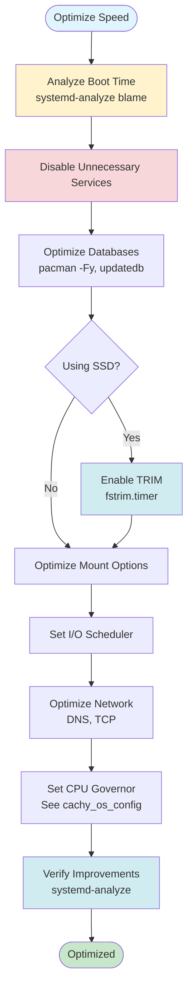

# Speed Optimization Guide

**Improve boot time, optimize databases, and tune filesystem performance.**

This guide covers boot time optimization, database optimization, filesystem tuning, and performance improvements for Arch/CachyOS systems.

---

## Boot Time Optimization

Faster boot times improve system responsiveness and user experience.

### Analyze Boot Time

```bash
# Analyze boot time
systemd-analyze

# Output example:
# Startup finished in 3.234s (kernel) + 12.456s (userspace) = 15.690s

# Detailed boot time breakdown
systemd-analyze blame

# Shows services sorted by boot time:
#   5.234s NetworkManager-wait-online.service
#   2.123s systemd-udev-settle.service
#   1.456s systemd-journald.service
```

### Identify Slow Services

```bash
# Services taking more than 1 second
systemd-analyze blame | grep -E '[0-9]+\.[0-9]+s' | head -10

# Services taking more than 5 seconds
systemd-analyze blame | awk '$1 ~ /^[5-9]/ || $1 ~ /^[0-9][0-9]/'

# Critical path (slowest chain)
systemd-analyze critical-chain

# Plot boot timeline (requires systemd-analyze plot)
systemd-analyze plot > boot-time.svg
```

### Disable Unnecessary Services

**List enabled services:**

```bash
# List all enabled services
systemctl list-unit-files --state=enabled

# List running services
systemctl list-units --type=service --state=running

# Check service status
systemctl status service-name
```

**Common services to disable (if not needed):**

```bash
# Bluetooth (if not using)
sudo systemctl disable bluetooth.service

# Print services (if not using printer)
sudo systemctl disable cups.service
sudo systemctl disable cups-browsed.service

# Network wait (can slow boot)
sudo systemctl disable NetworkManager-wait-online.service

# Example: Disable service
sudo systemctl disable service-name.service
sudo systemctl stop service-name.service
```

**Warning:** Only disable services you understand. Some services are required for system functionality.

### Enable Parallel Boot

Systemd already parallelizes boot by default, but you can optimize:

```bash
# Check if parallel boot is enabled (default)
cat /etc/systemd/system.conf | grep -i parallel

# Enable parallel boot explicitly (if not set)
sudo sed -i 's/#DefaultTimeoutStartSec=90s/DefaultTimeoutStartSec=10s/' /etc/systemd/system.conf
```

### Optimize Service Timeouts

```bash
# Edit systemd config
sudo nano /etc/systemd/system.conf

# Set shorter timeouts:
DefaultTimeoutStartSec=10s
DefaultTimeoutStopSec=10s
```

### Disable Unnecessary Kernel Modules

```bash
# List loaded modules
lsmod

# Blacklist unnecessary modules
sudo nano /etc/modprobe.d/blacklist.conf

# Example: Blacklist Bluetooth (if not using)
blacklist btusb
blacklist bluetooth
```

---

## Database Optimization

Optimize package and file databases for faster queries.

### Pacman Database Optimization

```bash
# Refresh package database
sudo pacman -Sy

# Refresh file database (for pacman -F)
sudo pacman -Fy

# Optimize pacman database
sudo pacman-optimize

# Note: pacman-optimize is deprecated in newer pacman versions
# Modern pacman optimizes automatically
```

### Locate Database Optimization

The `locate` command uses a database to find files quickly.

```bash
# Check if locate is installed
which locate

# Install if needed
sudo pacman -S mlocate

# Update locate database
sudo updatedb

# Update database regularly (add to cron or systemd timer)
```

### Create Systemd Timer for Updatedb

```bash
# Create timer file
sudo nano /etc/systemd/system/updatedb.timer

# Add:
[Unit]
Description=Update locate database
Requires=updatedb.service

[Timer]
OnBootSec=15min
OnUnitActiveSec=1d

[Install]
WantedBy=timers.target

# Create service file
sudo nano /etc/systemd/system/updatedb.service

# Add:
[Unit]
Description=Update locate database

[Service]
Type=oneshot
ExecStart=/usr/bin/updatedb

# Enable timer
sudo systemctl enable updatedb.timer
sudo systemctl start updatedb.timer
```

---

## Filesystem Optimization

Optimize filesystem performance and enable TRIM for SSDs.

### TRIM for SSDs

TRIM helps maintain SSD performance by marking deleted blocks for garbage collection.

**Check if TRIM is enabled:**

```bash
# Check filesystem type
df -T /

# Check if TRIM is supported
lsblk -o NAME,DISC-MAX

# Check TRIM status
systemctl status fstrim.timer
```

**Enable TRIM:**

```bash
# Run TRIM manually
sudo fstrim -av

# Enable automatic TRIM (systemd timer)
sudo systemctl enable fstrim.timer
sudo systemctl start fstrim.timer

# Check timer status
systemctl status fstrim.timer

# List timer schedule
systemctl list-timers fstrim.timer
```

**Manual TRIM schedule:**

```bash
# Add to crontab (weekly TRIM)
sudo crontab -e

# Add:
0 0 * * 0 /usr/bin/fstrim -av
```

### Mount Options Optimization

Optimize mount options for better performance.

**Check current mount options:**

```bash
# Check mount options
mount | grep -E '^/dev'

# Check /etc/fstab
cat /etc/fstab
```

**Optimize /etc/fstab:**

For SSDs, add these options:

```bash
# Edit fstab
sudo nano /etc/fstab

# Example optimized entry:
UUID=xxxx-xxxx / ext4 defaults,noatime,discard 0 1

# Options explained:
# - noatime: Don't update access time (faster, less writes)
# - discard: Enable TRIM (or use fstrim timer instead)
# - relatime: Update access time only if modified (alternative to noatime)
```

**Warning:** Be careful editing `/etc/fstab`. Incorrect entries can prevent boot.

### I/O Scheduler Optimization

I/O scheduler controls how the kernel handles disk I/O requests.

**Check current scheduler:**

```bash
# Check scheduler for each disk
cat /sys/block/sda/queue/scheduler

# Output example:
# [mq-deadline] kyber bfq none
# (mq-deadline is active)
```

**Set I/O scheduler:**

For SSDs (recommended: `none` or `mq-deadline`):

```bash
# Set scheduler temporarily
echo mq-deadline | sudo tee /sys/block/sda/queue/scheduler

# Or for NVMe SSDs:
echo none | sudo tee /sys/block/nvme0n1/queue/scheduler
```

**Set scheduler permanently:**

Create `/etc/udev/rules.d/60-ioschedulers.rules`:

```bash
# For SSDs
ACTION=="add|change", KERNEL=="sd[a-z]", ATTR{queue/rotational}=="0", ATTR{queue/scheduler}="mq-deadline"

# For NVMe
ACTION=="add|change", KERNEL=="nvme[0-9]n[0-9]", ATTR{queue/scheduler}="none"

# For HDDs
ACTION=="add|change", KERNEL=="sd[a-z]", ATTR{queue/rotational}=="1", ATTR{queue/scheduler}="bfq"
```

**Reload udev rules:**

```bash
sudo udevadm control --reload-rules
sudo udevadm trigger
```

---

## CPU Governor Optimization

CPU governor controls CPU frequency scaling. See [CachyOS Configuration](../cachy_os_config/asus_x_507_uf_readme.md) for detailed power management.

**Quick CPU governor check:**

```bash
# Check current governor
cpupower frequency-info

# Set governor
sudo cpupower frequency-set -g performance  # Maximum performance
sudo cpupower frequency-set -g powersave    # Power saving
sudo cpupower frequency-set -g ondemand     # Balanced
```

---

## Kernel Parameters

Kernel parameters can improve performance. See [GRUB Parameters](../cachy_os_config/GRUB_PARAMETERS.md) for detailed kernel tuning.

**Common performance parameters:**

```bash
# Edit GRUB config
sudo nano /etc/default/grub

# Add to GRUB_CMDLINE_LINUX:
# - quiet: Reduce boot messages
# - splash: Show boot splash
# - zswap.enabled=1: Enable ZRAM swap (if using)

# Update GRUB
sudo grub-mkconfig -o /boot/grub/grub.cfg
```

---

## Network Optimization

Optimize network performance for faster downloads and connections.

### DNS Optimization

```bash
# Check current DNS
cat /etc/resolv.conf

# Use faster DNS servers (edit NetworkManager or systemd-resolved)
# Google DNS: 8.8.8.8, 8.8.4.4
# Cloudflare DNS: 1.1.1.1, 1.0.0.1
```

**For NetworkManager:**

```bash
# Edit connection
nmcli connection edit connection-name

# Set DNS
set ipv4.dns "1.1.1.1 1.0.0.1"
save
quit
```

### TCP Optimization

```bash
# Check current TCP settings
sysctl net.ipv4.tcp_*

# Optimize TCP (add to /etc/sysctl.d/99-sysctl.conf)
sudo nano /etc/sysctl.d/99-sysctl.conf

# Add:
net.core.rmem_max = 16777216
net.core.wmem_max = 16777216
net.ipv4.tcp_rmem = 4096 87380 16777216
net.ipv4.tcp_wmem = 4096 65536 16777216
net.ipv4.tcp_congestion_control = bbr

# Apply
sudo sysctl -p /etc/sysctl.d/99-sysctl.conf
```

**Note:** BBR requires kernel 4.9+ and may need to be enabled:

```bash
# Check if BBR is available
modprobe tcp_bbr

# Enable BBR
echo 'tcp_bbr' | sudo tee -a /etc/modules-load.d/bbr.conf
```

---

## Application-Specific Optimization

### Browser Optimization

```bash
# Firefox: Enable hardware acceleration
# Edit ~/.mozilla/firefox/profile/prefs.js
# Add:
user_pref("layers.acceleration.force-enabled", true);
user_pref("gfx.webrender.all", true);
```

### File Manager Optimization

```bash
# Disable file previews (faster navigation)
# KDE Dolphin: Settings > Configure Dolphin > General > Previews
# Disable: Images, Videos, Documents
```

---

## Speed Optimization Workflow



---

## Step-by-Step Optimization Process

### Step 1: Analyze Current Performance

```bash
# Boot time
systemd-analyze blame > boot-analysis.txt

# Disk I/O
iostat -x 1 5

# CPU usage
top -bn1 | head -20
```

### Step 2: Optimize Boot Time

```bash
# Identify slow services
systemd-analyze blame | head -10

# Disable unnecessary services
sudo systemctl disable service-name.service

# Verify boot time improved
systemd-analyze
```

### Step 3: Optimize Databases

```bash
# Refresh pacman file database
sudo pacman -Fy

# Update locate database
sudo updatedb

# Set up automatic updates (see above)
```

### Step 4: Optimize Filesystem

```bash
# Enable TRIM (if SSD)
sudo systemctl enable fstrim.timer

# Optimize mount options (edit /etc/fstab carefully)
# Add noatime option

# Set I/O scheduler
echo mq-deadline | sudo tee /sys/block/sda/queue/scheduler
```

### Step 5: Optimize Network

```bash
# Set faster DNS
# Edit NetworkManager connection

# Optimize TCP settings
sudo sysctl -p /etc/sysctl.d/99-sysctl.conf
```

### Step 6: Verify Improvements

```bash
# Check boot time
systemd-analyze

# Test disk speed
hdparm -tT /dev/sda

# Monitor system
htop
```

---

## Troubleshooting

### "Boot time didn't improve"

**Check:**

- Are services actually disabled? `systemctl is-enabled service-name`
- Check critical path: `systemd-analyze critical-chain`
- Check for errors: `journalctl -b -p err`

**Solution:**

- Some services are required and can't be disabled
- Hardware limitations (slow disk, old CPU)
- Kernel/initramfs size

### "TRIM not working"

**Check:**

```bash
# Verify filesystem supports TRIM
lsblk -o NAME,DISC-MAX

# Check fstrim timer
systemctl status fstrim.timer
```

**Solution:**

- Ensure filesystem supports TRIM (ext4, btrfs, xfs)
- Enable discard mount option or use fstrim timer
- Check SSD supports TRIM

### "I/O scheduler not applying"

**Check:**

```bash
# Verify scheduler
cat /sys/block/sda/queue/scheduler

# Check udev rules
cat /etc/udev/rules.d/60-ioschedulers.rules
```

**Solution:**

- Reload udev rules: `sudo udevadm control --reload-rules`
- Reboot to apply udev rules
- Check disk name matches rule (sda vs nvme0n1)

---

## Best Practices

1. **Measure Before Optimizing:** Always check current performance first
2. **One Change at a Time:** Make one optimization, test, then proceed
3. **Backup Configs:** Backup `/etc/fstab`, `/etc/default/grub` before changes
4. **Monitor Performance:** Use `systemd-analyze`, `htop`, `iostat` regularly
5. **Document Changes:** Note what optimizations you applied

---

## Quick Reference

```bash
# Analyze boot time
systemd-analyze blame

# Disable service
sudo systemctl disable service-name.service

# Enable TRIM
sudo systemctl enable fstrim.timer

# Run TRIM manually
sudo fstrim -av

# Refresh pacman file database
sudo pacman -Fy

# Update locate database
sudo updatedb

# Set I/O scheduler
echo mq-deadline | sudo tee /sys/block/sda/queue/scheduler

# Check CPU governor
cpupower frequency-info
```

---

**Next Steps:**

- Optimize memory: [Memory Optimization Guide](MEMORY_OPTIMIZATION.md)
- Clean caches: [Cache Cleanup Guide](CACHE_CLEANUP.md)
- Power management: [CachyOS Configuration](../cachy_os_config/asus_x_507_uf_readme.md)
