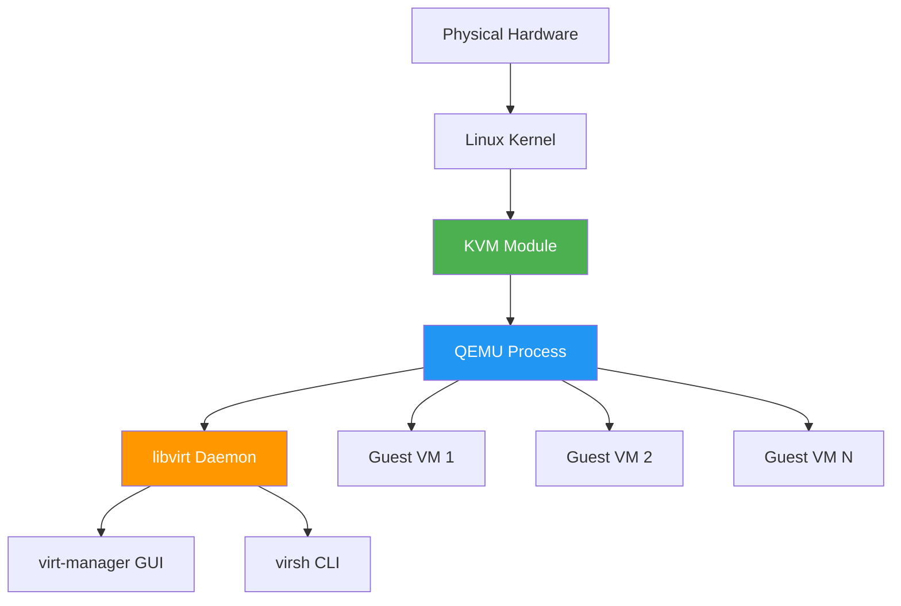

# Virtualization Basics

Understanding what virtualization is, how KVM/QEMU/libvirt work together, and when to use VMs vs containers vs bare metal.

---

## What Is Virtualization?

**Virtualization** allows you to run multiple operating systems (guests) on a single physical machine (host). Each guest OS runs in isolation, thinking it has dedicated hardware.

### The Problem Virtualization Solves

**Without virtualization:**

- One OS per physical machine
- Need separate hardware for each OS
- Can't test safely (might break host)
- Can't run legacy software (incompatible with modern OS)
- Wasted resources (most machines underutilized)

**With virtualization:**

- Multiple OSes on one machine
- Efficient resource usage
- Safe testing environment
- Legacy software support
- Easy isolation and management

**Real-world problems solved:**

- **Testing:** Try new software without risking your main system
- **Legacy support:** Run old Windows apps on modern Linux
- **Isolation:** Separate work and personal environments
- **Learning:** Experiment with different OSes safely
- **Resource efficiency:** Use one powerful machine for multiple purposes

### Why Virtualization Exists

**1. Resource Efficiency:**

- One physical machine can run multiple virtual machines
- Better hardware utilization
- Cost-effective (fewer physical machines needed)
- Example: One server running 10 VMs instead of 10 servers

**2. Isolation:**

- VMs can't affect each other or the host
- Security boundary (malware in VM stays in VM)
- Testing safety (experiments don't break host)
- Example: Test malware in isolated VM

**3. Flexibility:**

- Run any OS on any hardware
- Mix different OSes (Linux, Windows, BSD)
- Easy to create/destroy VMs
- Example: Run Windows VM on Linux host

**4. Testing:**

- Safe environment for experiments
- Easy to revert changes (snapshots)
- Test configurations without risk
- Example: Test system updates before applying to host

**5. Legacy Support:**

- Run old software on modern hardware
- Preserve old environments
- Compatibility without maintaining old hardware
- Example: Run Windows XP software on modern Linux

### Real-World Analogy

**Virtualization is like an apartment building:**

- **Physical building** = Host computer (physical hardware)
- **Apartments** = Virtual machines (isolated environments)
- **Each apartment** = Has own utilities (OS, applications)
- **Apartment isolation** = VMs can't access each other
- **Building manager** = Hypervisor (manages all apartments)
- **Tenants** = Users (can't affect other apartments)
- **Building resources** = Shared (electricity, water = CPU, RAM)

**Key insight:** Just like apartments share building infrastructure but are isolated, VMs share host hardware but are isolated.

**Think of it like:**

- **Host:** The physical computer (the building)
- **Guest:** The virtual machine running inside the host (an apartment)
- **Hypervisor:** The software layer that manages guests (building management system)

---

## The KVM Stack: What Each Piece Does



### KVM (Kernel-based Virtual Machine)

**What:** Linux kernel module enabling hardware-assisted virtualization

**Why KVM Exists:**

- Provides hypervisor functionality at kernel level
- Direct access to CPU virtualization extensions
- Efficient (runs in kernel, not userspace)
- Part of Linux kernel (no separate installation needed)

**Role:** Provides the hypervisor functionality

**How it works:**

- Loads as kernel module (`kvm` + `kvm_intel` or `kvm_amd`)
- Enables CPU virtualization extensions (VT-x/AMD-V)
- Provides hardware-assisted virtualization
- Acts as foundation for VM execution

**Key point:** Uses CPU virtualization extensions (VT-x/AMD-V)

**Why kernel module:**

- Direct hardware access (needed for virtualization)
- Low overhead (runs in kernel space)
- Efficient (no userspace overhead)
- Secure (kernel-level isolation)

**Location:** Part of the Linux kernel itself

**Real-world analogy:** KVM = Building foundation (provides structural support for everything else)

### QEMU

**What:** Userspace emulator and virtualizer

**Why QEMU Exists:**

- Provides VM runtime (CPU, memory, devices)
- Emulates hardware for guest OS
- Can work standalone (slow) or with KVM (fast)
- Handles device emulation (network, disk, graphics)

**Role:** Provides the VM runtime (CPU, memory, devices)

**How it works:**

- Runs as process on host
- Creates virtual hardware for guest
- Manages VM lifecycle (start, stop, pause)
- Handles I/O (disk, network, display)

**Key point:** When paired with KVM, provides near-native performance

**Why userspace:**

- Easier to develop (userspace tools)
- Can run without root (for some operations)
- Flexible (can be updated without kernel changes)
- Safer (userspace crashes don't crash kernel)

**Location:** Runs as a process on the host

**Real-world analogy:** QEMU = Apartment building (creates the living spaces where guests run)

### libvirt

**What:** Management daemon and API

**Why libvirt Exists:**

- Unified interface for different hypervisors
- Manages VMs, storage, networks
- Provides consistent API (same commands for different hypervisors)
- Abstraction layer (hide complexity)

**Role:** Manages VMs, storage, networks, and provides a unified interface

**How it works:**

- Runs as daemon (`libvirtd`)
- Tracks all VMs, networks, storage pools
- Provides API for management tools
- Handles configuration (XML files)

**Key point:** Abstraction layer — you can use different hypervisors through libvirt

**Why abstraction:**

- Same tools work with different hypervisors
- Easier migration between hypervisors
- Consistent management interface
- Hides implementation details

**Location:** Runs as `libvirtd` systemd service

**Real-world analogy:** libvirt = Building management system (tracks all apartments, handles maintenance, provides interface)

### virt-manager

**What:** Graphical user interface for libvirt

**Why virt-manager Exists:**

- User-friendly GUI (easier than CLI)
- Visual VM management
- Good for beginners
- Shows VM status graphically

**Role:** User-friendly GUI for creating and managing VMs

**How it works:**

- Connects to libvirt daemon
- Provides GUI for VM operations
- Shows VM console (display)
- Manages VM configuration visually

**Key point:** Comparable to VirtualBox's GUI, but more powerful

**Why GUI:**

- Easier to use (visual interface)
- Good for beginners
- Shows VM status clearly
- Intuitive operations

**Location:** Desktop application

**Real-world analogy:** virt-manager = Tenant portal (user-friendly interface to manage apartments)

### virsh

**What:** Command-line interface for libvirt

**Why virsh Exists:**

- Scriptable (can automate tasks)
- Reproducible (same commands work every time)
- Powerful (more control than GUI)
- Essential for automation

**Role:** Scriptable, reproducible VM management

**How it works:**

- Command-line tool
- Connects to libvirt daemon
- Executes VM operations
- Can be scripted (bash, Python, etc.)

**Key point:** Essential for automation and advanced use cases

**Why CLI:**

- Scriptable (automation)
- Reproducible (same commands)
- Powerful (more options)
- Remote management (SSH)

**Location:** CLI tool (part of libvirt package)

**Real-world analogy:** virsh = Building management API (programmatic control, automation)

---

## Hypervisor Types

Hypervisors come in two types, each with different architectures and use cases.

### Why Two Types Exist

**Type 1 (Bare Metal):**

- **Direct hardware access** → Better performance
- **Less overhead** → More efficient
- **Production servers** → Maximum performance

**Type 2 (Hosted):**

- **Runs on OS** → Easier setup
- **More flexible** → Can use host OS features
- **Desktop use** → User-friendly

### Type 1 (Bare Metal) Explained

**What it is:** Hypervisor runs directly on hardware (no host OS)

**Architecture:**

```
Physical Hardware
    ↓
Hypervisor (IS the OS)
    ↓
Guest VMs
```

**Characteristics:**

- Hypervisor IS the operating system
- Runs directly on hardware
- No host OS needed
- Maximum performance (minimal overhead)
- Used in production servers

**Examples:**

- **VMware ESXi:** Entire OS is hypervisor
- **Microsoft Hyper-V:** Hypervisor is OS layer
- **Xen:** Bare metal hypervisor

**When to use:**

- Production servers
- Maximum performance needed
- Dedicated virtualization host
- Enterprise environments

**Pros:**

- Best performance (no OS overhead)
- More secure (smaller attack surface)
- Efficient resource usage
- Production-grade

**Cons:**

- Requires dedicated hardware
- Less flexible (can't use host OS)
- More complex setup
- Not for desktop use

**KVM note:** **KVM is technically Type 1** (runs in kernel, direct hardware access)

### Type 2 (Hosted) Explained

**What it is:** Hypervisor runs on top of an operating system

**Architecture:**

```
Physical Hardware
    ↓
Host OS (Windows/Linux/macOS)
    ↓
Hypervisor (Application)
    ↓
Guest VMs
```

**Characteristics:**

- Hypervisor runs as application
- Host OS manages hardware
- Easier to use (familiar OS)
- More overhead (OS + hypervisor)
- Used on desktop/workstation

**Examples:**

- **VirtualBox:** Runs on Windows/Linux/macOS
- **VMware Workstation:** Runs on Windows/Linux
- **Parallels:** Runs on macOS

**When to use:**

- Desktop virtualization
- Development/testing
- Learning virtualization
- Personal use

**Pros:**

- Easy setup (install like app)
- Flexible (can use host OS)
- User-friendly
- Good for desktop

**Cons:**

- More overhead (OS + hypervisor)
- Lower performance than Type 1
- Host OS can affect performance
- Not ideal for production

**QEMU/KVM note:** **QEMU/KVM is often called Type 2** because QEMU runs as a process (like Type 2), even though KVM is kernel-based (Type 1-like)

### KVM's Unique Position

**KVM blurs the distinction:**

**Type 1 characteristics:**

- KVM runs in kernel (direct hardware access)
- Uses CPU virtualization extensions
- Low overhead (kernel-level)
- Production-grade performance

**Type 2 characteristics:**

- QEMU runs as process (userspace)
- Managed like Type 2 hypervisor
- Easy to use (familiar tools)
- Desktop-friendly

**Best of both worlds:**

- **Performance:** Type 1-like (kernel-based)
- **Flexibility:** Type 2-like (userspace management)
- **Result:** Production performance with desktop ease

**Why this matters:**

- Get Type 1 performance on Type 2 setup
- Best of both worlds
- Suitable for both desktop and server use

---

## Guest vs Host Concepts

Understanding the relationship between host and guest is fundamental to virtualization.

### Host Explained

**What:** The physical machine running the hypervisor

**Responsibilities:**

- **Manages resources:** Allocates CPU, RAM, disk, network to guests
- **Controls lifecycle:** Starts, stops, pauses VMs
- **Manages networking:** Creates virtual networks, NAT, bridges
- **Provides storage:** Manages disk images, storage pools
- **Runs host OS:** Arch Linux (or your distribution)

**Real-world analogy:** Host = Landlord

- Owns the building (physical hardware)
- Manages apartments (VMs)
- Allocates resources (utilities)
- Controls access (networking)
- Handles maintenance (storage, lifecycle)

**What host sees:**

- Physical hardware (CPU, RAM, disk, network)
- Multiple VMs running
- Resource usage (CPU, RAM per VM)
- Network traffic (all VM traffic)

**What host controls:**

- VM creation/destruction
- Resource allocation (how much RAM/CPU per VM)
- Network configuration (NAT, bridges)
- Storage management (disk images, pools)

### Guest Explained

**What:** The virtual machine running inside the host

**Characteristics:**

- **Thinks it has dedicated hardware:** Guest OS doesn't know it's virtualized
- **Isolated:** Can't access other guests or host directly
- **Can run any OS:** Linux, Windows, BSD, etc.
- **Virtual hardware:** Sees virtual CPU, RAM, disk, network

**Real-world analogy:** Guest = Tenant

- Lives in apartment (VM)
- Thinks apartment is own place (dedicated hardware)
- Isolated from other tenants (can't access other VMs)
- Uses building utilities (host resources)

**What guest sees:**

- Virtual hardware (virtual CPU, RAM, disk, network)
- Its own OS and applications
- Virtual network interface
- Virtual disk

**What guest controls:**

- Its own OS and applications
- Internal configuration
- Software installation
- User management

**What guest CANNOT do:**

- Access other VMs directly
- Access host directly (without configuration)
- Control host resources directly
- See physical hardware (sees virtual hardware)

### Key Relationships

**1. Resource Relationship:**

- **Host provides resources** → Guest consumes them
- Host allocates CPU cores, RAM, disk space to guests
- Guests use allocated resources
- Host can limit guest resources
- Example: Host has 16GB RAM, gives 4GB to each of 3 VMs

**2. Networking Relationship:**

- **Host manages networking** → Guest connects through virtual bridge
- Host creates virtual network (virbr0)
- Guest connects to virtual network
- Host handles NAT/forwarding
- Example: Guest sends packet → Host NATs it → Internet

**3. Lifecycle Relationship:**

- **Host controls lifecycle** → Guest starts/stops via host commands
- Host starts/stops/pauses VMs
- Guest can't control its own lifecycle (from host perspective)
- Host can force shutdown guest
- Example: `virsh start myvm` (host command) → VM boots (guest starts)

**4. Storage Relationship:**

- **Host manages storage** → Guest uses virtual disks
- Host creates/manages disk images
- Guest sees virtual disk
- Host controls disk allocation
- Example: Host creates `myvm.qcow2` → Guest sees `/dev/sda`

**5. Isolation Relationship:**

- **Guests are isolated** → Can't access each other or host directly
- Each guest is separate
- No direct communication between guests
- Host mediates all communication
- Example: VM1 can't directly access VM2 (must go through host network)

### Visual Model

```
┌─────────────────────────────────────┐
│           HOST (Physical)          │
│  ┌───────────────────────────────┐ │
│  │      Host OS (Arch Linux)     │ │
│  │  ┌─────────────────────────┐ │ │
│  │  │   Hypervisor (KVM)      │ │ │
│  │  └─────────────────────────┘ │ │
│  │  ┌─────────────────────────┐ │ │
│  │  │  QEMU (VM Runtime)      │ │ │
│  │  └─────────────────────────┘ │ │
│  │  ┌─────────────────────────┐ │ │
│  │  │  libvirt (Management)   │ │ │
│  │  └─────────────────────────┘ │ │
│  └───────────────────────────────┘ │
│                                     │
│  ┌──────────┐  ┌──────────┐        │
│  │  Guest 1 │  │  Guest 2 │        │
│  │ (Ubuntu) │  │ (Windows)│        │
│  └──────────┘  └──────────┘        │
│                                     │
│  Physical Hardware (CPU, RAM, etc.) │
└─────────────────────────────────────┘
```

**Key insight:** Host provides everything, guests consume resources. Host is in control, guests are isolated tenants.

---

## Hardware Virtualization

### CPU Extensions

**Intel VT-x:**

- Hardware-assisted virtualization
- Check: `lscpu | grep -i vmx`
- Required for KVM on Intel CPUs

**AMD-V (SVM):**

- AMD's virtualization extension
- Check: `lscpu | grep -i svm`
- Required for KVM on AMD CPUs

**IOMMU (VT-d / AMD-Vi):**

- Input/Output Memory Management Unit
- Required for GPU passthrough
- Check: `dmesg | grep -i iommu`
- See [`advanced.md`](advanced.md) for GPU passthrough

### Why Hardware Virtualization Matters

Without hardware extensions:

- Software emulation (very slow)
- Not suitable for production use

With hardware extensions:

- Near-native performance
- Suitable for production workloads

---

## When to Use VMs vs Containers vs Bare Metal

### Use VMs When:

- Running different operating systems (Windows, Linux, BSD)
- Need complete isolation (security, testing)
- Learning system administration
- Testing configurations safely
- Running legacy applications
- Need GPU passthrough

### Use Containers When:

- Running applications (not full OS)
- Need lightweight isolation
- Microservices architecture
- CI/CD pipelines
- Resource efficiency matters

### Use Bare Metal When:

- Maximum performance required
- No isolation needed
- Single OS deployment
- Direct hardware access required

---

## Mental Model Summary

```
Physical Hardware
    ↓
Linux Kernel (with KVM module)
    ↓
QEMU Process (VM runtime)
    ↓
libvirt Daemon (management)
    ↓
virt-manager / virsh (user interface)
    ↓
Guest VMs (isolated OS instances)
```

**Key insight:** KVM provides the hypervisor, QEMU provides the VM runtime, libvirt provides management, and virt-manager/virsh provide the user interface.

---

## Next Steps

- **Ready to install?** → [`installation-setup.md`](installation-setup.md)
- **Want to understand networking?** → [`networking.md`](networking.md)
- **Need performance tips?** → [`performance.md`](performance.md)

---

## Learn More

- **Arch Wiki:** [KVM](https://wiki.archlinux.org/title/KVM)
- **QEMU Documentation:** [https://www.qemu.org/documentation/](https://www.qemu.org/documentation/)
- **libvirt Documentation:** [https://libvirt.org/docs.html](https://libvirt.org/docs.html)
